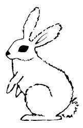

  
[Intangible Textual Heritage](../../../index.md)  [Native
American](../../index)  [Southwest](../index)  [Index](index.md) 
[Previous](yml46)  [Next](yml48.md) 

------------------------------------------------------------------------

p. 131

 

### In Rabbit's House

RABBIT had a house. Into this house crawled a snake. He stayed there,
waiting for the owner to return so he could eat him.

When the rabbit came home, he saw the track of the snake going into his
house. So, to deceive whoever was inside, he spoke to his house, saying,
"Good morning, my house."

There was no answer. A second time he greeted the house and there was no
reply.

When there was no answer the third time, the rabbit said, "Oh, my house,
why do you not answer me? Is something the matter?"

And again he said, "Good morning, house."

"Good morning, my patron," replied the snake from within.

Then the rabbit said, "What! Whoever heard of a house speaking? It is
clear that some enemy is inside." And he went away and built himself a
new house. LC

This incident is recorded in stories collected in New Mexico, Mexico,
and Chile.

------------------------------------------------------------------------

[Next: Coyote and the Friendly Dogs](yml48.md)
