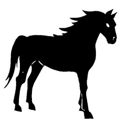

  
[Intangible Textual Heritage](../../../index)  [Native
American](../../index)  [Southwest](../index)  [Index](index) 
[Previous](yml48)  [Next](yml50) 

------------------------------------------------------------------------

p. 133

 

### The Black Horse

I HAD BEEN riding my black horse through the thickets of pitahaya from
early morning until past midday. I had no water and the sweetness of the
pitahaya honey caused me great thirst. There was no place within one
hundred and sixty kilometers where I could get any water. I was getting
desperate, thinking I might die any minute.

But at that moment some great, beautiful clouds formed. I looked at
those clouds and jumped on my horse and rode to the top of a hill. I
carried a long stick with a fork on the end of it. When I got there, I
kicked my horse with my wooden spurs and he gave a great jump up toward
the clouds, and I, with my forked stick, made a stab at the cloud. My
aim was good. As we came down, we were followed by a torrent of fresh
water.

I drank and also my horse drank and we both bathed. Water ran in all the
washes. It ran deep in Sabino arroyo. From that time on there has been
water in Sabino arroyo, for which we all have to thank my wonderful
horse.

------------------------------------------------------------------------

[Next: Duck Hunter](yml50)
