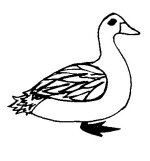

  
[Intangible Textual Heritage](../../../index.md)  [Native
American](../../index)  [Southwest](../index)  [Index](index.md) 
[Previous](yml49)  [Next](yml51.md) 

------------------------------------------------------------------------

p. 134

### Duck Hunter

ONE DAY out by a lake I was duck hunting. I had a gun but I wanted to
save bullets so I thought of another way to catch them. I had some
string which I fastened around my waist. Then I swam under water to
where the ducks were swimming above the water. I tied the ducks' legs
together under water until I almost choked. By the time I had tied a
great number of ducks together I burst out of the water so suddenly that
all the ducks flew up, taking me with them, tangled up in the string. In
a moment I was so high in the air that I could not see anything below.
In order to come down, I had to shoot all the ducks, one by one, and I
came down to the ground safely with my game, but disappointed because I
had to use my bullets.

 

------------------------------------------------------------------------

[Next: Tesak Pascola's Watermelons](yml51.md)
