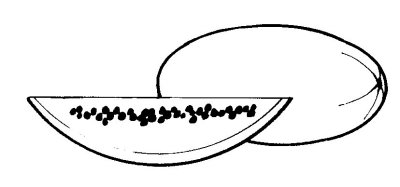
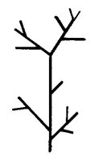

  
[Intangible Textual Heritage](../../../index)  [Native
American](../../index)  [Southwest](../index)  [Index](index) 
[Previous](yml50)  [Next](yml52) 

------------------------------------------------------------------------

p. 135

 

### Tesak Pascola's Watermelons

WELL, GENTLEMEN, this horse of mine became very old. I let him out for a
few days so that he might rest. But one day I saddled him again, to take
a little turn through the monte. I traveled almost a whole day, and in
the afternoon I took off the saddle. I noticed that he had a sore on his
back. I turned him out. On the following day I went in search of him. I
found him, lassoed him and, after cutting myself a ripe watermelon, I
jumped on his back, opened the melon and rode along eating my
watermelon. I came to the river and let him drink and bathed the sore on
his back. I got on again and commenced eating watermelon and throwing
the seeds away. Soon we came to a well and I got down. I took a little
fine dirt and put it on my horse's wound, then set him free in my
pasture. I went back to my house and forgot about my horse.

About four or five months later, I went in search of him. The pasture
wasn't very big and didn't have much underbrush in it. It is well

p. 136

fenced. My horse had no means of getting out, no place to hide.
Nevertheless, I could not find him. I was there an entire week without
once seeing him. The following week I went in search again. One day I
passed near a forest I had not seen before and stopped to contemplate
the branches. It was not mesquite, nor *batamote*. As I looked, I heard
a horse sneeze--brr--burr.

I went up to those branches and saw that it was a watermelon vine. I
looked again and saw that the vine had grown out of the sore on my
horse, aided by the dirt which I had placed on it. Some watermelon seeds
had fallen into the wound.

Well, I took my horse to my house and cut many watermelons, good-sized
and ripe, off of him. I sold them, and gave them to my neighbors. Later,
I cut the trunk of the watermelon vine off and cured my horse.

When he died, I gave him a fiesta and did mourning for six months.

There you have it, Señores.

 

------------------------------------------------------------------------

[Next: The Calabazas Funeral](yml52)
