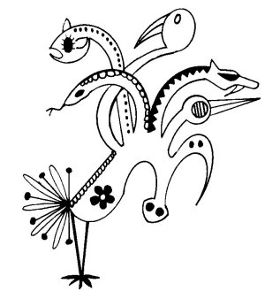
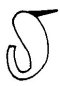

  
[Intangible Textual Heritage](../../../index)  [Native
American](../../index)  [Southwest](../index)  [Index](index) 
[Previous](yml52)  [Next](yml54) 

------------------------------------------------------------------------

p. 138

 

### Suawaka

IN EARLIER times, there used to be serpents with seven heads. These
lived northeast of Guaymas near a hill that has two little points; it is
called Takalaim. Serpents with seven heads also lived in another hill,
down-river and near the seashore, called So'ori.

The people of the old days say that if a Yaqui should marry a relative,
he would become a serpent. He would go as a little worm into the hill,
and in one year he would grow one head. By two years, he would have two
heads, and at three years, he would have three. And so on, every year,
he would grow a new head until he had seven. Then he would be ready to
go out.

Well, when these serpents come out, they make a terrific wind and
floods. Suawaka is up

p. 139

above watching for them. He knows that they come out every seven years,
and first appears their middle head. Then Suawaka throws a harpoon of
fire. This is the shooting star we see at night.

Suawaka grasps the serpent he has killed and carries it up above to his
mother-in-law and father-in-law and wife. The father-in-law is Yuku, the
god of thunder and lightning. Yuku's wife is the rain. They all cat this
kind of serpent. Every seven years, Suawaka goes down to Takalaim, and
the next seven years he goes down to So'ori. So Yuku and his family have
plenty of meat. But if Suawaka doesn't come down when a serpent starts
out of a hill, there is much wind and rain.

Once a man was fishing near Guaymas. He was out in a canoe when he saw
Suawaka come down and kill a seven-headed serpent.

"What are you doing?" asked the fisherman.

"Killing serpents," said Suawaka.

"Where do you live?"

"Up there."

"Take me to your house," said the fisherman.

"Very well," said Suawaka. So he put the serpent meat on his shoulders,
then put the fisherman to top of it.

"Close your eyes," said Suawaka. The man did, and they flew up to the
other world.

The fisherman opened his eyes and saw serpent meat all around. The meat
did not please him. There were scales all over it, each scale as big as
a tub.

The wife of Suawaka said, "Try it. The meat is delicious." But the man
could not. There was nothing else to eat up there. At last the woman
said to Suawaka, "I think this man is going to

p. 140

die. He can't eat. I don't know why you brought him up here. It would be
best to carry him down there again, Miguel." (He is really Suawaka, but
sometimes he is called San Miguel.)

"Carry me back down to earth again," said the man.

"Very well. Take this serpent's scale with you so that your people can
see it. Then others will not want to come up here. Close your eyes."

They went back down and arrived quickly.

The fisherman showed the Yaquis the serpent scale and all of them were
frightened.

It is said that Yuku, the father-in-law of Suawaka is always very
wrathful with him. When Suawaka goes down toward earth, the one-eyed
Yuku throws bolts of lightning at him. This is the story. It is finished
here. MT

 

Suawaka is described more fully in other versions of this story as a
blond dwarf. The Huichol Indians also believe that shooting stars kill
water monsters (Zingg 1938: 564). The Yaqui belief in a water monster
associated with floods and torrential rains is also expressed by other
Indians: the Aztecs, Huicholes, Cora, Mixe, and Mayos of Mexico (Parsons
1939, Vol. 2: 1009, 1016; Beals 1933: 79), and the Zuni, Hopi and Sia of
the southwest (Beals 1933: 79; Parsons 1939, Vol. 2: 1003).

------------------------------------------------------------------------

[Next: Topol the Clever](yml54)
