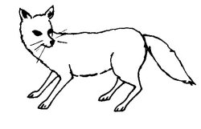

  
[Intangible Textual Heritage](../../../index.md)  [Native
American](../../index)  [Southwest](../index)  [Index](index.md) 
[Previous](yml55)  [Next](yml57.md) 

------------------------------------------------------------------------

p. 144

### Coyote Woman

NEAR Ousekari is an arroyo called Ba'atcbem. Here once lived a Yaqui
called Mangwe Wakira, or "Manuel the Weak." Also in this place there was
a little ranchería. Among those who lived there, was a Yaqui woman who
enjoyed practicing the art of witchcraft. She would turn herself into a
coyote. This is how she did it: she would go out into the monte, take
off all of her clothes, and lie down and roll over in an ant hill. When
she arose, she would be transformed into a coyote. In this form, she was
referred to as Coyote Woman, or Yoem Wo'i. She was greatly feared
because of her strange powers.

One cold winter dawn, Mangwe Wakira was warming himself at his fire,
clothed only with some skins. He was seated with his eyes closed. He did
not know it when Yoem Wo'i arrived.

She sat down across from him and said, "Awfully cold, isn't it, Mangwe?"
But because of being a coyote she did not speak clearly.

When Mangwe Wakira opened his eyes and saw the naked animal close to
him, forgetting both his cloak and the warm fire, he jumped up and
started to run.

No one knows where Mangwe went, nor do they know if he ever returned.
Here the story ends.

 

------------------------------------------------------------------------

[Next: The First Fiesta](yml57.md)
