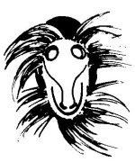

  
[Intangible Textual Heritage](../../../index)  [Native
American](../../index)  [Southwest](../index)  [Index](index) 
[Previous](yml56)  [Next](yml58) 

------------------------------------------------------------------------

p. 145

 

### The First Fiesta

YOMUMULI WAS a hunter who lived near the pueblo of Juirivis. He was an
old man, and he had twin sons who were called Yomumulim. The old man,
walking one day through the monte, heard the beat of a drum. Although he
drew near to where the drum was sounding, although he made every effort
possible to find the musician, he could not see anyone.

In those days, no one yet knew about drums, nor about pascolas. So
Yomumuli was hearing the first drum in the land of the Yaquis. The
following day he returned to the same spot and the drummer again began
to play a very pretty song. Yomumuli, who was enchanted with the music,
searched again for the musician, but could not find him. He returned to
his hut and chatted about this with the twins, Yomumulim.

These two boys were very obedient. Their father said to them, "Go down
to that place where we rested four days ago, near a little mound of
spines. There, I don't know exactly where, can be heard a beautiful
thing which caused my heart to be very happy. Go then, to see if also
you hear it. But don't go near those spines."

The Yomumulim twins went into the familiar monte. When they arrived at
the place, the drummer was playing the most beautiful of songs. The
Yomumulim listened. The drummer finished, and from beneath the pile of
spines which were of

p. 146

cholla, mesquite, and pitahaya, there appeared a *toli*. This is a kind
of rat which is sometimes called *bwiya toli* because he lives
underground beneath a pile of cactus spines and thorns which serve him
as a nest.

The *toli* came out. Greeting the twins he said, "Come into my house."

"Thank you very much, but we cannot go in there because our father
ordered us to come this near to those spines and no nearer."

"And what more did your father tell you?" asked the *bwiya toli*.

"Well, our father sent us here in order that we might hear that sound in
your house."

"Aha, well, this is called a drum," said the *bwiya toli*, showing it to
them. "And this is called a flute," he said, showing them a carrizo
flute.

"Ah, yes, thank you," said the Yomumulim.

When they arrived home they chatted with the old man, Yomumuli, about
this.

A few days later our mother Eva arrived at the house of Yomumuli. She
said to the old man, "From this time on there shall be religious
fiestas. You, from now on, are the *moro yaut*. Your children shall make
*cohetes*. Tomorrow you must go over to see *bwiya toli* and tell him
that you are going to have a fiesta and that he should come to play.
After that, go to the Devil and have him come to dance pascola."

Yomumuli did it all. *Bwiya toli* agreed to present himself with his
drum and flute. But old Satan said, "I shall not go to dance. Instead I
shall send my son."

Then the Devil spoke to his son. "You must go to the fiesta and be very
funny in order that

p. 147

all the Yaquis may laugh. But there is one thing--they are going to give
you three *cohetes* to burn. I do not want you to light them."

"Very well," said the little devil, and he went to the fiesta. As soon
as he arrived they gave him three *cohetes*. "I can't light these," he
said.

"And why not?" asked the fiestero.

"My father does not desire it."

"Well, you are a pascola now, and it is an obligation of all pascolas to
burn *cohetes*."

*Cohetes* are sacred and are burned at the hour of prayer. By burning
these, the Devil and the other evil spirits flee far from such saintly
things. For this reason, the Devil had said to his son, "Don't burn
*cohetes*."

Well, the Devil had a desire to see his son dance pascola, so he was
there, hidden behind some branches. When they gave the young devil the
*cohetes*, he burned one and threw it straight at old Satan. Satan ran
as fast as a bird. In the early hours of dawn he came back, but again
they burned *cohetes* and again he had to run away. From that time on,
the Devil has not been able to attend fiestas.

Well, this is the way Yomumuli discovered the first drum and flute,
those of the *bwiya toli* who made the first fiesta.

Twin boy culture heroes are encountered in myth cycles of other American
tribes, such as the Zuni (Parsons 1939, Vol. 2: 966), Hopi and Pima
(Parsons 1939, Vol. 2: 995). In a Papago myth, twin boy heroes find the
first bamboo from which flutes were made (Densmore 1929: 61-62).

------------------------------------------------------------------------

[Next: Bobok](yml58)
