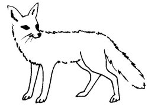

  
[Intangible Textual Heritage](../../../index)  [Native
American](../../index)  [Southwest](../index)  [Index](index) 
[Previous](yml60)  [Next](yml62) 

------------------------------------------------------------------------

p. 160

 

### The Spirit Fox

AN INDIAN lived in the region of the hill west of Bacum. This man's name
was Ba'ayoeria. Alone, he and his woman lived. They had neighbors a
little distance away to the north, and others farther away to the south.
Ba'ayoeria was not a hunter. He lived from collecting roots for
medicines and edible roots. Also he collected blossoms from trees for
use in tanning hides and others for medicines. He would load them in
some coyote or fox hide sacks, or wildcat skin sacks. Then he would set
out, carrying various sacks full of roots and flowers, crossing the
hills and higher mountains to the edge of the sea. All these things he
would exchange for dried fish, clams, oysters, and salt--all of these
for his woman, and for his neighbors who brought him skins in exchange
for salt, fish and oysters. In this way, he was living.

p. 161

One day when Ba'ayoeria traveled in search of roots, a fox passed in
front of him and stopped, gazing at him. Ba'ayoeria went on his way,
looking back now and again at the fox who was still watching him.

The same thing happened the second day. On the third day, at the same
place, the fox came out and spoke, saying, "Listen to me, Ba'ayoeria.
This is a true thing. I am your friend. I am not really a fox, but I
asked permission to come here with you because I am looking at a great
danger that will come to you and I want to save you. This night an
individual is coming with intentions to kill you. Your woman is having
amorous relations with this man and they are agreed upon killing you.
For some time they have been playing treasonously with you. Tonight
don't lie down in your bed in the place where you are accustomed to
sleep. Put your wife there where you usually sleep because she has told
the man, 'Thus you may kill him as he sleeps and we will live together
without danger from Ba'ayoeria.' Thus your wife spoke."

All of this, the fox told to Ba'ayoeria who then asked, "Who are you?"

"I am the soul of that lost body you buried near Buram Teopo. In
gratitude for your having buried my body, I, today, advise you."

"Good, then, little fox," said the Indian.

The fox disappeared into the thicket and the man returned to his hut,
and to his woman. That evening, after supper they chatted awhile. The
two appeared to be contented, nothing could be seen, not a bad word or a
bad look. The two conversed until bedtime came.

p. 162

And when it came time to lie down, the man said to the wife, "Let us
change places. You sleep in my place, and I in yours."

The woman took her head in her hands, and he asked, "Why do you appear
so sad?"

"I don't know what happened to me," replied the woman.

"Come, then, lie down in my place and you will feel better," he said.
The woman lay down and pretended to sleep.

But Ba'ayoeria did not sleep. Late at night the traitor came quietly. He
moved up to the bed where the woman lay, thinking it was Ba'ayoeria. He
lifted his arm and gave a great stab with his sharp, wooden lance.
Ba'ayoeria arose, threw himself on the man and overcame him. He tied him
firmly with ropes and waited for the dawn to come. In the morning he
buried his woman.

He took the assassin to Bacum. There, the man was punished with lashes
until blood gushed from between his shoulder-blades. From these lashes
he died two days later.

Ba'ayoeria married another young girl, and continued his work of trading
roots and flowers.

 

------------------------------------------------------------------------

[Next: The Yaqui Doctor](yml62)
