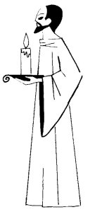
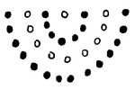

  
[Intangible Textual Heritage](../../../index.md)  [Native
American](../../index)  [Southwest](../index)  [Index](index.md) 
[Previous](yml61)  [Next](yml63.md) 

------------------------------------------------------------------------

p. 163

 

### The Yaqui Doctor

AN OLD Yaqui man had twelve sons. When the thirteenth son came along, no
one in the village wanted to take him as a god-son. Thirteen sons was
just one too many.

The father became angry. "I go now," he said. "I don't care for this
pueblo." He went off in the direction of the mountains. "Out here among
the animals, the first one I meet, he shall be my *compadre*."

A man came toward him. He was tall and distinguished looking. "Where do
you go?" he asked the father of thirteen sons.

"Anywhere."

"You go in search of someone who would serve as your *compadre*?"

"How did you know?"

"I am the Devil."

"I am a poor man," said the father. "You are for the rich. Go away."

The Devil went away in a great yellow cloud of reeking dust.

p. 164

Then a second man appeared. He was tall, slender, and respectable
looking. He had a sword. He said to the father, "Where are you going,
good man?"

"I go in search of someone who would serve me as *compadre*."

"I will serve you. And I will promise that when your son grows up he
will be a doctor, a good doctor, the best."

"Who are you?"

"I am Death."

"Well, since you take all from rich and poor alike, good. You will be my
*compadre*."

"When you enter the church I will be there," said Death. "Bring your
son."

The old man returned to his pueblo. His son was baptized.

When the boy was thirteen years old, his father again met Death who
said, "I told you this boy is going to be a good doctor. Leave him to me
for instruction."

Since that was the agreement, Death carried the boy away. They entered a
hill, into a huge room. There were six other rooms, all very big. In
each room there were different flowers, and many candles burning. These
were the lives of Yaqui men. "This herb is used for a certain sickness,"
Death said. "This also is a cure."

Thus, he taught the boy. "Each time you visit a sick man, I will be
there. When you see my form at the head of a sick man you will cure him.
But when you see me at the foot of the sick man, know then that he must
die and give him no medicine."

The boy went out to cure, and always he was a good doctor. Word went out
that he was good

p. 165

at curing. He always asked a great deal of money, so by the time he was
thirty years old, he was very rich. People came to him from all over.
And always, he did as his god-father had advised.

Finally a King who was very sick called him and said that whoever made
him well could marry his daughter. The doctor thought very much of the
King's daughter and she begged him to make her father well.

When he saw Death standing at the King's feet, he quickly turned the
King about, and administered the medicine.

The King got well and the princess was very happy. "Let us go to the
church," she said.

After the marriage, Death was standing at the door of the church. To his
god-son he said, "You got yourself married, I see."

"Yes," replied the young doctor.

"Come with me," said Death, and they went to another hill. Inside were
candles, some of them just beginning to burn, others half gone, others
lying about extinguished on the ground. The boy begged to be shown his
own candle. "This is your candle," said Death.

And he blew it out. LC

 

------------------------------------------------------------------------

[Next: The Twins](yml63.md)
