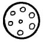
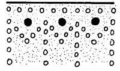

  
[Intangible Textual Heritage](../../../index.md)  [Native
American](../../index)  [Southwest](../index)  [Index](index.md) 
[Previous](yml62)  [Next](yml64.md) 

------------------------------------------------------------------------

p. 166

 

### The Twins

THESE TWINS were born near the hill of Huri Kawi, near here and not very
far from the railroad track.

Their mother was called Hekka Nibino. She died when they were born. The
grandparents brought them up. One twin they named Cho'i and after a time
he learned to be a cowboy. He came out very well.

The other twin came out a thief. He liked very much to rob. He appeared
to be a natural magician. He stole and no one saw him. For this reason
they called him Hi'ikia.

Thus the two grew up and when they were finally men, Cho'i had the luck
of marrying a fairly pretty Yaqui girl. She owned a great many goats,
horses, and cows; in fact, it was a very pretty ranch where the two
lived.

Hi'ikia went on with his profession of robbing. But the wife of Cho'i
was not acquainted with her husband's twin brother. One day Cho'i talked
to his woman, telling her, "I have a brother who

p. 167

looks very much like me. Don't get us confused. This brother of mine
enjoys very much to steal. I warn you carefully. If he should come here
when I'm not about, do me the favor of escorting him through every part
of the house so he may see all that is here. That which you do not show
him he will steal. So it is necessary that he see everything, that he
might rob us of nothing."

"It is well," answered the woman. Cho'i saddled up his horse to go out
and see his cattle. It was late when he went off.

After a time, Hi'ikia came up and saluted the woman. She looked, and
looked again; she talked to him, and believed him to be her husband. His
face was the same as that of her man, his mode of speech and the build
of his body. She was very confused.

Finally she said, "Come, in order that you may see my house." And she
took him where she kept her treasure. She let him see everything except
some cheeses. Hi'ikia stayed until evening, and they ate supper. They
were eating their supper when Cho'i returned and greeted his brother.

After supper, they went to bed. Later in the night, Cho'i said, "I am
going now. I'll be back in a little while. I am going to look for some
cattle on the other side of the river."

When Cho'i left, Hi'ikia entered the storehouse, took a cheese and went
away. Just outside he stepped on a thorn and cried, "Ay, ay, ay! I
pricked myself!"

The woman thought it was her husband whom she heard cry and she got up
to see about it. Hi'ikia quickly pulled out the thorn and went on his
way with the cheese.

p. 168

The wife looked all around. Finally her husband returned and she said to
him, "Tell me what happened?"

"Nothing. All went well," replied Cho'i. He took her by the hand and
they went back to their room to bed. After a while, he asked her, "Why
did you ask me what happened?"

"Because you cried out, 'Ay, I pricked myself!' "

"But, I didn't."

"I heard your voice."

"Ah, well. It was my brother, Hi'ikia. Tell me. How many things did you
show him?"

"I showed him everything, the treasure, the arms, the corral, the
calves--Oh!" said the woman, "that one thing which I didn't show him
were the cheeses."

"And how many cheeses did you have?"

"Eight," she said.

"Come, let us look," said Cho'i, and they looked, and there were only
seven cheeses. "One cheese my brother carried off," Cho'i said, "I am
going to take it from him." And he left.

Cho'i knew where his brother was hidden. He went straight there. Hi'ikia
had left the cheese with a friend, saying, "Take care of this cheese. I
am going to steal some corn to eat with it. I'll be back soon." And he
went off.

Before approaching the camp, Cho'i cried out, "Ay, I pricked myself!"

The man guarding the cheese thought that it was Hi'ikia and he said, "I
will help you!"

But Cho'i said, "No, don't come. I go now. Better that you should gather
up some fire-wood."

"Good," said the Yaqui with the cheese.

p. 169

Leaving the cheese, he went off to gather wood. Cho'i took the stolen
cheese and returned with it to his house.

When Hi'ikia came back with many ears of corn, he asked his friend about
the cheese. He didn't see it where it had been left. His friend did not
know where it was.

"Who has been here?" asked Hi'ikia.

"Nobody has been here."

"Then why did you go to gather wood?"

"Because you told me to."

"Aha, tell me, how was that?"

"You said, 'Ay, I have pricked myself!' and I said, 'Wait, and I will
come and help you,' but you said to go on out and gather wood so I left
the cheese and went to gather firewood."

"Aha," said Hi'ikia. "That was my brother."

They roasted the ears in the coals and ate only corn. Then they went to
sleep.

All this took place that night. The next day they got up to go in search
of food in other parts. Hi'ikia did not return again to his brother's
house, and Cho'i lived tranquilly with his wife, taking care of his
cattle.

Hi'ikia continued to rob in order to eat. Thus each one proceeded at his
own profession until, together, on the same day, they died.

 

It is likely that there once existed more complete legends about the
twin Yaqui boy culture heroes (Fabila 1940: 238), since other tribes
have longer stories about similar characters. The Papagos have

p. 170

a myth wherein such twins find the first bamboo for the making of the
flute (Densmore 1929: 61-62). Stories about twins with unusual powers
are found in the mythology of the Navajos, the Pimas, Hopis (Parsons
1939, Vol. 2: 995) and Zunis (Benedict 1935: 264-265). Other isolated
incidents in Yaqui mythology seem to connect it with that of other
American aborigines and suggest the kinds of stories which may have been
lost through acculturation. The story of "Suawaka" and the myth "When
Badger Named the Sun," have affiliations with parts of the elaborate,
pagan myth cycle of the Huicholes of Mexico in which falling stars are
said to kill the rain serpents of Nakwe (Zingg 1938: 564) and in which a
gathering is said to have been held for the purpose of naming the sun
(Zingg 1938: 517). Also, as in Yaqui mythology, measuring land is
important in Huichol stories, and the wind is considered evil as it is
in the Yaqui myth, "Yuku." The myth of a cannibal bird monster is found
in the stories of the Cochiti (Benedict 1931: 211), Pima and Papago
Indians (Densmore 1929: 45-54).

 

------------------------------------------------------------------------

[Next: The Snake of the Hill of Nohme](yml64.md)
