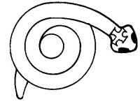

  
[Intangible Textual Heritage](../../../index.md)  [Native
American](../../index)  [Southwest](../index)  [Index](index.md) 
[Previous](yml63)  [Next](yml65.md) 

------------------------------------------------------------------------

p. 171

 

### The Snake of the Hill of Nohme

IN A LARGE waterhole under the hill of Nohme there lives a big snake
with a cross on its forehead. This monster lives on water animals but
sometimes it eats cattle, goats, and even people. It makes a great wind
with its indrawn breath and sucks them right into its mouth. This
snake's name is Acencio. He was once a *maestro* in the church.

But this *maestro* did evil things. When he died and they buried him, at
once the grave began to sink. The sky became cloudy and dark and from
the hole where the grave had been was heard a noise such as a lion
makes.

Then a priest came who knew how to talk Yaqui, and said, "Go, Acencio,
go to a place where there are no Christians."

At once the animal began to break the earth and travel below the surface
of the ground. Many people walked behind the moving mound, praying, so
that the monster might not remain in the pueblo. The priest also
followed along, praying, until at last the snake reached the foot of the
hill of Nohme. Breaking the rock, he went deep under the hill into the
water which is inside of that hill. There, it is said, Acencio still
lives.

A similar monster is described in the myths of the Papago, the Pueblos
(Parsons 1939, Vol. 2: 1003; Benedict 1935: 326), and the Cora (Beals
1933: 79 ).

------------------------------------------------------------------------

[Next: Tukawiru](yml65.md)
