[Intangible Textual Heritage](../../index)  [Native American](../index.md) 
[Index](index)  [Previous](wa00)  [Next](wa02.md) 

------------------------------------------------------------------------

 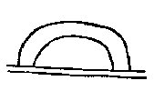

1\. At first, in that place, at all times, above the earth,

1\. Sayewi talli wemiguma wokgetaki,

 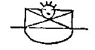

2\. On the earth, \[was\] an extended fog, and there the great Manito
was.

2\. Hackung kwelik owanaku wak yutali Kitanitowit-essop.

 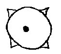

3\. At first, forever, lost in space, everywhere, the great Manito was.

3\. Sayewis hallemiwis nolemiwi elemamik Kitanitowit-essop.

 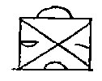

4\. He made the extended land and the sky.

4\. Sohawalawak kwelik hakik owak \[read, woak\] awasagamak.

 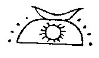

5\. He made the sun, the moon, the stars.

5\. Sohalawak gishuk nipahum alankwak.

 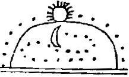

6\. He made them all to move evenly.

6\. Wemi-sohalawak yulikyuchaan.

 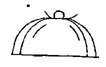

7\. Then the wind blew violently, and it cleared, and the water flowed
off far and strong.

7\. Wich-owagan kshakan moshakwat \[Var. moshakguat.\] kwelik
kshipehelep.

 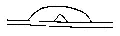

8\. And groups of islands grew newly, and there remained.

8\. Opeleken mani-menak delsin-epit.

 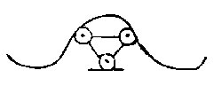

9\. Anew spoke the great Manito, a manito to manitos,

9\. Lappinup Kitanitowit manito manitoak.

 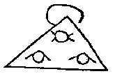

10\. To beings, mortals, souls and all,

10\. Owiniwak angelatawiwak chichankwak wemiwak.

 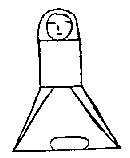

11\. And ever after he was a manito to men, and their grandfather.

11\. Wtenk manito jinwis lennowak mukom.

 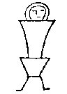

12\. He gave the first mother, the mother of beings.

12\. Milap netami gaho owini gaho.

 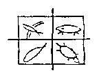

13\. He gave the fish, he gave the turtles, he gave the beasts, he gave
the birds.

13\. Namesik milap, tulpewik milap, awesik milap, cholensak milap.

 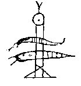

14\. But an evil Manito made evil beings only, monsters,

14\. Makimani shak sohalawak makowini nakowak amangamek.

 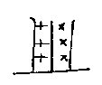

15\. He made the flies, he made the gnats.

15\. Sohalawak uchewak, sohalawak pungusak.

 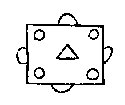

16\. All beings were then friendly.

16\. Nitisak wemi owini w'delisinewuap.

 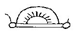

17\. Truly the manitos were active and kindly

17\. Kiwis, wunand wishimanitoak essopak.

 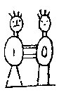

18\. To those very first men, and to those first mothers; fetched them
wives,

18\. Nijini netami lennowak, nigoha netami okwewi, nantine'wak.

 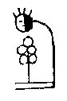

19\. And fetched them food, when first they desired it.

19\. Gattamin netami mitzi nijini nantine'.

 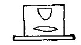

20\. All had cheerful knowledge, all had leisure, all thought in
gladness.

20\. Wemi wingi-namenep, wemi ksinelendamep, wemi wullatemanuwi.

 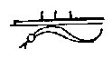

21\. But very secretly an evil being, a mighty magician, came on earth,

21\. Shukand eli-kimi mekenikink wakon powako init'ako.

 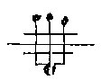

22\. And with him brought badness, quarreling, unhappiness,

22\. Mattalogas pallalogas maktaton owagan payat-chik yutali.

 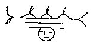

23\. Brought bad weather, brought sickness, brought death.

23\. Maktapan payat, wihillan payat, mboagan payat.

 

24\. All this took place of old on the earth, beyond the great
tide-water, at the first.

24\. Won wemi wiwunch kamik atak kitahikan netamaki epit.

------------------------------------------------------------------------

[Next: Part II](wa02.md)
