[Intangible Textual Heritage](../../index)  [Native American](../index.md) 
[Index](index)  [Previous](wa01)  [Next](wa03.md) 

------------------------------------------------------------------------

 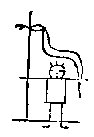

1\. Long ago there was a mighty snake and beings evil to men.

1\. Wtilamo maskanako anup lennowak makowini essopak.

 

2\. This mighty snake hated those who were there (and) greatly
disquieted those whom he hated.

2\. Maskanako shingalusit nijini essopak shawelendamep eken shingalan.

 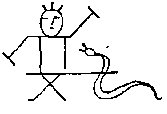

3\. They both did harm, they both injured each other, both were not in
peace.

3\. Nisliawi\` palliton, nishawi machiton, nishawi matta lungtindowin.

 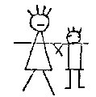

4\. Driven from their homes they fought with this murderer.

4\. Mattapewi wiki nihanlowit mekwazoan.

 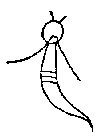

5\. The mighty snake firmly resolved to harm the men.

5\. Maskanako gishi penatiwelendamep lennowak owini palliton.

 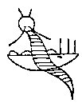

6\. He brought three persons, he brought a monster, he brought a rushing
water.

6\. Nakowa petonep, amangam petonep, akopehella petonep.

 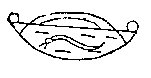

7\. Between the hills the water rushed and rushed, dashing through and
through, destroying much.

7\. Pehella pehella, pohoka pohoka, eshohok eshohok, palliton palliton.

 

8\. Nanabush, the Strong White One, grandfather of beings, grandfather
of men, was on the Turtle Island.

8\. Tulapit menapit Nanabotish maskaboush owinimokom linowimokom.

 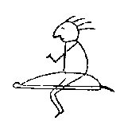

9\. There he was walking and creating, as he passed by and created the
turtle.

9\. Gishikin-pommixin tulagishattenlohxin.

 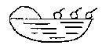

10\. Beings and men all go forth, they walk in the floods and shallow
waters, down stream thither to the Turtle Island.

10\. Owini linowi wemoltin, Pehella gahani pommixin, Nahiwi tatalli
tulapin.

 

11\. There were many monster fishes, which ate some of them.

11\. Amanganek makdopannek alendyuwek metzipannek.

 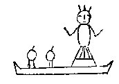

12\. The Manito daughter, coming, helped with her canoe, helped all, as
they came and came.

12\. Manito-dasin mokol-wichemap, Palpal payat payat wemichemap.

 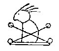

13\. \[And also\] Nanabush, Nanabush, the grandfather of all, the
grandfather of beings, the grandfather of men, the grandfather of the
turtle.

13\. Nanaboush Nanaboush wemimokom, Wimimokom linnimokom tulamokom.

 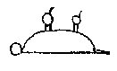

14\. The men then were together on the turtle, like to turtles.

14\. Linapi-ma tulapi-ma tulapewi tapitawi.

 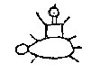

15\. Frightened on the turtle, they prayed on the turtle that what was
spoiled should be restored.

15\. Wishanem tulpewi pataman tulpewi poniton wuliton.

 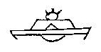

16\. The water ran off, the earth dried, the lakes were at rest, all was
silent, and the mighty snake departed.

16\. Kshipehelen penkwihilen, Kwamipokho sitwalikho, Maskan wagan
palliwi palliwi.

------------------------------------------------------------------------

[Next: Part III](wa03.md)
