[Intangible Textual Heritage](../../index)  [Native American](../index.md) 
[Index](index)  [Previous](wa03)  [Next](wa05.md) 

------------------------------------------------------------------------

 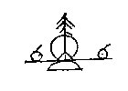

1\. Long ago the fathers of the Lenape were at the land of spruce pines.

1\. Wulamo linapioken manup shinaking.

 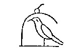

2\. Hitherto the Bald Eagle band had been the pipe bearer,

2\. Wapallanewa sittamaganat yukepechi wemima,

 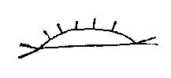

3\. While they were searching for the Snake Island, that great and fine
land.

3\. Akhomenis michihaki wellaki kundokanup.

 

4\. They having died, the hunters, about to depart, met together.

4\. Angomelchik elowichik elmusichik menalting.

 

5\. All say to Beautiful Head, "Be thou chief."

5\. Wemilo kolawil sakima lissilma.

 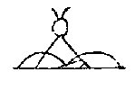

6\. "Coming to the Snakes, slaughter at that Snake hill, that they leave
it."

6\. Akhopayat kihillalend akhopokho aski'waal.

 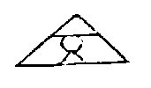

7\. All of the Snake tribe were weak, and hid themselves in the Swampy
Vales.

7\. Showihilla akhowemi gandhaton mashkipokhing.

 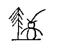

8\. After Beautiful Head, White Owl was chief at Spruce Pine land.

8\. Wtenkolawil shinaking sakimanep wapagokhos.

 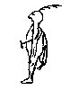

9\. After him, Keeping-Guard was chief of that people.

9\. Wtenk nekama sakimanep janoto enolowin.

 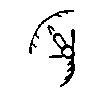

10\. After him, Snow Bird was chief; he spoke of the south,

10\. Wtenk nekama sakimanep chilili shawaniluen.

 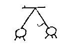

11\. That our fathers should possess it by scattering abroad.

11\. Wokenapi nitaton wullaton apakchikton.

 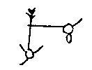

12\. Snow Bird went south, White Beaver went east.

12\. Shawaniwaen chilili, wapaniwaen tamakwi.

 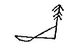

13\. The Snake land was at the south, the great Spruce Pine land was
toward the shore;

13\. Akolaki shawanaki, kitshinaki shabiyaki.

 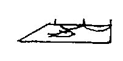

14\. To the east was the Fish land, toward the lakes was the buffalo
land.

14\. Wapanaki namesaki, pemapaki sisilaki.

 

15\. After Snow Bird, the Seizer was chief, and all were killed,

15\. Wtenk chilili sakimanep ayamek weminilluk.

 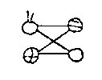

16\. The robbers, the snakes, the evil men, the stone men.

16\. Chikonapi akhonapi makatapi assinapi.

 

17\. After the Seizer there were ten chiefs, and there was much warfare
south and east.

17\. Wtenk ayamek tellen sakimak machi tonanup shawapama.

 

18\. After them, the Peaceable was chief at Snake land.

18\. Wtenk nellamawa sakimanep langundowi akolaking.

 

19\. After him, Not-Black was chief, who was a straight man.

19\. Wtenk nekama sakimanep tasukamend shakagapipi.

------------------------------------------------------------------------

[Next: Part IVb](wa05.md)
