[Intangible Textual Heritage](../../index)  [Native American](../index) 
[Index](index)  [Previous](wa04)  [Next](wa06) 

------------------------------------------------------------------------

 

20\. After him, Much-Loved was chief, a good man.

20\. Wtenk nekama sakimanep pemaholend wulitowin.

 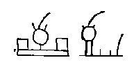

21\. After him, No-Blood was chief, who walked in cleanliness.

21\. Sagimawtenk matemik, sagimawtenk pilsohalin.

 

22\. After him, Snow-Father was chief, he of the big teeth.

22\. Sagimawtenk gunokeni, sagimawtenk mangipitak.

 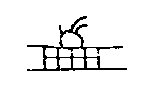

23\. After him, Tally-Maker was chief, who made records.

23\. Sagimawtenk olumapi, leksahowen sohalawak.

 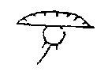

24\. After him, Shiverer-with-Cold was chief, who went south to the corn
land.

24\. Sagimawtenk taguachi shawaniwaen minihaking.

 

25\. After him, Corn-Breaker was chief, who brought about the planting
of corn.

25\. Sakimawtenk huminiend minigeman sohalgol.

 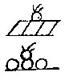

26\. After him, the Strong-Man was chief, who was useful to the
chieftains.

26\. Sakinawtenk alkosohit sakimachik apendawi.

 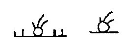

27\. After him, the Salt-Man was chief, after him the Little-One was
chief

27\. Sawkimawtenk shiwapi, sakimatenk penkwoni.

 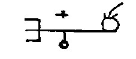

28\. There was no rain, and no corn, so they moved further seaward.

28\. Attasokelan attaminin wapaniwaen italissipek.

 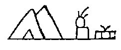

29\. At the place of caves, in the buffalo land, they at last had food,
on pleasant plain.

29\. Oligonunk sisilaking nallimetzin kolakwaming.

 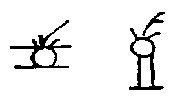

30\. After the Little-One (came) the Fatigued; after him, the Stiff-One.

30\. Wtenk penkwonwi wekwochella, wtenk nekama chingalsuwi.

 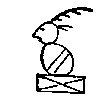

31\. After him, the Reprover; disliking him, and unwilling (to remain),

31\. Wtenk nekama kwitikwond, slangelendam attagatta,

 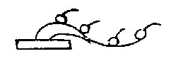

32\. Being angry, some went off secretly, moving east.

32\. Wundanuksin wapanickam \[Var. wapanahan.\] allendyachick kimimikwi.

 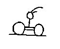

33\. The wise ones who remained made the Loving-One chief.

33\. Gunehunga wetatamova wakaholend sakimalanop.

 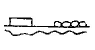

34\. They settled again on the Yellow river, and had much corn on
stoneless soil.

34\. Wisawana lappi wittank michi mini madawasim.

 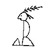

35\. All being friendly, the Affable was chief, the first of that name .

35\. Weminitis tamenend sakimanep nekohatami.

 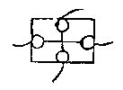

36\. He was very good, this Affable, and came as a friend to all the
Lenape.

36\. Eluwiwulit matemenend wemi linapi nitis payat.

 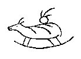

37\. After this good one, Strong-Buffalo was chief and pipe-bearer.

37\. Wtenk wulitma maskansisil sakimanep w'tamaganat.

 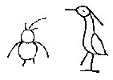

38\. Big-Owl was chief; White-Bird was chief.

38\. Machigokloos sakimanep, wapkicholen sakimanep.

 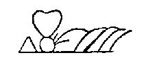

39\. The Willing-One was chief and priest; he made festivals.

39\. Wingenund sakimanep powatanep gentikalanep.

------------------------------------------------------------------------

[Next: Part IVc](wa06)
