[Intangible Textual Heritage](../../index)  [Native American](../index.md) 
[Index](index)  [Previous](wa05)  [Next](wa07.md) 

------------------------------------------------------------------------

 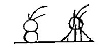

40\. Rich-Again was chief; the Painted-One was chief.

40\. Lapawin sakimanep, wallama sakimanep.

 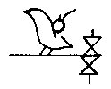

41\. White-Fowl was chief; again there was war, north and south.

41\. Waptipatit sakimanep, lappi mahuk lowashawa.

 

42\. The Wolf-wise-in Counsel was chief.

42\. Wewoattan menatting tumaokan sakimanep.

 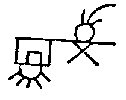

43\. He knew how to make war on all; he slew Strong-Stone.

43\. Nitatonep wemi palliton maskansini nihillanep.

 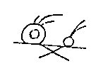

44\. The Always-Ready-One was chief; he fought against the Snakes.

44\. Messissuwi sakimanep akowini pallitonep.

 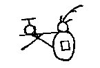

45\. The Strong-Good-One was chief, he fought against the northerners.

45\. Chitanwulit sakimanep lowanuski pallitonep.

 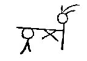

46\. The Lean-One was chief; he fought against the Tawa people.

46\. Alokuwi sakimanep towakon pallitonep.

 

47\. The Opossum-Like was chief; he fought in sadness,

47\. Opekasit sakimanep sakhelendam pallitonepit.

 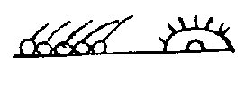

48\. And said, "They are many; let us go together to the east, to the
sunrise."

48\. Wapagishik yuknohokluen makeluhuk wapaneken.

 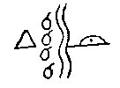

49\. They separated at Fish river; the lazy ones remained there.

49\. Tsebepieken nemassipi \[Var. mixtisipi.\] nolandowak gunehunga.

 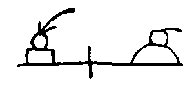

50\. Cabin-Man was chief; the Talligewi possessed the east.

50\. Yagawanend sakimanep talligewi wapawullaton.

 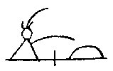

51\. Strong-Friend was chief; he desired the eastern land.

51\. Chitanitis sakimanep wapawaki gotatamen.

 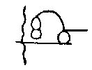

52\. Some passed on east; the Talega ruler killed some of them.

52\. Wapallendi pomisinep talegawil allendhilla.

 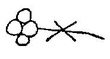

53\. All say, in unison, "War, war."

53\. Mayoksuwi wemilowi palliton palliton.

 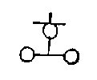

54\. The Talamatan, friends from the north, come, and all go together.

54\. Talamatan nitilowan payatchik wemiten.

 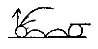

55\. The Sharp-One was chief, he was the pipe-bearer beyond the river.

55\. Kinehepend sakimanep tamaganat sipakgamen.

 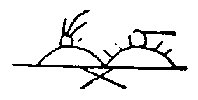

56\. They rejoiced greatly that they should fight and slay the Talega
towns.

56\. Wulatonwi makelima pallihilla talegawik.

 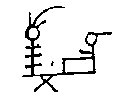

57\. The Stirrer was chief; the Talega towns were too strong.

57\. Pimokhasuwi sakimanep wsamimaskan talegawik.

 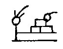

58\. The Fire-Builder was chief; they all gave to him many towns.

58\. Tenchekentit sakimanep wemilat makelinik.

 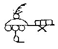

59\. The Breaker-in-Pieces was chief, all the Talega go south.

59\. Pagan chichilla sakimanep shawanewak wemi talega.

 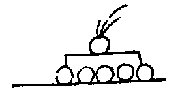

60\. He-has-Pleasure was chief; all the people rejoice.

60\. Hattan wulaton sakimanep, wingelendam wemi lennowak.

 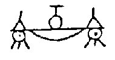

61\. They stay south of the lakes; the Talamatan friends north of the
lakes.

61\. Shawanipekis gunehungind lowanipekis talamatanitis.

 

62\. When Long-and-Mild was chief, those who were not his friends
conspired.

62\. Attabchinitis gishelendam gunitakan sakimanep.

 

63\. Truthful-Man was chief, the Talamatans made war.

63\. Linniwulamen sakimanep pallitonep talamatan.

 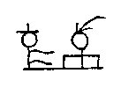

64\. Just-and-True was chief; the Talamatans trembled.

64\. Shakagapewi sakimanep nungiwi talamatan.

------------------------------------------------------------------------

[Next: Part Va](wa07.md)
