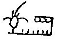
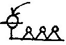
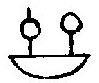
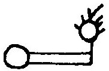
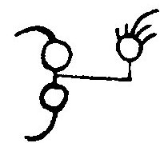
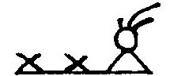
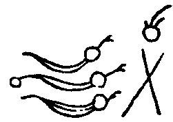
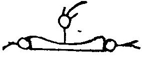

[Intangible Textual Heritage](../../index)  [Native American](../index.md) 
[Index](index)  [Previous](wa06)  [Next](wa08.md) 

------------------------------------------------------------------------

 

1\. All were peaceful, long ago, there at the Talega land.

1\. Wemilangundo wulamo talli talegaking.

 

2\. The Pipe-Bearer was chief at the White river.

2\. Tamaganend sakimanep wapalaneng.

 

3\. White-Lynx was chief, much corn was planted.

3\. Wapushuwi sakimanep kelitgeman.

 

4\. Good-and-Strong was chief; the people were many.

4\. Wulitshinik sakimanep makdopannik.

 

5\. The Recorder was chief; he painted the records.

5\. Lekhihitin sakimanep wallamolumin.

 

6\. Pretty-Blue-Bird was chief; there was much fruit.

6\. Kolachuisen sakimanep makeliming.

 

7\. Always-There was chief; the towns were many.

7\. Pematalli sakimanep makelinik.

 

8\. Paddler-up-Stream was chief; he was much on the rivers,

8\. Pepomahenem sakimanep makelaning.

 

9\. Little-Cloud was chief; many departed,

9\. Tankawon sakimanep makeleyachik,

 

10\. The Nanticokes and the Shawnees going to the south.

10\. Nentegowi shawanowi shawanaking.

 

11\. Big-Beaver was chief, at the White Salt Lick.

11\. Kichitamak sakimanep wapahoning.

 

12\. The Seer, the praised one, went to the west.

12\. Onowutok awolagan wunkenahep.

 

13\. He went to the west, to the southwest, to the western villages.

13\. Wtinpakitonis wunshawononis wunkiwikwotank.

 

14\. The Rich-Down-River-Man was chief, at Talega river.

14\. Pawanami sakimanep taleganah.

 

15\. The Walker was chief; there was much war.

15\. Lokwelend sakimanep makpalliton.

 

16\. Again with the Tawa people, again with the Stone people, again with
the northern people.

16\. Lappi towako lappi sinako lappi lowako.

 

17\. Grandfather-of-Boats was chief; he went to lands in boats.

17\. Mokolmokom sakimanep mokolakolin.

 

18\. Snow-Hunter was chief; he went to the north land.

18\. Winelowich sakimanep lowushkakiang.

 

19\. Look-About was chief, he went to the Talega mountains.

19\. Linkwekinuk sakimanep talegachukang.

------------------------------------------------------------------------

[Next: Part Vb](wa08.md)
