[Intangible Textual Heritage](../../index)  [Native American](../index) 
[Index](index)  [Previous](wa08) 

------------------------------------------------------------------------

 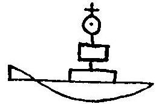

40\. At this time whites came on the Eastern sea.

40\. Wonwihil wapekunchi wapsipayat.

 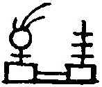

41\. Much-Honored was chief; he was prosperous.

41\. Makelomush sakimanep wulatenamen.

 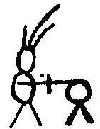

42\. Well-Praised was chief; he fought at the south.

42\. Wulakeningus sakimanep shawanipalat.

 

43\. He fought in the land of the Talega and Koweta.

43\. Otaliwako akowetako ashkipalliton.

 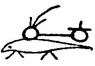

44\. White-Otter was chief; a friend of the Talamatans.

44\. Wapagamoshki sakimanep lamatanitis.

 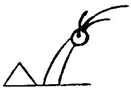

45\. White-Horn was chief; he went to the Talega,

45\. Wapashum sakimanep talegawunkik.

 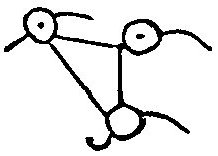

46\. To the Hilini, to the Shawnees, to the Kanawhas.

46\. Mahiliniki mashawoniki makonowiki.

 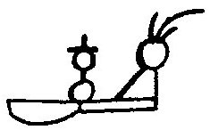

47\. Coming-as-a-Friend was chief; he went to the Great Lakes,

47\. Nitispayat sakimanep kipemapekan,

 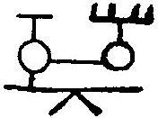

48\. Visiting all his children, all his friends.

48\. Wemiamik weminitik kiwikhotan.

 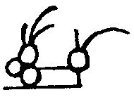

49\. Cranberry-Eater was chief, friend of the Ottawas.

49\. Pakimitzin sakimanep tawanitip.

 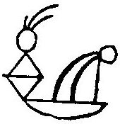

50\. North-Walker was chief, he made festivals.

50\. Lowaponskan sakimanep ganshowenik.

 

51\. Slow-Gatherer was chief at the shore.

51\. Tashawinso sakimanep shayabing.

 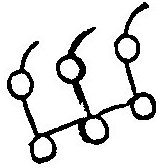

52\. As three were desired, three those were who grew forth,

52\. Nakhagattamen nakhalissin wenchikit,

 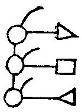

52\. bis. The Unami, the Minsi, the Chikini.

52\. bis. Unamini minsimini chikimini.

 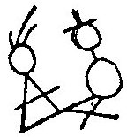

53\. Man-Who-Fails was chief; he fought the Mengwe.

53\. Epallahchund sakimanep mahongwipallat.

 

54\. He-is-Friendly was chief; he scared the Mengwe.

54\. Langomuwi sakimanep mahongwichamen.

 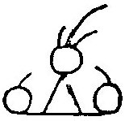

55\. Saluted was chief; thither,

55\. Wangomend sakimanep ikalawit,

 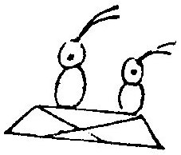

56\. Over there, on the Scioto, he had foes.

56\. Otaliwi wasiotowi shingalusit.

 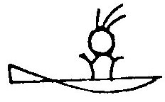

57\. White-Crab was chief, a friend of the shore.

57\. Wapachikis sakimanep sahyabinitis.

 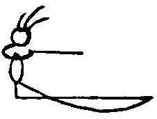

58\. Watcher was chief, he looked toward the sea.

58\. Nenachihat sakimanep peklinkwekin.

 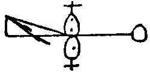

59\. At this time, from north and south, the whites came.

59\. Wonwihil lowashawa wapayachik.

 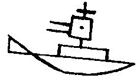

60\. They are peaceful; they have great things; who are they?

60\. Langomuwak kitohatewa ewenikiktit?
