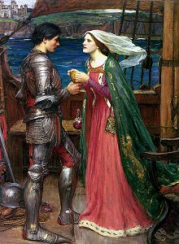

  
[Intangible Textual Heritage](../../index)  [Legends/Sagas](../index) 
[England](../eng/index) 

------------------------------------------------------------------------

<table width="75%">
<colgroup>
<col style="width: 50%" />
<col style="width: 50%" />
</colgroup>
<tbody>
<tr class="odd">
<td width="50%" data-valign="TOP"></td>
<td width="50%" data-valign="CENTER"><h1 id="an-arthurian-miscellany" data-align="CENTER">An Arthurian Miscellany</h1></td>
</tr>
</tbody>
</table>

------------------------------------------------------------------------

This is a collection of Arthurian literature: poetry, drama and essays,
written after the main canon, principally in the 18th through early 20th
centuries. The files are arranged by author and date of publication.
These works were all originally published prior to 1923 and hence are in
the public domain in the United States.

------------------------------------------------------------------------

[At the Palace of King Lot, by Oscar Fay Adams \[1886\]](art000)  
[The Maid's Alarm, by Oscar Fay Adams \[1886\]](art001)  
[The Rape of the Tarts, by Oscar Fay Adams \[1886\]](art002)  
[The Return from the Quest, by Oscar Fay Adams \[1886\]](art003)  
[The Vision of Sir Lamoracke, by Oscar Fay Adams \[1886\]](art004)  
[The Water Carriers, by Oscar Fay Adams \[1886\]](art005)  
[Thomas and Vivien, by Oscar Fay Adams \[1886\]](art006)  
[Gawaine and Marjorie, by Oscar Fay Adams \[1906\]](art007)  
[Pleasuance of Maid Marian, by Oscar Fay Adams \[1906\]](art008)  
[The Ballad of Glastonbury, by Henry Alford \[1853\]](art009)  
[Tristram and Iseult, by Matthew Arnold \[1852\]](art010)  
[La Mort d'Arthur Not by Alfred Tennyson, by William Edmondstoune Aytoun
\[1843\]](art011)  
[Cian of the Chariots, by William H. Babcock \[1898\]](art012)  
[The Prophecy of Merlin, by Anne Bannerman \[1802\]](art013)  
[From the Diary of Iseult of Brittany, by Maurice Baring
\[1913\]](art014)  
[Ballade of Tristram's Last Harping, by Gertrude Bartlett
\[1916\]](art015)  
[Merlin's Youth, by George Bidder \[1899\]](art016)  
[Prince Arthur. An Heroick Poem in Ten Books: Part I, by Richard
Blackmore \[1695\]](art017)  
[Prince Arthur: Part II, by Richard Blackmore \[1695\]](art018)  
[King Arthur: Part I, by Richard Blackmore \[1697\]](art019)  
[King Arthur: Part II, by Richard Blackmore \[1697\]](art020)  
[Arthur in Avalon, by J. Arthur Blaikie \[1884\]](art021)  
[The Wisdom of Merlyn, by Wilfrid Scawen Blunt \[1914\]](art022)  
[To Nimue, by Wilfrid Scawen Blunt \[1914\]](art023)  
[The Birth of Arthur, by Reginald R. Buckley & Rutland Boughton
\[1886\]](art024)  
[Merlin's Prophecy: Humbly Inscrib'd to his R.H. the Prince of Wales, by
Melissa \[pseudonym of Jane Brereton\] \[1735\]](art025)  
[Merlin: A Poem: Humbly Inscrib'd to her Majesty Queen Guardian, by
Melissa \[pseudonym for Jane Brereton\] \[1735\]](art026)  
[Excalibur, by Sallie Bridges \[1864\]](art027)  
[The Death of Lanceor, by Sallie Bridges \[1864\]](art028)  
[The King and the Bard, by Sallie Bridges \[1864\]](art029)  
[The Love-Drink, by Sallie Bridges \[1864\]](art030)  
[The Quest of the Sancgreal, by Sallie Bridges \[1864\]](art031)  
[Camlan, by Robert Buchanan \[1859\]](art032)  
[Gawayne's Ghost, by Robert Buchanan \[1859\]](art033)  
[Gawayne's Revenge, by Robert Buchanan \[1859\]](art034)  
[Joyous Garde, by Robert Buchanan \[1859\]](art035)  
[Merlin's Tomb, by Robert Buchanan \[1859\]](art036)  
[The Rendering, by Robert Buchanan \[1859\]](art037)  
[The Rescue, by Robert Buchanan \[1859\]](art038)  
[The Tryste, by Robert Buchanan \[1859\]](art039)  
[Sir Galahad, A Call to the Heroic, by James Burns \[1915\]](art040)  
[Guinevere to Lancelot, by H. C. C. \[1869\]](art041)  
[An Epigram, by Thomas Campion \[1607\]](art042)  
[The Tragedy of Etarre, by Rhys Carpenter \[1912\]](art043)  
[King Arthur: A Drama in a Prologue and Four Acts, by J. Comyns Carr
\[1895\]](art044)  
[Of Palomide, by Prince Aelian (Frank Carr) \[1890\]](art045)  
[A Guinevere, by Madison Cawein \[1913\]](art046)  
[Isolt, by Madison Cawein \[1913\]](art047)  
[The Daughter of Merlin, by Madison Cawein \[1913\]](art048)  
[The Dream of Sir Galahad, by Madison Cawein \[1913\]](art049)  
[Tristram and Isolt, by Madison Cawein \[1913\]](art050)  
[Tristram and Isolt, by Madison Cawein \[1913\]](art051)  
[Waste Land, by Madison Cawein \[1913\]](art052)  
[The Boy Apprenticed to an Enchanter, by Padraic Colum
\[1920\]](art053)  
[The New Sangreal, by Rose Terry Cooke \[1888\]](art054)  
[Tom Thumb, by Dinah Maria Mulock Craik \[1863\]](art055)  
[Excalibur: An Arthurian Drama, by Ralph Adams Cram \[1909\]](art056)  
[Merlin's Last Prophecy, by George Darley \[1838\]](art057)  
[The Last Ballad, by John Davidson \[1899\]](art058)  
[Palomydes, by Austin Dobson \[1885\]](art059)  
[The Mill, by Henry Van Dyke \[1902\]](art060)  
[Merlin I, by Ralph Waldo Emerson \[1846\]](art061)  
[Merlin II, by Ralph Waldo Emerson \[1846\]](art062)  
[Merlin's Song, by Ralph Waldo Emerson \[1846\]](art063)  
[The Love-song of Tristram and Iseult, by Cyril Emra \[1905\]](art064)  
[When Tristram to Tintagel Came, by Cyril Emra \[1905\]](art065)  
[Arthur's Knighting, by Sebastian Evans \[1875\]](art066)  
[The Eve of Morte Arthur, by Sebastian Evans \[1875\]](art067)  
[The New King Arthur: An Opera Without Music, by Edgar Fawcett
\[1885\]](art068)  
[The Vision of the Holy Grail, by Eugene Field \[1905\]](art069)  
[Tom Thumb, a Tragedy, by Henry Fielding \[1730\]](art070)  
[The Tragedy of Tragedies, by Henry Fielding \[1731\]](art071)  
[Sonnet XXIII, by Fulke Greville \[1633\]](art072)  
[Geraint the Son of Erbin, by Lady Charlotte Guest](art073)  
[Owain or the Lady of the Fountain, by Lady Charlotte Guest](art074)  
[Peredur the Son of Evrawc, by Charlotte Guest](art075)  
[The Dream of Rhonabwy, by Charlotte Guest](art076)  
[Cerdic and Arthur, by John Lesslie Hall \[1899\]](art077)  
[Sir Tray: An Arthurian Idyl, by General Edward Hamley
\[1873\]](art078)  
[The Opera of Operas or Tom Thumb the Great, by Eliza Haywood and
William Hatchett \[1733\]](art079)  
[The Quest of the Sangraal, by Robert S. Hawker \[1864\]](art080)  
[King Arthur's Waes-hael, by Robert Stephen Hawker \[1869\]](art081)  
[Queen Guennivar's Round, by Robert Stephen Hawker \[1869\]](art082)  
[The Doom-Well of St. Madron, by Robert Stephen Hawker
\[1869\]](art083)  
[Tristram of the Wood, by Paul Hamilton Hayne \[1882\]](art084)  
[Guinevere, by Graham Hill \[1906\]](art085)  
[Launcelot and Gawaine, by Richard Hovey \[1888\]](art086)  
[The Quest of Merlin, by Richard Hovey \[1891\]](art087)  
[The Last Love of Gawaine, by Richard Hovey \[1898\]](art088)  
[The Marriage of Genevere: A Tragedy, by Richard Hovey
\[1899\]](art089)  
[The Misfortunes of Arthur, by Thomas Hughes \[1587\]](art090)  
[Arteloise, by J. Dunbar Hylton \[1887\]](art091)  
[The Dwarf's Quest: A Ballad, by Sophie Jewett \[1905\]](art092)  
[The Speeches at Prince Henries Barriers, by Ben Jonson
\[1610\]](art093)  
[For All Ladies of Shalott, by Aline Kilmer \[1921\]](art094)  
[A Legend of Tintagel Castle, by Letitia Elizabeth Landon
\[1833\]](art095)  
[Illustrations of the Fulfillment of the Prediction of Merlin, by Joseph
Leigh \[1807\]](art096)  
[Gawayne and the Green Knight: A Fairy Tale, by Charlotte Miner Lewis
\[1903\]](art097)  
[Launcelot, by Sinclair Lewis \[1904\]](art098)  
[The Old Legend of King Arthur, by W.J. Linton \[1865\]](art099)  
[An Iseult Idyll, by Grace Constant Lounsbery \[1901\]](art100)  
[The Vision of Sir Launfal, by James Russell Lowell \[1848\]](art101)  
[The Great Return, by Arthur Machen \[1915\]](art102)  
[Tristram, by Frederic Manning \[1910\]](art103)  
[Beowulf and Arthur as English Ideals, by Sarah McNary
\[1894\]](art104)  
[Samor, Lord of the Bright City, by H. H. Milman \[1818\]](art105)  
[The Shriving of Guinevere, by S. Weir Mitchell \[1883\]](art106)  
[How Lancelot Came to the Nunnery in Search of the Queen, by S. Weir
Mitchell \[1887\]](art107)  
[A Ballad of Cornwall, by F.B. Money-Coutts \[1896\]](art108)  
[Sir Dagonet's Quest, by F.B. Money-Coutts \[1897\]](art109)  
[The History of the Kings of Britain, by Geoffrey of Monmouth
\[1138\]](art110)  
[Palomyde's Quest, by William Morris \[1855\]](art111)  
[A Good Knight in Prison, by William Morris \[1858\]](art112)  
[King Arthur's Tomb, by William Morris \[1858\]](art113)  
[Near Avalon, by William Morris \[1858\]](art114)  
[Sir Galahad, A Christmas Mystery, by William Morris \[1858\]](art115)  
[The Chapel in Lyoness, by William Morris \[1858\]](art116)  
[The Defence of Guenevere, by William Morris \[1858\]](art117)  
[In Arthur's House, by William Morris \[1870\]](art118)  
[Merlin and Vivian: A Lyric Drama for Chorus, Soli and Orchestra, by
Ethel Watts Mumford \[1907\]](art119)  
[Mordred, a Tragedy, by Henry Newbolt \[1895\]](art120)  
[Tom Thumb the Great, by Kane O'Hara \[1780\]](art121)  
[King Arthur in Avalon, by Sara Hammond Palfrey \[1900\]](art122)  
[The Romaunt of Sir Floris, by John Payne \[1870\]](art123)  
[Sir Hornbook; or, Childe Lancelot's Expedition, A
Grammatico-Allegorical Ballad, by Thomas Love Peacock
\[1814\]](art124)  
[Calidore: A Fragment of a Romance, by Thomas Love Peacock
\[1816\]](art125)  
[The Round Table; or King Arthur's Feast, by Thomas Love Peacock
\[1817\]](art126)  
[King Arthur's Death, by Bishop Thomas Percy \[1765\]](art127)  
[King Ryence's Challenge, by Bishop Thomas Percy \[1765\]](art128)  
[Sir Lancelot du Lake, by Bishop Thomas Percy \[1765\]](art129)  
[The Boy and the Mantle, by Bishop Thomas Percy \[1765\]](art130)  
[The Legend of King Arthur, by Bishop Thomas Percy \[1765\]](art131)  
[The Marriage of Sir Gawaine, by Bishop Thomas Percy \[1765\]](art132)  
[The Christmas of Sir Galahad, by Elizabeth Stuart Phelps
\[1871\]](art133)  
[The Lady of Shalott, by Elizabeth Stuart Phelps \[1871\]](art134)  
[The True Story of Guenever, by Elizabeth Stuart Phelps
\[1876\]](art135)  
[The Terrible Test, by Elizabeth Stuart Phelps \[1878\]](art136)  
[Guinevere, by Elizabeth Stuart Phelps \[1880\]](art137)  
[Elaine and Elaine, by Elizabeth Stuart Phelps \[1883\]](art138)  
[Of Joyous Gard, by Ælian Prince \[1890\]](art139)  
[The Prophecy of Merlin, by John Reade \[1870\]](art140)  
[Geraint of Devon, by Marion Lee Reynolds \[1916\]](art141)  
[Rosenthal's Elaine, by William Henry Rhodes \[1876\]](art142)  
[King Arthur's Sleep, by Ernest Rhys \[1898\]](art143)  
[The Death of Merlin, by Ernest Rhys \[1898\]](art144)  
[The Waking of King Arthur, Brechva's Harp Song, by Ernest Rhys
\[1898\]](art145)  
[Sir Launcelot and the Sancgreal, by Ernest Rhys \[1905\]](art146)  
[The City of Sarras, by Ernest Rhys \[1905\]](art147)  
[The Lament of Sir Ector de Maris, by Ernest Rhys \[1905\]](art148)  
[The Last Sleep of Sir Launcelot, by Ernest Rhys \[1905\]](art149)  
[The Quest of the Grail: On The Eve, by Ernest Rhys \[1905\]](art150)  
[Timor Mortis, by Ernest Rhys \[1905\]](art151)  
[Merlin, by Edwin Arlington Robinson \[1917\]](art152)  
[God's Graal, by Dante Gabriel Rossetti \[1911\]](art153)  
[The Birth of Merlin; or, The Childe Hath Found His Father, by William
Rowley \[1662\]](art154)  
[The Bridal of Triermain, by Sir Walter Scott \[1813\]](art155)  
[Vivien, by Alan Seeger \[1916\]](art156)  
[Gawain and the Lady of Avalon, by George Augustus Simcox
\[1869\]](art157)  
[The Farewell of Ganore, by George Augustus Simcox \[1869\]](art158)  
[Camelford, by Douglas B. W. Sladan \[1885\]](art159)  
[Pastoral of Galahad, by Elinor Sweetman \[1899\]](art160)  
[Pastoral of Lancelot, by Elinor Sweetman \[1899\]](art161)  
[A Famous Prediction of Merlin, by Jonathan Swift \[1709\]](art162)  
[Queen Yseult, by Algernon Charles Swinburne \[1857\]](art163)  
[The Day Before the Trial, by Algernon Charles Swinburne
\[1857\]](art164)  
[Joyeuse Garde, by Algernon Charles Swinburne \[1859\]](art165)  
[The Tale of Balen, by Algernon Charles Swinburne \[1896\]](art166)  
[King Ban, by Algernon Charles Swinburne \[1915\]](art167)  
[The Secret of Sir Dinadan, by Marion Ames Taggart \[1894\]](art168)  
[The March of Arthur (Bale Arzur), by Thomas Taylor \[1865\]](art169)  
[Galahad in the Castle of the Maidens, by Sara Teasdale
\[1911\]](art170)  
[Guenevere, by Sara Teasdale \[1911\]](art171)  
[The Lady of Shalott, by Alfred Tennyson \[1833\]](art172)  
[Sir Galahad, by Alfred Tennyson \[1834\]](art173)  
[Sir Lancelot and Queen Guinevere, by Alfred Tennyson
\[1842\]](art174)  
[Balin and Balan, by Alfred Tennyson \[1859\]](art175)  
[Gareth and Lynette, by Alfred Tennyson \[1859\]](art176)  
[Geraint and Enid, by Alfred Tennyson \[1859\]](art177)  
[Guinevere, by Alfred Tennyson \[1859\]](art178)  
[Lancelot and Elaine, by Alfred Tennyson \[1859\]](art179)  
[Merlin and Vivien, by Alfred Tennyson \[1859\]](art180)  
[The Coming of Arthur, by Alfred Tennyson \[1859\]](art181)  
[The Holy Grail, by Alfred Tennyson \[1859\]](art182)  
[The Last Tournament, by Alfred Tennyson \[1859\]](art183)  
[The Marriage of Geraint, by Alfred Tennyson \[1859\]](art184)  
[The Passing of Arthur, by Alfred Tennyson \[1859\]](art185)  
[Merlin and the Gleam, by Alfred Tennyson \[1889\]](art186)  
[The Fairy of the Lake, by John Thelwall \[1801\]](art187)  
[Kathanal, by Katrina Trask \[1892\]](art188)  
[Merlin, by John Veitch \[1889\]](art189)  
[On King Arthur's Round-table at Winchester, by Thomas Warton
\[1777\]](art190)  
[The Grave of King Arthur, by Thomas Warton \[1777\]](art191)  
[Knights of King Arthur's Court, by Jessie Weston \[1896\]](art192)  
[Sir Gawain and the Green Knight, by Jessie L. Weston
\[1900\]](art193)  
[The Sword of Kingship, by Thomas Westwood \[1866\]](art194)  
[When Tristan Sailed, by Helen Hay Whitney \[1907\]](art195)  
[Merlin: A Drama in Three Acts, by Lambert A. Wilmer \[1827\]](art196)  
[Ballad of Sir Launcelot, by John Grosvenor Wilson \[1886\]](art197)  
[Excalibur, by John Grosvenor Wilson \[1886\]](art198)  
[Isolt at the Tomb of Tristram, by John Grosvenor Wilson
\[1886\]](art199)  
[Sir Palamides, by John Grosvenor Wilson \[1886\]](art200)  
[The Death of Guinevere, by John Grosvenor Wilson \[1886\]](art201)  
[The Egyptian Maid or the Romance of the Water-Lily, by William
Wordsworth \[1835\]](art202)  
[The Young Knight, or How Gareth Won His Spurs, by Rev. James
Yeames](art203)  
[Sir Gawain and the Green Knight: A Play, by The Reverend James Yeames
\[1911\]](art204)  
[Time and the Witch Vivien, by William Butler Yeats \[1889\]](art205)  
[Guenevere: A Play in Five Acts, by Stark Young \[1906\]](art206)  
[The San-Grail, by Ella Young \[1920\]](art207)  
[A Song that Trostan Made, by Ella Young \[1922\]](art208)  
[Trostan Made This, by Ella Young \[1922\]](art209)  
[The History of that Holy Disciple Joseph Arimathea](art210)  
[Tom Thumbe, His Life and Death, by Anonymous \[1630\]](art211)  
[The Temptation of Arthur, by Anonymous \[1870\]](art212)  
[Six Ballads about King Arthur, by Anonymous \[1881\]](art213)  
