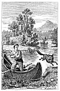
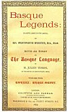

  
[Intangible Textual Heritage](../../../index.md)  [Sagas and
Legends](../../index)  [Basque](../index)  [Index](index)  [Next](bl01.md) 

------------------------------------------------------------------------

[Buy this Book at
Amazon.com](https://www.amazon.com/exec/obidos/ASIN/1402193092/internetsacredte.md)

------------------------------------------------------------------------

[  
Click to enlarge](img/front.jpg.md)  
ACHERIA, THE FOX.--P. 42  

# BASQUE LEGENDS:

###### COLLECTED, CHIEFLY IN THE LABOURD,

###### BY

## REV. WENTWORTH WEBSTER, M.A., OXON.

##### WITH AN ESSAY

###### ON

### THE BASQUE LANGUAGE,

###### BY

#### M. JULIEN VINSON,

##### OF THE REVUE DE LINGUISTIQUE, PARIS

###### TOGETHER WITH

#### APPENDIX: BASQUE POETRY

#### LONDON:

#### GRIFFITH AND FARRAN,

###### Successors to Newbery and Harris,

##### CORNER OF ST. PAUL'S CHURCHYARD;

###### AND

##### WALBROOK & Co., 52, FLEET STREET, E.C.

#### \[1879\]

Scanned at Intangible Textual Heritage, February, 2004. John Bruno Hare,
redactor. This text is in the public domain. These files may be used for
any non-commercial purpose, provided this notice of attribution is left
intact.

[  
Click to enlarge](img/title.jpg.md)

TO

M. ANTOINE D'ABBADIE,

OF ABBADIA,

MEMBER OF THE INSTITUTE OF FRANCE,

THIS

TRANSLATION OF LEGENDS,

ORIGINALLY TOLD IN THE LANGUAGE OF HIS ANCESTORS,

IN GRATEFUL ACKNOWLEDGMENT

OF

KINDLY COURTESY AND OF EVER-READY ASSISTANCE,

IS

Dedicated

BY HIS OBLIGED AND OBEDIENT SERVANT,

                          WENTWORTH WEBSTER.

 

------------------------------------------------------------------------

[Next: Contents](bl01.md)
