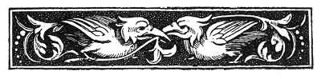

  
[Intangible Textual Heritage](../../../index.md)  [Sagas and
Legends](../../index)  [Basque](../index)  [Index](index.md) 
[Previous](bl00)  [Next](bl02.md) 

------------------------------------------------------------------------

[Buy this Book at
Amazon.com](https://www.amazon.com/exec/obidos/ASIN/1402193092/internetsacredte.md)

------------------------------------------------------------------------

p. v

 

# CONTENTS.

|                                                                                       |                          |
|---------------------------------------------------------------------------------------|--------------------------|
| PAGE                                                                                  |                          |
| INTRODUCTION                                                                          | [vii](bl02.htm#page_vii.md) |
| I.--LEGENDS or THE TARTARO                                                            | [1](bl03.htm#page_1.md)     |
|   The Tartaro                                                                         | [4](bl03.htm#page_4.md)     |
|   M. d'Abbadie's Version                                                              | [4](bl03.htm#page_4.md)     |
|     Variations of above                                                               | [5](bl05.htm#page_5.md)     |
|   Errua, the Madman                                                                   | [6](bl06.htm#page_6.md)     |
|     Variations of above                                                               | [10](bl07.htm#page_10.md)   |
|   The Three Brothers, the Cruel Master, and the Tartaro                               | [11](bl08.htm#page_11.md)   |
|   The Tartaro and Petit Perroquet                                                     | [16](bl10.htm#page_16.md)   |
| II.--THE HEREN-SUGE.--THE SEVEN-HEADED SERPENT                                        | [20](bl11.htm#page_20.md)   |
|   The Grateful Tartaro and the Heren-Suge                                             | [22](bl11.htm#page_22.md)   |
|     Variation of above                                                                | [32](bl12.htm#page_32.md)   |
|   The Seven-Headed Serpent                                                            | [33](bl13.htm#page_33.md)   |
|   The Serpent in the Wood                                                             | [38](bl14.htm#page_38.md)   |
| III.--ANIMAL TALES                                                                    | [42](bl16.htm#page_42.md)   |
|   Acheria, the Fox                                                                    | [43](bl17.htm#page_43.md)   |
|   The Ass and the Wolf                                                                | [45](bl17.htm#page_45.md)   |
| IV.--BASA-JAUN, BASA-ANDRE, AND LAMINAK                                               | [47](bl19.htm#page_47.md)   |
|   Basa-Jauna                                                                          | [49](bl19.htm#page_49.md)   |
|   The Servant at the Fairy's                                                          | [53](bl20.htm#page_53.md)   |
|   The Fairy in the House                                                              | [55](bl21.htm#page_55.md)   |
|   The Pretty but Idle Girl                                                            | [56](bl22.htm#page_56.md)   |
|   The Devil's Age                                                                     | [58](bl23.htm#page_58.md)   |
|   The Fairy-Queen Godmother                                                           | [59](bl24.htm#page_59.md)   |
| V.--WITCHCRAFT AND SORCERY                                                            | [64](bl26.htm#page_64.md)   |
|   The Witches at the Sabbat                                                           | [66](bl27.htm#page_66.md)   |
|   The Witches and the Idiots                                                          | [67](bl27.htm#page_67.md)   |
|   The Witch and the New-Born Infant                                                   | [69](bl28.htm#page_69.md)   |
|   The Changeling                                                                      | [73](bl30.htm#page_73.md)   |
| p. vi                                                       |                          |
| VI.--CONTES DES FÉES                                                                  | [76](bl31.htm#page_76.md)   |
|   (A) *Tales like the Keltic*                                                         | [77](bl31.htm#page_77.md)   |
|     Malbrouk                                                                          | [77](bl31.htm#page_77.md)   |
|     The Fisherman and his Sons                                                        | [87](bl32.htm#page_87.md)   |
|     Tabakiera, the Snuff-Box                                                          | [94](bl33.htm#page_94.md)   |
|     Mahistruba, the Master Mariner                                                    | [100](bl34.htm#page_100.md) |
|     Dragon                                                                            | [106](bl35.htm#page_106.md) |
|     Ezkabi-Fidel                                                                      | [111](bl36.htm#page_111.md) |
|       Variation of above                                                              | [120](bl37.htm#page_120.md) |
|     The Lady-Pigeon and her Comb                                                      | [120](bl37.htm#page_120.md) |
|       Suggested Explanation of above                                                  | [130](bl39.htm#page_130.md) |
|     Laur-Cantons                                                                      | [132](bl40.htm#page_132.md) |
|     The Young School-Boy                                                              | [136](bl41.htm#page_136.md) |
|     The Son who Heard Voices                                                          | [137](bl42.htm#page_137.md) |
|     The Mother and her Idiot Son; or, the Clever Thief                                | [140](bl43.htm#page_140.md) |
|     Juan Dekos, the Blockhead (Tontua)                                                | [146](bl44.htm#page_146.md) |
|       Variation of the above--Juan de Kalais                                          | [151](bl46.htm#page_151.md) |
|     The Duped Priest                                                                  | [154](bl46.htm#page_154.md) |
|   (B) *Contes dos Fées, derived directly from the French*                             | [158](bl48.htm#page_158.md) |
|     Ass'-Skin                                                                         | [158](bl48.htm#page_158.md) |
|       Variations of above                                                             | [165](bl49.htm#page_165.md) |
|     The Step-Mother and Step-Daughter                                                 | [166](bl50.htm#page_166.md) |
|     Beauty and the Beast                                                              | [167](bl51.htm#page_167.md) |
|       Variation of above                                                              | [172](bl52.htm#page_172.md) |
|     The Cobbler and his Three Daughters (Blue-Beard)                                  | [173](bl53.htm#page_173.md) |
|       Variations of above                                                             | [175](bl54.htm#page_175.md) |
|     The Singing Tree, the Bird which tells the Truth, and the Water which makes Young | [176](bl55.htm#page_176.md) |
|       Variation of above                                                              | [181](bl56.htm#page_181.md) |
|     The White Blackbird                                                               | [182](bl57.htm#page_182.md) |
|     The Sister and her Seven Brothers                                                 | [187](bl58.htm#page_187.md) |
|       Variations, etc.                                                                | [191](bl59.htm#page_191.md) |
|     *List of Publication of Foreign Legends in France*                                | [192](bl60.htm#page_192.md) |
|   VII.--RELIGIOUS TALES                                                               | [194](bl62.htm#page_194.md) |
|   Fourteen                                                                            | [195](bl63.htm#page_195.md) |
|     Variation of above--Jesus Christ and the Old Soldier                              | [199](bl63.htm#page_199.md) |
|   The Poor Soldier and the Rich Man                                                   | [200](bl64.htm#page_200.md) |
|   The Widow and her Son                                                               | [202](bl66.htm#page_202.md) |
|   The Story of the Hair-Cloth Shirt (La Cilice)                                       | [206](bl66.htm#page_206.md) |
|   The Saintly Orphan Girl                                                             | [209](bl67.htm#page_209.md) |
|   The Slandered and Despised Girl                                                     | [211](bl68.htm#page_211.md) |
| AN ESSAY ON THE BASQUE LANGUAGE                                                       | [219](bl70.htm#page_219.md) |
| APPENDIX.--BASQUE POETRY                                                              | [235](bl71.htm#page_235.md) |

 

------------------------------------------------------------------------

[Next: Introduction](bl02.md)
