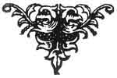

  
[Intangible Textual Heritage](../../../index)  [Sagas and
Legends](../../index)  [Basque](../index)  [Index](index) 
[Previous](bl14)  [Next](bl16) 

------------------------------------------------------------------------

[Buy this Book at
Amazon.com](https://www.amazon.com/exec/obidos/ASIN/1402193092/internetsacredte)

------------------------------------------------------------------------

### THE SERPENT IN THE WOOD.

LIKE many others in the world, there was a widower who had three
daughters. One day the eldest said to her father, that she must go and
see the country. She walked on for two hours, and saw some men cutting
furze, and others mowing hay.

She returned to the house, astonished at having seen such wonderful
things. She told her father what wonderful things she had seen, and her
father replied:

"Men cutting furze! Men mowing hay!!"

The second daughter asks, too, to go like her sister, and she returned
after having seen the same things. And the third daughter said that she
ought to go, too.

"Child, what will you see?"

"I, like my sisters, something or other."

p. 39

She set off on the same road as the others; and she, like the others,
saw men cutting furze, and men mowing hay. She went on further, and she
saw some washerwomen; and she went still a little further on till she
had walked for three hours, and she saw some wood-cutters cutting
firewood. She asked them if she should see anything more if she went a
little further. They told her that she would see some more wood-cutters
cutting firewood.

She went very much farther into the wood, and she was caught, and kept
prisoner by a serpent. She remained there crying, and not able to eat
anything; and she remained like that eight days, very sad; then she
began to grow resigned, and she remained there three years. At the end
of three years she began to wish to return home. The serpent told her to
come back again at the end of two days; that his time was nearly
finished, and that he was a king's son condemned for four years [1](#fn_33) (to be a serpent). He gave her a distaff
and spindle, of silver-gilt, and a silk handkerchief. He said to her:

"If you do not find me here on your return, you will have to wear out
seven pairs of shoes, six of leather and one pair of iron ones (before
you will be able to find me)."

When she came home, her father would not let her go back to the house
where she had passed such a long time with a son of a king, condemned to
be a serpent. She said that his time was almost finished, and that in
gratitude she ought to return; that he had said that he would marry her.
The father had her put in prison, confined in a room very high up. The
fourth day she escaped, and went to the place, but she did not find the
king's son. She had already shoes on her feet. She had almost worn them
out. After that she bought another pair. She kept journeying on and on,
and asking if it were far, and they told her that it was very far. She
bought still another pair of shoes, and these, too, got worn out on the
road. She bought a fifth pair, and

p. 40

after them the sixth also. She then asked if she were near yet, and they
told her that she was still very far. Then she bought the seventh pair
of shoes, of iron. And when she had gone a short way in these shoes, she
asked if it were far from there to the son of the king. The seventh pair
of shoes were almost worn out when she came to a city, and heard sounds
of music. She inquired what was happening in the city.

"Such a king's son is being married to-day."

She went to the house, and knocked at the door. A servant came.

"What do you want?"

She asked if there were any work to spin, and she would spin it.

And the servant went to tell it to the mistress. The lady ordered the
servant to bring her in. She brought her in. And when she was in the
kitchen, she showed the silk handkerchief which the king's son had given
her; and she began to blow her nose with that. The lady was quite
astonished to see the girl blow her nose with such a beautiful
handkerchief, as if it were nothing, [1](#fn_34)
when her son had one just like it for his marriage-day. So she told her
son, when he came back from the church, that she had a spinster who came
from a great distance, and said to him:

"She has a silk handkerchief just like yours!"

And the king's son said to his mother:

"I, too, must see this spinster that you have there." And he began to go
there.

And his mother said to him,

"But why must you see her?"

"I wish to see her."

He went to the kitchen, and in his presence she used her silk
handkerchief.

p. 41

He said to her,

"Show me that."

She said to him,

"It is too dirty to put into your hands, sir."

The gentleman says to her,

"I wish to see it, and show it to me."

(Then) he recognised the young girl. She showed him (too) the distaff
and spindle.

At table, when everybody was engaged telling stories, this king said:

"I also have a story to tell."

Everybody was silent, and turned to look at him, and he said:

"Formerly, I had a key to a chest of drawers, and I lost it, and had a
new one made. (After that, I found the old one.)"

And he turned to his wife:

"Should I use the old one or the new one?"

And she replied:

"If the first was a good one, why should you make use of the new one?"

Then he gave her this answer

"Formerly, I had a wife, and now I have taken you. I leave you, and take
the former one. Do you go off, then, to your own house."

GAGNA-HAURRA HIRIGARAY.  
(Learnt at Guethary.)

For the version of the Heren-Suge tales which most closely approaches
the Gaelic, see below, "Keltic Legends," "The Fisherman and his Sons,"
[p. 87](bl32.htm#page_87).

 

 

------------------------------------------------------------------------

### Footnotes

[39:1](bl15.htm#fr_33) *Cf.* "Mahistruba," [p.
100](bl34.htm#page_100); and "Beauty and the Beast," [p.
167](bl51.htm#page_167).

[40:1](bl15.htm#fr_34) Silk kerchiefs are
generally used, especially by women, as headdresses, and not as
pocket-handkerchiefs, all through the south of France.

------------------------------------------------------------------------

[Next: Introduction](bl16)
