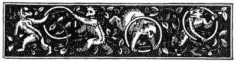

  
[Intangible Textual Heritage](../../../index.md)  [Sagas and
Legends](../../index)  [Basque](../index)  [Index](index.md) 
[Previous](bl15)  [Next](bl17.md) 

------------------------------------------------------------------------

[Buy this Book at
Amazon.com](https://www.amazon.com/exec/obidos/ASIN/1402193092/internetsacredte.md)

------------------------------------------------------------------------

p. 42

 

# III.--ANIMAL TALES.

WE give two stories as specimens of animal tales, which are neither
allegories, nor fables, and still less satires. The reader must remember
the phrase, "This happened when animals and all things could talk." So
thoroughly is this believed, that the first tale of this class recited
to us completely puzzled us. The animals are in them placed so fully on
a footing with human beings--not in the least as our "poor relations,"
but rather as sharper-witted, and quite as happy and well off as
ourselves--that it is difficult at times to determine whether it is the
beast or the man who is the speaker.

Of the latter part of our first story we have heard many variations. In
one given by M. Cerquand, p. 29, note, [1](#fn_35.md) the fox is represented by Basa-Jauna; in a
version from Baigorry, by the Tartaro; but in three others, from
separate localities, he is a fox. The first two truths are the same in
all the versions. In that here given, the fun is heightened by the fox
talking and lisping throughout like a little child. All these versions
we take to be merely fragments of a much longer story.

In M. Cerquand's "The Chandelier of St. Sauveur," p. 22, the hero's name
is Acherihargaix--"the fox difficult to be caught;" and we suspect that
he, too, was originally merely an animal.

------------------------------------------------------------------------

### Footnotes

[42:1](bl16.htm#fr_35.md) "Légendes et Récits
Populaires du Pays Basque," par M. Cerquand. Part I., Pau, 1875, and
Part II., p. 28, Pau, 1876.

------------------------------------------------------------------------

[Next: Acheria, The Fox](bl17.md)
