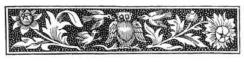

  
[Intangible Textual Heritage](../../../index)  [Sagas and
Legends](../../index)  [Basque](../index)  [Index](index) 
[Previous](bl30)  [Next](bl32) 

------------------------------------------------------------------------

[Buy this Book at
Amazon.com](https://www.amazon.com/exec/obidos/ASIN/1402193092/internetsacredte)

------------------------------------------------------------------------

p. 76

 

# VI.--CONTES DES FÉES.

UNDER this head, we include all those legends which do not readily fall
under our other denominations. Fée and fairy are not synonymous. All
such tales as those of the "Arabian Nights" might come within the
designation of Contes des Fées, but they could hardly be included under
Fairy Tales, though the former may be said to embrace the latter. We
have divided our legends of this kind into two sections:--(A) Those
which have a greater or less similarity to Keltic legends, as recorded
in Campbell's "Tales of the West Highlands," and elsewhere; (B) Those
which we believe to be derived directly from the French.

We have chosen the designation Keltic, because the burning question
concerning the Basques at present is their relation to the Keltic race.
Anything that can throw light upon this will have a certain interest for
a small portion of the scientific world. That these legends do in some
degree resemble the Keltic ones will, we think, be denied by no one.
Whether they have a closer affinity with them than with the general run
of Indo-European mythology may be an open question. Or, again, whether
the Basques have borrowed from the Kelts, or the Kelts from the Basques,
we leave undetermined. One legend here given, that of "Juan Dekos," has
clearly been borrowed from the Gaelic, and that since the Keltic
occupation of the Hebrides. [1](#fn_72) The very

p. 77

term Keltiberi, as used by the classical writers, shows some contact of
the Kelts with the Basques in ancient times, whether we take Basque and
Iberi to be co-extensive and convertible terms or not. What the *rôle*
of the "White Mare" is in these tales we do not understand. Can it be
connected with the figure of a horse which appears so frequently on the
so-called Keltiberian coins, or is it a mere variation of the Sanscrit
"Harits, or horses of the sun?" Campbell, Vol. I., p. 63, says these
"were always feminine, as the horses in Gaelic stories are."

It may be, perhaps, as well to mention that we did not see Campbell's
"Tales of the West Highlands" till after these legends had been written
down.

------------------------------------------------------------------------

### Footnotes

[76:1](bl31.htm#fr_72) See notes to "Juan
Dekos," [p. 146](bl44.htm#page_146).

------------------------------------------------------------------------

[Next: Malbrouk](bl32)
