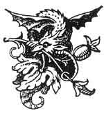

  
[Intangible Textual Heritage](../../../index.md)  [Sagas and
Legends](../../index)  [Basque](../index)  [Index](index.md) 
[Previous](bl68)  [Next](bl70.md) 

------------------------------------------------------------------------

[Buy this Book at
Amazon.com](https://www.amazon.com/exec/obidos/ASIN/1402193092/internetsacredte.md)

------------------------------------------------------------------------

### THE SLANDERED AND DESPISED YOUNG GIRL.

LIKE many others of us in the world, there was a mother and her
daughter. They were very poor, and the daughter said that she wished to
go out to service, in order to do something for her mother. The mother
will not listen to it; what would become of her without her daughter?
She prefers to be poor with her to being rich alone. The young girl
stays at home. She used to go out as needlewoman; but suddenly her
mother falls ill, and quickly she dies.

This poor young girl had the deepest sorrow, and she continued to go out
to work as before. One day, while she was

p. 212

at work in a house, some acquaintance came and said to them--

"What! you have this young girl here to work! She is a bad girl; she is
not at all what she ought to be. You should not take her."

In the evening they give her her day's wages, and say that they do not
want her any more. She goes to another house, and there the same thing
happens. Some people come and say in the same way--

"You have that young girl to work! She will come to a bad end, that girl
will. She is even a thief; do not have her again."

In the evening they give her her day's wages, and say to her that they
do not want her any more. No one asked her to work any more, and she
remained at home. By charity and pity, some neighbours, without any
necessity, let her come to work for them, because they were pained to
see her distress. But there, too, someone comes and says,

"I am astonished to see that young girl here. She is a worthless girl.
How is it that you have her here?"

They answer, "Moved by charity, just to help her."

"Do not have her any more; she is a thief, and as bad as can be."

After having given her her day's wages, they send her off, and say that
they do not want her any more. [1](#fn_175.md)

This poor young girl was in the greatest distress; if she wished to eat,
she must beg. She set to work begging then, and everyone disliked her so
much that, when they saw her, they used to spit at her.

There came home from one of his voyages a ship's captain, and, while he
was amusing himself with his friends, this young girl asks for charity.
His friends tell

p. 213

him that she was a bad girl, and they spit at her, and he does like the
rest. Our captain goes off for another voyage; but he was overtaken by a
terrible tempest. The storm was so violent, and the rain came down as if
it would never leave off; it made them all tremble. In the midst of his
prayers the captain made a vow that, if he escaped, he would marry the
worst and most despised girl that he could find. Immediately the weather
became fine. He makes a very successful voyage, and one which brought
him plenty of money; but, when he reached land, he forgot his vow, and
began to amuse himself as much as possible.

This same young girl asks charity, and, after his friends have told him
that she was a bad girl, they spat at her, and he did so too.

Again he goes to sea, and he is overtaken by a storm, much worse than
the former one. The wind was most violent, and the lightning terrible;
they saw nothing but that. All trembled, and were praying. The captain
again makes a vow of marrying, if he should get safe home, with the most
abandoned and the poorest girl he can find, and he regrets that he has
not kept his vow. He said to himself,

"If I had kept it, perhaps I should not have had such weather as this;
but nothing now shall make me forget my promise."

Immediately the weather becomes fine; he has immense good fortune, and
gains as much money as he wishes.

When he comes home, he sees this young girl again. His friends spit at
her, but he says to them,

"I will not spit at her--I wish to marry her."

His friends burst out into roars of laughter, "Ha! ha! ha!" The sailor
goes home to his mother, and tells her that he is going to be married.
His mother answers him,

"If you make a good and rich marriage, very well."

The son said to her, "She is not at all rich. She is that girl there."

The mother was not pleased. "Leave that bad girl alone."

p. 214

He said, "It is all the same to me; I will marry none but her."

He asks his friends where she lives. They point to an old house. The
captain goes there in the evening and knocks at the door. The girl says,
"Who is there?"

The man says, "Open the door for me. It is I."

The young girl says, "I will not open the door--I am in bed."

"Never mind, open it."

"No! I will not do it."

"I am going to break in the door."

"Do what you will, but I will not open it."

He breaks open the door, as he said, and goes in. He sees this young
girl on a little straw, covered only by her dress. The man wants to go
near her. The girl says:

"You may kill me if you like, but you shall not come near me."

They were like that a long time. The man says to her:

"Give me your promise of marriage, then?"

The young girl says, "What do you mean? I so poor and you so rich--how
can we marry?"

The man says that they will do so. The young girl will not believe him,
and the gentleman says to her:

"If you will give me your promise I will go away at once." And the young
girl says "Yes," in order to make him go away. Then he goes away.

The next day he goes to a priest and tells him what has taken place, and
gives him forty thousand francs, and tells him to build a fine house
with it, and to furnish it, and if anything more is wanting he will pay
it at his next voyage. The young girl, too, goes to the priest, for
before this she had been helped and comforted by him. The priest tells
her how the captain had given him forty thousand francs for her to build
a fine house with, and for her to make use of for all she wanted. The
priest said that he would undertake building the house, and she said
that she would see to all that was wanting for herself.

p. 215

The captain goes off, and has as successful a voyage as could be
made--he had nothing but fair weather. He brought back plenty of money,
and they were married soon after his arrival. His mother and his
brothers and sister were at the wedding. After some time the captain
wished to go and make another voyage. He left his fine house to take his
wife to his mother's house, and he said to her:

"My wife will be better with you than all alone. You will have her
always dressed as becomes her position, and keep a good table for her,
and take good care of her."

The husband went to sea. He often wrote to his wife; but what do the
captain's mother and her daughter do after he is gone? They take away
from this lady all her pretty dresses, and make her put on old ones, and
wooden shoes too with straw inside, and send her off to keep the geese
with a bit of bread, telling her that she must bring home a load of
small wood (to light the fire with), and that she must keep spinning
while she is watching the geese. This poor young girl says nothing. She
goes off with her flock of geese. When night comes she returns with four
skeins of thread spun and a load of small wood. Every day she does the
same. They do not even tell her that her husband has written to her.

The captain has a fine voyage. He had some fears about his mother and
his sister, and he thought to himself that it would be best to come home
secretly, in silence, and see how they were treating his wife. He comes
then as a foreigner, in the dress of a captain. He says that he comes
from a distance, and that he wishes to pass a week in their house. The
mother and the daughter receive him very well. They tell him to choose
his own room, and he chooses his own wedding-chamber. At nightfall the
geese come home, cackling, cackling, and with them the young girl. This
gentleman tells them that it is his habit to have some young girl with
him when he travels like that, and

p. 216

asks them if they can get him one. They tell him "Yes," that there would
be none more glad than this young girl, and that they will give her to
him. They go and tell it to the goose girl.

She says that certainly she will not go. They say to her that he has
chests full of gold, and that they would willingly go, but that he has
chosen her; and they push her by force into the room. The gentleman
orders an excellent supper, and says that he has the habit of supping
well. The goose girl stands sadly before the table. She would not eat
anything; the gentleman presses her, and she kept saying that she was
not hungry--that she had eaten as much as she usually did. He asks her:

"Where have you eaten? and what have you eaten?"

"A piece of bread that I took with me in the morning."

He tells her again to eat these good things. She says that she does not
want anything, and that the greatest pleasure he can give her is to let
her go off to her geese. The gentleman says to her:

"You do not know then why you have come here? You are to sleep with me."

The young girl says: "You shall cut me in pieces on the spot before I
will go to your bed. I have a husband, and I wish to be faithful to
him."

And she tells, on his asking her, how that she was very poor, and no one
loved her, and how a rich gentleman had wished to marry her--how very
good he had been to her even after the marriage, and how when he went on
a voyage he had left her at his mother's house, thinking that she would
be best there, and that since he was gone she had had no news of her
husband. The gentleman said to her:

"Would you recognise your husband?" She says,

"Yes."

"Has he any marks?"

The young girl says, "Yes; he has a mole between his two breasts with
three hairs on it."

p. 217

The gentleman opens his shirt and shows her his birthmark.

This young girl was seized with such joy that she fainted away, and fell
down on the floor. As this gentleman knew the ways of the room he burst
open the closet, and took a bottle of liqueur to bring his wife round
again, and at last she came to herself, and passes a sweet night with
her husband.

The next morning the geese come, cackle, cackle, before the door, and
the mistress of the house and her daughter come to the gentleman's door,
calling out, if they have not stopped there long enough, that it is time
to set off, and that it is a shame to be in bed at that hour. The
gentleman gets up and says to his mother:

"What, mother, was this the way that you ought to have treated my
dearly-loved wife?"

And he was in such a rage that, if his wife had not begged him to
forgive her, he would even have beaten her; but his wife prevented him.
He sent his mother and his sister out of the house, and he and his wife
lived for many years happy and pleased with each other; and as they
lived well they died well too.

THE SISTER OF LAURENTINE.

This may be Toutou, but in the Basque country it is sometimes difficult
to get hold of a person's surname. "Who is Laurentine?" you ask. "She is
Toutou's sister," is the reply. "But who is Toutou?" "She is
Laurentine's sister." If you want to get anything more out you have to
cross-examine for half-an-hour. Some of our tales are not signed; we
believe these are to be divided between Catherine Elizondo and
Laurentine Kopena. Fresh names we think we always put down, but these
brought so many tales that we sometimes omitted it with them, and in the
rearrangement for printing we have lost our clue.

p. 218

We have some thirteen other tales of all kinds, beside variations, which
we have not given. They are mostly short, and not very different in
character from those given above, except in being more stupid in two or
three cases and a few of them are to be found in M. Cerquand's
collection.

 

 

------------------------------------------------------------------------

### Footnotes

[212:1](bl69.htm#fr_176.md) This whole picture is,
unhappily, more true to life than one would think at first sight. The
whole history of the Cagots, and a good deal of that of witchcraft,
shows how virulent this kind of irrational dislikes is, and how
difficult to deal with and to overcome when once they have been
introduced into a rural population.

------------------------------------------------------------------------

[Next: An Essay on the Basque Language](bl70.md)
