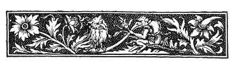

  
[Intangible Textual Heritage](../../../index)  [Sagas and
Legends](../../index)  [Basque](../index)  [Index](index) 
[Previous](bl70)  [Next](bl72) 

------------------------------------------------------------------------

[Buy this Book at
Amazon.com](https://www.amazon.com/exec/obidos/ASIN/1402193092/internetsacredte)

------------------------------------------------------------------------

p. 235

 

# BASQUE POETRY.

### I.--PASTORALES.

PERHAPS there is no people among whom versification is so common, and
among whom really high-class poetry is so rare, as among the Basques.
The faculty of rhyming and of improvisation in verse is constantly to be
met with, Not unusually a traveller in one of the country *diligences*,
especially on a market-day, will be annoyed by the persistent crooning
of one of the company, like Horace of old, more or less under the
inspiration of Bacchus; and if he enquire what the man is about, he will
be told that he is reciting a narrative in verse of all the events of
the past day, mingled probably with more or less sarcastic reflections
on the present company, and with especial emphasis on the stranger. At
the yearly village *fêtes*, when the great match of *Jeu de Paume au
Rebot* has been lost or won, prizes are sometimes given for
improvisation on themes suggested at the moment, and the rapidity of the
leading *improvisatori* [1](#fn_183) is
something marvellous. Moreover, there are two species of native Drama.,
One, the Pastorale, the more regular and important,

p. 236

is now confined to the Vallée of La Saison and the Souletin district.
The other, the Charivari, or Mascarade, more unfettered and impromptu,
giving free rein to the invention of the actors, is occasionally, but
rarely, acted in all districts of the Pays Basque.

The Pastorale, or Tragedy, is certainly a representative and survival of
the Mediæval Mystery, or Miracle Play; and in the remoter districts is
acted almost as seriously as is the Ammergau Passion Play. It is an
open-air performance, which unites in interminable length, and in the
same piece, tragedy and comedy, music, dancing, and opera. Though
undoubtedly the oldest form in which Basque poetry of any kind is
preserved, it can have no claim to be an indigenous product. The
subjects of the older Pastorales are drawn from three sources--from the
Bible; from the lives of the Saints, or Hagiology; from the Chansons de
Geste and Romances of Chivalry. None of the extant Pastorales, even in
their earliest form, would, we think, be anterior to the thirteenth
century. The anachronisms, the prejudices, the colouring, the state of
education evinced, are all those of the date when the Chansons de Geste
and the Legenda Aurea were the favourite literature of high and low; the
epoch at the close of which flourished the brilliant petty courts of
Gaston de Foix at Orthez, and of the Black Prince at Bordeaux. The
anachronisms make Charlemagne a contemporary of the Crusaders; Mahomet
is an idol, and in the shape of a wooden puppet sits on a cross-bar over
one of the stage-entrances, where he is worshipped by all his followers
as they pass in and out. The make-up of the characters and the dresses
are conventional. But though we cannot .assign any higher antiquity even
to the original form of any of the extant Pastorales--we say original
form, because they have been edited and re-edited generation after
generation by almost every prompter at each successive
representation--yet several of the accessories and part of the
stage-business point to possibly older traditions. The stage, at least
in

p. 237

the more inaccessible villages, where alone the Pastorales are now to be
seen in anything like their genuine form, may still be described as
"*modicis pulpita tignis*." It is generally constructed against a house
in the "Place" of the village, and is composed of boards resting on
inverted barrels; one or more sheets, suspended from cross-bars, hide
the house walls, and form the background; to this drapery bunches of
flowers and flags are affixed, and thus is formed the whole "scenery";
the rest is open air and sky. Usually behind the sheet, though sometimes
in front on a chair, sits the prompter, or stage-director; at the
corners and sides of the stage are the stage-keepers, armed with
muskets, which are fired off at certain effective moments, and always at
the end of a fight. But there are four points in which a Pastorale
recals more ancient traditions: (1) The sexes are never mingled; the
Pastorale being played either entirely by men, or entirely by
women. [1](#fn_184) (2) The speech is always a
kind of recitative or chant, varying in time according to the step of
the actors. (3) There is a true chorus. (4) The feet and metre of the
verse correspond to the step and march of the actors, and to the dancing
of the chorus.

Now, as to (1), the effect is not unpleasing; the boy-lady or the
boy-angel is often one of the most successful actors, and makes an
excellent substitute for the real lady. There is no coarseness in his
acting; on the contrary, there is a certain reserve of movement caused
by the unwonted dress, which looks like a pleasing modesty, and makes
the boy appear really lady-like. His get-up is generally
unexceptionable.

We have once only had an opportunity of seeing a girl's Pastorale, "Ste.
Helène," at Garindein, in April of the present year, 1879. Unfortunately
it was interrupted, almost as soon as commenced, by violent rain. The
costumes were very modest and pretty. The heroines of the piece wore
blue or

p. 238

scarlet-jackets, with long white skirts; the lady-heroes had shorter
skirts and white unmentionables. The Pastorale of "Ste. Helène" has
nothing to do with the mother of Constantine the Great, or with the
Invention of the Cross. It is an *olla podrida* of old legends. The
opening scene is taken from "The King who wished to marry his own
daughter" (see above, [p. 165](bl49.htm#page_165).) A King Antoina
wishes to marry his daughter Helène, and for that purpose procures a
dispensation from the Pope, who appears on the scene, attended by an
angel. Helène, however, still refuses, and escapes; she embarks for
England, but the captain of the vessel falls outrageously in love with
her (*cf.* "Juan Dekos," [p. 148](bl45.htm#page_148)). A shipwreck saves
her from his persecutions; she lands alone in England, is seen by Henry,
King of England, who falls in love with her and forthwith marries her,
in spite of his mother's objections. He is forced to go to the wars;
Helène gives birth to twin boys, but the queen-mother changes the
letter, and sends word to the King that she is confined of two puppies
(*cf.* "The singing tree, the bird which tells the truth, and the water
that makes young," [p. 177](bl56.htm#page_177)). Ste. Helène is
condemned to death; Clarice, her maid, offers to die in her stead, but
both escape; the boys, who were supposed to have been murdered, at last
reappear, and all ends happily as in the legends. The part of the
"Satans" was taken by three middle-aged men, in buff breeches and white
stockings, who danced very well. The preliminary procession on
horseback, and the opening scene on the stage, were exceedingly pretty.

(:2) The recitative is always accompanied by music; generally a violin
or two, a flute, the chirola, and the so-called Basque tambourine, a
species of six-stringed guitar, beaten by a short stick, or plectrum.
The tune is almost a monotone, but differs in time, being faster or
slower according to the action of the piece; with the exception of those
parts in which the chorus alone has possession of the stage, when the
*Saut Basque* or other lively dancing airs are played. The strong, clear
chant of the actor accompanying this

p. 239

music, which is never overpowering in its loudness, is heard much better
and to a greater distance in the open air than any mere speaking would
be; and, moreover, it prevents rant, without altogether effacing
vivacity. For (3) there is a singular idea running through all these
Basque Pastorales, according to which sanctity and nobility of character
are associated with calmness of demeanour and tone, and villany and
devilry of all kinds with restlessness and excitement. The angels and
saints, the archbishops and bishops, move with folded hands and softly
gliding steps; the heroes walk majestically slow; the common soldiers
are somewhat more animated and careless in their gestures; the Saracens,
the enemies, the villains, rush wildly about; but the chorus, or
"Satans," are ever in restless, aimless, agitated movement, except when
engaged in actual dancing. It is on these last, the chorus--of whom
there should be three, or two at least--that the great fatigue and
burden of the acting weighs. None but the most active and well-knit lads
can play the part, and even them it tries severely. This chorus is
invariably called "Satans;" their dress is always rigidly the same, and
a pretty one it is--red beret or cap, red open jacket, white trousers
with red stripes, red sashes, *spartingues* (hempen sandals) bound with
red ribands; and they carry a little wand ornamented with red ribands
and terminating in a three-forked hooked prong. [1](#fn_185) Blue is the colour consecrated to the
good and virtuous; red to the enemy and the vicious, to the English,
Saracens, and "Satans." The task of the "Satans" is not only to take
part among the actors, but the difficulty of their utterance is much
heightened by the compelled rapidity of their movements, while at
intervals, when the stage is empty of other actors, they

p. 240

occupy the front corners of it, and dance the wild *Saut Basque*,
singing at the same time some reflections on, or anticipations of, the
action of the piece played, much like the chorus of a Greek tragedy;
but, in addition to this, there is generally a comic interlude, more or
less impromptu, and very slightly, if at all, connected with the main
piece, wherein the "Satans" take the principal *rôle*, together with the
best comedian of the other actors. This is done to relieve the tedium of
the heavy tragedy, and, oddly enough, is often spoken partly in Gascon
or in French, while only Basque is used in the Pastorale proper. (4) As
will be judged from the above remarks, there is, perhaps, no spectacle
in Europe from which the original relations of feet, line, pause, metre,
verse, strophe, antistrophe, and rhythm in music, dance, and poetry can
be better studied than at a Basque Pastorale. It will be seen there at a
glance how far these terms are from being mere metaphors.

Now, when we add that many of the actors in these Pastorales
cannot--scarcely any could before the present generation--read or write;
that the Pastorales extend from three to seven thousand lines,
distributed in ballad verses of four lines each, the second and fourth
rhyming; and that the representations last from six to eight hours, our
readers may imagine the amount of serious preparation required where
every sentence has to be learned by heart from repetition of a reader or
reciter. Consequently, to get up a Pastorale, a whole winter is not too
long. The task is generally performed at home in the actor's family, or
in a house where two or three meet together for the study, if
neighbours. We have seen some pleasing instances of the pride the whole
family take in the success of the actor. Asking once a pretty boy where
he could have learnt to play his part of lady in so very ladylike a
manner, he answered, "From my father and my mother in the winter." At
another time we had as companion in a long day's walk a man upwards of
sixty, who had been a "Satan" in his youth. He explained how very

p. 241

trying it is both to dance well and to sing at the same time so as to be
clearly heard. His father had been a "Satan" before him, and had trained
him for the occasion, and had made him eat two raw eggs before
commencing. He spoke of the joy of the whole family when his performance
was successful, though he lost his voice for several days afterwards. To
show what his former agility must have been, he cleared every fence and
obstacle in our path gallantly, despite his sixty years. These
Pastorales are seldom, if ever, acted as a money speculation, but during
the acting of them one or two young men, accompanied by a pretty girl,
make the round of the spectators, offering a glass of wine, in
quasi-payment for which you are expected to place a coin in the plate
which the maiden carries. The amount collected is seldom much beyond
what is required for the necessary expenses; more often it is below, but
if anything remains it is spent on a grand feast to all the actors. The
number of Pastorales in existence is variously stated at from seventy to
two hundred. The former number we believe to be the nearer to the fact.
The names of those best known are as follows:--

FROM THE BIBLE AND HAGIOLOGY.

<table data-cellspacing="0" data-border="0" data-cellpadding="9" width="798">
<colgroup>
<col style="width: 50%" />
<col style="width: 50%" />
</colgroup>
<tbody>
<tr class="odd">
<td width="50%" data-valign="TOP">
Abraham, <em>avec</em> Sara and Agar 
Josué de Moïse 
Nabuchodonosor 
S. Pierre 
S. Jacques 
S. Jean Baptiste 
S. Louis 
S. Alexis 
S. Roch
</td>
<td width="50%" data-valign="TOP">
S. Claudieus et Ste. Marsimissa 
Ste. Engrace 
Ste. Helène, or Elaine 
Ste. Geneviève 
Les Trois Martyrs 
Ste. Agnes 
Ste. Catherine 
Ste. Marguerite 
La Destruction de Jerusalem
</td>
</tr>
</tbody>
</table>

CLASSICAL.

|         |           |
|---------|-----------|
| Bacchus | Alexandre |

CHANSONS DE GESTE, ETC.

<table data-cellspacing="0" data-border="0" data-cellpadding="9" width="798">
<colgroup>
<col style="width: 50%" />
<col style="width: 50%" />
</colgroup>
<tbody>
<tr class="odd">
<td width="50%" data-valign="TOP">
Clovis 
Mustafa, le Grand Turc 
Astiaga 
Charlemagne
</td>
<td width="50%" data-valign="TOP">
Thibaut 
Godefroi de Bouillon et la Deliverance de Jerusalem 
Marie de Navarro
</td>
</tr>
</tbody>
</table>

 

 

p. 242

<table data-cellspacing="0" data-border="0" data-cellpadding="9" width="798">
<colgroup>
<col style="width: 50%" />
<col style="width: 50%" />
</colgroup>
<tbody>
<tr class="odd">
<td width="50%" data-valign="TOP">
Roland 
Les Douze Pairs de France 
Les Quatre Fils Aymon 
Geneviève de Brabant 
Richard Sans Peur, Duc de Normandie <a href="#fn_186">1</a>
</td>
<td width="50%" data-valign="TOP">
Jeanne d'Arc 
Jean Caillabit 
La Princesse de Gamatie 
Jean de Paris 
Jean de Calais <a href="#fn_187">2</a>
</td>
</tr>
</tbody>
</table>

MODERN.

<table data-cellspacing="0" data-border="0" data-cellpadding="9" width="798">
<colgroup>
<col style="width: 50%" />
<col style="width: 50%" />
</colgroup>
<tbody>
<tr class="odd">
<td width="50%" data-valign="TOP">
Napoleon--(1) Le Consulat 
(2) L'Empire
</td>
<td width="50%" data-valign="TOP">
(3) Ste. Helène
</td>
</tr>
</tbody>
</table>

 

We will now give a brief epitome of "Abraham" as a specimen, not of the
best, but of the only one which we have at hand in MS., [3](#fn_188) for none of the Pastorales, we believe,
have ever been printed *in extenso*. The *dramatis personæ* are:

The Eternal Father, who speaks chiefly in Latin quotations from the
Vulgate, and always from behind the scenes, *i.e.*, the suspended sheets
mentioned above.

Three Angels--Michael, Raphael, Gabriel--all of whom mingle quotations
from the Vulgate with their Basque.

Abraham, Sara, Agar, Isaac, and Ismael. Lot, and Uxor (*sic*) Lot's
wife. Tina and Mina, Lot's daughters.

Salamiel and Nahason, shepherds of Abraham. Sylva and Milla, shepherds
of Lot.

Melchisedec.

Escol, a companion of Abraham.

All these names are from the Vulgate:

<table data-border="" data-cellspacing="1" data-cellpadding="9" width="624">
<colgroup>
<col style="width: 50%" />
<col style="width: 50%" />
</colgroup>
<tbody>
<tr class="odd">
<td width="45%" data-valign="TOP">
Raphel (Amraphel) 
E Arioch 
Thadal 
Chodorlaomor
</td>
<td width="55%" data-valign="MIDDLE">
Kings of the Turks (Turcac).
</td>
</tr>
<tr class="even">
<td width="45%" data-valign="TOP">
Sennaab 
Bara 
Bersa 
Semeber 
Bala
</td>
<td width="55%" data-valign="MIDDLE">
Good Kings.
</td>
</tr>
</tbody>
</table>

 

p. 243

Pharaon, King of Egypt.

Corion and Gober, Pharaon's courtiers.

<table data-border="" data-cellspacing="1" data-cellpadding="9" width="624">
<colgroup>
<col style="width: 50%" />
<col style="width: 50%" />
</colgroup>
<tbody>
<tr class="odd">
<td width="36%" data-valign="TOP">
Astaroch 
Cormaim 
Telemar 
Zuzite
</td>
<td width="64%" data-valign="MIDDLE">
Good Soldiers, defenders of the Holy Religion.
</td>
</tr>
</tbody>
</table>

Chavoq and Chorre, good giants, killed by the Turkish kings.

Cocor, Patar; Maneton, and Catilie, inhabitants of Sodom. The last two
are ladies. Maneton is a diminutive from Marie--Manon, Manette, Maneton;
like Jeannette, Jeanneton, from Jeanne.

"Satans"--Satan and Bulgifer--who swear most frightfully in *French*, on
the principle, perhaps, of *omne ignotum pro magnifico*, and because
swearing, while more terrible, is less mischievous when uttered in a
tongue "not understanded of the people."

 

Abraham is the model of a Christian, and Abraham and Pharaon both
address their followers as "barons." Satan flatteringly addresses the
shepherds by the Spanish title "Caballeros" when he wants to lead them
into mischief. The actors are by no means so numerous as the "*rôles*";
one takes several successive parts, often without change of dress, a
custom which heightens not a little the difficulty of following an acted
Pastorale.

There is more dramatic unity in "Abraham," and the main plot is more
skilfully conducted than might be expected from its title. The key-note
of the action is given at once when Satan and Bulgifer appear on
horseback in the "Place" in front of the stage, and announce their
project of "tormenting Abraham," and of "weakening the Christian Faith."
The plot then follows pretty closely the Bible narrative. Only it is
Satan and Bulgifer who are the authors of all Abraham's misfortunes and
vexations; although the angels constantly appear to save him when
matters are at their worst. It is the "Satans" who inflame Pharaon in
Egypt with the report and sight of Sara's beauty; it is they who stir up
strife between Abraham's and Lot's herdsmen; they are delighted with the
wickedness of the

p. 244

inhabitants of Sodom, which they direct to suit their own purposes; they
stir up war against Abraham and Lot in the persons of the Turkish kings
with Biblical names. These at first conquer Lot, and one by one slay
all. his partisans, including the good giants Chavoq and Chorre, whose
corpses are carried off by Satan to be feasted upon, with the licorish
exclamation: "O what cutlets! what a fine leg!!" Then they tempt Agar,
and make her quarrel with Sara. In the scene preceding the destruction
of Sodom, although the angels are present, the inhabitants round Lot's
door are blinded, not by them, but "by some magician." Lot's wife, Uxor,
when to be changed into a pillar of salt, ingeniously falls under the
stage, and there the transformation takes place unseen. When Isaac is
born, he is forthwith baptised. Agar and Ismael are driven into the
desert, and are saved by the angel Gabriel. The play then gradually
works up to the climax, the sacrifice of Isaac--the last and terrible
temptation--in which the "Satans" tempt the "two Christians," Abraham
and Isaac, to unbelief and disobedience, and are foiled as ever. After
this, the action languishes, Abraham dies, and the Pastorale comes to an
end. All the actors appear on the stage and chant the *De Profundis*,
then the angels sing, and all unite in a concluding chant. We give a few
verses from the scene of the sacrifice as a specimen of the whole:--

SATAN AND BULGIFER; ABRAHAM AND ISAAC.

Satan.

Abraham, art thou ignorant?  
What art thou thinking of?  
Leave him in life;  
Thou hast some wise hairs.

I tell thee to return  
To the house with the child  
And there you shall live  
With very great joy.

Abraham.

Ah! alas! wretched torment!  
Always thus on this earth  
Satan doth vex me  
In all my doings.

Nevertheless, I take courage  
Yes, even now  
To slay Isaac  
I am ready on the instant.

p. 245

He has given me the order,  
The good God Himself,  
That I sacrifice Isaac  
On this mountain myself.

Bulgifer.

He who gave you this order  
Was not God. No!  
Go off to your house,  
And take your young son.  
  .    .    .    .   .

Abraham.

My only son Isaac,  
If I sacrifice him,  
All of my race  
I quickly destroy.

The good God had told me  
That he would marry;  
But if he dies now,  
How can that be?

I trust, nevertheless,  
On our Lord God;  
I am willing to offer to Him,  
To Him alone, my son.  
  .    .    .    .   .

At last Satan and Bulgifer go off, exclaiming:--

O, you accursed one!  
You always overcome us;  
To confusion always  
You do put us.

But, if we no more tempt you,  
We will tempt some one else;  
And we will even take down  
To hell some soul.

In despair we depart  
For ever from thee;  
And we leave you now  
In a very sad case.

After a few words between father and son, Isaac then offers himself, and
prays as follows:--

People, I pray you, look  
On this poor innocent child;  
I am about to leave the world,  
And have done harm to none.

O King of Heaven!  
Who art powerful  
Above all other,  
Wise and triumphant. (*Music*)

(*Music*.)

O Lord ! our Saviour!  
Unjustly crucified!  
Lord, I must also  
Soon leave this world. (*Music*.)

I ask pardon of Thee  
For all my sins,  
Wherewith I oft have offended  
Thee from my birth.

He binds himself, and goes on:--

All those, O Lord!  
Blot from remembrance;  
To Thy glory, I pray,  
Receive me immediately.

King of the Angels,  
Prince of the Heaven,  
May'st Thou grant me,  
I pray Thee, Thy rest.

I ask Thee pardon  
From my whole heart;  
Succour me, O Lord!  
With Thy holy hand.

p. 246

I have not enough wit  
To thank Thee therewith;  
But if to Heaven I should go,  
There will I praise Thee.

O Lord! I pray Thee, have pity!  
Thou shouldest grant it me;  
For to leave this world  
I am determined.

Angel of the Lord,  
Grant me strength,  
Since Thou art  
My Guide!

Lord, I commend  
To Thee my spirit;  
It is Thou Who first  
Hast created me.

And O! great God! I pray,  
If it be Thy will,  
In the repose of the blessed  
Place my soul.

Father,--whenever You will,--  
Sacrifice me now;--  
To find my God  
I would depart.

Abraham is in the act of sacrificing when the Angel Gabriel seizes him
from behind, and bids him not do it, &c., &c. Any foreigner who, unless
he has a most charming interpreter or interpretress, can sit out a whole
Pastorale would surely deserve the first prize in the school of
patience.

The other kind of dramatic performance is much more irregular, and may
assume various forms according to the circumstances which give occasion
to it. It may be only a wild kind of carnival procession, the Mascarade,
where each gesticulates as the character he represents; or a *charivari*
in honour (?) of a dotard's marriage, wherein the advantages of celibacy
over married life are sarcastically set forth; or it may take the form
of a really witty impromptu comedy played on a tiny stage in honour of
the marriage or the good fortune of the most popular persons of the
village. One of the first kind is excellently described in Chaho's
"Biarritz, entre les Pyrénées et l'Océan," vol. ii. pp. 84-121, to which
we refer the reader. One of the last kind was acted at Louhossoa about
1866, on the double occasion of some marriages, and of the return of
some young men from South America. There were three actors; the piece
was witty and well played, and seemed to give the greatest satisfaction
to the audience.

------------------------------------------------------------------------

### Footnotes

[235:1](bl71.htm#fr_184) The names of some of
the most famous *improvisatori*, or *Coblacaris*, as they are called in
Basque, have been preserved: Fernando Amezquetarra, in the Spanish
Provinces; and Pierre Topet *dit* Etchehun, and Bernard Mardo of Barcus,
in the French Pays Basque.

[237:1](bl71.htm#fr_185) An exception is
occasionally made in the case of the "Satans," as the part is almost too
fatiguing for girls.

[239:1](bl71.htm#fr_186) This little wand plays
an important part of its own. In many of its uses it resembles the
Caduceus of Mercury; a touch from it renders invisible, puts to death,
or restores to life at the will of the Satanic possessor. It appears
also as given to the hero in many of the "Legends;" *Cf.* pp.
[34](bl14.htm#page_34), [35](bl14.htm#page_35), above.

[242:1](bl71.htm#fr_187) An account of the
acting of Richard Sans Peur, at Larrau, in June 1864, is given in
*Macmillan's Magazine*, January, 1865.

[242:2](bl71.htm#fr_188) *Cf.* Legends above,
[p. 151](bl46.htm#page_151).

[242:3](bl71.htm#fr_189) This MS. was kindly
lent by M. J. Vinson, to whom we have been so often indebted.

------------------------------------------------------------------------

[Next: II.](bl72)
