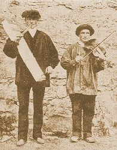

<table data-border="0" data-cellpadding="0" data-cellspacing="0" width="800">
<colgroup>
<col style="width: 100%" />
</colgroup>
<tbody>
<tr class="odd">
<td data-valign="top" width="470"><a href="../index">Legends and Sagas</a>  

<table width="100">
<tbody>
<tr class="odd">
<td data-valign="center" width="50%"> </td>
<td data-valign="center" width="50%">Basque Folklore </td>
</tr>
</tbody>
</table>

Intangible Textual Heritage has the full text of two books from the 19th century on Basque folklore. 

  <a href="lbp/index">Legends and Popular Tales of the Basque People</a> 
by Mariana Monteiro [1887]  

  <a href="bl/index">Basque Legends</a> 
by Wentworth Webster [1879]  

<table data-border="0" data-valign="top" width="100%">
<colgroup>
<col style="width: 50%" />
<col style="width: 50%" />
</colgroup>
<tbody>
<tr class="odd">
<td></td>
<td> 
</td>
</tr>
</tbody>
</table></td>
</tr>
</tbody>
</table>
