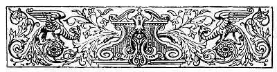

  
[Intangible Textual Heritage](../../../index)  [Sagas and
Legends](../../index)  [Basque](../index)  [Index](index) 
[Previous](lbp00)  [Next](lbp02) 

------------------------------------------------------------------------

p. v

 

# CONTENTS.

|                                      |                           |
|--------------------------------------|---------------------------|
|                                      | PAGE                      |
| INTRODUCTION                         | [1](lbp03.htm#page_1)     |
| I.                                   |                           |
| AQUELARRE                            | [19](lbp04.htm#page_19)   |
| II\.                                 |                           |
| ARGUIDUNA                            | [52](lbp05.htm#page_52)   |
| III\.                                |                           |
| MAITAGARRI                           | [80](lbp06.htm#page_80)   |
| IV\.                                 |                           |
| ROLDAN'S BUGLE-HORN                  | [125](lbp07.htm#page_125) |
| V.                                   |                           |
| JAUN-ZURIA, PRINCE OF ERIN           | [180](lbp09.htm#page_180) |
| p. vi      |                           |
| VI\. THE BRANCH OF WHITE LILIES      | [166](lbp09.htm#page_166) |
| VII\.                                |                           |
| THE SONG OF LAMIA                    | [185](lbp10.htm#page_185) |
| VIII\.                               |                           |
| THE VIRGIN OF THE FIVE TOWNS--BALLAD | [206](lbp11.htm#page_206) |
| IX\.                                 |                           |
| THE CHANT OF THE CRUCIFIED--BALLAD   | [215](lbp12.htm#page_215) |
| X.                                   |                           |
| THE RAIDS--BALLAD                    | [220](lbp13.htm#page_220) |
| XI\.                                 |                           |
| THE HOLY WAR--BALLAD                 | [226](lbp14.htm#page_226) |
| XII\.                                |                           |
| THE PROPHECY OF LARA--BALLAD         | [233](lbp15.htm#page_233) |
| XIII\.                               |                           |
| HURCA-MENDI                          | [247](lbp16.htm#page_247) |
| GLOSSARY                             | [261](lbp17.htm#page_261) |

 

------------------------------------------------------------------------

[Next: Illustrations](lbp02)
