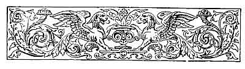
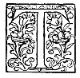

  
[Intangible Textual Heritage](../../../index)  [Sagas and
Legends](../../index)  [Basque](../index)  [Index](index) 
[Previous](lbp05)  [Next](lbp07) 

------------------------------------------------------------------------

p. 80

 

# MAITAGARRI. [1](#fn_4)

### I.

## ITURRIOZ. [2](#fn_5)

|                    |
|--------------------|
|  |

HE most profound silence reigned in one of the houses of the suburbs of
Oyarzun. Pedro Iturrioz, the head of the family, a robust mountaineer of
advanced age, had finished his supper; and his wife some years younger
than he, was at his side offering him a cup of warm wine, and awaited
that her husband should address her. The chieftain made a sign, and the
wife placed in his hands a silver cup with a gesture of tender love and
deep respect.

p. 81

\[paragraph continues\] She then laid on the table a basket filled with
luscious fruit, and sat down at the further end of the room at her
wheel, spinning the finest thread, which later on would become converted
into handkerchiefs, towels, and perfumed linen, such as abounds in
quantities in all Basque homes. At another corner of the kitchen, two
girls of singular beauty, were conversing in a low tone with a youth of
about fifteen years of age who stood with uncovered head.

A long settle, ornamented with large brass nails, could be seen
unoccupied beneath the wide chimney roof, to the right of the hearth.
The gleams from the crackling fire on the hearth, and the bright rays of
a flambeau of hempen cord and rosin which hung from an iron ring, lit up
this family group. The chief divided a beautiful apple and gave one half
to his wife, then drank two-thirds of the warm wine in the cup, and
invited her to finish the rest; this she did without saying a word. The
mountaineer then uncovered his venerable head, and all rose up on seeing
this action. He made the sign of the cross, murmured a prayer in which
all present joined, and then sat down on the settle by the fireside.

One of the girls removed the supper things, carefully folded the white
cloth, and then all the family sat clown around the fire. The mistress
of the house was spinning, the young girls were winding skeins of thread
on wooden reels, the youth sharpened a woodman's knife, meanwhile

p. 82

that Pedro Iturrioz, leaning his elbow on the arms of the settle,
appeared lost in thought. The eyes of all were directed to the
countenance of the old man, whose eyes were gradually closing in sleep.
The wife made quietly a sign; the conversation of the girls ceased, and
the young man intoned in a low voice a simple monotonous song, the
cadences of which were marked by the three women moving their hands. The
melody certainly acted with much power on the aged man, for his head
fell over his breast in deep sleep.

Through the half-open door poured in the beams of the moon, which was
illuminating the magnificent landscape of luxuriant trees and gigantic
mountains; the ripple of the mountain stream was also heard, imparting
on that quiet scene a singular charm. For a length of time did all
things remain in this way, until suddenly the old man awoke and said:

"Tell me, Antonio, what did you hear on the mountain?"

The youth threw down. the knife which he was sharpening, rose up, and
respectfully replied:

"I heard, father, that the battle proved a bloody one."

"Do you know who were the vanquished?"

"I was not told, father.""

The old man remained silent. The eldest girl turned deadly pale, and
allowed the skein she was winding to fall to the ground, and gazed on
her brother as though

p. 83

she wished to interrogate him with her looks. Antonio, however, awaited
his father's permission to speak.

"To-morrow, ere it is light, proceed to the frontier, and do not return
until you learn what success the combat has had," said the father.

"I will do so," replied the youth.

"Then approach nearer to me and listen, Antonio."

"What do you wish me to do?" Antonio asked, bending down his ear to
listen to the words his father desired to speak confidentially.

"Gil is with them," he said, in a deeply moved voice; "he is your
brother and my son, ask, explore the camp and when you return tell me
that you saw him alive, or, else, if he is dead, that you buried him in
a Christian manner."

"I will comply with your orders, father."

"Should he be living, tell him from me that I forbid him--do you
understand? I forbid him to use his weapons against those of Arpide so
long as they are before the enemy," continued the father.

"And to me, do you also forbid me this?"

"Yes, my son. Feuds and private resentments, although they may lie deep,
should be hushed and laid aside when it is a question of saving the
country. Cursed may he be who shall do otherwise."

The old man rose up, kissed the foreheads of the three women, blessed
Antonio, and slowly quitted the kitchen.

p. 84

\[paragraph continues\] Half an hour later he was sleeping the calm
sleep of the just man.

Scarcely had Pedro Iturrioz left the room than the women surrounded
Antonio.

"Your father has communicated to you secret commands which are not given
to me to know," said the mother, with saintly resignation. "Obey him, my
son, implicitly; your father holds the place of God in this world."

"This you have always taught me, my mother," replied the youth, kissing
her.

"So it is, Antonio, but after the father it appertains to the mother to
counsel her children. Sit down and listen to me."

The three young people sat down, the mother between her two daughters,
one of which betrayed considerable anguish, While the other was lovingly
watching her. Antonio knelt before Catalina and fixed his black eyes
upon her. The wife of Iturrioz was caressingly playing with the curly
locks of her son.

"Antonio," she said, "your brother is fighting on the frontier. You well
know his fiery character: if he still lives, tell him to fulfil his duty
like the brave; nevertheless, not to attempt or risk his life in
senseless, heedless undertakings."

"I will tell him so," replied the youthful Antonio.

"Tell him," continued Catalina, "that he is to forget

p. 85

our private questions, and only remember that he is a Guipuzcoan, and
that his enemies are those who are enemies to the country."

"My brother, do not forget these prudent counsels," interrupted the
maiden, who was evidently suffering grief.

"What do you know of these affairs, Inez?" demanded Antonio, giving her
a searching look.

"It is true," replied the girl, blushing, "that I understand but little
about these things, but I nevertheless believe that sound reason
dictates these counsels."

"My mother, what you have just advised me is the same as my father bade
me do."

"God be praised!" replied Catalina. "Now nothing else remains to advise,
but that you are not to linger on the journey. Receive your mother's
blessing, and may God protect your brothers! My girls, let us retire."

They all rose up and left the kitchen. The household remained only under
the protection of the laws of the country, and watched and guarded by a
mastiff which stretched itself before the fire.

### II.

## THE WITCH OF ZALDIN.

The hour of midnight was striking when the outer door of the house was
slowly opened, and an aged woman entered the kitchen. The mastiff lifted
up his head,

p. 86

uttered a growl, approached the new comer, and then, turned lazily to
lie down again. The woman threw some dry branches on the fire, and a
brilliant flame lit up the hospitable room. After this she imitated to
perfection the screech of an owl, and a light step was very soon after
heard descending the stairs from the first floor. Dominica, the youngest
of the daughters of Pedro Iturrioz, had just entered, and stopped at
some distance, looking at the stranger with a look of fear and respect
depicted on her countenance.

"Approach, Dominica, and come and sit by my side," said the old woman.

The maiden obeyed, and sat on the wooden bench occupied by her
interlocutor; the mastiff then rose and lay at the feet of Dominica,
placing his intelligent head between her knees. That group, lit up by
the firelight, and standing out in relief against the blackened walls,
partook somewhat of the weird character of witchcraft. The old woman
with her brown wrinkled brow, round, unquiet eyes, red tangled hair, and
long pointed nose, formed a strange contrast to the fresh checks,
beautiful, expressive black eyes, lithe waist, and graceful smile of
Dominica. To complete the picture, we will add that the old woman drew
her face close to the fair countenance of the maiden, the mastiff
meanwhile watching with his penetrative sight all the movements of the
witch.

p. 87

"Did you send for me, Dominica?" asked the old woman, in a low voice.
"Well, here I am: what do you want with me?"

"I wished to know," replied the girl, in an agitated voice, "who were
the vanquished in the battle fought on the frontier?"

"Nothing else?" questioned the witch, meanwhile attentively watching
Dominica.

"Nothing more," replied the maiden, lowering her eyes.

"Very well. Open that window which looks in the direction of the camp."

"It is open," she said, throwing it back.

"Look up to the sky."

"I am looking."

"What do you see towards the west?"

"I see a grey cloud."

"What form has it taken?"

"It appears to me to be like the skeleton of a gigantic horse."

"What more do you observe?"

"I see the cloud divided in two."

"Which side is the larger half?"

"The side of the head."

"The Navarrese and the French are vanquished!" replied the witch.

Dominica gave a cry of joy, and, approaching the witch, said, "Is this
certain what you tell me?

p. 88

"As certain as that I am standing here. Do you wish to know more?"

"I would much like to know what has been the fate of my brother," the
girl replied.

"I will satisfy your curiosity. Come near that caldron."

Dominica hastened to do as she was bidden.

"Put it on the fire, and go to the fields and bring me the roots of the
plant '*virtude*.'"

The girl left the house to seek the desired roots, followed by the
mastiff. Then the wily pythoness drew from her pocket a leathern bag and
took out of it a bundle of rags. She began to unfold most carefully this
bundle until she discovered the hand of a child [1](#fn_6) in perfect preservation, and around this
little hand were some curls of silky, golden hair. Out of a small
earthenware

p. 89

bottle she poured some drops of red liquor into the caldron, which was
already becoming hot over the fire, and waited for the return of
Dominica.

She had not long to wait. The maiden soon returned, bearing a bundle of
roots in her hand, and when she went near the old woman she noticed that
the mastiff was pulling at her dress.

"Be quiet, Moor, be quiet," she said to the dog. "It seems you like to
amuse yourself out in the moonlight!"

She then turned to the woman and gave her the roots.

"Did you gather these roots under the shadow?" the old witch asked, as
she took them from Dominica.

"Yes, under the shadow of a walnut tree."

"It is well; sit down on the bench and watch with all attention the
caldron."

The witch threw the carefully peeled roots into the cauldron, the
contents of which were beginning to boil. A few moments after there rose
up a blue flame, which cast a weird reflection on the furniture of the
kitchen.

"What do you see?" inquired the witch.

"I see my brother covered with blood and sleeping calmly. I see many
dead lying on the battle-field. Ah me!" she cried, suddenly.

"What more do you see?"

"I see Juan de Arpide also sleeping at some distance. There are many
camp fires; I see sentinels."

"Look towards your brother; what is he doing?"

p. 90

"Good heavens!" cried Dominica, turning pale.

"What is taking place?" asked the witch.

"My brother rises up, unsheathes his sword, and cautiously approaches
Juan de Arpide."

Your brother and Arpide must fight, and blood will flow," said the
witch, in a woeful tone of voice. "What more do you see?"

"Nothing more," replied Dominica, trembling.

"Turn your face towards the wall," continued the witch; "attentively
observe the figures which will be depicted on the wall."

Dominica obeyed, and, uttering a cry of anguish, she covered her eyes
with her hands.

"It is impossible for me to look," the girl said, greatly agitated.

"Take your hands from your face and tell me what you see; I have no time
to listen to your cries and sobs."

"I see Juan de Arpide, and a woman is holding him up in her arms."

"Do you know that woman?

"Her face is turned away from me."

"Look attentively towards Arpide; what is his colour?"

He is pale, very pale."

Are you satisfied?" asked the witch, with an evil smile on her wrinkled
face.

"My poor sister!" exclaimed Dominica, weeping.

p. 91

"Your brother has shed the blood of the lover of Inez. Do you wish to
know further about these love affairs?"

The mastiff howled and placed its two paws on the shoulders of the
maiden, and licked her face.

"Good gracious!" murmured Dominica.

"Make up your mind quickly; they are waiting for me elsewhere these last
two hours."

The girl hesitated, while the dog, continued to lick its young
mistress's face, meanwhile eyeing savagely the old woman.

"Bah! you are weak-spirited," then said the witch, putting her bag away
and preparing to depart.

"Wait! stay a moment!" Dominica cried, as she pulled at the dress of the
old woman to detain her.

"I cannot remain longer in this house," replied the old woman, looking
askance at the mastiff.

"Very well, then I decide," said the girl.

The dog gave a piteous whine, and, leaving the girl, went to a corner
and rolled itself up.

"Take this bag, now that you have made up your mind to do as you are
bid, and observe anew the blue flame."

"I will do so," said Dominica, taking the bag, and making a great effort
to overcome her fear.

"Open the bag, and throw into the caldron one by one all the objects it
contains."

p. 92

Dominica obeyed; but when she drew forth the mutilated member, and saw
it in her hand, enwrapped with a curl of hair, she felt such a sensation
of horror that she threw it, the bag and all its contents, into the fire
which burned on the hearth.

A fearful detonation shook the house, and when the girl wished to fly
away she could not. Her knees bent under her, and she fell to the
ground, uttering a piercing cry. She saw the "witch of Zaldin" cast
herself forth out of the window, transformed into a monstrous bat.

The fire slowly became extinguished, and the room remained in total
darkness.

### III.

## THE AVOWAL.

It was at break of day when Antonio, dressing hurriedly, prepared to
leave the house. At the door he was met by Inez, seated on the doorstep,
breathing nervously the fresh morning breeze.

"Good morning, Inez," he said, kissing her on the forehead. "Why have
you risen so early?"

"I wished to see you before you left the house."

"Thank you, my Inez; in this I know your love for me. Why is not
Dominica with you?"

"She is asleep, I suppose. But listen, Antonio: I am

p. 93

alone because I wished to confer with you. You are young, I know, but
nevertheless the counsels of men of your age are more prudent and just
than those of women at mine."

Antonio looked at his sister, and noticed by the light of the dawn that
she was very pale.

"Are you ill, my sister?" he affectionately asked.

"Yes, Antonio, sick in body, and more so in the soul."

"Poor Inez! what can I do for you? Speak, for you well know that I love
you tenderly."

Inez raised her eyes and fixed them in such a searching manner on her
brother, that he felt deeply wounded.

"Do you perchance doubt my affection?" he asked.

"Such a doubt on your part would wound me much."

"Far from it, my brother," sweetly replied Inez: "I am going to confide
to you something which is unknown to Gil or to our father."

"That will comfort me," replied Antonio, sitting close to her.

"The hours are passing swiftly, my brother, and you have far to go;
listen to me, therefore, and be indulgent to me."

"Speak, Inez, speak. I will listen attentively."

Inez took the hand of Antonio between hers, and began her narrative in
the following way:

"You are aware of the fearful enmity which exists

p. 94

between our family and that of Arpide: this enmity is the principal
cause of my unhappiness."

"Why so?" asked Antonio, in a tone of fear.

"Because the case is this, my brother. I have met Juan, and the first
time I saw him I flew from his presence."

"You did well, my sister. The injury his father did to our father is
unpardonable."

"Listen to me to the end. From that day he never ceased to follow me. If
I went to Oyarzun to church, accompanied by my mother, I was certain to
meet him at the church door; he would kneel close to us during Mass, and
when we left the temple we used to find him at the porch. When we
returned home he always followed us at a distance."

"Without addressing a word to you?"

"He never dared to do so. When I approached to my window I could always
see him, with bow slung on shoulder, standing on the summit of the
mountain, his eyes fixed on our house."

"Perchance does that man harbour any evil designs against us?"

"No!" quickly replied Inez. "The spring came, and at daydawn, when I
used to open the window of my room, I always found each morning a crown
of flowers on the sill. At first I used to throw the flowers to the
ground, because I felt certain that he would be concealed

p. 95

somewhere in the wood, and watching what I did. But on the following day
I would meet Juan, either in the woods or close to the fountain; and on
his countenance there was such a look of deep sadness that I could not
help pitying him."

Antonio withdrew his hand from that of his sister's and remained
pensive.

"Listen to me, brother, for pity's sake. His reserve and respectful
conduct arrested my attention in an extraordinary manner; I thought of
him more frequently than I should, and in spite of every effort I made
to drive his image from my mind, I found it impossible to do so. . . .
It was at the twilight hour; I was returning from visiting the dead
remains of our poor Cousin Lucia, whom we all so dearly loved; it began
to snow heavily, and the road was impassable. On reaching the cross
which stands close to the spring, I saw a black form standing in the
middle of the road; this form had eyes which were flashing in the
darkness like two flames, and fixed on me; I grew so alarmed that I
remained rooted to the spot; nor could I even cry out. The form gave a
terrific howl, and cast itself on me."

"Perhaps it was Juan?" exclaimed the lad, leaping to his feet. "Wretch!"

"No, my brother, it was not he. It was the dreadful wolf, the terror of
all the district------"

"The one which was found dead close to the fountain?"

p. 96

\[paragraph continues\] "Poor sister!" he said, taking once more the
hand of his sister.

"My death was certain," she continued, shuddering. "When I beheld the
animal close upon me, grinding his teeth and howling, the excess of fear
made me utter a piercing scream, and just as I was about to fall a prey
to the clutches of the wolf, I saw a human form emerge from the far end
of the road, place itself between the beast and myself, and receive the
first encounter. The two then wrestled in a desperate manner; and what
added to the horror of the moment was the fact that neither the wolf
howled, nor did the man who fought with it utter a cry; it was a dumb
encounter, yet a fierce one. What I endured at that moment is simply
indescribable. I believed in good faith that the man who thus wrestled
with the beast was Gil."

During the narrative of this encounter, Antonio pressed convulsively the
hands of Inez.

"The combat continued for nearly ten minutes," continued the maiden.
"The wolf fell down dead, strangled by the iron grip of my liberator. He
then approached me, and you may judge what my surprise must have been
when I recognized in him Juan de Arpide------"

"Juan de Arpide!" cried Antonio, in deep astonishment.

"Yes, my brother, I owe him my life. He besought me to allow him to see
me home, and to swear to him

p. 97

never to tell any one what had taken place. I gave the desired promise,
and until to-day I have kept my oath."

"And have you seen him since?" asked, Antonio.

"Many times, my brother; because from that moment I found it impossible
to keep from loving him."

Saying this, she blushed and hid her face on the breast of her brother.
The youth felt greatly moved on hearing this tender avowal.

"Do you know, Inez," Antonio asked, after a moment's pause--"do you know
whether he loves you?"

"His lips have never told me his love; but his eyes often do. Garlands
of flowers adorn my window every morning, and on the eve of his
departure to fight against the enemy of our country, instead of finding
the usual crown, I found only two flowers, an everlasting flower and a
pansy twined together."

"His behaviour has been a truly noble one," said the youth, in a solemn
tone. "Rise up, poor sister Inez lift up that brow pure as the first
thought of a babe rise up, my sister; I, your brother, will protect you
against all others. Should our father yield to the impulses of hatred
and curse your love, and should our eldest brother do the same, I who
know what has passed will never desist from protecting you, my sister.
When Gil and my father shall come to know what I do, I have no doubt but
they will bless you as the peacemaker

p. 97

between the two families, which never ought to have been severed; they
will bless you, Inez, as I bless you.

Inez threw herself into the arms of her brother, who warmly embraced her
and covered her face with kisses.

"I did well to confide in you, my brother!" she cried, shedding tears of
joy.

"Yes, my sister, you did well; I cannot forget that you have loved me
with singular affection, and although I partake somewhat of the
disposition of my father, and respect his opinion, nevertheless my heart
tells me that in this respect his ideas are not the most desirable ones.
Retire now, dear Inez, and await my return. Who knows what may take
place?"

"Let us trust in God, my brother."

"So be it, let us trust all things to God."

"And that He may keep you in His holy keeping, dear Antonio."

They once more embraced each other, and the young man started to carry
out the orders given to him by his father.

### IV.

## THE DUEL.

Along the western skirt of the hills which form a ridge from Leiza to
the shores of the ocean, a horseman

p. 99

arrayed in armour might be seen riding along mounted on a fiery steed.
From the dilapidated state of his armour, his crushed war helmet, the
rusty broken cuirass, the want of feathers in the tuft worn on his
casque, could be inferred that the brave knight was returning from some
tournament or fierce combat. He rode on alone, without page or
shield-bearer, stopping now and again to reconnoitre the country through
which he passed, grasping the hilt of his sword whenever the slightest
noise reached his ears, or unfastening the war hatchet which he carried
suspended from the pommel of his saddle whenever a shepherd or traveller
crossed his path. He left on his right the town of Goizueta; he followed
the path of Urumea towards the immediate boundary of the stronghold of
Articuza, a celebrated arsenal of those parts, close to which is seen a
sumptuous building, the admiration of all who frequent those fastnesses.
However, in those days nothing of this existed, and the very narrow
valley wherein the palace and arsenal were constructed was then the
wildest place in all that district.

When the horseman reached the summit of one of the mountains which
surrounded that valley, the sun was setting behind the sea, and could
only be descried from that spot by a golden line along the horizon far
away. The knight stood still for a moment to gaze upon the scene, and
then continued his journey, descending

p. 100

into the dark valley. On reaching near one of the broken rocks which
intercepts the flow of the stream that passes at the bottom of the
valley, he stopped, dismounted, and threw himself on the grass, leaving
his horse to graze quietly, and prepared to enjoy a few moments of
repose. But when the horseman rose to continue his march, the horse
suddenly gave a loud neigh, which was quickly replied to by another. The
knight leaped on his steed. and prepared himself for the defensive,
expecting to be taken by surprise. He listened for some time, and it was
not long before he heard the noise of hoofs trampling, and the rattle of
armour. The darkness of night prevented him from distinguishing objects
even at a short distance, so that it was not until the two horsemen
found themselves face to face that they were able to see one another.

"Who goes there?" asked the first arrival.

"And who are you to ask me?" replied the other,

"I am a knight," said the first.

"Guipuzcoan, or Navarrese?"

"Guipuzcoan," was the reply.

"God assist you. In that case we are friends."

Saying this, they approached nearer to one another, and asked, "Where
are you going to?

"Towards Oyarzun."

"Are you of that place?"

"Very near it."

p. 101

"In that case your name must be well known. What may it be?"

"Juan de Arpide."

"And I am Gil de Iturrioz," replied the second.

A moment's silence followed this declaration. The two confronted each
other, the first-born of each of those two families, whose feuds dated
from long years.

"We meet at last on neutral ground," said Gil to his antagonist; "here
we have not our arms tied through respect for the laws of the country,
neither have we here to forget our private feuds in order to combat
against the common enemy."

"You say well," replied Arpide, in a sad tone; "nevertheless I do not
see the reason why we should measure swords when there exists no reason
for rancour between us."

"Why not?" asked Gil; "does Juan de Arpide forget that his father
insulted mine, or does he think that an injury done to the chieftain of
the family does not bind his descendants to vengeance? A graceful
inheritance it would certainly be!"

"Listen to me, Gil," replied Arpide. "I do not deny that there have
existed misunderstandings in both families since the day when my father
refused the hand of his sister after he had promised it, nevertheless
previous to this unfortunate occurrence I have understood that there
existed a close friendship between the

p. 102

families. Very well, must the remembrance of the good feeling be
altogether extinguished by the recollection of an injury due, perhaps,
to the unbridled fiery character of our parents? Let us be just, Gil;
the peace which our elders severed, let us bind once more together; let
us end our feuds, Gil; let us be brothers; there are over many enemies
to fight with us on the plains of our country without weakening
ourselves by intestine wrestling."

"By my faith, but you ought to fling down your armour and substitute the
soutane," said Gil, with an ironical smile. "I can assure you that you
resemble a missionary preacher more than a knight who wears spurs."

"Gil! I do not deserve this provocation on your part. You are well aware
that it is not fear which induces me to speak in this way, but the
desire that a good understanding and harmony should exist between us."

"On my part I do neither desire nor contemn it.. When I was born these
hatreds existed between the families of Arpide and of Iturrioz; with
these feuds I was brought up, and with them I shall die!"

"How wrong you do!" exclaimed Juan, in a desponding tone.

"That is not your affair," haughtily replied Gil. "In any case it does
not devolve on you to counsel me, neither do I humble myself to ask your
advice."

"I have not attempted to become your counsellor.

p. 103

\[paragraph continues\] You may foster your hatred as long as you wish,
and may God grant it may be for a short term; but let us separate at
least without using our weapons."

"You are very prudent and discreet, Arpide," said Gil, laughing.
"Perchance you are more than prudent--you are a coward."

"Eight days have not yet elapsed since you yourself saw to the
contrary," replied Arpide, making a great effort to restrain his anger.

"That is true; but, nevertheless, I believe that it is not the same
thing to fight against common soldiers and French invaders as it is to
fight against a son of Pedro Iturrioz."

"That is not the reason why I feel a repugnance to fight with you; you
are well aware that I do not fear you."

"What, then, can be your motive?

"I fear the consequences which will result from this duel. God guard
you, Gil; I declare that I do not wish to fight against you."

On concluding these words he set spurs to his horse and turned away.

"You do not wish it?" cried Iturrioz, in wrathful tones. "Then I will
compel you to fight."

And, running up to him, he dealt a fierce blow with his mailed gauntlet
at the face of Juan de Arpide.

The latter stopped, looked at Gil, dismounted and

p. 104

drew his sword. Gil Iturrioz did the same, and both prepared for the
combat.

The spot in which they were to combat could not certainly be less fitted
for fighting. The surface of the ground was scarcely level for the space
of two yards; on three sides it was surrounded by dense tangled briars
and brushwood, on the fourth was a fearful chasm. The night was dark,
and some drops of rain were falling. The first to assault was Gil de
Iturrioz, whose sword fell heavily on the shoulder of Juan de Arpide.
The duel began. The broken rocks and hollow places echoed the clashing
of the weapons; rays of lightning flashed at intervals from the summit
of the cliff, illuminating for brief moments the armour of the
combatants, and by the aid of this uncertain light it could be perceived
that Gil retained the fiery gleams of his eyes, and that he struck
furiously, meanwhile that the countenance of Juan revealed an expression
of intense sorrow, and he only maintained an attitude of defence. The
combat continued; no other sound was heard in those solitudes but the
rough clanging of arms, no voice broke the stillness--not a single word
did they pronounce. Any one who perchance had passed the vicinity would
have judged that he was witnessing some gigantic wrestling between the
spirits of darkness.

Suddenly a heavy fall was heard, and a voice which said, "Rise up, Gil,
and let this end the duel."

p. 105

"No, by my faith! Although you might have killed me while I lay on the
ground."

"Nevertheless I did not do so. Let us, therefore finish at this point,
and each go his way."

As an only reply to this was heard anew the clashing of weapons, to
indicate that the fight was being continued. This did not, however, last
long. A terrible blow was dealt, a cry of pain was heard, and then all
things lapsed into deep silence.

Amid the shadows of the trees was seen gliding away a large form, and
along the stony road was heard the tread of a horse galloping at full
speed.

### V.

## MAITAGARRI. [1](#fn_7)

At nightfall an the following day, Juan de Arpide found himself sitting
in the most concealed part of the valley of Articuza; near him, and at
the foot of a broken rock, his war-horse was quietly grazing; he felt
his limbs

p. 106

so benumbed that he could not move. He began to recall all the events
which had taken place on the previous day, and then rose to his memory
the encounter he had had with Gil; his conversation with him, the duel
which had followed, and its ending. He looked up towards the rock, at
the base of which he was sitting, and noticed that it was on its heights
that he had fought on the previous night. He then comprehended the cause
of his benumbed state, and the deep holes of his broken armour told the
rest. He felt bruised all over; his neck was wounded, and he was almost
inanimate from want of food, since he had not taken any nourishment for
some thirty hours. All human help seemed to him impossible in that
solitary spot. A canopy of verdure during summer covers this wild part.
The trees, with their enormous growth and extended branches, entwined
with each other, and scarcely permitted the sunbeams to pierce through.
The stream of pure water which flows along the base of this narrow
valley bathes the trunks of the trees, and preserves a delightful
freshness around. The vegetation there is strong, magnificent; and
nothing more poetic can be imagined than a walk by moonlight across that
calm solitude. This rivulet in places forms little lakes calm and still;
small lagoons surrounded by reeds, briars, lilies, and wild roses. When
gazing on the tranquil waters of these lakes in miniature, one would
almost believe that he

p. 107

were gazing on a large mirror surrounded by flowers. Perchance some
kingfisher of emeraldine hues is heard screeching, or skimming with its
wings the surface of the lake; some stag quenches its thirst from the
currents which feed the stream, or a nightingale perched on the branches
singing plaintively, or a dove whose sad cooing invites to meditation,
are the only creatures which give life to the romantic landscape.

Juan de Arpide, seeing that the night was closing in, and feeling that
it would be impossible to bear the pangs of hunger until morning, called
his horse, which was grazing near him, and the faithful animal soon
joyously neighed in response to its master's call and came to him. After
several vain attempts to mount him, he at length succeeded, and
proceeded on his march. Juan found himself on the margin of one of the
tiny lakes which we have just described, at the base of the cliff, from
the summit of which he had rolled over on the previous night. From the
middle of this lake rose a diaphanous vapour; long stems of climbing
plants hung from the broken edges of the overhanging rocks, until they
dipped their ends in the waters of the lake. These were covered with
leaves, and formed hanging curtains similar to the reed lattices which
shade Chinese windows. Long pointed reedmace grew on the margins, and
the branches of a weeping willow waved at the mercy of a gentle breeze,
like the feathers on a war helmet. The

p. 108

horseman fancied he perceived, amid the shades of night, a sudden
undulation on the waters; he thought also that the overhanging stems of
the climbing plants were separating; he saw the branches of the willow
tree moving in a strange manner, and at last he heard the sounds of far
distant melody, the mysterious echoes of which seemed to enrapture his
spirit. The crystalline surface of the waters became divided, and,
enveloped in the mist which rose from the lake, he saw appearing a
number of maidens of incomparable beauty. Their brows were encircled by
roses, and their aerial bodies were covered with robes of white gauze.
Stars of pale light adorned the centre of their diadems.

They rose up softly above the surface of the water, and, taking one
another's hands, the maidens began to intone the strange peculiar music
which had so enthralled the attention of the horseman. All their faces
were pale; their eyes were half closed and veiled by long eyelashes,
their abundant hair hung down loosely over their alabaster shoulders.

Soon after this singular apparition the maidens proceeded to the spot
where the knight, completely abstracted with this vision, was gazing on,
and they surrounded him on all sides. One held the bridle of his horse,
which seemed to be spell-bound, so quiet and motionless had the animal
become; another held the stirrups so that the warrior might dismount;
others

p. 109

removed his mailed armour; others, again, took his shield and the heavy
lance; and in this state, disarmed and confused in mind on beholding
himself served and waited upon by a bevy of such lovely, maidens, he
allowed himself to be conducted beneath the hanging branches of the
willow tree. This tree, with its waving overhanging branches, covered
the entrance to a cave whose floor, carpeted with fine yellow sand, was
the entrance to the magic mansion of the Maitagarri of the Pyrenees. All
whatsoever the most poetic imagination of the East could invent of
marvels was found collected together in the vast saloon where the
maidens conducted the knight. The vaulted dome shone as though it were
composed of one immense polished diamond; high columns of stalactites,
which appeared like crystal serpents twisted one with another amid
garlands of flowers, sustained that brilliant ceiling. Fringes of lilies
joined together, leaves of the wild vine mingled with flowers of the
rosemary red as the ruby, formed festoons which were truly enchanting,
and beneath a canopy formed by the crystallized waters was seen a throne
of moss, soft as the skin of the ermine, yielding like the cushions upon
which recline the Oriental odalisques. Softly leaning on this couch
reposed the queen of this mansion of marvels; red tiny slippers covered
her feet, and a gauze embroidered with gold veiled her face. When the
warrior entered this retreat, she arose and drew back her veil. Her
jet-black

p. 110

eyes were fixed on Juan de Arpide; around her coral lips hovered a
charming smile, and with her exquisitely modelled hand she made a sign
to the knight to come and sit by her side. Arpide obeyed, and the
maidens who had conducted him disappeared.

"Juan de Arpide," she said, in a melodious voice, "you have come in here
at a forbidden hour; you have surprised me in my sleep, and you
interrupted my feasts; you were worthy of punishment."

"Lady!" replied Arpide, astonished at beholding such exquisite beauty,
"I was unaware of your existence in these places, and if, in effect, I
have committed the crimes you accuse me of, the blame is due to my evil
star."

"For that reason do I forgive you," replied the charmer "Had it not been
for my intervention your death would have been certain."

"How so? Do you perchance know------"

"I know all. Concealed in the shadows, I witnessed your combat of
yesternight. I guessed your grounds of complaint, and when you were
engaged in the duel, had you not found invisible arms in the air to ward
off and lessen the blows that were directed upon you, your body would
have been broken to pieces."

"And how am I to thank you, lady, for such a signal favour?" cried
Arpide, fascinated by the looks and speech of Maitagarri.

"You owe me nothing. I saved your life, that is

p. 111

certain; and therefore that life belongs to me for the future."

"Lady!" cried the knight, looking in terror to his interlocutor.

"Do not doubt it, Juan. I think also that you ought to thank me for this
new proof of my affection. I well deserve that for my love you should
sacrifice that of Inez de Iturrioz!"

Juan de Arpide bent down his head and made no reply.

Maitagarri broke the silence of the knight.

"Do you not answer me? Yet so must it be. A being that, like you,
penetrates into my domains never leaves it again!" And the enchantress
assumed, to the astonished eyes of the warrior, the same features, the
same looks, the same voice as Inez de Iturrioz.

Juan de Arpide thought he was dreaming. All the pains he had suffered in
his body had left him. He no longer felt the pangs of hunger, he seemed
to be drinking in life from the eyes of Maitagarri.

"Listen to me," she continued, approaching him. "I will make you the
happiest of mortals. Do you desire glory? Speak, and the crown of the
conqueror will ever encircle your brow. Do you wish for wealth? Ask, and
you shall see palaces rising up to receive you, brilliant shields to
defend you, costly robes to adorn you, maidens and pages to serve you.
Do you yearn for love? You will possess mine eternally--a love which is
not to be compared with any other."

p. 112

"Oh, Inez, Inez!" cried the knight, half distracted.

The enchantress took his hand and imprinted a kiss on his brow. But that
hand was icy cold, and her kisses had no warmth in them.

Juan experienced a feeling of terror mingled with pleasure coursing
through his veins. He felt the influence of the charmed atmosphere, that
it was acting upon him in a soothing manner; he felt drowsy, and a mist
rose before his eyes. A heavy slumber made his eyelids droop, and he
fell heavily on the bed of moss, and sleep completely overpowered him.

Then Maitagarri summoned her maidens, and they sprinkled perfumed waters
on his mossy bed; they cooled the atmosphere by waving huge fans of
gauze; and upon his lips they poured some drops of red liquor.

Suddenly the mysterious light which had so splendidly illumined that
chamber gradually began to lose its radiance. The fairy queen gazed on
the face of the sleeping knight, and a look of deep sadness overspread
her countenance, as also over those of her maidens; their aerial forms
became more impalpable in proportion as the light waned, and they
quickly disappeared, converted into mist, which likewise dispersed,
leaving the cavern in complete darkness. The clatter of armed knights
was echoed among the rocks, and the songs of the linnets filled the
woods. The sun was showing its rubicund face on the heights of the
mountain Aya.

p. 113

When Juan de Arpide awoke he found himself in the same magic chamber,
his head reposing, at the feet of Maitagarri, whose velvety eyes were
fixed on him as though wishful of receiving the first glance on awaking.
A table covered with abundant and delicate food stood in the centre of
the chamber.

### VI.

## THE PILGRIM.

Antonio wended his way to the encampment. Some of the soldiers told him
that Juan de Arpide had disappeared, and that his brother Gil of
Iturrioz, seeing the Franco-Navarrese army routed, and not supposing
that it should ever become reorganized, had departed towards home. The
other troops were also retiring.

When the youth returned home he thought that some news must have been
received of the lover of his sister, and he was determined to protect
her love. Great was his surprise when he only found Gil, who had brought
the news that Juan de Arpide had died in battle.

The news, given unexpectedly and without any preparation, inflicted a
mortal wound in the heart of Inez. A profound sadness took possession of
her, and a slow, obstinate fever began to undermine her existence. Whole
days would she spend seated on the trunk of the

p. 114

tree where she had seen her lover for the first time, and at night she
used to rise stealthily from her bed to creep away and wander along the
solitary fields and woods. Her brow grew pale, the light of her eyes
became dimmed, her well-formed figure wasted away to a skeleton, and
from a maiden of great beauty she became like a living shadow which the
slightest breath of air would suffice to extinguish her life. The sage
counsels of her father, the tender caresses of her mother and sister,
afforded no balm to cure and comfort that sad heart, wounded to death.
To the wise words of her father she would listen patiently, and reply by
a sad smile; to the tender caresses of her mother by a flood of tears.

In this way passed several months. It was late in the autumn. The leaves
of the trees were flying about in clouds, impelled by the north-west
winds, like birds of passage when they emigrate to remote lands and
climes. The blue sky was covered by the first fogs of winter, the days
were visibly shortened, and the nights were lengthening over the earth.
The sickness of Inez was following its course; her nightly walks had
already ceased.

One night the whole family were gathered together around the hearth. The
father, with his venerable head uncovered, was blessing the frugal meal
which was laid on the rustic table, Gil of Iturrioz was sitting at one
side

p. 115

of the room; Catalina was spanning flax, casting from time to time sad
looks at Inez, who, propped up with pillows, her eyelids half closed,
and her almost transparent hands crossed, was murmuring some words, and
smiling to herself in such a melancholy manner, that her smile drew
tears from those around her. Dominica was weeping, hiding her face in
her hands: Antonio was convulsively clutching between his hands his
wood-knife with which he was carving ingenious patterns upon a
walnut-wood stick which was to serve as a staff for his dying sister. A
deep silence reigned in that apartment. A storm was raging, outside when
suddenly some one was heard knocking at the door.

"Go and see who is there, Antonio," said the head of the family.

"A poor stranger who has lost his way and asks for shelter," replied a
voice at the door.

"God protect the traveller!" replied Pedro Iturrioz. "Come in, whoever
ye may be the doors of the Basque are always open to the traveller."

The stranger entered. The young men rose up, and Antonio approached the
stranger to assist him. Catalina left her wheel and placed a plate on
the table. The head of the family made a sign for the stranger to sit on
the settle near the fire--a seat of honour reserved for the oldest of
the family, but which is always given up to the guest or the stranger.

p. 116

He who had come in was dressed in the garb of a pilgrim. He appeared to
be about fifty years of age; his heard was thick but snow-white; his
face was dark-complexioned; his hair curly; a distraught look in his
eyes; his limbs were strong and well built, although he appeared tired
and weary. The coarse robe which covered him was torn and draggled, a
large felt hat covered his head, and he supported himself with a long
staff.

At the invitation of the host the pilgrim took the seat offered him, and
partook of the supper with him.

When supper was over, Pedro Iturrioz asked the stranger to say night
prayers for them, which the traveller did in a tremulous voice. Scarcely
had the pilgrim concluded the prayers than a deep-drawn sigh was heard,
which made them all turn round. Inez had risen up appalled; her eyes had
lost their brilliancy, and were opened wide in a ghastly way; her mouth,
pale and parched, articulated some sounds; while her outstretched hands
and arms seemed as though they wished to draw some distant object
towards them. In this posture did she remain for some minutes, to the
great astonishment of all who were there. Then she slowly moved her head
and fell back into her chair and into her former position.

"Inez," said Dominica, in tender accents, "do you wish for anything? '

p. 117

"Nothing, my sister; I want nothing. I had a happy dream, but one which
will never be realized."

The young woman once more returned to her usual listless, silent manner.

"My poor daughter!" murmured Catalina, sobbing.

"Bid me adieu, my mother!" replied Inez, looking sadly at her. "Life is
fast ebbing away, and I will soon go to join my darling!"

Catalina took her daughter's hands in hers, and began to kiss them
passionately.

"Is your daughter ill?" the pilgrim asked Pedro.

"The wrath of God has descended on this house," he replied. "Let us
bless His holy name and submit to His loving will!"

The holy resignation of the old man visibly affected the pilgrim, for
his eyes were streaming with tears.

"Can you tell me the cause of her illness?" asked the pilgrim.

"They say she is dying of love!"

"Poor child!" murmured the pilgrim.

"You say well, poor child!" replied the old man. "Before this unhappy
event she was the pride of my old age and the joy of my heart!"

"Perhaps she was forsaken by her lover?"

"No; her lover was one of our neighbours, a noble, honourable man."

"And what became of him?" still asked the pilgrim.

p. 119

"He died," replied the old man, bending, down his head. "He died just as
we were at the point of extinguishing the feuds which had divided the
two families for years, and when apprised of his noble conduct towards
my daughter I was ready to admit him into my house. Alas! hatred is a
cursed passion; and for having harboured that passion too long in my
breast God has punished me. Blessed be the justice of God, that He has
thought meet to make us an example!"

"Can you tell me how he died?" insisted the pilgrim.

"He died the death I wish for my sons--on the field of battle."

The pilgrim slowly turned his head and looked towards Gil, who appeared
taciturn and ill at ease, not daring to look at his sister.

"Did you say he died on the battle-field?" he asked, after some moments.

"Yes, he did," replied Pedro.

"Fighting against his enemies?"

"Yes, fighting against the enemies of his country."

Once again the pilgrim looked towards Gil de Iturrioz.

Antonio had approached his father, and was listening attentively to the
dialogue between him and the stranger,

"Who told you so?" once more asked the pilgrim.

"My son, who saw him die!"

"Which of them? The youth who is listening to us, or Gil, whom I see so
abstracted?"

p. 119

"Gil!" replied the old man, astonished at the indiscreet curiosity of
the stranger, and more greatly astonished still that he should know the
name of his son.

"Gil Iturrioz in that case told you a lie!" said the pilgrim, in a
ringing voice.

"Gil Iturrioz never lies!" cried the first-born of the family, leaping
to his feet and threatening the stranger with clenched fist.

"Strike, knight! strike me on the face--this face so wrinkled; it will
then be the second time that you do it!" said the pilgrim, bowing
himself down.

The arm of the young man dropped powerless by his side in presence of
that evangelical humility, and he covered his face with his hands.

"Knight!" exclaimed the pilgrim, addressing Gil, "I accuse you before
your parents of the odious crime of assassination."

The bystanders shuddered on hearing these words. Inez drew herself up,
and fixed all her attention on that scene.

"’Tis false, villain cried Gil, in a fury. "You may thank your luck that
you are under our roof; you may thank your age that I do not pierce you
through with my sword!"

"Since when do my sons forget," cried Pedro Iturrioz, with angry mien,
"the duties which are imposed by the laws of hospitality? Sit down, Gil,
without another

p. 120

word; you are accused of a crime. Señor," he added, addressing the
pilgrim, "you have pronounced a grave accusation; can you prove it?"

"At this very moment, if you wish it," replied the pilgrim.

"Commence at once then," said the old man, his countenance assuming the
dignity of a judge who distributes impartial justice without appeal.

"To you, Gil de Iturrioz, a Guipuzcoan knight, I address myself. Whom
did you meet in the valley of Articuza about four months ago?" the
pilgrim asked, in a loud tone.

Gil shuddered, and looked in terror towards the stranger.

"What was the conversation which took place between you and Juan de
Arpide? Did he not offer you terms of peace?"

"Yes," replied the accused, in a low voice.

"Did he not promise you his sincere friendship?"

"Certainly."

"And instead of accepting it, did you not insult him?"

"That also is true," replied Gil, abashed.

"And to the insult did you not add the injury of striking him in the
face with your gauntlet?"

The young man did not reply.

"Answer, Gil de Iturrioz," continued the pilgrim.

When you grasped the weapon was it not you the only

p. 121

one to attack, and your antagonist did no more than defend himself by
parrying off the blows without in any way wounding you?"

Gil likewise did not reply to this question. The father was casting on
his son looks of wrath; Antonio trembled with indignation; and the women
appeared struck dumb with astonishment.

"To you now, old man, I address myself," continued the stranger. "Your
son stumbled and fell to the ground, and when Juan de Arpide, justly
irritated, might have killed him as he lay there, he nevertheless gave
him his hand to assist him to rise; he then newly proposed terms of
peace with him, and instead of accepting the proposals, he landed a blow
at him which inflicted a deep wound in his neck, and then he cast him
headlong from the summit of a rock down a deep chasm. How will you call
your son in future?"

"Gil!" cried the old man, pointing to the door with an imperious
gesture, "quit my house! I no longer acknowledge you to be a son of
mine!"

On hearing the curse uttered by Pedro Iturrioz on his first-born, and
deeply impressed by the revelation made by the pilgrim, Inez uttered a
cry and fell back insensible. Catalina and Dominica remained
terror-stricken.

When Gil, in obedience to his father's orders, was about to leave the
paternal home, the pilgrim detained him.

p. 122

"Look at your sister, who is nearly expiring; repent of what you did,
and perchance there may yet be a remedy for so much evil done."

The stranger approached Inez, who was recovering from her faint--thanks
to the care and attention of her mother--and, taking her hand, he said,
turning towards the assembled family, "Should Juan de Arpide be still
living, would you consent to his marriage with Inez?"

Antonio ran to the stranger, and quickly removed his hat; the white
beard fell--for it was only a false one--and the noble countenance of
the lover of Inez stood revealed before them all. A cry of surprise and
joy rose from the lips of the assembled group. Inez looked at her lover;
she passed her hands over her eyes, in silence moved her lips in prayer
for some time, and then, throwing her arms around the neck of Juan de
Arpide, poured a flood of tears of joy without saying a word.

That silence was truly sublime.

Gil turned pale with terror, because he judged that this apparition was
a supernatural one. Acknowledging his evil conduct, he at length
approached Juan, and in a deeply moved voice said: "My brother, plead
for me before the just tribunal of my father."

\*     \*     \*     \*     \*     \*

At the beginning of the following month the marriage of Inez de Iturrioz
with the first-born of the house of Arpide was celebrated with signal
rejoicing.

p. 123

### EPILOGUE.

Two days after the marriage of Inez and Juan, deep-drawn sighs could
have been heard about midnight issuing from the valley, of
Articuza. [1](#fn_8) Favoured by the moonlight
could be seen, close to the rivulet, a decrepit old woman, pitifully
torn and wounded in body. At her side were some shadows, or rather
phantoms, that were beating and belabouring her unpityingly, and this
punishment was presided over by the Maitagarri of the Pyrenees. Her
countenance was expressive of wrath; from her eyes shot flames of fire;
out of her mouth issued cries in place of words. It was no longer the
beauty which had so charmed Juan de Arpide; it was a beauty of another
description--that of the fallen angel when perchance it ceases for a
moment to endure the torments of the lower regions.

"Cursed woman!" she said, interrogating the old woman; "of what use were
your philters? Was it for this that you asked me for a sleeping child's
hand? Woe to me! who placed more faith in the power of your amulets than
in my own charms!"

p. 124

"Pardon!" cried the witch of Zaldin, for it was none other, this poor,
ill-used old woman.

"Pardon, indeed!" she replied, "when I would wish to tear your body to
pieces! Die, lying one, as you have lived!" And the witch of Zaldin,
unable to endure any longer this cruel and merciless treatment, fell
down dead.

Maitagarri, with her phantom retinue, disappeared in the marvellous
cave, out of which she did not issue again for a long time. When she
once more appeared, the stronghold of Articuza had been already erected,
and the noise of the colossal hammers, and the immense sheets of flames
and sparks which like a volcano issued from the forge, impelled
Maitagarri to forsake those parts to inhabit others more solitary--the
sierras of *Ahuñemendi*.

The lifeless body of the witch turned black like coal, and a gigantic
eagle took it away on the winds in its powerful clutches.

 

------------------------------------------------------------------------

### Footnotes

[80:1](lbp06.htm#fr_4) Fairy, or Hade, which
inhabits the lakes.

[80:2](lbp06.htm#fr_5) Iturrioz--*Fonte
fria*--the cold fountain.

[88:1](lbp06.htm#fr_6) *The left hand of a
child*. It was a general belief among the mountain dwellers of the
Basque provinces that the left hand of a child, if severed during sleep,
and wrapped round with curls of its own hair, became a valuable amulet
which would deliver them of every kind of danger, and with it philters
of different properties could also be made. There yet exists some among
the rude inhabitants of the mountains of Roncal who foster this
superstitious belief, although examples are unknown of this cruel
mutilation ever having been effected, unless by the artifice of gipsies,
*agotes*, or Jews, in very remote ages, as there still exists evidence
of severe provisions having been adopted against these barbarians. It
was also a popular belief that the blood of children was useful for
invigorating the weak bodies of women.

[105:1](lbp06.htm#fr_7) *Maitagarri*. Among the
Basque people this stands for the "Peri," or the Genius of the Persians.
According to the legend or popular tradition, this fairy, or hade, fell
in love with a shepherd called Luzaide, and she took him to the summit
of Ahuñemendi, where she had her palace made of crystal. This legend
evidently forms the basis of the narrative which the author gives in
this chapter.

[123:1](lbp06.htm#fr_8) *Articuza*. Palace and
stronghold close to the shores of that name. They are situated in the
centre of the mountains of Goizueta, ten kilometres from this town, and
surrounded by dense woods and forests.

------------------------------------------------------------------------

[Next: Roldan's Bugle-Horn](lbp07)
