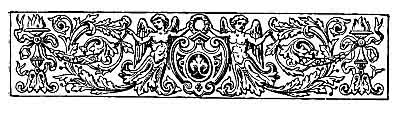

  
[Intangible Textual Heritage](../../../index)  [Sagas and
Legends](../../index)  [Basque](../index)  [Index](index) 
[Previous](lbp10)  [Next](lbp12) 

------------------------------------------------------------------------

p. 206

[  
Click to enlarge](img/20600.jpg)  
THE VIRGIN OF THE FIVE TOWNS.  
''The vision approached nearer and nearer and sat by the side of the
sleeping huntsman and gazed upon him for a long time in silence.''  

 

# THE VIRGIN OF THE FIVE TOWNS. [1](#fn_18)

### BALLAD.

|                    |
|--------------------|
|  |

IRAM is sad, very sad; what ails Airam? An untiring huntsman, yet the
aurora found him in Achular [2](#fn_19) with his
bow slung over his shoulder and the faithful Bart lying at his feet. The
thick branches of the trees of Esquiroz [3](#fn_20) sheltered his sleep from the burning rays
of

p. 207

the sun, and the lasses of Sumbilla [1](#fn_21)
rejoiced when, coming to the spring to draw water, they heard the merry
songs of the youthful huntsman as he descended the declivity.

But now Airam is sad, very sad; what ails Airam? See him as he leans
against the stone cross which divides Navarre and Aragon--his eyes
fixed, his countenance pale, melancholy, and pensive.

Listen, stranger. Airam hunted all one day. At nightfall the damp beams
of the white moon surprised him as he lay on the sward of Bardena
Real. [2](#fn_22) The habitations were distant;
the limbs of the huntsman were weary with fatigue, and he slumbered. And
in his sleep he had a dream.

The pale moonbeams illumined an angelic form. It was that of a maiden of
fifteen summers, dressed in white, like the ancient virgins of Carmel.
The tresses of the vision were silky and as golden as the husk which
pends from the maize when it is nearly ripe; her eyes were beautiful
like those of the roe of Ollin: the

p. 208

face that of Benzozia, [1](#fn_23) the goddess
of felicity and of chaste love. The heart of Airam palpitated visibly, a
fierce fire devoured his soul. The young man placed his hand on his
breast and found it empty. The vision approached nearer and nearer, and
came and sat by the side of the sleeping huntsman, and gazed upon him
for a long time in silence. The vision bent its head over the forehead
of the youth, and the perfumed curls of the vision covered the face of
the huntsman. Then in the mysterious silence of night resounded a kiss;
then was heard a celestial voice, which arrested the course of the moon,
and made its white beams flicker. It was a voice such as has not its
equal on earth; a voice which arrests the fury of the hurricane as it is
about to break over the heights of Canigou, [2](#fn_24) where it dwells; a voice which stills the
waters against the promontory of Jaizquibel. [3](#fn_25) And she said:

"Airam! for two years have I sought you; from the lattices of my convent
I have called you every night. The bark of your faithful Bart was echoed
in the

p. 209

mountains, and the sound of your bugle-horn was lost in the distance.
And I would return sadly and tearfully to my couch on perceiving that
you heeded not my voice or my calls; and my companions mocked me in the
morning because my eyes were swollen with weeping. Airam! Airam! my
mouth calls you, my heart is breaking; come quickly, come, because else
I shall lose you, and you me, for ever. I am Cingaya the Beautiful, I am
the Virgin of the Five Towns."

The huntsman awoke with a start. The moon was placidly illuminating the
greensward; his faithful Bart was sleeping quietly; the silence of that
calm night was truly solemn; no figure or form appeared amid the
fragrant bushes. Only on the road to Aragon, in the far distance, could
be felt, rather than heard, the noise of a cavalcade approaching. The
tramping of the horses grew louder. In front of this cavalcade rode the
principal lord of Egea, of Sos, and of Verdun. At his side, seated on a
white steed, rode a maiden, her face veiled by a silver gossamer,
followed by a retinue of relations and friends and noble Aragonese
pages.

"Tell me, good page, may Our Lady guard you. From whence come you?"

"From the neighbouring convent, gallant huntsman. Do you wish to know
more? Make haste, then, for the cavalcade is departing."

"Tell me, good page, who is that maiden riding the

p. 210

white steed, and whose face is veiled in silvery gossamer?"

"She is our mistress: she is Cingaya the Beautiful, the Virgin of the
Five Towns, who leaves her convent to be betrothed."

"Good page, tell me more; does Cingaya the Beautiful, the Virgin of the
Five Towns, love her promised husband?

"She comes sad, gallant huntsman; sad and full of tears. Her promised
husband is haughty and cruel; they wished to unite the fresh plant with
the worm-eaten oak."

"Thanks, good page, thanks. Tell Cingaya the Beautiful that Airam the
huntsman has his breast empty because his heart has gone after the
Virgin of the Five Towns."

"It is too late," replied the maiden.

This is the reason, stranger, why Airam is sad; the reason why he leans
against the stone cross, the bounds of Aragon and Navarre, his eyes
fixed, his countenance pale, melancholy, and pensive.

 

Place, place to the minstrel who comes from distant lands! Place to him,
for he comes in time to dispute the prize at the floral games. Clemencia
Isaura [1](#fn_26) has

p. 211

made a sign to him; let us hear the stranger. And he commenced:

"Noble dames, listen with indulgence to the new rhymester: his voice is
not sweet, because the hurricane of the Pyrenees, the tempest on the
ocean, the simoom of the desert, have rendered his voice hoarse.

"I saw Zaira close to the cistern of Embrun; [1](#fn_27) Zaira was good and lovely. I am thirsty, I
said to her, and she lifted her water pitcher, made of clay from the
Nile, and put it to my parched lips."

"Love me, Nazarene, love me," she said, "for I love you. Around my tent
wave the branches of twelve palm trees; I have twelve barns full of
corn, and twelve camels of finest hair: love me, Nazarene!"

"You are not Cingaya the Beautiful, the Virgin of the Five Towns. She
stole my heart while I slept on the sward: I cannot love you!"

"Allah be with you, good Nazarene. There lies the road to the West: you
are right--I am less beautiful than Cingaya."

The new troubadour flung his cithern to his shoulder and embarked.

p. 212

"I am Aimée, daughter of the deep; I am beautiful, as you see; I have
necklaces of corals, bracelets of gold, girdles of morocco: love me,
good minstrel, love me!"

"You are not Cingaya the Beautiful, the Virgin of the Five Towns. She
stole my heart when I slept on the sward: I cannot love you!"

"God guard thee, good minstrel. From Cyprus to your land is a long
journey. May love guide thee! You are right, I am less beautiful than
Cingaya."

The new songster shouldered his cithern, and reached the land of his
birth. Many years had passed since his departure.

"Where is Cingaya the Beautiful?" he asked the rocks of Achular. And the
rocks replied, "She has departed from hence."

"Where is the Virgin of the Five Towns?" he asked the tree of Esquiroz.
And the tree replied, "She has gone from here."

"Where is she who stole my heart while I slept?" he asked the sward of
Bardena Real. And the wind sadly murmured also that she had gone away
never to return.

Then the troubadour flung his cithern to his shoulder and came to
Tolosa [1](#fn_28) to dispute the prize in the
floral games. He will never return to his birthplace, to its mountains,
because they have all told him that Cingaya the Beautiful had departed
never to return.

p. 213

"Noble dames, you have listened my voice is not sweet because the
hurricane of the Pyrenees, the tempest of the ocean, the simoom of the
desert, have rendered it hoarse."

Clemencia Isaura is shedding tears.

"How are you called good minstrel? Your ballad is a tender one, and your
strange accent lends to it a greater value."

"They used to call me Airam the huntsman, but today I have no name."

"I will give you one, good minstrel. Behold, here is the golden rose,
because you have nobly earned it. Sing, sing in your own beautiful
language the glories of your warriors, sing the loves of the valleys,
the hurricane of the mountains. The poet belongs to all the world; hence
all true inspirations are drawn and felt only when close to the home
which witnessed our birth."

Thus spoke Clemencia Isaura to the minstrel. The noble dame, veiled with
the fine white gossamer, then approached the stranger.

"Have you still your breast empty and desolate?" she asked, deeply
moved.

"Yes, noble dame, it is still empty."

"Take my heart, then, in place of yours. I am the vision of the sward of
Bardena Real!"

The minstrel felt that his breast was filling with felicity.

p. 214

"Yes, yes; you are Cingaya the Beautiful, the Virgin of the Five Towns,"
he said, clasping her in his arms.

Since that day never was Airam seen again leaning against the stone
cross, the boundary of Navarre and Aragon, his eyes fixed in space, his
countenance pale, melancholy, and pensive.

 

 

------------------------------------------------------------------------

### Footnotes

[206:1](lbp11.htm#fr_18) *Five Towns of Aragon*.
A group composed of the towns of *Sos*, *Sadava*, *Uncastillo*,
*Tauste*, and *Egetz*--all situated on the frontiers of Aragon and
Navarre, to the extreme of the Pyrenees.

[206:2](lbp11.htm#fr_19) *Achular*. A mountain
of Guipuzcoa, close to Andoain. There is another of the same name in the
valley of Lerin, in Navarre.

[206:3](lbp11.htm#fr_20) *Esquiroz*. A mountain
situated in Navarre, on the confines of Bardena Real.

[207:1](lbp11.htm#fr_21) *Sumbilla*. A lovely,
picturesque town of Navarre, situated in the valley of Lerin, on the
straight line with Vidassoa, about thirty-five kilometres from Pamplona.

[207:2](lbp11.htm#fr_22) *Bardena Real*. A
deserted arid plain cut through by rocks and broken boulders, extending
from the junction of the rivers Ebro and Aragon to two kilometres beyond
the frontier of the ancient kingdom of Aragon, a distance comprehending
many kilometres.

[208:1](lbp11.htm#fr_23) *Benzozia*. The Venus
of chaste love of the primitive Basque people.

[208:2](lbp11.htm#fr_24) *Canigou*. A high and
inaccessible mountain of the French Pyrenees; part corresponds to Spain.

[208:3](lbp11.htm#fr_25) *Jaizquibel*. A
mountain which rises parallel to the Cantabrian Sea from the Port of
Passagens to that of Fuenterrabia. At its extreme north there stood
anciently the promontory of Olearso, in our days the Cape of Higuer.

[210:1](lbp11.htm#fr_26) *Clemencia Isaura*. A
noble lady descended from the nobles of Tolosa. She lived in the
fifteenth century. It was she who p. 211
revived in that city the famous floral games which had fallen into
disuse for more than a century, and she left at her death, in 513, a
fixed sum for defraying the expenses of those poetic tournaments.

[211:1](lbp11.htm#fr_27) *Embrun*. A cistern
situated in Palestine, and much renowned in the time of the Crusaders.

[212:1](lbp11.htm#fr_28) *Tolosa*. The capital
of the province of Guipuzcoa.

------------------------------------------------------------------------

[Next: Kurucificatuaren Canta (The Chant of the
Crucified)--Ballad](lbp12)
