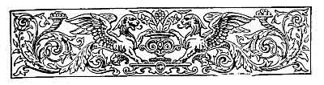
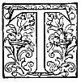

  
[Intangible Textual Heritage](../../../index)  [Sagas and
Legends](../../index)  [Basque](../index)  [Index](index) 
[Previous](lbp11)  [Next](lbp13) 

------------------------------------------------------------------------

p. 215

 

# KURUCIFICATUAREN CANTA. [1](#fn_29)

## (*The Chant of the Crucified*.)

### BALLAD.

|                    |
|--------------------|
|  |

HE woods of Odolaga [2](#fn_30) are sombre from
the abyss of Guesalza issue dismal sounds, and the Kuruceta [3](#fn_31) veils its face with a thick fog,

"Why do ye weep, maidens of Izaspi? [4](#fn_32)
Why pluck your beards, ye ancients of Errazil? What mean these tearful
eyes, and this disordered hair?"

p. 216

No one replied to the stranger: sorrow has no words it is dumb like
death. The maidens wipe away their tears; the ancients majestically
enwrap their mantles around them, and sit down, deeply moved and silent,
upon the broken-down trunks of their oaks. Yet though their sorrow may
be immense and deep, the *Euscara* must not manifest himself weak to the
eyes of the stranger. To others belong the loud plaints or the cry wrung
from feeble spirits. The tree groans as it breaks down; the strong rock
is cleft without hurting itself; the Euscara is like the rock--he dies;
but without death being able to wrench from him a single sigh.

Out of the dense fog which is covering Kuruceta issues from its bosom
sylvan harmonies and cries of triumph The Basque mountain is stirred to
its base, and, shaking its granite front, flings to the winds its diadem
of clouds. It is the full moon of May; the queen of night shows her
sanguinary face towards Otsondo, [5](#fn_33) and
with red

p. 217

beams illumines the mysterious heights. Sylvan melodies follow, and the
cries of triumph become louder. The torrents stop their course; the
winds of the forests become hushed, and timidly retire to take shelter
amid the leafy branches. What mysterious sacrifice is about to be
celebrated on the Basque mountain? Oh! what shadowy outlines rise up in
the horizon! What a long line of lances! Nude bodies pend from upraised
crosses; but the brows of the crucified are proudly lifted up; their
looks are haughty, and their lips curl with contempt. Cries of triumph
are uttered before the terrified Romans; the lips of the crucified are
crying thus:

"Salve! moon of May, light of our feasts and of our lives! spread thy
beams and encircle our brows with the brilliant crown of triumph and of
martyrdom!"

"The Romans desire to see on our faces the contortions of agony; that is
proper of cowards, and we are not cowards. These crosses are the thrones
of our glory!

"They weep like children on yielding up their spirit we sing the song of
death, the hymn of victory!

"Your Augustus Octavius is great, you say; and in truth he is great like
yourselves--in pusillanimity and in treachery.

"Salve! May moon, which shines over fresh valleys, rugged mountains, and
the shady woods of our land!

"Relate to our sons, to our wives, to our lovers, and to

p. 218

our country, the deeds of *Euscara* and the cowardice of the Romans who
gaze on us.

"Tell them that we fling to the face of the son of the Tiber the blood
which gushes from our wounds. Tell them that when our souls fly to
heaven, our hearts will still continue to throb for our country!

"Satellites of the tyrant! land of slaves! We despise ye like the bear
despises the fox; and on their faces, pale with terror, we hurl our
contempt!

"Salve! thou moon of May, look at us well: we smile at pain; our
countenances do not grow pale. The love of liberty and of our country
still fills our hearts!

"Tell our beloved fathers and our dear brothers what you have seen; and
that to the cries of triumph which resound from Kuruceta responds the
cry of extermination and vengeance throughout the Basque mountains.

"May moon! light of May! kiss the brows of our children and of our
mothers, and carry to our spouses, whom we received before the altar,
the last throb of our hearts!

"Oh, May moon! repeat with us the last motto of our spirit, *Viva la
Patria*! Hatred and contempt for idolatrous Rome!"

To this clamour replies another, great and echoing--terrible--a cry
which fills the depths of the forests and fills the immensity of space.
Then the Basque mountains remain silent; the woods of Odolaga become

p. 219

more sombre, and from the mouth of Guesalza [1](#fn_34) issues still more dismal sounds, and the
Kuruceta veils her face with a more dense fog. And the beams from the
May moon descends over the valleys, and consoles with its cold light the
maidens of Izaspi and the ancients of Errazil.

 

------------------------------------------------------------------------

### Footnotes

[215:1](lbp12.htm#fr_29) *Kurucificatuaren
Canta*. (*The Chant of the Crucified*.) During the long and sanguinary
war sustained by the Romans against the inhabitants of the Basque
mountains, the prisoners who fell into the power of the Romans were
crucified on the summit of the mountains with the object of inspiring
the dwellers with terror. p. 216 The heroic
Basque people intoned while on the cross a chant of triumph and death,
and also insulted their enemies, who witnessed with feelings of awe such
manifestations of courage and lofty independence of spirit.

[215:2](lbp12.htm#fr_30) *Odolaga*. A mountain
which, forming a cordillera, separates the valleys of Baztan and Ulzama.
It is covered with woods.

[215:3](lbp12.htm#fr_31) *Kuruceta*. A mountain
situated in Guipuzcoa and Navarre, upon which some hundreds of Basque
prisoners were crucified during the wars against the Romans.

[215:4](lbp12.htm#fr_32) *Izaspi*. An ancient
place of Navarre.

[216:5](lbp12.htm#fr_33) *Otsondo*. A mountain
on the frontiers of France, near the Urdax, in Navarre.

[219:1](lbp12.htm#fr_34) Guesalza. A cave of
great depth and extension, full of crystals. It is situated near the
Mondragon, in Guipuzcoa.

------------------------------------------------------------------------

[Next: The Raids](lbp13)
