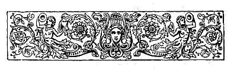

  
[Intangible Textual Heritage](../../../index.md)  [Sagas and
Legends](../../index)  [Basque](../index)  [Index](index.md) 
[Previous](lbp12)  [Next](lbp14.md) 

------------------------------------------------------------------------

p. 220

 

# THE RAIDS

<table>
<colgroup>
<col style="width: 100%" />
</colgroup>
<tbody>
<tr class="odd">
<td>"Houra! Cosacos del desierto, houra! 
La Europa os brinda esplendido botin. 
Sangrienta charca sus campiñas sean, 
De los grajos su ejército festin." 
                           --ESPRONCEDA.</td>
</tr>
</tbody>
</table>

("*Hurrah! Cossacks of the desert, hurrah! Europe offers ye a splendid
booty. Bloody pools may her battlefields become, and vultures on her
army feast*.")

|                    |
|--------------------|
|  |

ING, bard, sing! you who are as old as the world, and whose head began
to whiten on the very day when the great beech of Berderiz [1](#fn_35.md) was planted. Sing, bard, sing! Eldest of
our improvisatores; singer of our feasts, of our warlike deeds, of our
loves! Sing a welcome to our

p. 221

brothers of the valley of Bertizarana, of Baztan, Of Aezcoa, of Erro,
and of Roncal. [1](#fn_36.md) Salute with your most
penetrative and sonorous "lecayo" our brothers of Elzupel, of Otsobide,
Hernio, and Aitzgorri. [2](#fn_37.md)

The night is dark, and the wind whistles across the trees of
Irati, [3](#fn_38.md) compelling the wolf of the
mountains to hide its brown head. The night is darksome, and a whirlwind
of snow is drifting the flakes in heaps. It is a pleasant night for us,
children of the mountains and of the tempests. It is a night which
terrifies the Roman matrons, and makes the sybarite son of the Tiber
shudder as he ties on his soft couch.

We shall enter with strung bow into the gardens full of statues, into
the palaces of marble, into the bedchambers hung with silken draperies.
We must feast at the ivory tables, we must fill ourselves with the wines
of Syracuse and of Cyprus, quaffed in cups of gold and precious stones.
Our women will work mantles of

p. 222

purple--standards to serve as guides in the battles--and will plait
their hair with threads woven with the silver of their cups. The
chieftain of the frontiers on hearing the "irrinzi" will mistake it for
the noise of the hurricane, and we shall traverse the plains swift as
the winds. The Romans crucified our prisoners, and we must devastate
their cities and tread down their fields. And by the light of the
conflagrations our sons, crowning the crests of the mountains, will
intone hymns of victory.

Sing, bard, sing! This is the hour of our raid: the owl screeches in the
crevices, the wolf hides in the caverns, the eagle, timorous, thrusts
its beak under the wing; because night is fearful to all creatures, save
to us, sons of the mountains and of the tempest. Come, brothers,
forward! We drink our last wine, and eat our last bread, and our
children ask for more! Reach the cup of sour milk, and let us drink our
parting cup. Forward, my sons! Let our women sleep, and hush our
mastiffs. The raid will last eight suns.

 

Thus spoke the chieftain of Izalzu, [1](#fn_39.md)
and great acclamations resounded among the rocks of Orbara, [2](#fn_40.md) and the

p. 223

torrent, which later on took the name of Irati, stayed its rapid course.

An hour later, and the mountaineers traversed the deserted parts of
Montlig and Astarac. [1](#fn_41.md) To the right
appear, like so many skeletons of gigantic elephants amid the shades of
night, the Druidical altars of Asté, Sem, Nestos, and Heas. [2](#fn_42.md) From thence they descend and sally out of
the darksome defiles of Zulogaraya, Izotzce, and Asarosta, [3](#fn_43.md) into the fertile plains of
Novempopulania. [4](#fn_44.md) They descend
silently and sinister, like the black, immense wave, the first breath of
the hurricane which at night surprises the heedless ship.

Novempopulania slumbers in the midst of gardens and flowers, its
splendid palaces built of the marble of Paros and of gold from Ethiopia,
and out of them exhales, from among their peristyle columns, the
perfumes of the feasts of night. And they descend, those sons of the
mountains, like bands of water birds, enveloped in the

p. 224

dismal mantle of the tempest. The watch-guards of the Roman fortresses
are showing their bare heads and, flinging aside their lances, sleep at
will; because the mountain is far distant--because no noise comes from
thence--because the storm increases, and the night continues fearful and
darksome. The waters of the Adour and of the Nive [1](#fn_45.md) are filled with the multitude that are
swimming across silently, The neigh of the war-horse is not heard; nor
is the red standard of the *Three Hands* waving in the air; nor is the
echo awakened by the "irrinzi" of war.

Virgins of Leheren, of Iscilo, and Arai, repose peacefully. Only can
your sleep be agitated by the great voice of the tempest, or by the last
chords which vibrate from the citherns of gold. Nevertheless, during
your waking hours you will smile at the image of the patrician who
subjugated the heart, wearing on his brow the diadem of triumph in the
Hypic games! And you will do well; because the mountain is distant, and
no noise comes from thence; because the storm increases, and the night
is fearful and darksome.

Towards the furthest compass of the horizon is seen a red point; another
here and there, and some nearer. Oh, how these luminous points increase!
How do the

p. 225

waters of the rivers seethe! What clamours are mingled in the roar of
the tempest! What shadows are those which glide along the vast plains?
What smoke is that which rises like a funereal pall, and interposes
between earth and the firmament?

Sing, bards, sing! Sing the incursions of the sons of the mountains and
of the tempest! The lances are dripping with blood; the men come loaded
with spoils. Sing, bard, sing! May your sonorous voice be echoed across
the woods and forests of Cahella, of Belaya, and of Ahaide, [1](#fn_46.md) singing the victory of the sons of Aitor.
Sing, bard of the silvery beard! Our children will have white bread and
red wine until they are satiated, and our chieftains crucified in
Kuruceta and Izascun smile from within their sepulchres.

The son of the Tiber remains there below, amid the ruins of the
burnt-out palaces. Next spring the lime-tree of pale yellow flowers will
cover the devastated gardens.

Farewell, my brothers, farewell! In our next incursion we shall swim
across the Ebro, and our war-cry will reach even to Moncayo.

------------------------------------------------------------------------

### Footnotes

[220:1](lbp13.htm#fr_35.md) *Berderiz*. A mountain
situated at two kilometres from the town of Irurita, in the valley of
Baztan.

[221:1](lbp13.htm#fr_36.md) *Bertizarana*, &c.
Valleys of Navarre, on the frontiers of France. The three first are
narrow and surrounded by very high mountains.

[221:2](lbp13.htm#fr_37.md) *Elzupel*, &c.
Mountains. The two first belong to Navarre and the third to Guipuzcoa.

[221:3](lbp13.htm#fr_38.md) *Irati*. One of the
principal mountains of Navarre. It is covered by dense woods, in which
are found lynx, bears, wolves, and all kinds of large game. The
circumference of the base of this mountain is about fifty kilometres.
One part belongs to France, and the rest to Navarre.

[222:1](lbp13.htm#fr_39.md) *Izalzu*. A village
situated five kilometres from Ochagabia, in the valley of Aezcoa, in
Navarre.

[222:2](lbp13.htm#fr_40.md) *Orbara*. A precipitous
defile of the valley of Aezcoa, in Navarre.

[223:1](lbp13.htm#fr_41.md) *Montlig* and
*Astarac*. Deserted places of the French Pyrenees.

[223:2](lbp13.htm#fr_42.md) *Asté*, *Sem*,
*Nestos*, and *Heas*. Mountainous and deserted places in the centre of
the Pyrenees.

[223:3](lbp13.htm#fr_43.md) *Zulogaraya*, &c.
Defiles or passes of the French Pyrenees, which have their commencement
in Spanish territory.

[223:4](lbp13.htm#fr_44.md) Novempopulania. During
the epoch of the domination of the Romans this district extended from
the Cantabrian Ocean to the margin of the river Garona, and from the
first slope of the French Pyrenees to the margin of the above-said river
and its mouth into the sea, forming an acute angle.

[224:1](lbp13.htm#fr_45.md) *Nive*, &c. A French
river, which springs on the declivity to the north of the Western
Pyrenees, and joins the river Adour in Bayonne, and jointly flows into
the Cantabrian Ocean.

[225:1](lbp13.htm#fr_46.md) *Cahella*, &c. High and
very luxuriant mountains, close to the valley of Roncal, in Navarre.

------------------------------------------------------------------------

[Next: The Holy War--Ballad](lbp14.md)
