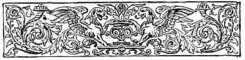
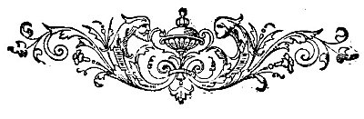

  
[Intangible Textual Heritage](../../../index)  [Sagas and
Legends](../../index)  [Basque](../index)  [Index](index) 
[Previous](lbp13)  [Next](lbp15) 

------------------------------------------------------------------------

p. 226

 

# THE HOLY WAR.

### BALLAD.

|                    |
|--------------------|
|  |

T is the autumnal equinox. The hurricane sweeps with potent breath the
leaves of the olive and the vine in the provinces of the south, and
directs its course, howling, towards the Basque mountains. The night is
dark; the woods of Biscay, the precipitous cliffs of Guipuzcoa, and the
and plains of Alava, are full of those tremendous echoes which appal the
manliest spirit. The homesteads and granges are stirred to their
foundations; the lofty chimneys are shaken; and the proud chestnut which
grows near the doors shake their branches in a

p. 227

furious manner as though engaged in a noble wrestling with the wind. The
hurricane continues its unbridled march. On meeting with the boulders of
rocks overtopping the mountains, it seems to wish, in its fury, to
wrench them suddenly, and cast them wrathfully down; and then, turning
round in its impotent rage, encircles the huge bulks with mighty spirals
of whirlwinds; and on witnessing how futile are all its efforts, it
casts itself headlong, roaring, into the valleys. Then to that fearful
noise is mingled the pitiful cries of nature assailed and beaten.

The *Echeco-Jauna* [1](#fn_47) sleeps
peacefully, as well as his faithful mastiff, without being disturbed by
those dismal howlings so familiar to the sons of the mountains and of
the forests. The mastiff, however, suddenly raises its enormous head,
pricks up its ears, opens its jaws, and utters a howl of alarm. The
echeco-jauna lifts his head, and, leaning his elbow on the bed pillow,
lends attentive ear, and with feverish hand grasps the bugle of war.

What was it awoke the echeco-jauna? And what alarmed the mastiff? Amid
the howlings of the tempest a great voice was heard: this voice
resounded from beyond the Ebro. It was the cry of a whole people
offended in its dignity and stained in its honour.

Thus did our Basque chieftain and his faithful mastiff

p. 228

interpret that cry. They both ascended the summit of the mountains, and
to the roaring of the tempest is quickly added the sound of the bugle of
war.

All at once huge flames shoot up along the entire chain of mountains
from Larum, the frontier of Navarre, to Tolosa, the frontier of Castile.
And the echoing sound of the war-bugle rises above the noises of the
storm, flies across the woods of Biscay, along the precipices of
Guipuzcoa, and sweeps the arid plains of Alava. And the chieftains of
the three tribes, from the heights of Gorbea, [1](#fn_48) Amboto, [2](#fn_49) and Aitzgorri, [3](#fn_50) repeat unceasingly the war cry, floating
the standards of war lashed by the tempest. From Gorbea, from Amboto,
and from Aitzgorri issue the call which no Basque ever leaves
unanswered.

Ia, ia, ia, ó, ó, ó! Bill-Zaar, in Vitoria, in Tolosa, and in
Guernica! [4](#fn_51)

And this call vibrated throughout the whole

p. 229

\[paragraph continues\] Euscuara [1](#fn_52)
nation, who replied with tremendous vehemence: "Ia, ia, ia, ó, ó, ó,
bill-zaar, bill-zaar!"

"Rise up from your sepulchres, ye warriors and bards of historic times!
Shake off the funeral dust of ages; tear asunder the grave-clothes, ye
Zurias, ye Ayalas, ye Lavas, and thousands of other heroes of ancient
Euscarian epic poetry! Hasten to attend the 'bill-zaar' of Biscay, of
Guipuzcoa, and of Alava. Your descendants have not yet become
degenerate; there you will hear from mouth to mouth the motto of your
ancient shields--*Ill, edo guaraitu*!"

 

"In what are you engaged, illustrious Alavese matron?"

"In broidering for my son, who goes to the Holy War, this blessed
scapular of Our Lady ad Nives."

"And you, beautiful Bergarese maiden, what work are you doing?"

"I am working for the idol of my heart, who is proceeding to the Holy
War, the scapular of Our Lady of Aránzanzu."

"What work is that which so occupies you, noble daughter of
Durango?" [2](#fn_53)

p. 230

"I am busy making a scapular of the Virgin of Begoña for my beloved
brother to wear as he goes to the Holy War."

"And do you know where your son and lover and brother are going to,
noble Basques?"

"Listen, stranger: they are going across Spain, as in the ancient days
they crossed Gallias; they are going to pass the strait, as they
formerly passed the Rhodano; they are going to utter their cry of war
and victory from the heights of Atlas, as they once did on the plains of
Capua. They are going to assist their brothers of Castile; they are
going to wash out the affront which stains the face of our common
mother; they are going to die or conquer as they did in Regil, [1](#fn_54) as in Cannas, [2](#fn_55) as in Covadonga, [3](#fn_56) and as in Navas.

"Do you see, stranger, those three diaphanous clouds which float on the
horizon? They enclose the souls of the ancient heroes who died for their
country. Do you hear the sweet melodies which pierce the winds?

p. 231

\[paragraph continues\] They are the voices of those who are praying to
God for the victory and triumph of their descendants. Do you perceive
the wide ray of light which illumines the whole Euscuara land? It is but
the dim reflex of the brilliant aureole which crowns the glorious brows
of those who die for their God, for their country, and for their king.

"Our war flags, our standard of the Three Hands shall wave by the side
of the glorious flag of Castile, and then, alas! for the standard of
Mahomet!

"Should our sons perish, there yet remain ourselves to avenge their
death. If our sons die, their souls will ascend in diaphanous clouds,
intoning hymns to God, their glorious brows crowned with aureoles which
will far exceed the sun in brightness."

Thus spoke the illustrious dames and maidens of the Basque provinces.

"May you be blessed of God one and a thousand times, noble women!"
replied the stranger, and then disappeared.

 

"Come, sons of the mountains! Rise up like one man to the sound of the
hymn of war and liberty! Thirty ages of combats and victories have
distinguished the three tribes of the Pyrenees and cast over them a
splendour--a splendour which has never been dimmed of its pristine
glories.

p. 232

"Sus, sons of Aitor, the famous and enlightened founder of our progeny!
Go, for your brothers from beyond the Ebro are calling ye. Grasp with
powerful arm the victorious weapon, and march towards Africa, with your
noble faces lifted up, your looks haughty, and your countenances calm.
March towards Africa, and may your war-whoop shake the Atlas! There do
new combats await you and new triumphs. Wrestle until you die against
your enemies, and God grant that your glory may ever shine brightly like
the flames of the three lamps in the feasts of the mysterious!"

Thus spoke the Basque chieftain; and three powerful armies replied to
the spirited call, and ran to the combat amid the frenzied acclamations
of a whole nation, who cried out:

"Ia, ia, ia, ó, ó, ó, ill edo garaitu."

 

 

------------------------------------------------------------------------

### Footnotes

[227:1](lbp14.htm#fr_47) *Echeco-Jauna*. The
head of the family, proprietor, &c.

[228:1](lbp14.htm#fr_48) *Gorbea*. A mountain of
Alava, which overlooks the plains upon which stands the city of Vitoria.

[228:2](lbp14.htm#fr_49) *Amboto*. A very high
cliff situated on the frontiers of Guipuzcoa, Alava, and Biscay.

[228:3](lbp14.htm#fr_50) *Aitzgorri*. Mountain
of Guipuzcoa: a continuation of Aloña. It rises 1·800 metres above the
level of the sea.

[228:4](lbp14.htm#fr_51) *Guernica*, *Arriaga*,
and *Guerekiz*. The three camps where in ancient times were gathered
together the *bill-zaars*, or meetings of the ancients. The first was in
Alava, the second in Biscay, and the third in Guipuzcoa.

[229:1](lbp14.htm#fr_52) "*Euscuara*, or
*Euscara*. The name given by the Basque to those who speak it." See
Essay on the Basque Language, by M. Julien Vinson, in "Basque Legends,"
by the Rev. Wentworth Webster.

[229:2](lbp14.htm#fr_53) *Durango*. Principal
town of Biscay.

[230:1](lbp14.htm#fr_54) *Regil*. The ancient
Errazill. A town close to Tolosa, of Guipuzcoa. Its inhabitants routed
the Romans in the time of Augustus.

[230:2](lbp14.htm#fr_55) *Cannas*. A celebrated
battle gained by Hannibal against the Romans. A vanguard of the
Carthaginian army which decided the victory was composed of Basque
auxiliaries.

[230:3](lbp14.htm#fr_56) *Covadonga*, *Navas*,
and *Salado*. Three famous sanguinary battles, in which the Moors were
routed: in these the Basque legions took an active part.

------------------------------------------------------------------------

[Next: The Prophecy of Lara--Ballad](lbp15)
