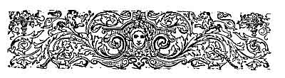
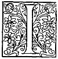

  
[Intangible Textual Heritage](../../../index.md)  [Sagas and
Legends](../../index)  [Basque](../index)  [Index](index.md) 
[Previous](lbp15)  [Next](lbp17.md) 

------------------------------------------------------------------------

p. 247

[  
Click to enlarge](img/24700.jpg.md)  
HURCA MENDI  
''And wrenching off the splendid crown which encircled its brow he
precipitately ran out of the church.''  

 

### HURCA-MENDI. [1](#fn_64.md)

|                    |
|--------------------|
|  |

RANZU! IRANZU! where are you going to, running, speeding along the
rugged heights of Sorazu, leaping brake ferns and broken cliffs?
Perchance, has the fearful *irrinzi* of war resounded along the defiles
of the Urola, or have the heights of Mauria been enkindled with the
foreboding bonfires, the sight of which makes, the hearts of mothers and
maidens shudder with terror? No, no; your hands do not grasp the warlike
bow, nor from your shoulder pends the quiver full of arrows, poisoned
with the sap of the *tejo*! You are not going to the combat, Iranzu! The
sons of your race enter

p. 248

the battle-field with a song, and they fall calm at heart. Their gaze is
free of fear or dread, but to-day your eyes are sombre like the night,
and your heart is agitated like the tempest when it rages amid the
woods. You suffer and weep! Down among the chestnuts of Artadi is
likewise seen a maiden, sweet like hope, beautiful as bliss, and she
sighs sadly on murmuring your name. Iranzu! Iranzu! why did you go to
the *Gara-paita* [1](#fn_65.md) of Artadi if your
life was passing calmly and happily dwelling in the ancient homestead of
your elders? Have you not heard, at times, that shadows of sadness and
mourning obscured the fate of your child?

One day, when that lovely child, a babe, still in her cradle, was placed
beneath the oak tree which shaded the doorway, an aged *Astiya* [2](#fn_66.md) passed by, and stayed to gaze upon that
child with deep emotion.

Suddenly her eyes were filled with tears, and her tremulous lips
murmured with sad accents a name. It was the name of her child--her
child which she had lost that moon, and its memory had made her heart of
mother shudder rudely! Because even the *Astiyas*, when they are
mothers, have loving hearts and feel affection towards those little ones
whom they have borne!

Touched tenderly by the memory of her lost one,

p. 249

she endeavoured to imprint a kiss on the fresh, rosy cheek; but the
innocent babe repelled with dread and fear her kisses and caresses. The
vengeful *Astiya* spitefully uttered over her brow mysterious words of
cursing and death!

Have none of those words reached to you, Iranzu? Listen, listen. "May a
curse fall on the first youth who shall make your heart beat, and
receives your first kiss of love!" she hissed.

And you are the first, Iranzu, who has attained to agitate the mind of
that maiden; you the first who has made her virgin soul tremble with
love; you who have won her loving caresses! Unhappy one! Better had it
been for you had you encountered on the mountains of Otoso a herd of
famished wolves, than have met the blue eyes of the maiden of Artadi!
How could you dream of obtaining the hand of that rich heiress, you,
poor cadet of Biscay, who has for his only heirloom *a tile, a tree, and
coat of mail*? [1](#fn_67.md) Fly from her, Iranzu!
Forget that perchance she is waiting for you at her window, listening
with beating heart for the sound of your footsteps!

But alas! the son of Iranzu will not turn back, because he is
love-stricken, and he will not return until he has seen her, even should
he have to leap across the

p. 250

black mouth of the chasm of Aitz-belz, [1](#fn_68.md) which descends, down to the bottomless
pit. He runs, runs, and at length he reaches Artadi. Oh, how his heart
beats on quitting the shades of the trees which overshadow her window!
Oh, how he trembles and shudders as by the light or the moon he
discovers the sweet brow of the love-stricken damsel!

But she is sad. Her eyes are swollen with tears, her looks reveal much
anguish, her cheeks are pale! It is because the angel of pain, on
passing swiftly, has left on her lips a kiss of death.

"What ails you, dove of Artadi?" cries the youth, with impassioned
accents.

"Iranzu?" she murmured.

"You are weeping! What is the matter?"

"Fly from hence, Iranzu!"

"What do I hear?"

"Oh, I hear my father coming--retire, Iranzu. But, first, one word. The
*Eche-jaun* of Igueldo has asked for my hand!"

"Oh! and what have you replied? What does your father say?"

"My father has accepted him, and I------"

"You vacillate?"

"What am I to do? He is my father."

p. 251

"He is your father, ’tis true. But I--I am your lover; oh, tell me--do
you love me? If so, come with me! fly with me! Come, I will give you my
heart and my life. I will win for you riches and a name!"

"It is impossible, Iranzu!"

"Oh! but listen to me!"

"Silence!" cried at this moment the aged Artadi, as he showed himself at
the window. "By the love which my daughter bears towards you, I will
give you a further term; but do not forget that if within fifteen days
you do not bring your *millares*, [1](#fn_69.md)
the maiden of Artadi will be the bride of the Eche-jaun of Igueldo. May
heaven assist you!"

"Perhaps it will be the evil one," cried the bold youth, in great wrath,
"since heaven is deaf to my pleadings and cries!"

A tremendous thunder-clap was the reply to this impious exclamation,
while a dart of lightning clove in twain the massive trunk of an
enormous oak tree which grew close to him.

Iranzu raised his head, and, with a look of deepest contempt on his
countenance, glanced up at the dark window, and began running over
mountain and valley, without aim or object, roaring with rage, and
invoking in one breath both heaven and hell. On turning round the brow
of a hill, a-pale blue light appeared before him,

p. 252

and this flame flickered in an agitated manner, as though it shuddered
at every movement. The young man stood still for a moment, as he gazed
upon it with absorbing interest; but its pale, mysterious gleams
strangely filled his soul with superstitious dread, and he turned back
to avoid it. Yet the flame continued before him, and at length, annoyed
at not being able to avoid or depart from it, he decided to continue his
march forward; so he impetuously ran to encounter it, in order to drive.
it away. But all in vain! If he advanced, the mysterious flame would
flit before him; if he turned back, the flame would turn back also; yet
he was unable to reach it, as it always kept at the same distance from
him, fascinating his eyes, and troubling his spirit with its sinister,
fantastic gleams.

"It must be my destiny!" he murmured, despondingly, and he continued to
walk on, giving himself up with despairing resignation to his fate.

And they both ran and ran; the light before him floating amid the
shadows in tremulous movements, Iranzu following it, taciturn and
sombre. When any mountaineer approached the path Iranzu was following,
and discovered the mysterious flame, he would quickly make the sign of
the Cross and hasten his pace. The night was far advanced when they
reached to Iciar. The flame went into the streets, and the youth still
behind it. But on turning into the open space or

p. 253

square before the church, the light glided swiftly over the door of the
temple, and after flickering for a few moments with rapid movements, it
vanished among the shadows. Notwithstanding the darkness of night, the
youth observed that the church door was half open, so he stepped into
the porch to look within. Black thoughts of crime must have at that
moment risen up in his mind, because, on drawing back from the door, his
eyes were glistening with sinister fire. Overcome, or rather led by some
undefinable emotion, he once again looked into the interior with eager
looks; but he only discovered the shadows cast forth by the holy images,
and which moved beneath the flickering gleams shed by the expiring light
of the lamp. Meanwhile dark thoughts assailed him each time with greater
force, and he was maddened by tempting visions, and these temptations
were dragging him towards the temple to manifest to his avaricious eyes
the riches which were within. But he still wrestled between the voice of
temptation and the voice of conscience, and he tremblingly murmured,
without daring to enter, "That light is the one which is guiding me
here--oh, light of my destiny! From whence does it come? Perchance from
the lower regions? But no matter! If it affords me the needed
*millares*, it will give me happiness!"

He vacillated for a moment; then, making a supreme effort, he leaped
across the threshold, and with firm

p. 254

step advanced to the altar of the Lady Chapel. In those days--as at the
present time--the brow of the holy image was encircled by a rich diadem
of gold studded with precious stones, and from the hands pended beads of
inestimable value.

On finding himself standing at the altar, Iranzu felt his knees quail
under him. "Oh, if I had all these precious things!" he said, as he
gazed with longing looks at the image--"oh, if I had the courage! But it
is such a sacred image, and hallowed by so many miracles--who would dare
to raise his wicked hand to touch its holy brow?" Nevertheless he was
instinctively approaching nearer and nearer to its side, until he stood
on the altar.

A gust of wind at that moment moved the curtain which veiled the sacred
queen of the angels. The youth trembled, yet he continued on the altar.
Suddenly throughout the wide vaulted dome of the temple resounded the
prolonged echoes of a far distant discharge of guns, and then another
and another, until they numbered twenty-one. [1](#fn_70.md)

It was the tender, respectful salute which from the far distant ocean
some brave sailor was directing to Our Lady of Iciar, the Star of the
Sea.

"What was I going to do--I, hapless man?" he murmured, as he leaped down
from the altar. "Some

p. 255

brave one, perhaps my brother Joanes, is sending across the shades of
night his homage and prayers to the Mother of God, meanwhile that my
sacrilegious hand is stretched forth to wrench off her crown I No,
never, never will I stain my soul with such an impious deed! It is
better to die at once! Death stifles in its arms at once misery and
sorrow!"

Saying this, he flung himself on his knees at the feet of the Virgin and
sobbed a prayer, while two burning tears coursed down his cheeks. But
these pious feelings and emotions were of short duration in a heart
puffed up with pride.

The evil one whom he had invoked in his senseless despair cast a deadly
shadow over his better nature, and presented before his mind and
feverish imagination the image of his beloved one, her eyes streaming
with tears, her heart agitated, and calling him in sad, passionate
tones. And he, on the wings of love, seemed to be flying to her side,
and to clasp her in his arms; but her father appeared to come to
separate them, delivering her up to his hateful rival who was taking her
away for ever. And in the midst of his delirium he heard distinctly
ringing in his ears those hateful words of the old man--"Do not forget
if within fifteen days you do not bring your *millares*, the maiden of
Artadi shall be the bride of the Eche-jaun of Igueldo."

Love, jealousy, wrath, and vengeance cast flames of

p. 256

fire over his proud heart, a vertigo of rage took possession of his
head, and, giving a leap, he stood on the altar and tore down the
curtains which veiled the holy image, and, wrenching off the splendid
crown which encircled its brow, he precipitately ran out of the church.
On bounding over the threshold he heard almost in his very ears a
frightful unearthly peal of laughter which well-nigh froze the blood in
his veins, and was re-echoed in the inmost recesses of his heart like a
cry of death. Maddened with terror at what he had done, he started in a
wild career along the skirt of Murguizabel, without noticing that the
aged *Astiya*, who, was concealed behind one of the recesses of the
porch, was watching him with a look of sinister satisfaction. And he
sped on and on until his chest became. contracted, and his breath failed
him, and his legs tottered and bent under him. He stopped to try and
recover breath for a moment, but on attempting it he thought to hear
anew that terrible, awful peal of laughter, and uttering a cry of
anguish, he began again to run along the broken rocks, and leaping
across. torrents with senseless, fearful impetus, casting froth from out
of his mouth, and darts of fire from his eyes.

The night was dark, very dark. The hurricane was breaking over the land,
the wind whistled among the aged oaks, and their dry branches, moving
under the impulses of the wind, appeared to be ill-omened phantoms,

p. 257

that were putting forth their weird arms towards the guilty youth,
whilst the shadows cast by the bushes, the broken rocks, and the briery
hedges which waved around him, conjured up in his terrified imagination
legions of devils that sprang up on every side as he trod the ground.

And thus he walked on for one hour, and two--and six--without stopping
once, without lessening his pace, scarcely daring to breathe, until at
the dawn of the new day he ceased to hear that fiendish laughter, as the
shades of night disappeared, and the wind became calmed down. Exhausted
and breathless, he stopped at the foot of a chestnut tree to rest
awhile; but, wishing first to know whereabouts he was, he climbed the
tree to reconnoitre the ground.

"How much I must have walked!" he murmured while he climbed up. "I must
be far, very far away!"

It was the hour when the day wrestles to open a way amid the shadows,
piercing through and pouring on all sides a dim misty light which alters
every object.

"I can distinguish nothing," he said, fixing his eyes with yearning
looks towards the east, where the horizon was beginning to be tinged
with the soft light of dawn.

All at once the sun, rending the mists and fogs with powerful impulse,
inundated with torrents of light a magnificent temple which rose up dark
and sombre at the foot of the white cliffs of Andutz. On recognizing

p. 258

it, the hapless youth felt his heart chilled within him with horror, and
a cold perspiration overspread his pale, weary forehead. The building
which appeared before his astonished gaze was the Church of Our Lady of
Iciar, from which he had been unable to depart more than a thousand
yards during seven hours of frenzied speed.

Believing that he was the victim of some nightmare, he closed his eyes
to shut out this awe-inspiring vision, and on opening them again he saw
on all sides the forms of armed men who were approaching, seeking
something among the briers and bushes. No doubt the sacrilegious robbery
had been discovered, and these men had come seeking the thief. Convinced
at that moment of the terrible reality, he bent down his head in deep
despondency and terror. Meanwhile the men were approaching, closely
following his footprints step by step. Iranzu, perceiving this, wished
to leap down, but the stolen jewels weighed him down terribly, and he
was unable to move a foot as though he were nailed to the tree.
Bewailing his powerlessness, he wished at least to cast the jewels from
him in order to conceal his crime, but, on putting his hand to his
breast where he had hidden them, he felt his fingers become charred at
the contact. In this terrible anguish he made a last and desperate
attempt to tear the cloth off his tunic; but it was in vain that he
employed all his

p. 259

strength. The fragile cloth resisted his efforts as though it had been
made of woven steel.

By this time the men had discovered him, and were coming quickly to the
tree, tracing a circle in order to prevent his escape. Oh, then did he
curse his ill-fated love, his existence, and his crime; and then,
unclasping the belt he wore, he made a noose with it, and in despair
hung himself from one of the branches.

When his pursuers reached him, they found him in the last throes of
death, and he only lived long enough to be able to recount the sad
circumstances of his sacrilegious attempt.

 

Since that epoch the brow of the mountain on which this event took place
is known throughout the district by the name of *Hurca-Mendi*--that is
to say, the mountain of the gibbet. On the left extends the ancient
roadway which leads from Iciar to the sea; and if any one desirous of
investigating these legends advances by that side towards the deserted
slopes of Arbill, the shepherds who tend the flocks there will show him
the spot on which the unhappy, ill-advised youth put an end to his days,
adding that during the darksome nights of winter there are heard the
doleful sighs of his spirit as it wanders among the woods.

------------------------------------------------------------------------

### Footnotes

[247:1](lbp16.htm#fr_64.md) *Hurca-Mendi*. See
Glossary.

[248:1](lbp16.htm#fr_65.md) *Gara-paita*. See
Glossary.

[248:2](lbp16.htm#fr_66.md) *Astiya*. See Glossary.

[249:1](lbp16.htm#fr_67.md) *A tile, a tree*, &.c.
See Glossary.

[250:1](lbp16.htm#fr_68.md) *Aitz-belz*. See
Glossary.

[251:1](lbp16.htm#fr_69.md) *Millares*. See
Glossary.

[254:1](lbp16.htm#fr_70.md) *Twenty-one*. See
Glossary.

------------------------------------------------------------------------

[Next: Glossary](lbp17.md)
