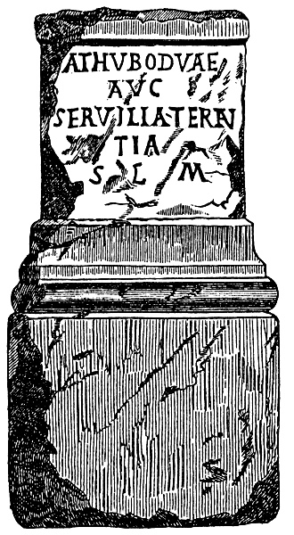

  
[Intangible Textual Heritage](../../../index)  [Myths and
Legends](../../index)  [Celtic](../index)  [Index](index) 
[Previous](aigw00) 

------------------------------------------------------------------------

*The Ancient Irish Goddess of War*, by WM Hennessey, \[1870\], at
Intangible Textual Heritage

------------------------------------------------------------------------

    The discovery of a Gallo-Roman inscription, figured in the *Revue
Savoisienne* of 15th November, 1867, and republished by M.
Adolphe Pictet in the *Revue Archéologique* for July, 1868, forms the
subject of one of those essays from the pen of the veteran philologist
for which the students of Celtic languages and archæology cannot be
sufficiently thankful. [2](#fn_1)

 

 

 

    The inscription, the initial letter of which has been destroyed by
an injury to the stone on which it is cut, reads: *athuboduæ
Aug*\[*ustæ*\] *Servilia Terenta* \[*votum*\] *s*\[*olvit*\]* 
l*\[*ibens*\] *m*\[*erito*\].

    M. Pictet’s essay is entitled “*Sur une Déese Gauloise de la
Guerre*”; and if he is right in his suggestion (which is very probably)
that the letter destroyed was a *c*, and that ATHUBODVÆ should be read
CATHUBODVÆ, the title is not inappropriate; and in the CATHUBODVÆ of the
inscription we may recognise the *badb-catha* of Irish mythology.

    The etymology of the name *athubodua*, or *cathubodua*, as we may
venture to read it, has been examined with great industry by M. Pictet,
who has managed to compress within the narrow limits of his essay a
great mass of illustrative facts and evidences drawn from all the
sources accessible to him. The first member of the name (*cathu*, =
Irish *cath*, «pugna») presents but little difficulty to a Celtic
scholar like M. Pictet, who would however prefer finding it written
*catu*, without aspiration, as more nearly approaching the rigid
orthography of Gaulish names, in which it is very frequently found as
the first element; but the second member, *bodua*, although entering
largely into the composition of names amongst all the nations of Celtic
origin from the Danube to the islands of Aran, is confessedly capable of
explanation only through the medium of the Irish, with its corresponding
forms of *bodb* or *badb* (pron. *bov* or *bav*), originally signifying
rage, fury, or violence and ultimately implying a witch, fairy, or
goddess, represented by the bird known as the scare-crow, scald-crow, or
Royston-crow, not the raven as M. Pictet seems to think.

    The etymology of the name being examined, M. Pictet proceeds to
illustrate the character of the *Badb*, and her position in Irish fairy
mythology, by the help of a few brief and scarcely intelligible
references from the printed books, the only materials accessible to him,
but finds himself unable to complete his task, “for want of sufficient
details,” as he observes more than once.

    The printed references, not one of which has escaped M. Pictet’s
industry are no doubt few, but the ancient tracts, romances, and battle
pieces preserved in our Irish MSS. teem with details respecting this
*Badb-catha* and her so-called sisters, *Neman*, *Macha*, and *Morrigan*
or *Morrigu* (for the name is written in a double form), who are
generally depicted as furies, witches, or sorceresses, able to confound
whole armies, even in the assumed form of a bird.

    Popular tradition also bears testimony to the former widespread
belief in the magical powers of the *Badb*. In most parts of Ireland the
Royston-crow, or *fennóg liath na gragarnaith* (“the chattering grey 
*fennóg”*). As she is called by the Irish speaking people, is regarded
at the present day with feelings of mingled dislike and curiosity by the
peasantry, who remember the many tales of depredation and slaughter in
which the cunning bird is represented as exercising a sinister
influence. Nor is this superstition confined to Ireland alone. The
popular tales of Scotland and Wales, which are simply the echo of
similar stories once current and still not quite extinct in Ireland,
contain requent allusion to this mystic bird. The readers of the
*Mabinogion* will call to mind, amongst other instances, the wonderful
crows of Owain, prince of Rheged, a contemporary of Arthur, which always
secured factory by the aid of the three hundred crows under its
command [3](#fn_2): and in Campbell’s *Popular
Tales of the West Highlands* we have a large stock of legends, in most
of which the principal fairy agency is exercised by the hoodie or
scare-crow.

    It may be observed, by the way, that the name hoody, formerly
applied by the Scotch to the hooded crow or the scare-crow, from its
appearance, is now generally applied to its less intelligent relative
the common carrion crow. But the hoody of Highland fairy mythology is,
nevertheless, the same as the *badb* or Royston crow.

    I have referred to *Neman*, *Macha*, and *Morrigu*, as the so called
sisters of the *Badb*. Properly speaking, however, the name *Badb* seems
to have been thee distinctive title of the mythological beings supposed
to rule over battle and carnage. M. Pictet feels a difficulty in
deciding whether there were three such beings, or whether *Neman*,
*Macha*, and *Morrigu* are only three different names for the same
goddess; but after a careful examination of the subject I am inclined to
believe that these names represent three different characters, the
attributes of *Neman* being like those of a being who confounded her
victims with madness, whilst *Morrigu* incited to deeds of valour, or
planned strife and battle, and *Macha* revelled amidst the bodies of the
slain.

    The popular notions regarding the identity of the battle furies with
the royston-crow are accurately given in the Irish Dictionary compiled
by the late Peter O’Connell, an excellent Irish scholar, who died some
60 years ago, and the original of whose excellent vocabulary is
preserved in the British Museum. Thus:

    *Badb-catha* is explained “*finnóg*, a royston crow, a squall crow”.

    “*Badb*, i.e. *bean sidhe*, a female fairy, phantom, or spectre,
supposed to be attached to certain families, and to appear sometimes in
the form of squall crows, or royston crows”.

    “*Macha*; i.e. a royston crow”.

    “*Morrighain*; i.e. the great fairy”.

“*Neamhan*; i.e. *Badb catha nó feannóg*; a *badb catha* or a royston
crow”.

    Similar explanations are also given by the other modern glossaries.

    The task of elucidating the mythological character of these fairy
queens has not been rendered easier by the labours of the etymologists,
from Cormac to O’Davoren. Thus, in Cormac’s glossary, *Nemain* is said
to have been the wife of *Neit*, “the god of battle with the pagan
Gaeidhel”. In the *Battle of Magh-Rath* (O’Donovan’s ed. p. 241) she is
called *Be nith gubhach Neid*, “the battle-terriffic *Be-Neid*”, or
“wife of *Neid*”. In an Irish MS. In Trin. Coll., Dublin class H, 3, 18,
p.73 col. 1), *Neit* is explained “*guin duine* .i. *gaisced; dia catha.
Nemon a ben, u test Be Neid*;”. A poem in the *Book of Leinster*(fol. 6,
a2), couples *Badb* and *Neman* as the wives of Neid or Neit:—

 

*Neit mac Indui sa di mnai,  
Badb ocus Nemaind cen goi,  
Ro marbtha in Ailiuch cen ail,  
La Neptuir d’Fhomorchaibh.*

 

“*Neit* son of *Indu*, and his two wives,  
*Badb* and *Neamin*, truly,  
Were slain in *Ailech*, without blemish,  
By Neptur of the Fomorians”.

 

* *

     At folio 5, a2, of the same MS., *Fea* and *Nemain* are said to
have been *Neit*’s two wives;  and if *Fea represents* Badb, we have a
good notion of the idea entertained of her character, for Cormac states
that *Fea* meant “everything most hateful”.

    But in the poem on Ailech printed from the Dinnsenchus in the
“*Ordinance Memoir of Templemore”* (p. 226), *Nemain* only is mentioned
as the wife of *Neit*, from whom Ailech was called *Ailech-Neit*; and it
is added that she was brought from *Bregia*, or Meath.

    In the Irish books of genealogy, *Fea* and *Neman* are said to have
been the two daughters of Elcmar of the *Brugh* (Newgrange, near the
Boyne), who was the son of Delbaeth, son of Ogma, son of Elatan, and the
wives of Neid son of Indae, from whom *Ailech-Neid* is named.

*Badb*, *Macha*, and *Morrigan* (who is also called *Ana*, are described
as the three daughters of Delbaeth son of Neid. And it is stated that
Ernmas, daughter of Ettarlamh, son of Nuada Airged-lamh (King of the
Tuatha-de-Danann), was the mother of the five ladies.

    In other authorities, however *Morrigan* is said to have been
*Neit*’s wife. For instance, in the very ancient tale called *Tochmarc
Emhire*, or Courtship of Emir, fragments of which are p\[reserved in the
*Lebor na hUidhre* and the book of Fermoy, *Morrigan* is described as
“*an badb catha, ocus is fria idberiur Bee Neid, i.e. bandea in cathae,
uair is inan Neid ocus dia catha*; “i.e. “the *badb* of battle; and of
her is said *Bee-Neid*, i.e. goddess of battle, for Neid is the same as
god of battle”. A gloss in the *Lebor Buidhe Lecain* explains Machæ
thus: “*badb, no asi an tres Morrigan; mesrad machæ,* .i. *cend*æ *doine
iar na nairlech*;” i.e. “a scald crow; or she is the third *Morrigan*
(great queen); *Macha’s* fruit crop, i.e. the heads of men that have
been slaughtered:. The same explanation, a little amplified, is also
given in the MS. H. 3. 18. Trin Coll., Dublin(p. 82, col.2) where the
name *Badb* is written *Bodb*, as it is elsewhere, and it is added that
*Bodb*, *Macha*, and *Morrigan* were the three *Morrigna*. In the same
glossary under the word  *be neit*, we have the further
explanation:—“*Neit* nomen *viri; Nemhon a ben; ba neim-nech in
lanomuin; be ben* i.e. * in badhb, ocus net cath, ocus olca diblinuib;
inde dicitur beneit fort”*. i.e. * *“*Neit* nomen *viri*; *Nehmon* was
his woman (wife); venomous were the pair; *be* a woman, i.e. the
*badhb*, and *net* is battle; and both were evil; inde dicitur *beneit 
fort* (“evil upon thee”). Another gloss in the same collection, on the
word *gudomain*, bears on the subject under consideration. It is as
follows:—*Gudomain*, .*i. fennoga no bansigaidhe;* ut est *glaidhomuin
goa, .i. na demuin goach, na morrigna*; *no go conach demain iat na
bansigaide go connach demain iffrin iat acht demain aeoir na fendoga; no
eamnait andlaedha na sinnaigh, ocus eamnait a ngotha na fendoga*;” i.e.
“*gudomain*, i.e. scald crows or fairy women; utest *glaidhumuin goahe*
false demons; it is false that the *fendoga*(scald crows) are not
hellish but aery demons: the foxes double their cries, but the *fennoga*
double their sounds”. To understand this curious gloss it is necessary
to add that in a previous one the word *glaidomuin* is explained as
signifying *sinnaig,* or *maic tire* (foxes or wolves), because in
barking they double their sound; *glaidomuin* being understood by the
glossarist as *glaid-emain*, i.e. “double call”, from *glaid*, “call”,
and *enain* “double,” while the crow only doubles the sound,
*gath-emain*, “double-sound”. Cormac explains *guidemain*as *uatha ocus
morrigna*, i.e. “spectres and great queens”.

    Let us take leave of these etymological quibbles, and examine the
mythological character of the *badb*, as portrayed in the materials
still remaining to us.

    As mostly all the supernatural beings alluded to in Irish fairy lore
are referred to the Tuatha-de-Danann. The older copies of the *Lebor
Gabhala*, or “Book of Occupation” that preserved in the Book of Leinster
for instance, specifies *Badb*, *Macha*, and *Ana* (from the latter of
whom are named the mountains *called da cich Anann*, or the Paps, in
Kerry), as the daughters of Ernmas, one of the chiefs of that mythical
colony. *Badb ocus Macha ocus Anand, diatat cichi Anand il- Luachair,
tri ingena Ernbais, na ban tuathige;* “*Badb*, and *Macha*, and *Anand*
from whom the “paps of Anann [4](#fn_3)” in
Luachair are \[called\], the three daughters of Ernmais, the
*ban-tuathaig*”. In an accompanying versification of the same statement
the name of *Anand* or *Ana*, however, is changed to *Morrigan:*—

 

“*Badb is Macha mét indbáis,  
Morrigan fotla felbáis,  
Indlema ind ága ernbais,  
Ingena ana Ernmais* [5](#fn_4)

* *

“Badb and *Macha*, rich in store,  
*Morrigan* who dispenses confusion,  
Compassers of death by the sword,  
Noble daughters of Ernmas”.

 

It is important to observe that Morrigan is here identified with
*Anann*, or *Ana* (for *Anann* is the gen. form); and in Cormac’s
Glossary *Ana* is described as “Mater deorum Hibernensium; *robu
maithdin rosbiathadsi na dee* de cujus nominee *da cich Nanainne iar
Luachair* nominantur *ut fertur*;” i.e. “Mater deorum Hibernensium; well
she used to nourish the gods de cujus nominee the ‘two paps of *Ana*’ in
west *Luachair* are named” Under the name *Buanand* the statement is
more briefly repeated. The historian Keating enumerates *Badb*, *Macha*,
and *Morrighan* as the three goddesses of the Tuatha-de-Danann; but he
is silent as to their attributes. It would seem, however, that he
understood *Badb* to be the proper name of one fairy, and not a title
for the great fairy queens.

    In the Irish tales of war and battle, the *Badb* is always
represented as foreshadowing, by its cries, the extent of the carnage
about to take place, or the death of some eminent personage. Thus in the
ancient battle-story, called *Bruiden da Choga*, the impending death of
Cormac Condloinges, the son of Conor Mac Nessa, is foretold in these
words:—

“*Badb bel derg giarfid fon tech;  
Bo collain bet co sirtech*.”

 

“The red-mouthed *Badbs* will cry around the house,  
For bodies they will be solicitious.”

 

And again—

“*Grecfaidit badba banae”  
*“Pale *badbs* shall shriek.”

 

    In the very ancient tale called *Tochmarc Feirbe*, or the “Courtship
of Ferb:, a large fragment of which is rpeserved in the Book of
Leinster, the druid Ollgaeth, prophesying the death of Mani, the son of
Queen Medb, through the treachery of King Conor Mac Nessa, says:—

 

“*Brisfid badb  
Bid brig borb,  
    Tolg for Medb;  
Ilar écht,  
Ar for slùag,  
    Trúag in deilm* [6](#fn_5).

 

“*Badb* will break;  
Fierce power will be  
    Hurled at Medbh;  
Many deeds—  
Slaughter upon the host—  
    Alas! the uproar.”

 

    In the account of the battle of Cnucha (or Castleknock, near
Dublin), preserved in a 14th century MS., the druid Cunallis,
foretelling the slaughter, says:—“*Biagh bádba os bruinnibh na bfear”*
 “Badbs will be over the breasts of men [7](#fn_6).”

    In the description of the battle of Magh-Tuiredh, it is said that
just as the great conflict was about to begin, the “*badbs*, and
*bledlochtana*, and idiots shouted so that the were heard in clefts and
in cascades, and in the cavitites of the earth;” “*badba ocus
bledlocktana, ocus amaite, go clos anallaib, ocus a nesaib, ocus a
fothollaib in talnian* [8](#fn_7).”

    In the battle of Magh-Rath it is the “gray-haired *Morrigu*
“(scald-crow), that shouts victory over the head of Domhnall son of
Ainmire, as Dubgdiadh sings (O’Donovan’s ed. p. 198):—

   

“*Fuil os a chind ag eigmigh  
Caillech lom, luath ag leimnig  
Os eannaib a narm sa sciath,  
Is i in Morrigu mongliath*.”

   

“Over his head is shrieking  
A lean hag, quickly hopping  
Over the points of their weapons and shields—  
She is the gray-haired *Morrigu.*”

 

    In the account of the massacre of the Irish Kings by the
Aithech-tuatha, preserved in the Book of Fermoy, it is stated that after
the nmassacre “*ba forbhailidh badhbh derg dasachta, ocus ba bronach
banchuire don treis sin*;” “Gory *Badb* was joyful, and women were
sorrowful, for that conflict.”

    In the enumeration of the birds and demons that assembled to gloat
over the slaughter about to ensue from the clash of the combatants at
the battle of Glontarf, the *badb* is assigned the first place. The
description is truly terrible, and affords a painful picture of the
popular superstition at the time. “*Ro erig em badb discir, dian,
demnetach, dasachtach, dúr, duabsech, detcengtach, cruaid, croda,
cosaitech, co bai ic screchád ar luamain, os a cennaib. Ro eirgetar am
bananaig, ocus boccanaig, ocus geliti glinni, ocus amati adgaill, ocus
siabra, ocus seneoin, ocus damna admilti aeoir ocus firmaminti, ocus
siabarsluag debil demnach, co mbatar a comgresacht ocus i commorad aig
ocus irgaili leo*.”

    “There arose a wild, impetuous, precitpitate, mad, inexorable,
furious, dark, lacerating, merciless, combative, contentious *badb*,
which was shrieking and fluttering over their heads. And there arose
also the satyrs, and sprites, and the maniacs of the valleys, and the
witches, and goblins, and owls, and destroying demons of the air and
firmament, and the demoniac phantom host; and they were inciting and
sustaining valour and battle with them.”—“*Cogadh Gaedhel re Gallaibh*,”
Todd’s ed., p. 174.

    So also in the account of the battle fought between the men of
Leinster and Ossory, in the year 870, contained in the Brussells
“Fragments of Irish Annals,” the appearance of the *badb* is followed by
a great massacre: “*As mór tra an toirm ocus an fothrom baoi eturra an
uair sin, ocus ra togaibh badbh cenn eturra, ocus baoi marbhadh mór 
eturra san cán*;” i.e. “great indeed was the din and tumult that
prevailed between them at this time, and *Badb* appeared among them, and
there was great destruction between them to and fro.”

    But the *Badbs* could to more than scream and flutter. Thus we read
in the first battle of Magh-Tuiredh, that when the Tuatha-de-Danann had
removed to the fastness of Connacht, to Sliabh-Belgadain, or
Cenn-duibh-slebhe, that *Badb*, *Macha*, and *Morrigu* exercised their
magical powers to keep the Fir-bolgs in ignorance of the westward
movement. The text is from H. 2. 17. T. C. D., fol. 93, col 2. “*Is
annsin do chuaidh Badhbh ocus Macha ocus Morrighu gu cnoc gabala na
ngial, ocus gu tulaig techtairechta na trom sluag, gu Temraig, ocus do
feradar cetha dolfe draigechta, ocus cith nela cotaigecha ciath, ocus
frasa tromaidble tened, ocus dortad donnfala do shiltin asin aeor i
cennaib ne curad, ocus nir legset scarad na scailed do feraib Bold co
cenn tri la ocus tri naidche*.” “Then the *Badb*, and *Macha*, and
*Morrigu* went to the hill of hostage-taking, the tulach which heavy
hosts frequented, to Temhair (Tara), and they shed druidically formed
showers, and fog-sustaining shower-clouds, and poured down from the air,
about the heads of the warriors, enormous masses of fire, and streams of
red blood; and they did not permit the Fir-Bolgs to scatter or separate
for the space of three days and three nights.”  It is stated, however,
that the Fir-Bolg druids ultimately overcame this sorcery. And in the
battle of Magh-Tuiredh they are represented as assisting the
Tuatha-de-Danann. Thus, in the account of the third day’s conflict we
read.—“*Is iad taisig ro ergedar re Tuathaib de Danann isin lo sin* .i.
*Ogma ocus Midir ocus Bodb derg ocus Diancecht, ocus Aengaba na
hiruaithe. Rachmaitne lib ar na ingena .i. Badb ocus Macha, ocus
Morrigan, ocus Danann*;” i.e. “The chieftains who assisted the
Tuatha-de-Danannon that day were Ogma, and Midir, and Bodb Derg, and
Diancecht, and Aebgabha of Norway. ‘We will go with you,’ said the
daughters, viz:—*Badb*, and*Macha*, and *Morrigan*, and * Danann* (or
*Anann*).” H. 2. 17, fol. 95, col. 2.

    Another instance of the warlike prowess of these fairies is related
in a curious mythological tract preserved in the Books of Lismore and
Fermoy. I refer to the Hallow-eve dialogue between the fairy Rothniab
and Finghen Mach-Luchta, in which the fairy enumerates the several
mystical virtues attached to that pagan festival, and amongst others the
following, referring to an incident arising from the battle of the
Northern Magh-Tuiredh, or “Magh-Tuiredh of the Fomorians.” “*Ocus cidh
buadh aile, for Fingen. Ni ansam, for in ben. Ata ann cethrar
atrullaiset ria Tuathaib de Danann a cath Muigi tuired, corrabatar oc
coll etha ocus blechta, ocus messa, ocus murthorad* .i. *fer dib a
slemnaib Maigi Itha* .i. *Redg a ainmsidé; fer dib a sléib Smóil* .i.
*Grenu a ainmsidé;fer aile a ndromannaib Breg* .i. *Bréa a ainm; fer
aile dib hi crichaib cruachna* .i. *Tinel a ainmsidé. Indocht rosruithéa
a hErinn* .i. *in Morrigan ocus Badb Side Femin, ocus Midir Brig Leith,
ocus Mac ind óc, conna beth foglai Fomóir for hErinn cu brath*.”

    “‘And what other virtue, ‘asked Finghen. ‘Not difficult to tell,”
said the woman. There were four persons who fled before the
Tuatha-de-Danann from the battle of Magh-Tuiredh, so that they were
ruining corn, and  milk, and fruit-crops, and sea produce; viz: one of
them in Slemna-Maighe-Itha, whose mane was *Redg;* one of them in
SliabhSmoil, whose mane was *Grenu*; another man of them in
Dromanna-Cruachan, whose mane was *Tinel*. This night \[i.e. on a
similar night\] they were expelled from Eriu by the *Morrigan*, and by
*Badb* of sidh-Femain,and by *Midir* of  Brig-leith, and *Mac-ind-oig,*
so that Fomorian depredators should never more be over Eriu.” Book of
Fermoy, 24, b2.

    In the grand old Irish epic of the *Tain Bo Cuailnge*, *Badb* (or
*Bodb*) plays a very important part. * Neman* confounds armies, so that
friendly bands fall in mutual slaughter whilst *Macha* is pictured as a
fury that riots and revels among the slain. But certainly the grandest
figure is that of *Morrigu*, whose presence intensifies the hero, nerves
his arm for the cast, and guides the course of the unerring lance. As in
this epic the first place in valour and prowess is given to Cuchullain,
the Hector of the Gaeidhel, it is natural to expect that he should be
represented as the special favourite of the supernatural powers. And so
it is; for we read that the Tuatha-de-Danann endowed him with great
attributes. In that passage of the Tain where Cuchullain is described as
jumping into his chariot to proceed to fight Firdia Mac Demain, the
narrative says (*Book of Leinster*, fol. 57, b2) “*ra gairestar imme
boccanaig, ocus banánaig, ocus geniti glinni, ocus demna aeoir, daig
dabertis Tuatha de Danann a ngasciud immisium, combad móti a grain, ocus
a ecla, ocus a urúaman in cach cath ocus in cach cathrói, in cach
comlund ocus in cach comruc i teiged*;” “the satyrs, and sprites, and
maniacs of the valleys, and demons of the air shouted about him, for the
Tuatha-de-Danann were wont to impart their valour to him, in order that
he might be more feared, more dreaded, more terrible, in every battle
and battle-field, in every combat and conflict, into which he went.” So,
when the forces of Queen Medb arrive at Magh-Tregham, in the present
county of Longford, on the way to Cuailnge, *Neman* appears amongst
them. “*Dosfobair tra ind Nemain* .i. *in Badb lasodain, ocus nipsísin
adaig bá samam doib la budris ocus focherd dirna mor dint slógh conluid
Medbh dia chosc”* “Then the *Neman*, i.e. *Badb*, attacked them, and
that was not the most comfortable night with them, from the uproar of
the giant Dubtach through his sleep. The bands were immediately
startled, and the army confounded, until Medb went to check the
confusion.” *Lebor na hUidhre*, fol. 46, b1.

    And in another passage, in the episode called “Breslech Maighe
Muirthemhne,” where a terrible description is given of Cuchullain’s fury
at seeing the hostile armies of the south and west encamped within the
borders of  Uladh, we are told (Book of Leinster, fol.54, a2, and b1):

    “*Atchonnairc seom uad gristaitnem na narm nglan orda os chind
chethri noll choiced nErend refuiniud nell na nona. Do fainig ferg ocus
luinni mor icanaiscin re ilar a bidbad, re immad a namad, Rogab a da
shleig, ocus a sciath, ocus a chlaideb, Crothais a sciath, ocus
cressaigis a shlega, ocus bertnaigis a chlaidem, ocus do bert rem curad
as a bragit cororecratar bananaig ocus boccanaig, ocus geniti glinni,
ocus demna aeoir, re uathgrain nag are dosbertatar ar aird, co ro mesc
ind Neamain* .i. *in Badb forsint slog. Dollotar in armgrith cethri
choiced hErend im rennaib a sleg ocus a narm fadessin, conerbaltatar ced
laech dib d’uathbas ocus chridemnas ar lar in dunaid ocus in longphoirt
in naidchisin*.” “He saw from him the ardent sparkling of the bright
golden weapons over the heads of the four great provinces of Eriu,
before the fall of the cloud of evening. Great fury and indignation
seized him on seeing them, at the number of his opponents and at the
multitude of his enemies. He seized his two spears, and his shield and
his sword, and uttered from his throat a warrior’s shout, so that
sprites, and satyrs, and maniacs of the valley, and the demons of the
air responded, terror-stricken by the shout which he had raised on high.
And the *Neman*, i.e. the *Badb*, confused the army; and the four
provinces of Eriu dashed themselves against the points of their own
spears and weapons, so that one hundred warriors died of fear and
trembling in the middle of the fort and encampment that night.”

    Of the effects of this fear inspired by the *Badb* was *geltacht* or
lunacy, which, according to the popular notion, affected the body no
less than the mind, and, in fact, made its victims so light that they
flew through the air like birds. A curious illustration of this idea is
afforded by the history of Suibhne, son of Colman Cuar, king of Dal-
Araidhe, who became panic-stricken at the battle of Magh-Rath, and
performed extraordinary feats of agility. Another remarkable instance
will be found in the Fenian Romance called *Cath-Finntragha* (Battle of
Ventry Harbour), where Bolcan, a king of France, is stated to have been
seized with *geltacht* at the sight of Oscur, son of Oisin, so that he
jumped into the air, alighting in the beautiful valley called
*Glenn-na-ngealt* (or “the Glen of the Lunatics”), twenty miles to the
east of Ventry Harbour, whither, in the opinion of the past generation,
all the lunatics of the country would go, if unrestrained, to feed on
the cure-imparting water cresses that grow there over the well called
*Tobar na ngealt*, or the “well of the lunatics”. In the same tale it is
also said that those who heard the shouts of the invading armies on
landing were surprised that they were not carried away by *the wind and
lunacy*: “*ba hiongna le gach dá gcúaladna garrtha sin gan dol re gaoith
agus re gealtachus doib.”* Persons are also represented as frightened to
madness on observing the fight between *Cuchullain* and *Ferdia*, which
forms the chief episode in the *Tain bo Cuailgne*.

    Again, in the battle of Almha (or the Hill of Allen, near Kildare),
fought in the eyar 722, between Murchadh, king of Laighen, and Ferghal,
monarch of Ireland, where “the red- mouthed, sharp-beaked *badb* croaked
over the head of Ferghal,” (“*ro lao badb belderg biorach iolach um cenn
Fergaile”*), we are told that nine persons became thus affected. The
Four Masters (A.D. 718) represent them as “fleeing in panic and lunacy,”
(*do lotar hi faindeal ocus I ngealtacht*). Other annalists describe
them in similar terms. Thus, Mageoghegan, in his translation of the
“Annals of Clonmacnoise,” says they “flyed in the air as if they were
winged fowle.” O’Donovan (in notes to the entries in his edition of the
Four Masters, and Fragments of Annals) charges Mageoghegan with
misrepresenting the popular idea; but Mageoghegan represented it
correctly, for in the *Chronicum Scotorum* the panic-stricken at this
battle are called “volatiles,” or *gealta*. May we not therefore seek,
in this vulgar notion, the origin of the word “flighty” as applied to
persons of eccentric mind?

    But although, as we have seen, the assistance given to Cuchullain by
*Neman* was both frequent and important, the intervention of *Morrigu*
in his behalf is more constant. Nay, he seems to have been the object of
her special care. She is represented as meeting him sometimes in the
form of a woman, but frequently in the shape of a bird—most probably a
crow. Although, apparently, his tutelary goddess, the *Morrigu* seems to
have been made the instrument, through the decree of a cruel fate, in
his premature death. The way was thus:

     In the territory of Cuailnge, near the Fews Mountains, dwelt a
famous bull, called the *Donn Cuailgne* (or Brown \[Bull\] of Cuailgne),
a beast so huge that thrice fifty youths disported themselves on his
back together. A certain fairy, living in the caves of Cruachan, in the
county of Roscommon, had a cow, which she bestowed on her mortal
husband, *Nera*, and which the *Morrigu* carried off to the great *Donn
Cualgne*, and the calf that issued from this association was fated to be
the cause of the *Tain Bo Cuailgne*. The event is told in the tale
called *Tain Be Aingen*, one of the prefatory stories to the great epic,
which thus speaks of the *Morrigan*. “*Berid in Morrigan iarum boin a
mic sium cen bai seom ina cotlad, conderodart in Donn Cuailgne tair i
Cuailgne. Do thaet cona boin doridise anair, Nostaertend Cuchullain i
Mag Murthemne oc tuidecht tairis, ar ba do gesaib Conculaind ce teit ban
as a thir manib udairc les. . . . . . Da thairte Cuchullain in Morrigan,
cona boid, ocus isbert ni berthar in nimirce, ol Cuchullain*,” i.e. “The
*Morrigan* afterwards carried off his \[*Nera*’s\] son’s cow, so that
the Donn Cuailgne consorted with her in the east in *Cuailgne*. She went
westward again with the cow. Cuchullain met with her in Magh-Muirthemhne
whilst crossing over it; for it was of Cuchullain’s prohibitions that
even a woman should leave his territory unless he wished. . . . . .
Cuchullain overtook the *Morrigan*, and he said: the cow shall not be
carried off.” But the *Morrigan* whom Cuchullain probably did not
recognise in the form of a woman, succeeds in restoring the cow to her
owner.

    All the while, *Morrigan* seems to watch over the interests of the
Ultonians. Thus when, after the death of Lethan at the hands of
Cuchullain, Medbh endeavoured, by a rapid and bold movement, to surround
and take possession of the *Donn Cuailgne*, we find her acquainting the
*Donn Cuailgne* with the danger of his position, and advising him to
retire into the impenetrable fastness of the Fews.

    “*Is he in la cetna tanic in Dond Cuailgne co crich margin, ocus
coica samseisce immi do samascib. . . . . is e in la cetna tanic in
Morrigu*, *ingen Ernmais*

*a sibaib \[in deilb euin\] comboi for in chorthi i Temair Chualgne ic
brith rabuid don Dund Chualgne ria ferdaib hErend, ocus rogab ac a
acallaim; ocus maith, a thruaig, a duind Cuailnge ar in Morrigu, deni
fatchius daig ardotreset fir hErenn, ocus not berat dochum longphoirt
mani dena faitchius; ocus ro gab ic breith rabuid do samlaid, ocus
dosbert na briathrasa ar aird*.”

    “It was on that very day that the Donn Cuailgne came to
Crich-Margin, and fifty heifers of the heifers about him. . . . . . It
was the same day *Morrigu*, daughter of Ernmas, from the Sidhe, came
\[in the form of a bird—Lebor na hUidhre\] and perched on the pillar
stone in Temair of Cuailnge, giving notice to the *Donn Cuailnge* before
the men of Erui; and she proceeded to speak with him, and said, ‘Well
thou poor thing, thou *Donn Cuailnge*; take care, for the men of Eriu
will come to thee, and they will take thee to their fortress if you do
not take care. ‘And she went on warning him in this wise, and uttered
these words aloud.” . . . . . \[Here follows a short and very obscure
poem to the same effect\], *Book of Leinster*, fol. 50, a1.

Immediately after the foregoing incident the narrative, as preserved in
the *Lebor na hUidhre*, represents Cuchullain and *Morrigu* as playing
at cross-purposes. I have suggested that Cuchullain did not appear to
recognise the *Morrigu* when she met him in the form of a woman, in the
scene quoted from the *Tain Be Aingen.* He seems similarly ignorant of
her identity on other occasions, when she is said to have presented
herself before him in female shape. Let us take, for example, the
episode entitled “*Imacallaim na Morigna fri Coincullain*,”—“Dialogue of
the *Morrigan* with Cuchullain, “which preceeds his fight with Loch, son
of Ernonis.

    “*Conacca Cu in nocben chuci conetuch cacn datha  impe, ocus delb ro
derscaigthe fuirri. Ce taisiu or Cu. Ingen Buain ind rig, or si; do
deochaidh cuchutsa; rotcharus ar thairscelaib, ocus tucuc mo seotu lim,
ocus mo indili. Ni maith, em, ind inbuid tonnanac, nach is olc ar mblath
oinmgorti. Ni haurusa damsa dana comrac fri banscail cein nombeo isind
nith so. Bid im chobairse daitsiu (.i. do gensa congnom latt) oc sudiu.
Ni ar thoin mna dana gabussa inso. Bi ansu daitsiu, or si, in tan
doragsa ar do chend oc comrac fris na firu; doragsa irricht escongan for
chossaib issind ath co taithis. Dochu lim, on, oldas ingen rig;
notgebsa, or se, im ladair commebsat t’asnai, ocus bia fond anim sin co
ro secha brath bennachtan fort. Timorcsa in cethri forsind ath do
dochumsa irricht soide glaisse. Leicfesa cloich daitsiu as in tailm co
commart do suil it cind, ocus bia fond anim co ro secha brath bennachtan
fort. To rach dait irricht samaisci maile derce riasind eit, comensat
forsnai lathu, ocus fors na hathu, ocus fors na liniu, ocus
nimaircechasa ar do chend. Tolecubsa cloich deitsiu or se, commema do
fergara fot, ocus bia fo ind anim sin co ro secha brath bennachtan fort.
Lasodain teit uad.”*

    “Cu saw the young woman dressed in garments of every hue, and of
most distinguished form, approaching him. ‘Who art thou?’ asked Cu. ‘The
daughter of Buan, the King,’ said she; ‘I have come to thee; I have
loved thee for they renown, and have brought with me my jewels and my
cattle.’ ‘Not good is the time thou hast come,’ said he,’ said he. ‘It
is not easy for me to associate with a woman whilst I may be engaged in
this conflict.’ ‘I will be of assistance to thee therein,’ replied she.
‘Not by woman’s favour have I come here, ‘responded Cuchullain. ‘’Twill
be hard for thee,’ said she, ‘when I go against thee whilst encountering
men. I will go in the form of an eel under thy feet, in the ford, so
that thou shalt fall.’ ‘More likely, indeed, than a king’s daughter; but
I will grasp thee between my fingers,’ said he ‘so that thy ribs shall
break, and thou shalt endure that blemish forever.’ ‘I will collect the
cattle upon the ford towards thee, in the shape of a grey-hound,’ said
she, ‘I shall hurl a stone at thee from the sling,’ said he, ‘which will
break thine eye in the head; and thou shalt be under that blemish for
ever.’ ‘I will go against thee in the form of a red hornless heifer
before the herd, and they shall defile the pools, and fords, and linns,
and thou shalt not find me there before thee’ ‘I will fling a stone at
thee,’ said he ‘which will break thy right leg under thee; and thou
shalt be under that blemish for ever,’ With that she departed from him.”

    In some MSS. The foregoing dialogue forms the principal feature in a
romantic tale called *Tain Bo Rgeamhna*, which, like the *Tain Be
Aingen*, is one of the prefatory stories to the great Cattle Spoil. Like
the *Tain Be Aingen*, also, it introduces the *Morrigu* in the character
of a messenger of the fate that had decreed the death of Cuchullain when
the issue of the *Donn Cuailnge* and the Connacht cow should have
attained a certain age. But the *Tain Bo Regamhna* is further important,
as connecting the *Morrigu* with Cuchullain, in the position of
protector. The tale, which is too long to quote *in extenso*, represents
Cuchullain as one morning meeting the *Morrigu* in the form of a
red-haired woman, driving a cow through the plain of Murthemne, as
related in *Tain Be Aingen*. Cuchullain, in his quality of guardian of
the border district, tries to prevent her from proceeding; and after a
great deal of argument during which Cuchullain seems

 not to know his opponent, the woman and cow disappear, and Cuchullain
percieves that she has become transformed into a bird, which perches on
an adjacent tree. Cuchullain, as soon as he become aware that he had
been contending with a supernatural being, confident in his own might,
boasts that if he had known the character of his opponent, they would
not have separated as they did; whereupon the following exchange of
sentiments takes place:—

    “*Cid andarignisiu, ol si, rodbia olc de. Ni cuma dam ol Cuchullain.
Cumcim eicin ol in ben; is ac \[do\] diten do baissiu, atusa ocus biad,
olsi. Do fucus in mboinsea a sith Cruachan, condarodart in Dub Cuailnge
lim i Cuailnge* .i. *tarb Dairi mic Fiachna, Ised aired biasu imbeathaid
corop dartaig in laegh fil imbroind na bo so, ocus ise consaithbe Tain
Bo Cuailnge. Bid am ardercusia de din tain ishin, ol Cuchullain. Gegna a
nanrada, brisfe a mor chatha, bid a tigba na tana.*”

    “‘What hast thou done?’ asked she; ‘evil will ensue to thee
therefrom,’ ‘I care not,’ said Cuchullain. ‘But I do,’ said the woman
(i.e. the bird or *badb*); it is protecting thee I was, am, and will
be,’ said she. ‘I brought this cow from Sidh-Cruachna, so that the *Dubh
Cuailnge*, i.e. Daire Mac Fiachna’s bull, met her in Cuiailnge. The
length of time you have to live is until the calf that is in this cow’s
body will be a yearling; and it is it that shall lead thee to the Tain
bo Cuailnge.’ ‘I will be illustrious on account of that Tain,’ observed
Cuchullain; ‘I shall wound their warriors break their great battles, and
I will be in pursuit of the Tain.’ (*Lebor Buidhe Lecain* col.648). Then
the *Morrigu* threatens to act to Cuchullain in the way detailed in the
dialogue which I have just quoted; and, as the tale concludes, “the
*Badb* afterwards goes away.” (“luid ass in Badb iarum”).

    The *Morrigu* puts her threats into execution during Cuchullain’s
fight with Loch, son of Ernonis. The narrative in *Lebor na hUidhre*
describes the encounter in the following manner:—

    “ *O ro chomraicset iarom ind fir for sind áth, ocus o rogabsat oc
gliaid ocus oc imesorcain and, ocus o ro gab cach dib for truastad a
chéli, focheird in escongon triol* (.i. *tri curu*) *im chossa
Conculaind combói fáen fotarsnu isind áth  ina ligu. Dauautat* (.i.
*buailis*) *Loch cosin chlaidiub combu chroderg int ath dia fuilriud. .
. . Lasodain atraig, ocus benaid in nescongain comebdatar a hasnai indi,
ocus comboing in cethri  dars na slúaga sair ar ecin, combertatar a
puple innan adarcaib lasa torandcless darigensat in dá lathgáile isind
ath. Tanautat som ind sod mactire do imairg na bú fair siar. Léicid som
cloich as a tailm co mebaid a suil ina cind. Téite irricht samaisce
máile derge, muitte rias na buaib forsna linni ocus na háthu. Is and
asbert som ni airciu* ( .i. *ni rochim*) *anáthu* *la linni. Leicidsom
cloich dont samaisc máil déirg comemaid a ger gara foi.*” *Lebor na
hUidre*, fol. 37, a1.

    “When the men met afterwards in the ford, and when they commenced
fighting, and assaulting, and when each man began to strike the other,
the escongon (eel) made a triple twist round  Cuchullain’s legs, so that
he was lying down prostrate across in the ford. Loch struck him with his
sword, and the ford was gory-red from his blood. . . . . Thereupon he
arose and struck the eel, so that her ribs broke in her. And the cattle
rushed violently past the army, eastwards, carrying the tents on their
horns, at the sound made by the two warriors in the ford. He
(Cuchullain) drove to the west the wolf-hound that collected the cows
against him; and cast a stone out of his sling at it, which broke its
eye in its head. Then she (*Morrigu*) went in the shape of a short
hornless red heifer before the cows, and advanced into the linns and
fords; when he said—‘I see not the fords with the pools.’ He cast a
stone at the red hornless heifer, and broke her leg.” it is added that
“it was then truly that Cuchullain did to the *Morrigu* the three things
which he had promised to accomplish, in the Tain Bo Regamna;” (*is
andsin tra do géni  Cuchullainn frisin Morrigain a tréde do rairngert di
hi tain bó Regamna*;” ib).

    With respect to the instances of transformation already referred to
it may be pertinent to quote the following, which is given in an account
of the battle alleged to have been fought at Tailte between the Milesian
forces and Eire, queen of Mac Greine, king of the Tuath-de-Danann,  who
acted in the capacity of a war goddess. The Milesian chiefs are
represented as having advanced as far north as the hill of Uisnech, when
it is added “*go facadar in en mnai minderg moir malach dhuibh in deil
bdesi . . . . da ninsaigidh. Ingantaigsed na sluaigh re sirdechsain
ahinnell ocus a habaise. In darna huair ann ba rigan roisclethan ro
alainn; ocus in uair aill . . . . na baidb biraigh banghlais. . . . . .
Suidhis ar inchaib Eremoin; snaidmis a heinech ar Emir. Ca crich as ar
cemnigis ocus ca cele ca clechtaidh do comluigi, ocus ca hainm is raiti
rit a ingín, ar Eremon. O tuathaib digraisi de Denann do dechladhus am,
bar, isi, 7 mac gréni gaiscedhach mfher cele, 7 Eriu mainmse, bar in
ingen*.” “They saw the one woman, smooth-red, large, black-browed, in
the shape of two . . . . . approaching them. The hosts wondered with
constant observation of her behaviour and changefulness. At one moment
she was a broad-eyed, most beautiful queen, and another time . . . . a
beaked, white-grey *badb*. . . . . She sits down in the presence of
Eremon; she enjoins her protection on Emir. ‘What country hast thou come
from, and what companion dost thou associate with, and what name is to
be addressed to thee, o woman, asked Eremon. ‘From the ardent Tuatha de
Danann I have come truly,’ said she, ‘and Mac Greni, warrior, is my
husband, and Eriu is my name, ‘said the woman.” Ms. H. 4. 22. p. 120.

     And Aimhirgin asks, immediately after the preceding dialogue, “*ca
ni chuingi etir, a ingin ilrechtach*;” what do you request, o woman of
many shapes,” the latter epithet being used in allusion to the frequent
transformations referred to before. The account further represents her
as fighting a battle with the chiefs in question, in the form of a
*badb*.

    The next meeting between Cuchullain and the *Morrigan* is very
curious. It is thus related in the *Book of Leinster* fol. 54,a2.

    *“Andsin tanic in Mórrigu ingen Ernmais a sidaib irricht sentainne,
corrabi ic blegu bó trí sine na fiadnaisse. Is immi tainic si sin ar
bith a forithen do Choinchullaind; daid ni gonad Cuchullain nech ara
térnád combeth cuit dó fein na legus. Conattech Cuchullain blegon fuirri
iar na dechrad dittaid. Do brethasi blegon sini dó . Rop slán a neim
damsa so. Ba slána lethrosc na rigna. Conaittecht som in tres ndig, ocus
dobrethasi blegon sine dó. Bendacht dée ocus ándee fort a ingen (batar é
a ndee int aes cumachta, ocus andee int aes trebaire*); *ocus ba slan
ind rigan*.”

    “then the *Morrigu*, daughter of *Ernmas*, came from the Sidhe, in
the form of an old woman, and was milking a three-teated cow in his
presence. The reason she came was, in order to be helped by Cuchullainn;
for no one whom Cuchullainn wounded could recover unless he himself had
some hand in the cure. Cuchullain asked her for milk, after having been
troubled with thirst. She gave him the milk of one teat. “May I be safe
from poison therefor.” The queen’s eye was cured. He asked her again for
the milk of a teat. She gave it to him. “May the giver be safe from
poison.” He asked for the third drink, and she gave him the milk of a
teat. “The blessings of gods and men be on thee, woman (the people of
power were their gods, and the wise people were their *andée* “non
divine:); and the queen was cured.”

    When the time approached in which Cuchullainn should succumb to the
decree of fate, as previously announced to him by *Morrigan*, the
impending loss of her favourite hero appears to have affected her with
sorrow. The night before the fatal day when his head and spoils were
borne off in triumph by Erc Mac Cairpre, *Morrigan*, we are told,
disarranged his chariot, do delay his departure for the fated meeting.

    Thus we read in the “*Aided Conchullainn*,” or “Tragedy of
Cuchullainn,” contained in the *Book of Leinster* (fol. 77, a1) that
when he approached his horse, the *Liath Macha*, in the last morning of
his existence, this faithful companion of his many victories “thrice
turned his left  side” towards his master, as an augury of his doom so
soon to await him; and he found that “the *Morrigan* had broken the
chariot the night previous, for she liked not that Cuchullainn should go
to the battle, as she knew that he would not again reach Emain Macha.”

    “*Teite Cuchullainn adochum* \[*in Leith Macha*\], *ocus ro impa int
ech a chle friss fothri, ocus roscail in Morrigu in carpat issind aidchi
remi, ar nir bo ail le a dul Conculainn dochum in chatha, ar rofitir
noco ricfad Emain Macha afrithis,”*

    Then follows a curious scene between Cuchullainn and *Liath Macha*
or “grey horse of Macha,” the hero reminding his steed of the time when
the *Badb* accompanied them in their martial feats at Emain Macha, or
Emania (*rodonbai badb in Emain Macha*), and the *Liath*, becoming so
affected at the impending fate of his master, “*co tarlaic a bolgdera
móra fola for a dib traigthib*,” “that he dropped his big tears of blood
on his (Cuchullain’s) two feet.”

    The grief of the *Liath Macha*, and the arts of the *Morrigu*, were
of no avail, Cuchullain would go to the field of battle, impelled by the
unseen power which ruled his destiny. But before he approaches the foe,
he meets with three female idiots, blind of the left eye, cooking a
charmed dog on spits made of the rowan tree; creatures of hateful aspect
and wicked purpose.

    Cuchullain’s strength must be annihilated, or the fates will have
decreed in vain; and this can only be done through his partaking of the
horrid dish, which he resolves to do rather than tarnish his chivalrous
reputation by refusing the request of the witches, although aware of the
tragic results about to ensue, The strength of the hero is paralyzed by
the contact with the unclean food handed to him from the witch’s left
hand; and Cuchullainn rushes headlong to his doom. But still the
*Morrigan* does not abandon him, although apparently quite powerless to
assist him; for as he comes near to the enemy, “a bird of valour” is
seen flying about over the chief in his chariot (*en blaith*, i.e. *lon
gaile*, *etarluamnach uasa erra oen charpait*). And after he has
received his death-wound she perches beside him awhile, before winging
her flight to the fairy palace beside the Suir, from which she came. The
following is the description of Cuchullainn’s proceedings after
receiving his mortal wound, extracted from the *Book of Leinster* (fol.
78, a2).

“*Do dechuid iarum crich mór ond loch*  (Loch Lamraith in Magh
Muirthemne) *slar*, *ocus rucad a rosc airi, ocus téit dochum coirthi
cloiche file isin maig cotarat a choimchriss immi, narablad na suidiu,
nach ina ligu, conbad ina sessam atbalad. Is iarsin do echatar na fir
immacuairt, ocus ni rolamsatar dul a dochum. Andarleo ropo beo. Is mebol
duib, ol Erc Mac Cairpre, cen cend ind fhir do thabhairt lib in digail
chind m’atarsa rucad leis co ro adnacht fri airsce Echdach Niafer. Rucad
a chend assaide co fil i síd Nenta iar nusciu. . . . .  Iarsin tra do
dechaid in Liath Macha co Coinculaind dia imchoimét in céin robói a anim
and, ocus ro mair in lon laith ass a étan. Is iarum bert in Liath Macha
na tri derg ruathar immi ma cuairt, co torchair l. leis cona fiaclaib,
ocus* xxx *cach crui do issed romarb dont sluag. Conid de ata nitathe
buadremmend ind leith Macha iar marbad Conculainn. Conid iarsin dolliud
ind ennach for a gualaind. Nir bo gnáth in corthe ut fo enaib ar Erc mac
Carpre.”*

*    *“He (Cuchullainn ) then went westwards, a good distance from the
lake (lock Lamraith in Magh Muirthemne), and looked back at it. And he
went to a pillar stone which is in the plain, and placed his side
against it, that he might not die sitting or lying, but that he might
die standing. After this the men went all about him, but dared not
approach him, for they thought he was alive. ‘It is a shame for you,’
said Erc Mac Cairpre, ‘not to bring that man’s head in retaliation for
my father’s head, which was borne off by him, and buried against Airsce
Echdach Niafer. His head was taken from thence, so that it is in
Sidh-Nenta. . . . . Afterwards, moreover, the *Liath Macha* went to
Cuchullain, to guard him whilst his spirit lived in him, and whilst the
*lon laith* (bird of valour?) continued out of his forehead. Then the
Liath Macha executed the three red routs about him, when fifty men fell
by his teeth, and thirty by each shoe, all of the enemy’s host; and
hence the proverb—‘Not more furious was the victorious rout of the Liath
Macha, after the killing of Cuchullain,’—Thereupon the bird went and
perched near his shoulder. “That pillar stone was not usually the resort
of birds,” said Erc Mac Cairbre, who supposed the *Morrigan* to be a
mere carrion crow awaiting the feast prepared by his hand. Then they
advance and cut off Cuchullain’s head, and the *Morrigan* disappears
from the scene.

     The exact meaning of the expressions *en blaith*, and *lon gaile*
(called also *lón* or *lúan-laith*) which occur in the preceding
sentences have not been well defined. Some writers have understood *en
blaith* as a veritable “bird of valour,” whilst others deem the words as
a title for a particular kind of frenzy. I have not met with any
statement identifying the bird of valour with the scare-crow, or,
indeed, with any bird in particular, although the principal heroes in
the Irish battle pieces, from Cuchullain to Murchadh, son of Brian, have
each his “Bird of valour” flying over him in the thick of the fight. In
the account of the battle of Magh-Rath, we are told that Congal Claen,
excited to fury and madness by the exhortations of one of his servants,
in the banqueting hall at Dun-na-ngedh, “stood up, assumed his bravery,
his heroic fury rose, and his ‘bird of valour’ fluttered over him, and
he distinguished not friend from foe at the time [9](#fn_8)”. So when Murchadh, son of Brian after the
repulse of the Dal-Cais by the Danes, at the battle of Clontarf,
prepares to assail the enemy, it is said that” he was seized with a
boiling terrible anger, an excessive elevation and greatness of spirit
and mind, A bird of valour and championship rose in him, and fluttered
over his head and on his breath..” But this *lon laith, en gaile*, or
bird of valour (?) which hovered about Cuchullain, not oly excited hism
ind to fury, as is represented, but also produced a sttrange bodily
transformation, from which he obtained the sobriquet of the
*Riastartha*, or transformed. Thus, in a passage in the tale form which
I have so often quoted already, where King Ailill deems it advisable to
beg Cuychullain’s permission for the Connacht army to retire from a
position of danger, the following account of the effects of this
paroxysm of fury is given:

    “*Denaid comarli for Ailill, Gudid Conculainn im for lecud asind
inudsa ar ni ragaid ar ecin tairis uair rodlebaing a long laith, ar ba
ges dosom intan no linged a lon laith ind imreditis a traigthi iarma
ocus a escada remi, odus muil a orcan for a lurgnib, ocus in dala suil
inachend, ocus araili fria chend anechtair; do coised fer chend for a
beolu. Nach findae bid fair ba hathithir delca sciach, ocus banna fola
for cach finnu. Ni aithgnead coemu na cairdiu. Cumma no slaided riam
ocus iarma. Is desin dober fir nolnecmacht in riastarthu do animm do
Coinculainn.* (*Lebor na hUidhre*, fol. 34, b1.)

    “‘Take counsel together,’ said Ailil; ‘entreat Cuchullain that he
may permit you to leave this place, since you cannot pass by him
forcibly, because his *lon laith* has sprung,’—For it was usually the
case with him when his *lon laith* started in him, that his feet turned
backwards and his arms forward, and the calves of his legs were
transferred to his shins, and one of his eyes sank deep into his head,
whilst the other was protruded, and a man’s head would fit in his mouth.
Every hair on his head was sharper than then thorns of whitethorn, and a
drop of blood stood on each hair. He would not know friends or
relations, and he slew equally backwards and forwards. Hence it was that
the men of Connacht applied the name of ‘Riastartha’ to Cuchullainn.”

    It has been already observed that the name of the goddess, o fury,
whose identity we have been endeavouring to connect with *Cathu-bodua*,
is written *badb* and *bodb*, just as the adjectives derived therefrom
are written *badba* and *bodba*, and the driv. subst. *badbdacht* and
*bodbdacht.*

    The term *bodba* (terrible) is applied to the * Morrigan* in an old
tract in the *book of Leinster*, where Conor Mac Nessa is represented as
directing Findchad to summon auxiliaries to assist Cuchullainn:
“*ardotrai cosin nathaig mbodba, cosin Mórriagain co dún Sobairche*;”
“go to the terrible fury, to the *Morrigan*, to Dun-Sobairche
(Dunseverick, co.Antrim).”

    The name *Morrigan* is also varied, as we have seen, to *Morrigu*;
but as the genitive form is *Morrigna*, the proper nom. would seem to be
*Morrigan*.

    In the Irish mythological tracts a well-marked distinction is
observable between the attributes of the scald-crow and those of the
raven; the scald-crow, or cornix, being represented in the written as in
the spoken traditions of the country, not alone as a bird of ill omen,
but as an agen in the fulfilment of what is “in dono” *in dan*, or
decreed for a person, whilst the raven is simply regarded as a bird of
prey, that follows the warrior merely for the sake of enjoying its gory
feast. Juast as the German myths describe Odin and Zio as accompanied by
ravens and wolves, which folow them to the battle field, and prey upon
the slain, so the Irish poets, in their laugations of particular heroes,
boast of the number of ravens and wolves fed by their spears. Odin,
especially, had two ravens, wise and cunning, which sa upon his
shoulders and whispered into his ears, like Mahomet’s pigeon, all that
they had heard and seen [10](#fn_9).In this
latter respect the raven of German mythology stands in the same relation
to Odin thta the raven of Greek mythology does to Apollo. The
scandinavians, like their German relatives, considered the raven in a
sacred light.

    The *Anglo-Saxon chronicle* (at the year 878) records the capture
from the Norse of a banner called the Raven, of which a more particular
account is in Asser’s *Life of Alfred*, at the same year. After
describing the defeat of the Pagan Norse before Kynwith castle. On
Devonshire, the writer adds, “and there they (the West Saxons) gained
very large booty, and amongst other thngs the banner called the Raven;
for they say that the three sisters of Hingwar and Hubba, daughters of
Lodbrok, wove tht flag and got it ready in one day, They say, moreover
that in every battle, wherever that flag went before them, if they were
to gain the victory, a live crow would appear flying on the middle of
the flag; but if they were doomed to be defeated it would hang down
motionles; and this was often proved to be so.” Earl Sigurd also is said
to have had a raen banner at the battle of Clontarf, which his mother
had woven for him with magical skill [11](#fn_10).

    This idea fo the raven banner is probably connected with the
tradition given in the Vœlsûnga-Saga, which represents Odin as sending
the Valkyria Oskemey, in the form of a crow, on a mission to Friga, to
entreat that the wife of King Reris might become fruitful [12](#fn_11); and the prayer being heard, a son
(Sigmund) was born, whose son Sigurd married Brunhilt, a Valkyria, who
was kalled Kraka, or the crow, and who was the wife of Radnar Lodbrok,
and mother of Ivar Beinlaus.

    The *Morrigan* has some dim connetion to the pagan festival of
*Samhain*, or *Allhallowtide*. *Macha Mongruadh*, the fabled foundress
of Ard-Macha (Armagh) whose sword (*chaidhem Macha Moingruadh*) is
described as a very powerful weapon, is sometimes *Morrigan*; as is also
Mongfind, a great queen of the 3rd cent., in whose honour the
festival of *Samhain* was anciently called “*Feil-Moing*,” “when the
vulger and women asked requests of her.” (*Book of Ballymote*.)

    The name of the * Morrigan*  is found connected with many of the
*fulachts*, or Kitchen Middens, particularly with the larger ones, which
are called “*Fulacht na Morrigna*,” the “Morrigan’s hearth,” whilst the
smaller ones are named “*Fulacht Fian*. One of these great *Fulachts* at
Tara would cook three kinds of food at the same time. Some account of it
wil be found in Petrie’s “Antiquities of Tara,” pp. 213-14 (where,
however, Petrie should have considered it rather a cauldron than a
spit). In the tract call the dthe *Agallamh beg*, or “Little Dialogue,”
contained in the “*Book of Lismore”* mention is made (fol. 196 a2) of
another *Fulacht-na-Morrigna* which existed near the fairy mound of
*Sidh-Airfemhin*, in the present countyof Tipperary.

    “*Ba hiat fein do rinde both doibh ind oidchi sin, ocus do rinded
indeonadh leo, ocuss teit Cailte ocus Findchadh do indlad a lámha cum
int srotha. Inad fulachta so ar Findchad, ocus is cian o do rinded. Is
fir ar Cailte, ocus fulacht na Morrighna so, ocus ni denta gan uisce.”*
“It was they who made a hut for themselves that night; and *indeonad*
(cooking places wer made by them And Cailte and Findchadh went to the
stream to wash their hands. ‘Here is the site of a fulacht, ‘said
Finchadh and it is a long time since it was made.’  ‘True,’ said Cailte;
‘and this is a *fulacht-na-Morrighna* which is not to be made without
water’” (*i. e.*there should be a supply of water near at hand).

    The name of the *Morrigan* enters not a little into the composition
of Irish topographical names. In the present county of Louth there is a
district anciently known by the name of *Gort-na-Morrigna*, of the
“*Morrigan’s* feild,”which her husband, the Dagda, had given to
her(“*Book of Fermoy*,” fol. 125, a2). The “*Book of Lismore*” (fol.
196, b1) mentions a *Crich-na-Morrigna*, as somewhere in the present
county of Wicklow. Among the remarkable monuments of the Brugh on the
Boyne were *Mur=na-Morrigna* (the mound of the *Morrigan)*; two hills
called the *Cirr* and *Cuirrel* (or comb and brush) of the Dagda’s wife,
which Dr. Petrie has inadvertently transformed into two proper names;
and *Da cich na Morrigna*, or the “*Morrigan’s* two paps.” The name of
the *Morrigan* is also probably contained in that of Tirreeworrigan, in
the county of Armagh.

 

W. M. Hennessy.

 

 

 

\_\_\_\_\_\_\_\_\_\_

 

 

 

 

    P. S.—Mr. Hennessy’s preceding paper is a valuable contribution to
the comparative mythology of the Germans (chiefly Scandinavians) and
Celts. More than one element of the Badhbh-story is common to both
races. I mention briefly the chief coincindences.

    I. To the ancient Irish goddesses of war correspond to the Norwegian
(and, in general, Germanic) Valkyrias.

    II. These Irish goddesses appear either by themselves, or (when more
than one) three in number. In a similar way the Norns appear three
together, and the youngest of them, Skuld, is at the same time a
Valkyria. Very often too, three Valkyrias fly together
(*Vœlundarquidha*, 1, 2).

    III. One of these goddesses is often the special companion of *one*
hero, assists and warns him and, when his hour has come, leaves him with
a cry. Instances of love-stories of a supernatural character are
numerous in Germanic mythology. « Sigurd and Brynhild » furnish one. But
the finest of the stories in the Older Edda, in the songsof Helgi. I do
not find however that in Germanic tales the approaching death is
announceed by the divine bride leaving her husband with sorrow. Perhaps
there may have been something of that kind in Sigurd’s murder committed
at the instiguation of Brynhild. The dying Helgi too says to his
Valkyrian bride: « Do you not sorrow, you have been destruction. »
Herein seems to lurk a conception more stern than the Irish, namelythat
the Valkyrian herself is, when time arrives, the instrument of her
lover’s death. The simply divine Valkyrias that live with Odhinn and are
not attached to any particular man, are sent by him for the special
purpose of calling the heroes « home ». Hence in fact the name
*VAlkyria*, « the chooser of the slain » (Norse *val-r*, strages;
*kiosa*, eligere).

    IV. The Irish goddesses appear in the form of a bird, which is more
especially considered as the « bird of valour » of the hero. It is not
always easy to find out what exact form they assume, but it is
genearally that of a scaldcrow. The Germanic Valkyrias generally appear
as swans. Yet the *Vœlsunga Saga* tells of love between one of Sigurd’s
ancestors and a Valkyria, who assumed the figure of a crow, and Aslaug,
daughter of Sigurd, who accompanies Ragnar Lodbrok after the fashion of
the Valkyrias, calls herself also « crow » (*kraka*).

    V. The names of the Irish goddesses, as far as can be ascertained,
are Badb, ( or Badb-catha ) Fea, Ana, Morrigu (or Morrigan) Macha,
Neman. Perhaps we might be justified in comparing the name of Macha with
gr. μάχη. As far as the first of these names is concerned it is
certainly identical witn M. Pictet’s \[C\]*athubodua* and it has its
conter-part in Germany. Tacitus tells us (*Ann*. IV, 73) that, in the
eventful campaign of the Romans against the Frisians, nine hundred
Romans were slain « apud lucum quem *Baduhennæ* vocant. » This must be
understood « Near the wood which is consecrated to *Baduhennæ*. » Now
*Badu* is a Germanic word for « strife » (Anglo-Saxon *beado*, Old-Norse
*boedhr*). Indeed it does not appear as the name of a Valkyria; but when
oen thinks that by the side of nemas in—*hild* decidedly derived from
the Valkyrias such as *Mahthild*, *Gundhild*, *Svanhild*, there appears
an Old-High German woman-name *Baduhild* which indirectly confirms the
statement of Tacitus, it becomes most probably that there was an ancient
Germanic goddess of war, named *Badu*.

    Such similarieites between German and Celtic traditions cannot be
accidental. Not even the historical connection of the Scandinavians and
the Irish can explain them. It seems that we must go much further back,
to those times when along the Rhine Celts and Germans mixed together,
sometimes as friends, sometimes as foes, when the king of the Marcomans,
*Maroboduus*, a German by birth, assumed a Celtic name, in the same way
as in later times *Cormac*, *Nial*, went over to the Scandinavians from
Celtic lips. The old Gaulish names *Caturix*, *Toutiorix*, *Segomaros*,
*Albiorix*, have their Germanic corresponding words (some of which are
still in use) in the names *Hedrich*, *Dietrich*, *Sigmar*, *Alberich*.

    All these instances of resemblance indicate a long intercourse, and
songs and traditions, as well as names and words, may have been
interchanged from one side of the Rhine to the  other and have
strenghtened the old bonds which united Celts and Germans in the time of
the Indogermanic unity.

 

C. Lottner.   

------------------------------------------------------------------------

### Footnotes

[1](#fr_0) The substance of this paper was read
before the Royal Irish  Academy on the 25th of January, 1869.

[2](aigw01.htm#fr_1) \[Nous devons à la
bienveillance de la *Revue Archéologique* de pouvoir reproduire ici la
representation du monument original qui accompagnait l’article de M.
Pictet. Cette copie est une reduction au dixième, obtenue par la
pantographe sur un estampage – H.G.

[3](aigw01.htm#fr_2) See the *Dream of Rhonabwy*,
in the *Mabinogion*, part. V, pp. 385 and 410.

[4](aigw01.htm#fr_3) It is rather an interesting
fact that near the mountain called *Da-Cich-Anann*, there is a fort
called *Lis-Babha*, or the fort of the Badb.

[5](aigw01.htm#fr_4) *Book of Leinster*, fol.5,
b2.

[6](aigw01.htm#fr_5) *Book of Leinster*, fol.
189, b1.

[7](aigw01.htm#fr_6) See also the reference to
*badbs* and furies in the *Battle of Magh-Lena*, pp. 130-1, sq.

[8](aigw01.htm#fr_7) Ms. Trin. Coll. Dublin H. 2,
17, fol. 97, a.

[9](aigw01.htm#fr_8) Battle of *Magh-Rath*, p.
33.

[10](aigw01.htm#fr_9) Grimm, *Deutsche
Mythologie2*, p. 134.

[11](aigw01.htm#fr_10) Todd’s “*Danish wars*,”
introd. p. clxxxiij, note 1.

[12](aigw01.htm#fr_11) *Fornaldar Sœgur*,
Copenagen, 1825, pp. 117-118.
