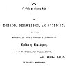

  
[Intangible Textual Heritage](../../../index) 
[Legends/Sagas](../../index)  [Celtic](../index)  [Barddas](../bim) 
[Index](index)  [Next](bim1001) 

------------------------------------------------------------------------

[Buy this Book at
Amazon.com](https://www.amazon.com/exec/obidos/ASIN/1578633079/internetsacredte)

------------------------------------------------------------------------

  
*The Barddas of Iolo Morganwg, Vol. I.*, ed. by J. Williams Ab Ithel,
\[1862\], at Intangible Textual Heritage

------------------------------------------------------------------------

p. title

 

##### Y GWIR YN ERBYN Y BYD.

# BARDDAS;

###### OR, A COLLECTION OF ORIGINAL DOCUMENTS, ILLUSTRATIVE OF THE THEOLOGY, WISDOM, AND USAGES OF

### The Bardo-Druidic System

###### OF THE ISLE OF BRITAIN.

###### WITH

#### TRANSLATIONS AND NOTES.

###### BY

## THE REV. J. WILLIAMS AB ITHEL, M. A.,

###### RECTOR OF LLANYMOWDDWY, MERIONETHSHIRE;

###### AUTHOR OF "THE ECCLESIASTICAL ANTIQUITIES OF THE CYMRY." &c., &c.

###### PUBLISHED FOR

#### The Welsh Mss. Society

#### VOL. I.

#### LLANDOVERY:

#### PUBLISHED BY D. J. RODERIC; LONDON: LONG IAN & CO.

#### MDCCCLXII.

\[1862\]

**NOTICE OF ATTRIBUTION**  
Scanned at Intangible Textual Heritage, November 2005. Proofed and
edited by John Bruno Hare. This text is in the public domain in the
United States because it was published prior to January 1st, 1923; since
the author died in 1826, it is also in the public domain worldwide.
These files may be used for any non-commercial purpose, provided this
notice of attribution is left intact in all copies

  [  
Click to enlarge](img/title.jpg)  
Title Page  

p. verso

 

##### Y GWIR YN ERBYN Y BYD.

I’R

BEIRDD, DERWYDDON, AC OFYDDION,

Y CYFLWYNIR

Y CASGLIAD HWN O WYBODAU A DEFODAU

Barddas yr Hen Cymry

GAN EU FFYDDLAWN WASANAETHWR,

AB ITHEL, B. B. D.

YN ENW DUW A PHOB DAIONI.

 
[  
Click to enlarge](img/verso.jpg)  
Verso  

------------------------------------------------------------------------

[Next: Welsh Manuscript Society](bim1001)
