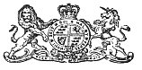

  
[Intangible Textual Heritage](../../../index.md) 
[Legends/Sagas](../../index)  [Celtic](../index)  [Barddas](../bim.md) 
[Index](index)  [Previous](bim1000)  [Next](bim1002.md) 

------------------------------------------------------------------------

[Buy this Book at
Amazon.com](https://www.amazon.com/exec/obidos/ASIN/1578633079/internetsacredte.md)

------------------------------------------------------------------------

  
*The Barddas of Iolo Morganwg, Vol. I.*, ed. by J. Williams Ab Ithel,
\[1862\], at Intangible Textual Heritage

------------------------------------------------------------------------

p. vii

"OES Y BYD I’R IAITH GYMRAEG."

 

**Patroness**,

HER MOST GRACIOUS MAJESTY QUEEN VICTORIA.

**Patronized also by**

HIS IMPERIAL MAJESTY THE EMPEROR OF RUSSIA,

AND

HIS IMPERIAL HIGHNESS THE PRINCE LOUIS LUCIEN BONAPARTE.

**President**,

THE RIGHT HONOURABLE THE EARL OF POWIS.

**Vice-presidents**,

His Grace The DUKE OF BEAUFORT, K.G.

His Grace The DUKE OF NEWCASTLE, K.G.

His Grace the DUKE OF SUTHERLAND, K.G.

The Most Noble The MARQUESS OF LANSDOWNE, K.G.

The Most Noble The MARQUESS OF CAMDEN, K.G.

The Right Honourable The EARL OF SHAFTESBURY

The Right Honourable The EARL OF DUNRAVEN

The Right Honourable The EARL OF CAERNARVON

The Right Honourable The EARL OF CAWDOR, F.R.S.

The Right Honourable VISCOUNT EVERSLEY

The Right Honourable VISCOUNT FEILDING

The Right Reverend The LORD BISHOP OF ST. DAVID'S

The Right Reverend The LORD BISHOP OF ST. ASAPH

The Right Reverend The LORD BISHOP OF LLANDAFF

The Right Reverend The LORD BISHOP OF BANGOR

The Right Honourable LORD DYNEVOR

The Right Honourable LORD CARBERY

The Right Honourable LORD MOSTYN

The Right Honourable LORD LLANOVER

The Honourable T. LL. MOSTYN, M.P.

The Right Honourable CONSEILLER JOUKOVSKY

SIR WATKIN WILLIAMS WYNN, Bart. M.P. Wynnstay

SIR STEPHEN GLYNNE, Bart. Hawarden Castle, Flintshire

SIR EDWARD BULWER LYTTON, Bart. M.P. Knebworth, Hertfordshire

SIR THOMAS PHILLIPPS, Bart., F.R.S., F.S.A. &c., Middle Hill

SIR HUGH WILLIAMS, Bart., Bodelwyddan

BERIAH BOTFIELD, Esq. M.P., F.R.S., F.S.A., &c., Norton Hall

WILLIAM ORMSBY GORE, Esq. M.P. Porkington

OCTAVIUS MORGAN, Esq. M.P.. F.R.S., F.G.S. Friars, Newport

W. W. E. WYNNE, Esq. M.P. Peniarth, Merionethshire

SIR GARDINER WILKINSON, F.R.S., D.C.L.

W. A. WILLIAMS, Esq. of Llangibby Castle, Monmouthshire

 

His Excellency MONS. VAN DER WEYER, Belgian Minister

His Excellency BARON BENTINCK, Netherlands Minister

p. viii

**Committee**,

The Right Honourable Lord Llanover, Chairman

Octavius Morgan, Esq. M.P., F.R.S., F.G.S., Friars, Newport

J. Bruce Pryce, of Dyffryn, Esq. Cardiff, Glamorgan

J. Arthur Herbert, of Llanarth, Esq.

The Rev. Illtyd Nicholl, M.A. of Ham, Cowbridge, Glamorgan

**Editors, Translators, and Collators of Manuscripts**,

The Rev. J. Williams Ab Ithel, M.A. Rector of Llanymowddwy\*

The Rev. E. Owen Phillips, M.A., Vicar of Aberystwyth\*

The Rev. Hugh Williams, M.A. Chancellor of Llandaff\*

John Pughe, Esq. F.R.C.S. Penhelyg, Aberdovey

William Rees, Esq. of Tonn, Llandovery\*

Those marked thus\* are also Members of the Committee.

 

**Corresponding Members**,

WALES.

The Right Hon. Lady Llanover, (*Gwenynen Gwent*) Llanover, Abergavenny

Lady Charlotte Schreiber, Dowlais, Glamorganshire

George Grant Francis, Esq. F.S.A. Cae’r Baily, Swansea

Major Herbert, Llansanffraed, near Abergavenny

Rev. Dr. James, (Dewi o Ddyfed,) of Pantêg, Monmouthshire

Arthur James Johnes, of Garthmyl, Esq. Judge of Local Courts, North
Wales

John Johnes, Esq., Dolaucothy, Caermarthenshire

Rev. T. Jones, M.A. Llanengan, Caernarvonshire

The Very Rev. Dr. Lewellin, Dean of St. David's, & Principal of St.
D.C.L.

Thomas Wakeman, Esq., The Graig, near Monmouth

W. W. E. Wynne, Esq. M.P. Peniarth, Merionethshire

Rev. Sir Charles Salusbury, of Llanwern, Bart.

Miss Williams, of Ynyslâs, Glamorgan, South Wales

Miss Jane Williams, of Ynyslâs, Glamorgan, South Wales.

 

ENGLAND, &c.

Rev. A. B. Clough, B.D., F S.A., &c. Braunston, Northampton

Rev. Robert Jones, M.A. All Saints Rectory, Rotherhithe, London

Rev. R. H. Lloyd, M.A. of Owersby, Lincolnshire

J. Whitefoord Mackenzie, Esq. F.R.S., F.S.A. &c.

Edinburgh Sir Thomas Phillipps, Bart. F.R.S. Middle Hill, Worcestershire

The Lady Charlotte Schreiber, Roehampton, Middlesex

**Secretary**,

Mr. William Griffith, 4, Sidmouth Place, Gray's Inn Road, London.

HONORARY FOREIGN SECRETARY FOR GERMANY.--Mr. J. G. Sanerwein, Asiatic
Society's Office, London.

HONORARY FOREIGN SECRETARY FOR FRANCE.--Monsr. Rio, Paris.

**Treasurers**,

Messrs. Bailey, Gratrex & Co., Bankers, Abergavenny.

**Publisher**,

Mr. D. J. Roderic, Llandovery, South Wales.

p. ix

### The Welsh Mss. Society,

HAS been formed for the purpose of transcribing and printing the more
important of the numerous Bardic and Historical Remains of Wales, still
extant in the Principality, and other parts of the world, that have
hitherto been allowed to continue in a state of obscurity, without any
effective measures being adopted to lay their contents before the
public, and secure them from the various accidents to which they are
liable. In addition to the general decay which, from their perishable
nature, these venerable relics have been for ages undergoing, whole
collections have, within a short space of time, been destroyed by fire;
and of those MSS. dispersed throughout the country, numbers known to
have existed a few years ago, are now no where to be found.

Besides the interest which these ancient documents possess, as objects
of antiquarian curiosity, and as contributing to the elucidation of
British History, they have a claim to attention of a far more general
character, as being intimately connected with the origin and progress of
modern European Literature; for it is among the legends and traditions
of the Welsh that many of the materials are to be found, which supplied
the nations of the Continent with their earliest subjects of
composition, and produced those highly imaginative works that continue
to exercise so powerful an influence to the present day.

A great mass of Historical information, relating to the thirteenth,
fourteenth, and fifteenth centuries, is contained in the unpublished
Poetry of Wales; from which an intimate acquaintance with the state of
society during those periods may be obtained; the Welsh Bards being the
Chroniclers of the times in which they lived, and their Poems chiefly
addressed to the leading men of the day. Besides Poetry, there is still
existing unpublished a large collection of Prose, both Historical and
Legendary; persons of affluence are therefore solicited to contribute
larger Donations and Subscriptions, than are required by the Rules of
the Society, in order to enable the Committee to proceed with greater
rapidity in carrying on the publication of Manuscripts.

The first Work that was published by this Society, was the LIBER
LANDAVENSIS, or LLYFR TEILO, comprising nearly 700 Royal 8vo. pages;
gratuitously edited and translated by the late Rev. W. J. Rees, M.A.,
F.S.A. &c. Of this Work only a few Copies remain to be sold to persons
becoming Members of the Society at £1 2s. 0d.--Non-members, £2 2s. 0d.

The second Work of the Society consisted of a MISCELLANEOUS SELECTION OF
ANCIENT WELSH MSS. in prose and poetry, from the originals collected by
the late Edward Williams, (*Iolo Morganwg*) for the purpose of forming a
continuation of the Myvyrian Archaiology, and afterwards proposed to be
used as materials for a New History of Wales. Edited with Notes and
Translations, by his son, the late TALIESIN AB IOLO, of Merthyr Tydvil.
This work is of the same size and price as the Liber Landavensis, and a
few copies remain still in the hands of the Publisher.

The third Work, The HERALDIC VISITATIONS OF WALES AND ITS MARCHES, Temp.
Elizabeth, and James I. in two Imperial 4to. Volumes was printed under
the gratuitous and able superintendence of its Editor, the late SIR
SAMUEL RUSH MEYRICK, K.H., LL.\])., F.S A, &c., of this Work only 240
copies were published which were all engaged by Subscribers; it is
therefore out of print and has become extremely scarce.

The LIVES OF CAMBRO BRITISH SAINTS, was next published, from Ancient
Welsh and Latin MSS. in the British Museum and elsewhere, comprising 680
pages Royal 8vo., and was gratuitously edited and translated by the late
Rev. W. J. REES, M.A., F.S.A., &c. Some copies of this Work are still to
be had of the Publisher, price £1 1s. 0d. to persons becoming Members of
the Society,--Non-members, £2 2s. 0d.

The ANCIENT WELSH GRAMMAR made by EDEYRN DAFOD AUR, by the command of
Llywelyn ap Gruffydd, (prince of Wales from 1254 to 1282,) Rhys Vychan
lord of Dynevor and Ystrad Towy; and Morgan Vychan, lord paramount of
Morganwg,--together with Y PUM LLYFR KERDDWRIAETH, Or Rules of Welsh
Prosody, by Simwnt Vychan, in the 15th Century. Edited with Translations
and Notes, by the Rev. John Williams Ab Ithel, M.A. A few

p. x

copies only remain on hand, to be sold at £1 1s. 0d. each,--Non-members,
£2 2s. 0d.

The MEDDYGON MYDDFAI, or a Compendium of the Medical Practice of the
celebrated Rhiwallon and his Sons, Cadwgan, Gruffydd, and Einion, of
Myddvai, in Caermarthenshire, Physicians to Rhys Gryg, lord of Dynevor
and Ystrad Towy, son of Gruffydd ap Rhys, the last Prince of South
Wales, about the year 1230; from Ancient MSS. in the Library of Jesus
College, Oxford, Llanover, and Tonn; accompanied by an English
Translation, To the whole is annexed the curious Legend of THE LADY OF
THE LAKE, called LLYN-Y-FAN, from whom the above Physicians were said to
be descended, and a copious Herbal; Edited by the Rev. J. Williams ab
Ithel, M.A., Rector of Llanymowddwy; Translated by John Pughe, Esq.,
F.R.C.S., Penhelyg, Aberdovey. Price £1 1s. 0d.

*To be ready early in* 1863, *the Second Volume of* 

BARDDAS; OR BARDISM, a Collection of Original Documents, illustrative of
the Theology, Discipline and Usages, of the Bardo-Druidic System of the
Isle of Britain, with Translations and Notes, by the Rev. J. Williams Ab
Ithel, M.A., Rector of Llanymowddwy.

  The curious matter
brought to light for the first time in this Work, cannot fail to attract
the particular attention of scholars, and to open a new and interesting
era in the History of Welsh Literature.

  *It is intended
henceforward to bring out a Volume of about 400 pages every Twelve
Months, to be supplied to Members of the Society only, free of all
expense. Those Works already published, and not out of print, can be had
by payment of the additional price affixed to each*.

RECOMMENDED FOR PUBLICATION.

The inedited matter of the LLYFR COCH O HERGEST, in the Library of Jesus
College, Oxford.

ANCIENT RECORDS, Temp. Edward III. belonging to the Manor Court of
Ruthin.

WELSH CHARTERS.

Y DAROGANAU, or VATICINATIONS of the middle ages.

A complete and correct edition of the BARDS of the 6th and 7th
centuries.

Y DIARHEBION CYMREIG, or WELSH PROVERBS.

The HISTORICAL TRIADS.

The Life of GRUFFUDD AB CYNAN.

The GREAL; in the Hengwrt Collection.

### Rules of the Society

I. That the objects of the Society shall be to procure copies of any
interesting Manuscripts relating to Wales and the Marches thereof, and
to publish them with English Translations and Notes.

II\. That Subscribers of at least One Guinea annually, become members of
the Society.

III\. That all Subscriptions being considered due for the ensuing year,
notice must be sent to the Secretary, before the 1st of January, of any
Member's intention to withdraw his name.

IV\. That the Society's Publications are to appear yearly in parts or
volumes, to be delivered free to Subscribers not in arrear with the
subscriptions.

V. That there shall be only a limited number of copies printed of each
Work beyond the number of Subscribers, which copies the Committee are
empowered to dispose of to persons becoming annual subscribers.

VI\. That the management of the affairs of the Society be vested in the
Chairman and Committee, and that the funds of the Society be disbursed
in payment of the necessary expenses incident to the production of the
Works of the Society, and that the accompts of the receipts and
expenditure be audited annually by two Members.

  Subscribers' Names,
Donations and Annual Subscriptions are requested to be forwarded to the
Secretary, Mr. Griffith, 4, Sidmouth Place, Gray's Inn Road, London.

------------------------------------------------------------------------

[Next: Advertisement](bim1002.md)
