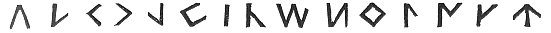
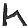
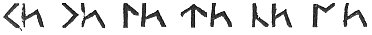
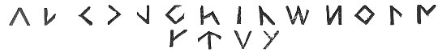
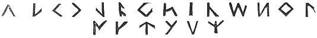
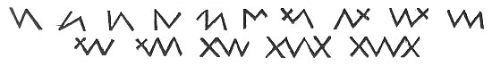

  
[Intangible Textual Heritage](../../../index.md) 
[Legends/Sagas](../../index)  [Celtic](../index)  [Barddas](../bim.md) 
[Index](index)  [Previous](bim1036)  [Next](bim1038.md) 

------------------------------------------------------------------------

[Buy this Book at
Amazon.com](https://www.amazon.com/exec/obidos/ASIN/1578633079/internetsacredte.md)

------------------------------------------------------------------------

  
*The Barddas of Iolo Morganwg, Vol. I.*, ed. by J. Williams Ab Ithel,
\[1862\], at Intangible Textual Heritage

------------------------------------------------------------------------

### THE PRIMARY LETTERS.--NAMES OF THE COELBRENS.

Here are the primaries,--

 

which were fifteen. After that 
 was made, and therewith 
. After that 
 and  ,
and then the letters were eighteen, thus,

 

being eighteen. After that, twenty; thus,--

 

being twenty.

And thus the Coelbren continued until the time when the Latin was lost
in the country, so that only book students and scholars knew it. Then,
with the view of shortening the work on wood, and of softening the
Cymraeg, secondary letters were invented, such as are now in the
Coelbren of the Bards.

The ancient extraordinary character of the Coelbren of the Bards, or
mystic letters, which, it is said, were the first known, was thus,--

 

Another,

p. 72 p. 73

 

and so with as many as one likes. Wherefore it is said, that with one
letter, by modifying it as occasion required, the Bards of the Isle of
Britain wrote whatever they liked in secret and mystery.

From what has been exhibited are seen the modes of the Coelbrens, as
they have been in various ages and times; they have also borne the names
of those who taught them; thus,

1\. The old Coelbren, called also the primitive Coelbren, which was
known to the Cymry before strange nations arrived in the island of
Britain.

2\. The Coelbren of eighteen, which is called the Coelbren of Taliesin,
or the one of Talhaiarn.

3\. The Coelbren of twenty, which is called that of Ithel the
Tawny. [1](#fn_103.md)

4\. The Coelbren of twenty-four, which is called that of Howel the Good.

5\. The Long Coelbren, which is of three or four ways and modes.

6\. The Coelbren of Ystudvach; [2](#fn_104.md) and
the Coelbren of Iorwerth the Gray-haired, [3](#fn_105.md) &c.

7\. The Coelbren of the Monks, after divers modes.

------------------------------------------------------------------------

### Footnotes

[73:1](bim1037.htm#fr_104.md) p. 72 This could hardly have been the same as Ithel
the Tawny, son of Llywelyn of the Golden Torque, in the middle of the
12th century. The number of his alphabet, being less than that of Howel
the Good, who died A.D. 948, would require that he should have
flourished before the latter date.

[73:2](bim1037.htm#fr_105.md) Ystudvach was a Bard
who flourished in the early part of the fifth century.

[73:3](bim1037.htm#fr_106.md) p. 73 Iorwerth Vynglwyd, or the Gray-haired, was an
eminent Poet, who was a disciple of the Glamorgan Gorsedd in 1460, and
presided there in 1500.

------------------------------------------------------------------------

[Next: Classification of the Letters](bim1038.md)
