  
[Intangible Textual Heritage](../../../index) 
[Legends/Sagas](../../index)  [Celtic](../index)  [Barddas](../bim) 
[Index](index)  [Previous](bim1037)  [Next](bim1039) 

------------------------------------------------------------------------

[Buy this Book at
Amazon.com](https://www.amazon.com/exec/obidos/ASIN/1578633079/internetsacredte)

------------------------------------------------------------------------

  
*The Barddas of Iolo Morganwg, Vol. I.*, ed. by J. Williams Ab Ithel,
\[1862\], at Intangible Textual Heritage

------------------------------------------------------------------------

### CLASSIFICATION OF THE LETTERS.

 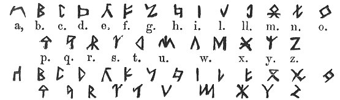

The above Alphabets are from Llywelyn Sion. [\*](#fn_106)

 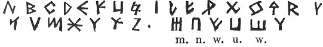

p. 74 p. 75

Abcedilros; so were called the ten primary letters, because they are put
in one word of four syllables, being arranged according to the word,
thus,

A. B. C. E. D. I. L. R. O. S.

After that M and N were invented, and thence there were twelve letters,
which were called Mabcednilros, the letters being thus arranged--

M. A. B. C. E. D. N. I. L. R. O. S.

making twelve letters. After that four other letters were devised,
namely, G. T. P. F. And then there was a new arrangement of the letters;
all that were partially co-vocal being placed next to each other, as if
of one family in respect of sound. That is to say, firstly, the simple
ones, namely,

<table data-border="0">
<colgroup>
<col style="width: 100%" />
</colgroup>
<tbody>
<tr class="odd">
<td data-valign="top">
A. E. I. O.

Then the labials, namely, M. B. P. F.

Then the dentals, namely, D. T. N.

Then the palatals, G. C.

Then the non congeners, namely, L. R. S.
</td>
</tr>
</tbody>
</table>

And thus were they arranged,--

A. E. I. O. B. M. P. F. D. T. N. G. C. L. R. S.

and were called after their primitive name Abcedilros, though the
authentic letters might, in respect of kind and number, be more than
what are found in the special word.

After that, two other letters were devised, namely   or
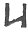, and  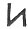
or  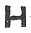, then there were
eighteen letters. After that, two others, which made twenty, namely,
  and  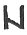. After that, four other
letters, namely,  .  . 
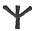; [1](#fn_107) which were
arranged on the Coelbren according to their families in respect of sound
and vocalness, and mutual relation. After that secondary letters were
devised, which are  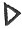.
 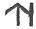.  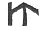. 
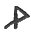, &c., as far as thirty-eight. Still their old

p. 76

p. 77

designation is retained, which is, Abcedilros. An old Book calls them,
Abcednilroswm.

------------------------------------------------------------------------

### Footnotes

[73:\*](bim1038.htm#fr_107) p. 72 This statement is made by the copyist, Iolo
Morganwg.

[75:1](bim1038.htm#fr_108) p. 74 A letter, probably either  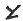 or  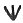, ought to be supplied here, in
order to make up the number four, if that, and not three, was really
intended.

------------------------------------------------------------------------

[Next: The Bardic Secret.--Formation of Letters](bim1039)
