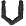

  
[Intangible Textual Heritage](../../../index) 
[Legends/Sagas](../../index)  [Celtic](../index)  [Barddas](../bim) 
[Index](index)  [Previous](bim1039)  [Next](bim1041) 

------------------------------------------------------------------------

[Buy this Book at
Amazon.com](https://www.amazon.com/exec/obidos/ASIN/1578633079/internetsacredte)

------------------------------------------------------------------------

  
*The Barddas of Iolo Morganwg, Vol. I.*, ed. by J. Williams Ab Ithel,
\[1862\], at Intangible Textual Heritage

------------------------------------------------------------------------

### THE VOWELS.

There are eight vowels or sounds,

A. E. I. O. U. W. Y. Y, (wy,) so called because it is the mutate of W.

p. 78 p. 79

  ( )

 ; and after that, thus,

 , which continued mostly

in use by the Bards and Teachers, until the time of Addav, son of
Davydd, of Gilvai, called in some books Adam Davi, [1](bim1041.htm#fn_109) who introduced five long
vowels into the Abcedilros, namely, 
; and, asserting that there was no occasion for  , he abolished it, and
appointed twelve vowels. Nevertheless, it was not that Addav who devised
these five, for they had been long retained in memory, even for upwards
of three hundred years; but they had no authority of Chair and Gorsedd.
It was this authoritative privilege that was bestowed upon them in the
time of the said Addav, who also restored to memory much of the
primitive learning. His books were warranted by the authority of ancient
memorial and art.

Thus, according to others,

 , which is called the New
Coelbren.

------------------------------------------------------------------------

[Next: The Primary Letters](bim1041)
