  
[Intangible Textual Heritage](../../../index) 
[Legends/Sagas](../../index)  [Celtic](../index)  [Barddas](../bim) 
[Index](index)  [Previous](bim1040)  [Next](bim1042) 

------------------------------------------------------------------------

[Buy this Book at
Amazon.com](https://www.amazon.com/exec/obidos/ASIN/1578633079/internetsacredte)

------------------------------------------------------------------------

  
*The Barddas of Iolo Morganwg, Vol. I.*, ed. by J. Williams Ab Ithel,
\[1862\], at Intangible Textual Heritage

------------------------------------------------------------------------

### THE PRIMARY LETTERS.

Sixteen principal letters have been from the beginning; namely,  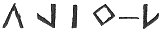, (others say,  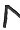,) 
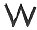 (or  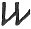)
 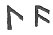 (or  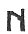) 
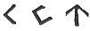 ( 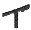)
 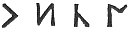 ( 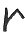) 
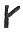 ( .)

And in respect of others, letters were doubled, trebled, or quadrupled;
as man, ei mman, maan, maab, gwen, gween, rhen, byr, myyr, llyyr, tor,
moor, crwn, crwwn,

p. 80 p. 81

baad, ei bbaad, dyydd, ei ddydd, fy 
 dddydd, &c. (Llywelyn Sion.)

Whence the doubling of d and dd, and l and ll, still retained.   n for d;  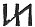 m for b.

Variations.

 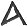 for  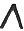--
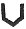 for  
or  --  for  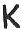--
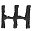 for 
,--  for
 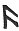-- 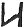 for  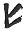--
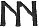 for 
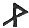.-- 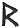 for
 -- 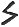 for  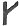--
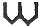 for 
-- 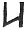 for
 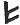.

 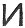  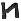 secretary, whence  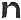--
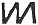 secretary from 
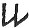. [\*](#fn_110)

These are the ten principal letters, which Einigan the Giant made,

A. P. C. E. T. I. L. R. O. S. [1](#fn_111)

That is to say, they are the ten powers of sound produced by the ten
organs of speech. Others call them the ten organs of speech; and so also
are the ten principal letters named.

------------------------------------------------------------------------

### Footnotes

[79:1](bim1040.htm#fr_110) p. 78 Adam Davie, an old English Minstrel or Poet
floruit Anno 1312.--Percy's Essay, p. 101. He was probably the same as
Addav Eurych, who was also called Addav ap Davydd, and wrote in English
as well as in Welsh. His son, p. 79 Gruffydd
ap Addaf ap Davydd, was the friend of Davydd ap Gwilym; and was murdered
at Dolgelley.

[81:\*](bim1041.htm#fr_111) These English
observations are, no doubt, those of the copyist, Iolo Morganwg.

[81:1](bim1041.htm#fr_112) We have placed the
vowels E and O in the positions which they ought to occupy so as to form
the word Apcetilros.

------------------------------------------------------------------------

[Next: Variations of Letters](bim1042)
