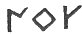
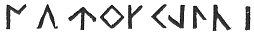

  
[Intangible Textual Heritage](../../../index.md) 
[Legends/Sagas](../../index)  [Celtic](../index)  [Barddas](../bim.md) 
[Index](index)  [Previous](bim1043)  [Next](bim1045.md) 

------------------------------------------------------------------------

[Buy this Book at
Amazon.com](https://www.amazon.com/exec/obidos/ASIN/1578633079/internetsacredte.md)

------------------------------------------------------------------------

  
*The Barddas of Iolo Morganwg, Vol. I.*, ed. by J. Williams Ab Ithel,
\[1862\], at Intangible Textual Heritage

------------------------------------------------------------------------

p. 82 p. 83

### INTRODUCTION OF LETTERS.--ORIGINAL COUNTRY OF THE CYMRY.--THEIR ARRIVAL IN BRITAIN.--AUGMENTATION OF THE ALPHABET.

At length here is an account of symbols and speech, namely, letters and
signs, according to their preservation by means of the memory, voice,
and usages of the Chair and Gorsedd of the Bards of Glamorgan and Gwent
in Tir Iarll, [1](#fn_112.md) and previously at
Caerleon-upon-Usk, since the first arrival of the Cymry in this island.
They say that three privileged arts were introduced by the Cymry tinder
the protection and guidance of Hu the Mighty [2](#fn_113.md) into this island; namely, Bardism,
Literature, and Agriculture; that is, they were brought from Asia, as it
is now called. Deffrobani, [3](#fn_114.md)
however, or the Summer Country, was the first name of the primitive
country of the nation of the Cymry, in which country were large and rich
kingdoms without number. An usurping nation drove the Cymry out of their
country into countries where for upwards of two hundred years they were
roving from land to land under the oppression of devastative and
predatory nations, until at last they landed in Scandinavia and the
highlands of Italy, and the region of Gaul. It was from Scandinavia that
they first came into the island \[of Britain,\] having landed at the
river Humber. [4](#fn_115.md) After that other
clans of Cymry came from the land of Gaul into this island, landing at
the fords of Pwyth Meinlas, [5](#fn_116.md) but
the usurping nation of the Coranians [6](#fn_117.md) drove

p. 84

p. 85

them to the South, whilst the Irish Picts drove the Cymry of the land of
Deivr and Bernicia, who were derived from the Cymry of Scandinavia, to
Venedotia; after that, the Irish of Ireland oppressed them in Mona and
Arvon. Ten from the beginning was the number of the symbols of the
Coelbren, and they were called Abcedilroes and Abcedilros, as they are
called at present, that is, 
   and
 . Subsequently, in the
time of Prydain \[son of \] Aedd the Great, others were added until they
were sixteen symbols, and they continued of that number until the coming
of Christ in the flesh; then eighteen, and after that twenty, or, as
others say, twenty-one symbols primarily as at present, whilst others
were invented as auxiliaries, in number as far as thirty-eight.

------------------------------------------------------------------------

### Footnotes

[83:1](bim1044.htm#fr_113.md) p. 82 "Cai Hir, nephew of the emperor Arthur, lord
of the Comot of Maes Mawr in Glamorgan, was the first who appointed a
Chair of Vocal Song in Tir Iarll, which was anciently called the Comot
of Maes Mawr, whither it had been re-moved from Caerleon upon Usk, on
account of the surrounding incursions of the Saxons. It was still called
there the Chair of Caerleon. In the time of the contests between Rhys,
son of Tewdwr, and Iestyn, son of Gwrgant, the Chair was disturbed,
until the time of William, earl of Gloucester, who renewed it in Tir
Iarll, (the earl's land,) for such, after his appellation, was the new
name bestowed upon the Comot of Maes Mawr, and gave privilege and
license to Bards."--Anthony Powell.

[83:2](bim1044.htm#fr_114.md) Geraint, the Blue
Bard, has recorded a tradition respecting some of the services which Hu
the Mighty showed to the Cymry, preparatory to their journey from
Deffrobani:--

Goruc Hugadarn gymmhrain  
Ar Gymry Ynys Prydain  
I ddyffryd o ddeffro Bain.

The achievement of Hu the Mighty, was forming social order  
For the Cymry of the Isle of Britain,  
To stream out of Deffrobani.--Iolo MSS. pp. 262, 669.

[83:3](bim1044.htm#fr_115.md) p. 83 Probably Taprobane, the island of Ceylon, is
meant; celebrated as having been the residence of Adam. The Historical
Triads, however, identify "the summer country" with that "in which
Constantinople now is." (Tr. 4. 56; Third Series.)

[83:4](bim1044.htm#fr_116.md) "They came across
the Hazy Sea to the island of Britain and Armorica where they remained."
(Tr. 4; Third Series.)

[83:5](bim1044.htm#fr_117.md) Anglice "the narrow
green point," where also the Romans are said to have landed under Julius
Cæsar. (Tr. 22; Second Series.)

[83:6](bim1044.htm#fr_118.md) The Coranians are
described as the first of "the three usurping hordes that came into the
Isle of Britain, and went not out of it," (Tr. 7; Third Series;) and as
having in course of time "coalesced with the Romans until they became
one people," and ultimately with the Saxons, "against the Cymry." (Tr.
15; ib.) They were evidently the same as the Coritani.

------------------------------------------------------------------------

[Next: Coelbren of the Bards, According to the Arrangement of
Llawdden](bim1045.md)
