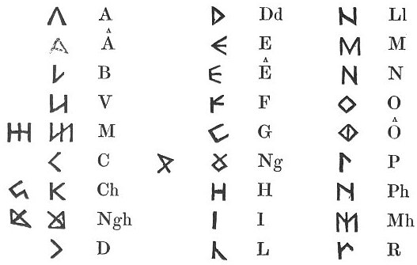
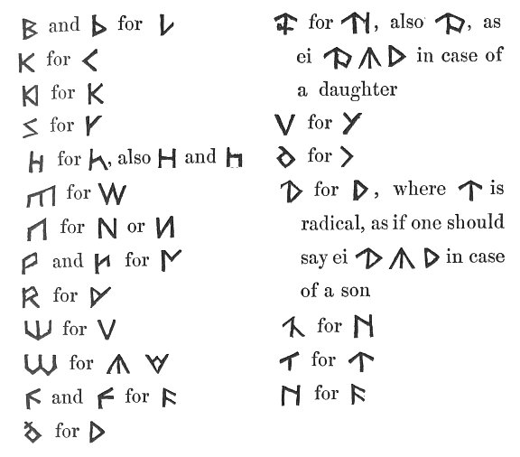

  
[Intangible Textual Heritage](../../../index.md) 
[Legends/Sagas](../../index)  [Celtic](../index)  [Barddas](../bim.md) 
[Index](index)  [Previous](bim1044)  [Next](bim1046.md) 

------------------------------------------------------------------------

[Buy this Book at
Amazon.com](https://www.amazon.com/exec/obidos/ASIN/1578633079/internetsacredte.md)

------------------------------------------------------------------------

  
*The Barddas of Iolo Morganwg, Vol. I.*, ed. by J. Williams Ab Ithel,
\[1862\], at Intangible Textual Heritage

------------------------------------------------------------------------

### COELBREN OF THE BARDS, ACCORDING TO THE ARRANGEMENT OF LLAWDDEN. [1](#fn_118.md)

 

p. 86 p. 87

 

Some have substituted

 

 

But the best of all is the old Coelbren, as Gwilym Tew [1](#fn_119.md) has arranged it in his Book of Vocal
Song, and the easiest to cut, and of least labour.

Some have placed   without
 , but that is an error,
for   has the weight of
 , and no more; therefore
it ought to be  , and not
 .

p. 88 p. 89

Here are other modifications of the Coelbren, which I have seen with
Meurig Davydd. [\*](#fn_120.md) [1](#fn_121.md)

 

 

------------------------------------------------------------------------

### Footnotes

[85:1](bim1045.htm#fr_119.md) p. 84 Llawdden, or Ieuan Llawdden, was a very
eminent Poet, who flourished from about 1440 to 1480. He was at one time
Rector of Machynlleth, but in his old age he retired to the place of his
nativity, the Vale of Llychwr, where he died, and was buried in the
Churchyard of Llandeilo Talybont. His elegy p.
85 was written by his contemporary, Iorwerth Vynglwyd, from which
we learn that he obtained the highest bardic honours.

[87:1](bim1045.htm#fr_120.md) p. 86 Gwilym Tew was a Poet who flourished from 1430
to 1470, and who presided at the Glamorgan Gorsedd in 1460.

[89:\*](bim1045.htm#fr_121.md) p. 88 Taliesin Williams says that this observation
is Llywelyn Sion's.

[89:1](bim1045.htm#fr_122.md) An eminent Poet of
Glamorgan, who presided in the Gorsedd Morganwg in the year 1560, and
died in 1600. Llywelyn Sion in the early part of his life was well
acquainted with him.

------------------------------------------------------------------------

[Next: The Symbols of Literary Sciences.--Improvement of the
Coelbren.--Metrical Canons.--Dissolution of the Monastery of Pen
Rhys](bim1046.md)
