  
[Intangible Textual Heritage](../../../index.md) 
[Legends/Sagas](../../index)  [Celtic](../index)  [Barddas](../bim.md) 
[Index](index)  [Previous](bim1048)  [Next](bim1050.md) 

------------------------------------------------------------------------

[Buy this Book at
Amazon.com](https://www.amazon.com/exec/obidos/ASIN/1578633079/internetsacredte.md)

------------------------------------------------------------------------

  
*The Barddas of Iolo Morganwg, Vol. I.*, ed. by J. Williams Ab Ithel,
\[1862\], at Intangible Textual Heritage

------------------------------------------------------------------------

### THE FIVE AGES OF LETTERS.

The five Ages of Letters. The first was the age of the three letters,
which above all represented the Name of God and goodness, and which were
a sign of goodness and truth, and understanding and equity, of
whatsoever kind they might be. Other things were exhibited under the
sign of blazonry in respect of the art of a herald-bard. This is the
mode in which they numbered ten according to the three letters, namely,
 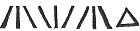,  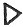 being put for ten, and after
that   for the second
tenth, that is, a hundred, and 
 for the third tenth, that is, a thousand, and  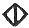 for the fourth tenth, that is,
a myriad, and for a million 
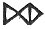, and for buna 
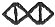, and so on to three 
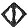, or four or more. According to this arrangement  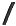 stood for A, that is, the
first letter,  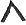 for B,
that is, the second,  ,
the third,  , the fourth,
 ,  , 
,  ,
 , and  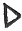, the tenth letter,  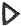, 
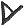 the twelfth. This is the first age.

 

In the second age sixteen letters were arranged, whence literature
became more clear. After that, In the third age there were eighteen
letters, for the improvement of literature; that is,  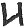 was put for the second

p. 96 p. 97

sound of B; and then the three letters of God's Name were made into
 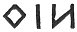; and the eighteenth
letter was  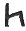, or,
according to another form, 
.

In the fourth age there were twenty-four letters; and the Name of God,
according to the arrangement of the third age, was a secret.

The fifth age was, as it is now, that is, there were thirty-eight
letters; and the Name of God, according to the arrangement of the third
age, was kept a secret.

------------------------------------------------------------------------

### Footnotes

[95:1](bim1048.htm#fr_129.md) p. 94 "Rhiaint was a name given to the sixteen
letters, and in the Ancient Secret the Birds of Rhianon:--one letter was
called Rhïan, plur. Rhieinau."--Iolo Morganwg, who refers to Llywelyn
Sion.

Hwn a bryn win o’r gwinwydd  
Hon fal *Rhianon* ai rhydd. p. 95

He will buy wine from the vines,  
She like *Rhianon* will give it.  
          Sion Brwynog, to Rhydderch ap Rhys  
                of Tregaian and his wife.

------------------------------------------------------------------------

[Next: The Three Symbols of Sciences](bim1050.md)
