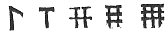

  
[Intangible Textual Heritage](../../../index) 
[Legends/Sagas](../../index)  [Celtic](../index)  [Barddas](../bim) 
[Index](index)  [Previous](bim1050)  [Next](bim1052) 

------------------------------------------------------------------------

[Buy this Book at
Amazon.com](https://www.amazon.com/exec/obidos/ASIN/1578633079/internetsacredte)

------------------------------------------------------------------------

  
*The Barddas of Iolo Morganwg, Vol. I.*, ed. by J. Williams Ab Ithel,
\[1862\], at Intangible Textual Heritage

------------------------------------------------------------------------

### THE THREE PRIMITIVE SYMBOLS.--THE THREE COELBREN SYMBOLS.

Here is the system of Symbols.

There have been three symbols remembered and preserved from the
beginning by the Bards and Sages of the nation of the Cymry; namely,

1\. The symbol of word [2](#fn_130) and speech,
that is, letter. It is from the symbols that a visible word is formed,
and from the words a visible language, and visible vocality.

2\. The symbol of harmony and tone, that is, the signs of the sound and
utterance of vocal song, and instrumental [3](#fn_131) song.

3\. The symbol of number and weight.

The symbols of number are exhibited under the signs of the ten vocal
characters of word and speech, that is, the ten characters of the
primitive letters, which are kept secret by the Bards of the nation of
the Cymry under the obligation of a vow, and may not be divulged to
other than a Bard under the sworn vow of life and death. Nevertheless,
for the purpose of instructing the common people, the sworn ten
characters are not the means, but the trite signs of number, such as are
in the memory and knowledge of a

p. 100 p. 101

civilized country and nation, and in unison with the sense of
civilization, and the three foundations of the sciences of learning, and
the three signs of a civilized and scholastic nation.

Here is a description of the symbols, as they are exhibited under the
trite signs of number in use by the civilized nations of Belief and
Baptism.

1 one, 2 two, 3 three, 4 four, 5 five, 6 six, 7 seven, 8 eight, 9 nine,
0 ten, and placing before the 0 the number which it has, thus, 10
one-ten, 20 two-tens, 30 three-tens, 40 four-tens, 50 five-tens, 60
six-tens, 70 seven-tens, 80 eight-tens, 90 nine-tens, 100 hundred. 11
one-ten and one, or ten and one, 12 one-ten and two, or ten and two, 13
one-ten and three, or ten and three, 14 one-ten and four, or ten and
four, 15 one-ten and five, or ten and five, 16 one-ten and six, or ten
and six, 17 one-ten and seven, or ten and seven, 18 one-ten and eight,
or ten and eight, 19 one-ten and nine, or ten and nine, 20 two-tens, 30
three-tens, 40 four-tens--and one, or two, and two-tens, &c., one being
added for every other plurality of tens as far as a hundred; 101 a
hundred and one,--a hundred and two, &c., or one and a hundred, two and
a hundred, &c., and so for every additional hundred; 101 a hundred and
one, 120 a hundred and two-tens, 125 a hundred and two-tens and five,
&c., and so for every additional hundred as far as a thousand; and so
for every additional thousand as far as a myriad, and for every
additional myriad as far as a million, and for every additional million;
and so on, in the same manner, as far as buna or mwnda; and on as far as
cattyrva; [1](#fn_132) and on as far as
rhiallu; [2](#fn_133) and from rhiallu to
manred; [3](#fn_134) and from manred

p. 102 p. 103

to cyvanred; [1](#fn_135) and from cyvanred to
ceugant, [2](#fn_136) which God only knows.

From the "Brith Cyvarwydd," compiled by Anthony Powell of Llwydarth in
Tir Iarll, about 1580.

In the Book of Llywelyn Sion thus;--

There are three series of Coelbren symbols, namely, the symbols of
language and speech, being twenty-four symbols; the symbols of music and
harmony, of which there are seven, namely, a, b, c, d, e, f, g; and they
are called the symbols of tone, and the tones of music; and the five
symbols of time, namely, 
, which signify the times of the tones. Where bare
tones are exhibited, the times are put over them, but where staves are
used, that is, the four staves of music, the times are represented on
the staves and intervening spaces.

------------------------------------------------------------------------

### Footnotes

[99:2](bim1051.htm#fr_131) Al. "of language."

[99:3](bim1051.htm#fr_132) Lit. "stringed."

[101:1](bim1051.htm#fr_133) p. 101 Cattyrva (cad-tyrva) means literally, the
crowd of battle.

[101:2](bim1051.htm#fr_134) Rhiallu,
(rhi-allu,) the power of a sovereign; army of a country.

[101:3](bim1051.htm#fr_135) Manred, (man-rhed,)
the elementary particles of creation.

[103:1](bim1051.htm#fr_136) p. 102 Cyvanred, (cyd-man-rhed,) an aggregate of
the elementary particles of creation.

[103:2](bim1051.htm#fr_137) Ceugant (cau-cant,)
an enclosing circle, being the term used by the Bards to denote the
infinite space which God alone traverses.

As these several terms were borrowed to represent particular figures in
the Numeration Table of the Bards, it would seem that at first they
respectively presented to the Bardic eye definite ideas of numbers, such
indeed as those which p. 103 were afterwards
attached to them. This view is supported by the fact that the Romans
considered their *caterva* as composed of a definite number of men,
namely, six thousand.

------------------------------------------------------------------------

[Next: Numbers](bim1052)
