  
[Intangible Textual Heritage](../../../index) 
[Legends/Sagas](../../index)  [Celtic](../index)  [Barddas](../bim) 
[Index](index)  [Previous](bim1062)  [Next](bim1064) 

------------------------------------------------------------------------

[Buy this Book at
Amazon.com](https://www.amazon.com/exec/obidos/ASIN/1578633079/internetsacredte)

------------------------------------------------------------------------

  
*The Barddas of Iolo Morganwg, Vol. I.*, ed. by J. Williams Ab Ithel,
\[1862\], at Intangible Textual Heritage

------------------------------------------------------------------------

p. 116 p. 117

### COELBREN OF THE BARDS.

The Bardic Coelbren, according to the book of Llywelyn Sion.

The primitive Cymry, and their poets, and book-wise men, were accustomed
to cut letters on wood, because in their time from the beginning there
was no knowledge either of paper or plagawd, and here is exhibited the
manner in which they constructed their books and the figure of the mode
and manner.

 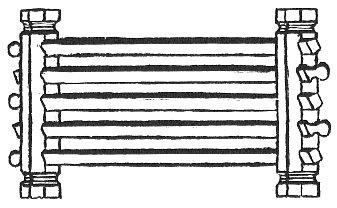

The first thing made was the pillwydd, [1](#fn_149) or the side posts, each post being in
two halves, thus,

 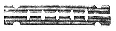

That is, there is a number of holes in the post, the halves of the holes
being in either half, and the other halves in the other, so that when
the two halves are put together, there will be a row of perfect holes in
a line from one end to the other, in the middle of the post, or
*pill*. [2](#fn_150) There will be also another
post of the same kind and size. After that, other staves, called
*ebillwydd*, [3](#fn_151) each of them thus,--

 

 

p. 118 p. 119

\[paragraph continues\] At one end and the
other let a neck be formed, as is delineated here, and let a closed and
tied pill be placed round the necks of as many ebillwydd as may be
required, at both ends. And thus let them be joined together, pillwydd
and ebillion, [1](#fn_152) in the form of a
hurdle; the ebillion, each one of them, turning all round by their necks
in the pillwydd, or posts. On the ebillion the letters are cut with an
efficient knife, that is, on each of the four sides of every ebill; and
when one side has been read, the second side is turned upwards, after
that the third side, and after that the fourth side, each side being
read as it is turned upwards.

The corners, along each of the ebillion as far as the necks, must be
trimmed down, that the cutting of a letter on one face may not become
one with, or break into the letters of the other face, and so with every
one of the four faces.

There is another mode of constructing the Coelbren of the Bards, namely,
by making the pillwydd, or the posts, entire, instead of their being in
halves, having a row of holes along the middle, bored with a fire auger;
the ebillion being pivotted at either end, and placed as to their pivots
in the pillwydd. The two ends of each of the pillwydd likewise should be
pivotted, the pivots passing into the holes of cross pillwydd, or
transverse staves, made after this manner,--

 

each hole tightly encircling the pivot of the post; and thus are the
whole firmly tied together, and conjoined, in the form of a hurdle.
Bearing in mind the facility of turning and re-turning in respect of
each one of the ebillion, the ends of the ebillion will be the length of
a thumb's joint through the posts, one end being a turning hilt, the
other a place on which to cut the numerical mark of the ebill. The
pivots of the posts will also be of the same length through the holes of
the cross pillwydd, which connect them together;

p. 120 p. 121

they will be somewhat necked too, and each neck will be tied with waxed
thread or string, that the pivots of the pillwydd might not drop out of
the hole. The neck should be tied until it be thicker than the pivot in
the hole; and the pivots of each post should be quite tight in their
holes, lest it might drop or shake. The connecting pillwydd are called
*troslathau*, [1](#fn_153) and the pillwydd
also are called *cyffon hydlath* or *hydladd*, [2](#fn_154) their pivots passing into the transverse
posts. Let the place of the string on each of the pivots of the
longitudinal pillwydd be rounded, and let them be tied against the
transverse staves, so that they do not become loose, or shaky. This mode
is firm and steady, and in that respect better than the one which
employs posts in two halves, though it is not as easy to undo and put
together the frame which is made with an entire pill, as the one with a
divided pill.

There is another method of connecting the longitudinal and transverse
posts, that is, by cutting a semi-notch on each end of the longitudinal,
and the like on each end of the transverse stave, thus,

 

the notch in each reaching to the middle of the stick, and putting the
notches of the transverse posts tightly in those of the longitudinal
ones, and tying the conjoined notches across firmly with a waxed line,
or the string of harp or violin. This method is fair and firm.

Others make ebillion, and make a narrow hole with a fire auger at each
end of the ebillion, and place them by those holes on a strong line or
string; which some people consider the best way of all, because the
ebillion may be rolled up in a bundle, and tied by the serial line. It
is also, done in this way, easiest to carry with one, because it need
not be unfastened in order to be bundled up. There must be a strong knot
at each end of the string, that it might not slip through the holes of
the ebillion, and there ought to be

p. 122 p. 123

sufficient length in the string, that the ebillion might be shifted and
turned so as to be easy to read, and that the string might be long
enough to tie the Peithynen [1](#fn_155) in one
round bundle, where there is need and occasion. Nevertheless, this is
the most difficult way for reading it, though it is the easiest of all
ways for undoing it and putting it together.

It is easier to undo and re-set that which is framed together by means
of halved pillwydd, than the one which is framed by means of whole
pillwydd; nevertheless it is in-firm and unsteady.

It is more difficult to undo and re-set that which is framed in entire
posts, but that is the strongest, though it is the heaviest to carry
with one; it is also the best when persons write with ink on wide
ebillion.

Some people make use of broad, thin, smooth ebillwydd, and form letters
with ink by means of square pencils on the ebillwydd, having made string
holes through them, that the ebillwydd might run together or apart on
the string, as occasion required.

Another usage and mode in respect of wide ebillwydd is to make them oval
at the transverse section,

 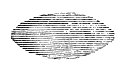

and to render the margins thin, not leaving the thickness of the edge
more than about the thickness of a noble, or very little more. This
lightens it, but the drawing together is less compact, because the
ebillwydd will not lie firmly one on the other.

p. 124 p. 125

A few persons make use of ebillwydd of double thickness, that is, they
modify them, so that there may be two thicknesses or two lines of
inscribed letters on every face of the transverse section, thus,--

 

and along the middle of every face a groove twice the width of the
letter engraving; or thus,--

 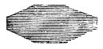

which is an excellent, ingenious way, troublesome to make, but better to
read, than the one with the four-sided ebillwydd. And when the writing
is done with ink, and not with a knife, it is not necessary to groove
the middle of the surface of the ebill. Some have made the ebillwydd, in
regard to the transverse section, thus,--

 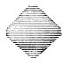

and more, they say, is the breadth of the sides in this way, and on that
account the letters are longer and larger, without increasing the weight
of the Peithynen. Its superiority is equal to the trouble bestowed on
it.

Some make necks on the ebillwydd that they may be inserted in side
pillwydd, and, besides, they make holes in the ends of the ebillwydd,
that a string may pass through them, for the sake of facility in
carrying. That is, they are carried in a bundle on a string, instead of
in side pillwydd. Let every one know his reason, and purpose, and awen.

Care must be taken that the pillwydd enclose firmly and wholly the necks
of the ebillwydd, keeping all in a row together.

p. 126 p. 127

*Rhill* [1](#fn_156) is the name given to the
quantity of ebillwydd framed together, most frequently twenty-four, but
some put together twenty-six, others twenty-seven, that is, the three
nines. A Peithynen has as many rhills as are required.

The longitudinal section of a pillwydd,--

 

The transverse section--

 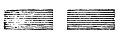 or thus  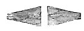

The two halved pillwydd are tied firmly with the strings of a violin or
harp, as being the strongest. Some tie them with silk strings, or silk
ribbons. And all books are carried in a bag of green silk.

Another form of book is the Roll, which is made of a round piece of
wood, turned thin in the middle as long as may be required, having its
two ends of the original thickness of the wood, the length of a thumb's
joint, or a thumb's breadth, thus,--

 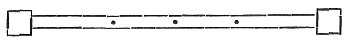

with three holes through the thin part, and a string passed through
them, in order to secure the plagawd or paper, which may be placed to
turn round the roll, as many leaves as may be required, or may be
necessary; and together with the leaves, above them, a silk leaf longer
than the paper leaves, to fold round the whole, as a covering for the
writing, to keep it clean and free from damage. This method was
discovered and brought to use after the knowledge of plagawd was
obtained; and after that the knowledge of paper.

Subsequently to the Roll, the books now in use were devised,

p. 128 p. 129

in the time of Lles, son of Coel, [1](#fn_157)
the first Baptismal King in the island of Britain. Nevertheless, the
Bards and Poets keep in memory and use the old observance of books for
the remembrance and preservation of every old art belonging to the
nation of the Cymry, and the knowledge, as far as possible, of one thing
or mode, which cannot be had of another thing or mode, through
inevitable destiny; for no form of good sciences ought to be lost.

This is the mode, as regards form and aspect, in which the letters of
the Coelbren of the Bards should be cut, that is to say, they ought to
be cut with a sharp-edged knife, and the cutting should be distinct and
ungulate.

Sixteen primitive letters have there been from the beginning--before the
memorial of sciences, and these have been taught and practised by the
old Cymry, who were Poets and Bards, and other learned men of letters.
They are the following,--

 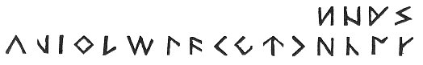

After that, others were devised, namely,

  or  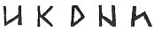 or  

After that, others were devised, and the Coelbren was completed as far
as thirty-eight letters, warranted by the reason and authority of
Gorsedds, and Bards, and learned men, and these are all of them.

There are twelve vowel letters, namely,

 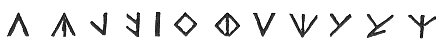

 

p. 130 p. 131

There are twenty-six consonants, namely, twelve primitives, as shewn
before, and fourteen secondaries.

The primitives are,

 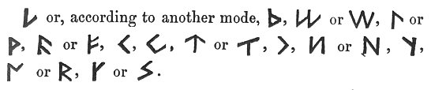

The following are the secondaries, namely,

 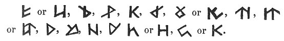

And thus in a series, according to the ancient art of the system of
letters:

 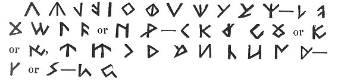

After the coming of the faith in Christ, the saints and monks intermixed
another Alphabet, different from the Coelbren of the Bards, which was
derived from the Latin; and this is the form and aspect which it
presents,

 

p. 132 p. 133

and they are twenty-one, or twenty, according to others, by leaving out
 .

And when this was obtained, the old authors used to mix in their
Coelbrens some of one and some of the other of the two Coelbrens above,
which have been exhibited, that is to say, the Coelbren of the Bards,
and the Coelbren of the Monks, as it seemed best to them, and according
to reason and awen.

When the art of plagawd was obtained, writing on trees failed;
nevertheless the Bards and Poets preserved the old art of using wood;
and until lately there was not one in a hundred of the regular Bards who
was not skilled in the Coelbren, and could not make it with his own
hands, as the primitive usage of the Bards required; that is to
say,--Three things which a Bard ought to make with his own hands: his
Coelbren; his Roll; and his Plagawd. Many, besides the Poets, knew the
Coelbren until within the memory of those now living; and many a one, in
no remote times, used to keep their domestic accounts on wood, cut with
a knife.

------------------------------------------------------------------------

### Footnotes

[117:1](bim1063.htm#fr_150) p. 116 Pillwydd, (pill-gwydd,) wooden sterns.

[117:2](bim1063.htm#fr_151) Pill = bill =
billet.

[117:3](bim1063.htm#fr_152) Ebillwydd,
(ebill-gwydd,) a wooden piercer. Ebill also comes from pill.

[119:1](bim1063.htm#fr_153) p. 118 The plural of ebill.

*Ebillion* gweddillion gwawd.

*Staves* of the relics of praise.  
                   D. ab Gwilym.

[121:1](bim1063.htm#fr_154) p. 120 Troslath, (tros-llath,) an over or
transverse rod.

[121:2](bim1063.htm#fr_155) Cyffon, stocks, the
plural of cyff, a stock, stem, trunk. Hydlath, (hydllath,) a
longitudinal rod.

[123:1](bim1063.htm#fr_156) p. 122 This was the name applied to the Wooden Book
of the Bards, meaning originally what is plain or clear, an elucidator.
"The term has also been applied to several other things, *a weaver's
slay*, *the cogs of a mill wheel*, *the rows of human teeth*, *a board
of wood*, *a slat*e, peithynen y ddwyfron, clwyd y ddwyfron, the breast
bone or brisket, &c. Of the several things, and of very different
natures and appearances, the original, whence all others figuratively or
similitudinarily derive their names, must be the Book, because it is
from some part, some appearance, or property to be found in it that
every other derives its name that has been so called. All the different
ideas to be found in the others separately are united in this. The
weaver's slay is similar in its formation to the billets in the Bard's
Book when framed together. The cogs of a mill wheel resemble strikingly
the ends of those billets that project at each end. The teeth are in
similar rows. The board and slate, before parchment or paper became
known, were used whereon to inscribe, engrave, paint, or cut letters or
literary memorials. The arrangement of the breast bone or ribs are very
similar to the billets in the p. 123 Book and
the reeds in the slay. But it is in the Book only, and in no other
thing, called peithynen, that all those different ideas can be found or
traced up to their origin. This is of itself a striking proof of the
antiquity of this kind of Book. The probability is at least great that
it was known before the weaver's slay, the cogs of a mill wheel, the use
of a slate or board for inscription, &e., were known to the Welsh, and
these last must have been used before parchment and paper were
introduced by the Romans."--Iolo Morganwg.

[127:1](bim1063.htm#fr_157) p. 126 "Rhill, (rhi-ill,) a row; a small trench or
furrow; a drill."--Dr. Pughe's Dict. Drill, d-rill, is probably derived
or borrowed from it.

[129:1](bim1063.htm#fr_158) p. 128 Lles, son of Coel, was a contemporary of
Eleutherius, bishop of Rome, A.D. 173-189. Lles seems to have been the
Welsh form of Lucius, which was the Latin translation of Lleuver, one of
the original names of the British prince. His other name was Lleirwg.
Geraint, the Blue Bard, has recorded in a triplet the literary
achievement of Lleirwg, thus,

Goruc Lleirwg gwâr unben  
Fab Coel fab Cyllin Aren,  
Gyfryngeu a Llyfreu Lleu,

The achievement of Lleirwg, the meek chieftain,  
The son of Coel, son of Cyllin the Eloquent,  
Was the forming of books, and the medium of learning.  
                              Iolo MSS., pp. 263, 671.

------------------------------------------------------------------------

[Next: Coelbren of the Bards](bim1064)
