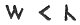
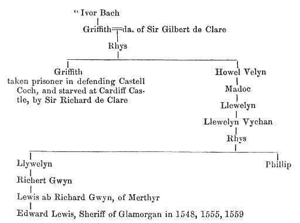
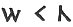

  
[Intangible Textual Heritage](../../../index.md) 
[Legends/Sagas](../../index)  [Celtic](../index)  [Barddas](../bim.md) 
[Index](index)  [Previous](bim1077)  [Next](bim1079.md) 

------------------------------------------------------------------------

[Buy this Book at
Amazon.com](https://www.amazon.com/exec/obidos/ASIN/1578633079/internetsacredte.md)

------------------------------------------------------------------------

  
*The Barddas of Iolo Morganwg, Vol. I.*, ed. by J. Williams Ab Ithel,
\[1862\], at Intangible Textual Heritage

------------------------------------------------------------------------

### DASGUBELL RODD. [2](#fn_171.md)

Question. What is the Dasgubell Rodd?

Answer. The keys of the primitive Coelbren.

Q. What is it that explains the primitive Coelbren? [3](#fn_172.md)

A. The Dasgubell Rodd.

p. 166 p. 167

Q. What else?

A. The secret of the Dasgubell Rodd.

Q. What secret?

A. The secret of the Bards of the Isle of Britain.

Q. What will divulge the secret of the Bards of the Isle of Britain?

A. Instruction by a master in virtue of a vow.

Q. What kind of vow?

A. A vow made with God.

------------------------------------------------------------------------

### Footnotes

[165:2](bim1078.htm#fr_172.md) p. 164 "A gift besom;" probably in reference to its
employment of clearing off what hides the bare truth, or of divulging
the secret in which it is couched.

[165:3](bim1078.htm#fr_173.md) Before we dismiss
the subject of the Coelbren, it may not be uninteresting to notice a
fact which, as far as it goes, clearly disproves the charge, which would
palm upon the late Iolo Morganwg the invention of the Bardic characters.
About six or seven years ago, during the process of repairing an old
house, called "The Court," at Merthyr Tydvil, a room, which had been
closed for a period of time exceeding the memory of man, was laid open,
and in it were found several pieces of oak furniture, of decidedly a
Tudor character, on one of which, a bedstead, were engraved, in relief,
the letters

 

that is, in modern orthography, M C L. Mr. Thomas Stephens, author of
The Literature of the Cymru, who has examined the carving, and inquired
into the history of the family that owned the bedstead, has kindly
favoured us with the following remarks,--"As to the age of the letters,
they are probably, and to all appearance, of the same age as the
bedstead. Wood carving in England does not lay claim to any great
antiquity. A taste for carving prevailed during the reigns of the Tudors
as well as of the Stewards; and it seems to me that the bedstead in
question may be about 250 years old, or perhaps 300; but certainly not
more. If the true date is ever ascertained, I think it not unlikely that
I shall be found to have overstated its age than otherwise. This,
however, will be of service in determining the age of the Coelbren to be
at least as old as the age of Llywelyn Sion, and in setting aside all
imputations upon the character of Iolo Morganwg, as a setter forth of an
alphabet of his own invention."

This is a most important admission on the part of one who is in general
extremely sceptical about the traditions of the Bards. Mr. Stephens
proceeds to give some account of the family, thus:--

p. 165

 

He lived at Van, near Caerphilly, and was the patron of Meyrig Dafydd,
(See Cyfrinach y Beirdd, pp. 124, 127,) Dafydd Llwyd Matthew, and other
Bards, The family, therefore, was one which must have been cognizant of
Coelbren y Beirdd. Next in descent was

1\. Thomas Lewis, of Van, also Sheriff of Glamorgan in 1569--died Nov.
2, 1594, 87th of Queen Elizabeth.

p. 166

He had the following brothers and sisters, viz.,--

2\. William Lewis  
3. Edward Lewis  
4. Mary Lewis  
5. Elizabeth Lewis  
6. Margaret Lewis  
7. Jane Lewis  
8. Blanch Lewis  
9. Cicely Lewis

\[paragraph continues\] Thomas Lewis
married Margaret, daughter of Robert Gamage of Coyty, and uncle of the
Countess of Leicester, the great Gamage heiress; and as his eldest p. 167 son was born in 1560, the marriage probably
took place during the Shrievalty of Sir Edward Lewis in 1559.

We have here the material for the interpretation of M C L. If these
letters are not the initials of any one of the three sisters--Mary,
Margaret, or Cicely Lewis, then they are most probably those of the
bride of Thomas Lewis--Margaret Damage Lewis--C being used as a radical
instead of G. There are two carved bedsteads at the Court; one far more
elaborately carved than the subject of these remarks. The former was
probably the wedding gift of Sir Edward Lewis to his son; the latter,
part of the dowry of Margaret Gamage. That at all events is my
exposition of  ."

------------------------------------------------------------------------

[Next: Triads of Bardism](bim1079.md)
