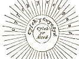

  
[Intangible Textual Heritage](../../../index.md) 
[Legends/Sagas](../../index)  [Celtic](../index)  [Barddas](../bim.md) 
[Index](index)  [Previous](bim1078)  [Next](bim1080.md) 

------------------------------------------------------------------------

[Buy this Book at
Amazon.com](https://www.amazon.com/exec/obidos/ASIN/1578633079/internetsacredte.md)

------------------------------------------------------------------------

  
*The Barddas of Iolo Morganwg, Vol. I.*, ed. by J. Williams Ab Ithel,
\[1862\], at Intangible Textual Heritage

------------------------------------------------------------------------

p. 168 p. 169

 

### TRIADS OF BARDISM. [\*](#fn_173.md)

1\. There are three primeval Unities, and more than one of each cannot
exist: one God; one truth; and one point of liberty, and this is where
all opposites equiponderate.

2\. Three things proceed from the three primeval Unities: all life; all
goodness; all power.

3\. God consists necessarily of three things: the greatest in respect of
life; the greatest in respect of knowledge; and the greatest in respect
of power; and there can only be one of what is greatest in any thing.

4\. Three things it is impossible God should not be: whatever perfect
goodness ought to be; whatever perfect goodness would desire to be; and
whatever perfect goodness can be.

5\. The three witnesses of God in respect of what He has done, and will
do: infinite power; infinite knowledge; and infinite love; for there is
nothing that these cannot perform, do not know, and will not bring to
pass.

p. 170 p. 171

6\. The three ultimate ends of God's regulation in giving existence to
every thing: to weaken the evil; to strengthen the good; and to manifest
all discrimination, that what ought to be might be known from what ought
not to be.

7\. Three things which God cannot but perform: what is most useful; what
is most necessary; and what is most beautiful of all things.

8\. The three stabilities of existence: what cannot be otherwise; what
need not be otherwise; and what cannot be conceived better; and in these
will all things end.

9\. Three things will necessarily exist: the supreme power; the supreme
intelligence; and the supreme love of God.

M. The three characteristics of God: complete life; complete knowledge;
and complete power.

11\. The three causes of living beings: the love of God in accord with
the most perfect intelligence; the understanding of God knowing all
possible means; and the power of God in accord with supreme will, love,
and intelligence.

12\. There are three Circles of existence: the Circle of Ceugant, [1](#fn_174.md) where there is nothing but God, of
living or dead, and none but God can traverse it; the Circle of
Abred, [2](#fn_175.md) where all things are by
nature derived from death, and man has traversed it; and the Circle of
Gwynvyd, [3](#fn_176.md) where all things spring
from life, and man shall traverse it in heaven.

p. 172 p. 173

13\. The three states of existence of living beings: the state of Abred
in Annwn; [1](#fn_177.md) the state of liberty in
humanity; and the state of love, that is, Gwynvyd in heaven.

14\. The three necessities of all animated existences: a beginning in
Annwn; progression in Abred; and plenitude in heaven, that is, the
circle of Gwynvyd; without these three things nothing can exist but God.

15\. Three things are necessary in Abred: the least of all animation,
and thence a beginning; the material of all things, and thence increase,
which cannot take place in any other state; and the formation of all
things out of the dead, hence diversity of existence.

16\. Three things cannot but happen to all living beings by the justice
of God: co-sufferance in Abred, because without that none could obtain
the perfect knowledge of any thing; co-participation of equal privilege
in the love of God; and co-ultimity, through the power of God, in
respect of such as are just and merciful.

17\. The three necessary occasions of Abred: to collect the materials of
every nature; to collect the knowledge of every thing; and to collect
strength to overcome every ad-verse and Cythraul, [2](#fn_178.md) and to be divested of evil; without this
traversing of every state of life, no animation or species can attain to
plenitude.

18\. The three principal calamities of Abred: necessity; forgetfulness;
and death.

19\. The three principal necessities before fulness of knowledge can be
obtained: to traverse Abred; to traverse Gwynvyd; and the remembrance of
all as far as Annwn.

20\. Three things indispensably connected with Abred:
[lawlessness](errata.htm#1.md), for it cannot be otherwise; the escape of
death from evil and Cythraul; and the increase of life and goodness,

p. 174 p. 175

by being divested of evil in the escapes of death; and this from the
love of God embracing all things.

21\. The three instrumentalities of God in Abred for the subduing of
evil and Cythraul, and escaping from them towards Gwynvyd: necessity;
forgetfulness; and death.

22\. There are three primary contemporaries: man; liberty; and light.

23\. The three necessary obligations of man: to suffer; [1](#fn_179.md) to change; and to choose; and whilst he
has the power of choosing, the other two things are not known before
they happen.

24\. The three equiportions of man: Abred and Gwynvyd; necessity and
liberty; evil and good; all equiponderate, man having the power of
attaching himself to the one he pleases.

25\. From three things will the necessity of Abred fall on man: from not
endeavouring to obtain knowledge; from non-attachment to good; and from
attachment to evil; occasioned by these things he will fall to his
congener in Abred, whence he will return, as at first.

26\. From three things will man fall of necessity in Abred, though he
has in every thing else attached himself to good: from pride even to
Annwn; from falsehood to a corresponding state of perception; [2](#fn_180.md) and from unmercifulness to a similarly
disposed animal, [3](#fn_181.md) whence, as at
first, he returns to humanity.

27\. The three primaries of the state of man: the first accumulations of
knowledge, love, and power, without death. This cannot take place, in
virtue of liberty and choice, previous to humanity: these are called the
three victories.

28\. The three victories over evil and Cythraul: knowledge; love; and
power; for these know, will, and can do, in their conjunctive capacity,
what they desire; they begin in the state of man, and continue for ever.

p. 176 p. 177

29\. The three privileges of the state of man: equiponderance of evil
and good, whence comparativity; liberty of choice, whence judgment and
preference; and the origin of power, proceeding from judgment and
preference, since these must necessarily exist before any other action.

30\. The three inevitable differences between man, or any other living
being, and God: man is finite, which God cannot be; man had a beginning,
which God could not have; man must needs change his condition
successively in the circle of Gwynvyd, from not being able to endure the
Ceugant, but God needs not, being able to endure all things, and that
consistently with felicity.

31\. The three primaries of Gwynvyd: cessation of evil; cessation of
want; and the cessation of perishing.

32\. The three restorations of the circle of Gwynvyd: original
Awen; [1](#fn_182.md) primitive love; and
primitive memory; because without these there can be no Gwynvyd.

33\. Three things discriminate every animate being from others: Awen;
memory; and perception: these will be complete in every one, and cannot
be common to any other living being; each will be plenary, and two
plenaries of any thing cannot exist.

34\. Three things has God given to every living being: namely, the
plenitude of his species; the distinction of his individuality; and the
characteristic of a primitive Awen as different from another; this is
what constitutes the complete self of every one as apart from another.

35\. From understanding three things will ensue the diminution and
subjugation of all evil and death: their nature; their cause; and their
operation; and this will be obtained in Gwynvyd.

36\. The three stabilities of knowledge: to have traversed every state
of life; to remember every state and its incidents; and to be able to
traverse every state, as one would wish, for the sake of experience and
judgment; and this will be obtained in the circle of Gwynvyd.

37\. The three characteristics of every living being in

p. 178 p. 179

the circle of Gwynvyd: vocation; privilege; and Awen; nor is it possible
for two beings to be identical in every thing, for every one will be
complete in what is characteristic of him; and there is nothing complete
without comprehending the whole quantity that can possibly belong to it.

38\. Three things none but God can do: to endure the eternities of
Ceugant; to participate of every state without changing; and to
ameliorate and renovate every thing without causing the loss of it.

39\. Three things that can never be annihilated, from their unavoidable
possibilities: form of existence; quality of existence; and the utility
of existence; for these will, divested of their evils, exist for ever,
whether animate or inanimate, as beautiful and good varieties of the
circle of Gwynvyd.

40\. The three excellencies of changing condition in Gwynvyd:
instruction; beauty; and repose, from not being able to endure the
Ceugant and eternity.

41\. There are three things on their increase: fire, or light;
understanding, or truth; and the soul, or life; these will prevail over
every thing, and then Abred will end.

42\. There are three things on the wane: the dark; the false; and the
dead.

43\. Three things acquire strength daily, there being a majority of
desires towards them: love; knowledge; and justice.

44\. Three things grow more enfeebled daily, there being a majority of
desires in opposition to them: hatred; injustice; and ignorance.

45\. The three plenitudes of Gwynvyd: participation of every nature,
with a plenitude of one predominant; conformity to every Awen, and in
one excelling; love towards every living being and existence, and
towards one, that is, God, above all; in these three ones will the
plenitude of heaven and Gwynvyd consist.

46\. The three necessities of God: to be infinite in Himself;

p. 180 p. 181

to be finite to the finite; and to be co-united with every state of
animated beings in the circle of Gwynvyd.

------------------------------------------------------------------------

### Footnotes

[169:\*](bim1079.htm#fr_174.md) p. 168 These Triads are printed in Edward
Williams's Lyric Poems, vol. second. Of the copy from which they were
taken, he gives the following account;--"The Triades that are here
selected are from a Manuscript Collection, by Llywelyn Sion, a Bard of
Glamorgan, about the year 1560. Of this manuscript I have a transcript;
the original is in the possession of Mr. Richard Bradford, of Bettws,
near Bridgend, in Glamorgan. This collection was made from various
manuscripts of considerable, and some of very great antiquity--these,
and their authors, are mentioned, and most or all of them still extant."

p. 169 They were published at Geneva, in
1856, by M. Pictet, under the title of "Cyfrinach Beirdd Ynys Prydain,"
or " Le Mystere des Bardes de l’Ile de Bretagne," accompanied by a
translation and a commentary in the French language.

[171:1](bim1079.htm#fr_175.md) p. 170 Cylch y Ceugant, translated by Ed. Williams,
"the circle of infinity," and by M. Pictet, "le cercle de la region
vide," means literally, the circle of the enclosing circumference, that
is, the perfect rim that bounds the entire space of existence. From the
idea of unchangeableness or absoluteness, involved in the doctrine of
the ceugant, the word has acquired a secondary meaning, that of
"certain." It is in that sense that we are to understand it in the
adage--

*Ceugant* yw angan.

Death is *certain*.

\[paragraph continues\] Also in the
following passage from Llywarch Prydydd y Moch, A.D. 1160-1220--

Ked archwyf ym llyw y lloergant yn rot  
Ef am ryt yn *geugant*.

Even should I demand of my chief the moon as a gift,  
He will *certainly* give it me.  
          I Llywelyn ap Iorwerth, Myv. Arch. i. p. 300.

[171:2](bim1079.htm#fr_176.md) Cylch yr Abred is
rendered by Ed. Williams, "the circle of inchoation," and by M. Pictet,
"le cercle de transmigration." Abred seems to be compounded p. 171 of *ab*, from, and *rhed*, a course, in
reference to the migration of the soul from one animal to another, until
it reaches the state of humanity.

Abred is mentioned in a poem attributed to Taliesin, where it is used to
denote hell.

Hyd pan ddillyngwys Crist gaethiwed  
O ddwfn fais affwys abred.

Until Christ released the bondage  
From the immensely deep abyss of hell.  
        Y Milveib, Myv. Arch. v. i. p. 170.

[171:3](bim1079.htm#fr_177.md) Cylch y Gwynvyd,
the circle of the *white*, or, (taking that colour as the emblem of
purity,) the *holy* world;--the circle of felicity, for, be it observed,
*gwynvyd* is the term generally used by the Cymry to this day to denote
bliss or happiness.

[173:1](bim1079.htm#fr_178.md) p. 172 Annwn = annwfn, (an-dwfn,) a bottomless
gulf; an abyss; the great deep, or lowest point of existence, as it is
translated by Ed. Williams. There is an old adage which says,

Nid eir i *annwn* ond unwaith.--*Annwn* is visited but once.

\[paragraph continues\] Taliesin opposes
it to heaven, when he speaks of a deluge;--

O nef pan ddoethant  
Yn *annwfn* llifeiriant.

When it came from heaven,  
The torrent reached to *annwn*.--Kad Goddeu.

\[paragraph continues\] In the Christian
code, annwn is made to stand for hell.

[173:2](bim1079.htm#fr_179.md) p. 173 Cythraul, (cy-traul,) the principle of
destruction. The term is that which is still employed for the most part
to denote the devil, or Satan.

[175:1](bim1079.htm#fr_180.md) p. 174 M. Pictet has rendered this
"l’impassibilitié," as if the word was compounded of *di*, non, and
*goddef*, to endure. He was driven to prefer this acceptation, from
having mistaken the word "angenorfod," which be supposed to mean what
was necessary for the triumph of man, over evil, and not, as we have
rendered it, "the necessary obligations" of a man, as such.

[175:2](bim1079.htm#fr_181.md) Obryn is an
obsolete word, but seems to be compounded of *ob*, a going out of, and
*rhyn*, an emotion, or perception, and to signify an equivalent state of
perception. Ed. Williams has it, "a state corresponding with his
turpitude," and is followed therein by M. Pictet, who writes "point de
démérite équivalent."

[175:3](bim1079.htm#fr_182.md) p. 175 Cydvil, (cyd-mil,) co-animal, meaning an
animal corresponding in disposition with himself. "A corresponding state
of brutal malignity."--Ed, Williams.

[177:1](bim1079.htm#fr_183.md) p. 176 Genius.

------------------------------------------------------------------------

[Next: Theological Triads](bim1080.md)
