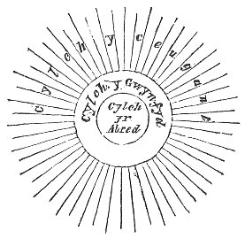

  
[Intangible Textual Heritage](../../../index) 
[Legends/Sagas](../../index)  [Celtic](../index)  [Barddas](../bim) 
[Index](index)  [Previous](bim1096)  [Next](bim1098) 

------------------------------------------------------------------------

[Buy this Book at
Amazon.com](https://www.amazon.com/exec/obidos/ASIN/1578633079/internetsacredte)

------------------------------------------------------------------------

  
*The Barddas of Iolo Morganwg, Vol. I.*, ed. by J. Williams Ab Ithel,
\[1862\], at Intangible Textual Heritage

------------------------------------------------------------------------

p. 222 p. 223

### THE CIRCLES. [1](#fn_234)

The Circle of Abred, in which are all corporal and dead existences.

The Circle of Gwynvyd, in which are all animated and immortal beings.

The Circle of Ceugant, where there is only God. The wise men describe
them thus, in three Circles.

 

------------------------------------------------------------------------

### Footnotes

[222:1](bim1097.htm#fr_235) p. 223 Some persons, and among them M. Henri
Martin, the celebrated French Historian, are of opinion that the three
Circles of existence are represented in the old stone enclosures of the
Bards, such as Avebury, and in the wheels observable on ancient British
coins.

------------------------------------------------------------------------

[Next: The Book of Bardism](bim1098)
