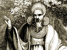

  
[Intangible Textual Heritage](../../../index) 
[Legends/Sagas](../../index)  [Celtic](../index)  [Barddas](../bim) 
[Index](index)  [Previous](bim2003)  [Next](bim2005) 

------------------------------------------------------------------------

[Buy this Book at
Amazon.com](https://www.amazon.com/exec/obidos/ASIN/1578633079/internetsacredte)

------------------------------------------------------------------------

  
*The Barddas of Iolo Morganwg, Vol. II.*, ed. by J. Williams Ab Ithel,
\[1874\], at Intangible Textual Heritage

------------------------------------------------------------------------

### THE TRIADS OF PRIVILEGE AND USAGE.

1\. The three primary Bards of the Isle of Britain: Plennydd; Alawn; and
Gwron. Before them there were no Bards according to the privilege and
usage of Gorsedd, but the Gwyddoniaid were at the head of instruction.

Others say:

The three primary presiding Bards of the Isle of Britain: Plennydd;
Alawn; [1](#fn_9) and Gwron; and before them
there were no Bards, but the Gwyddoniaid were the poets and teachers of
country and nation. The first of the Gwyddoniaid was Tydain, the father
of Awen, and it was he who first invented Cymric vocal song.

Others say:

The three primary Bards of privilege and usage of the Isle of Britain:
Plennydd; Alawn; and Gwron; who lived in the time of Prydain, son of
Aedd the Great.

2\. For three reasons are the Bards called Bards according to the
privilege and usage of the Bards of the Isle of Britain, namely: first,
because Bards and Bardism originated in the Isle of Britain; secondly,
because genuine Bardism has not been found in any country besides the
Isle of Britain; thirdly, because genuine Bardism cannot be maintained
except in virtue of the usages, instruction, and voice of Gorsedd of the
Bards of the Isle of Britain. Therefore, of whatever country a Bard may
be, he is called a Bard according to the privilege and usage of the
Bards of the Isle of Britain.

3\. Bardism was obtained originally from three things: Awen from God;
instruction by man; [2](#fn_10) and the tendency
of nature.

4\. Three ways in which the genuine Bardism of the Bards of the Isle of
Britain is maintained: the memorial of Gorsedd; the usage of Gorsedd;
and the song of Gorsedd.

p. 42 p. 43

Others say: the usage; voice; and song of Gorsedd.

5\. The three memorials of the Bards of the Isle of Britain: the
memorial of the voice of Gorsedd; the memorial of song; and the memorial
of usage. [1](#fn_11)

Others say: the memorial of the voice of Gorsedd; the memorial of
efficient song; and the memorial of Coelbren.

6\. Three things that cannot be contravened: the usage and voice of
Gorsedd; an ancient song of Gorsedd; and the verdict of country and
lord. That is to say, by means of these three are the memorial,
authority, privileges, and usages of the Bards of the Isle of Britain,
maintained.

Others say:

Three things that cannot be contravened: [2](#fn_12) the usage of Gorsedd; the voice of
Gorsedd; and an ancient song bearing the privilege of Gorsedd.

7\. There are three primitive Bards of original disposition. [3](#fn_13) A Bard of privilege, or poet, being a
Primitive Bard Positive, according to the privilege, usage, and voice of
Gorsedd; and his function is to rule, and to preserve the memorial and
record of Bardism, according to the three memorials, and to compose
eulogy, instruction, and memorial--his origination being from the
Gwyddoniaid. The second is an Ovate, according to awen, exertion, and
circumstance; and his function is to poetize according to imagination,
circumstance, and art, and to defer to the judgment of Gorsedd, until it
becomes efficient. The third is the Druid, according to reason, nature,
and Gorsedd; and his function is to teach, according to the necessity of
country and nation; and every priest or worshipper is adjudged to come
under the privilege of a Druid, when he attends the Gorsedd of the Bards
of the Isle of Britain.

8\. The three branches of learning of the Bards of the Isle of Britain.
Bardism, or poetry; in respect of which it is incumbent to poetize, and
to maintain the memorial of song, voice, and usage of Gorsedd, and to
maintain and improve the art of poetry. The second is Druidism; and it
is incumbent upon a Druid to teach according to reason,

p. 44 p. 45

nature, and Gorsedd, as order, morality, and the mysteries of godliness
require. The third is Ovatism; and it is incumbent upon an Ovate to
endeavour after learning and knowledge, as he can, by means of hearing,
seeing, and devising. That is, a poet ought to maintain all learning and
knowledge which may be privileged by an efficient Gorsedd; an Ovate
ought to improve and amplify learning and knowledge, and to submit them
to the judgment of Gorsedd, until it becomes efficient; and a Druid
ought to teach, according to the original usage and privilege of an
efficient Gorsedd, and according to any new discovery, in respect of
reason, nature, and cogency.

Others say:

The three branches of learning of the Bards of the Isle of Britain.
Poetry by a primitive Bard; and it is incumbent upon a Poet to poetize,
and to maintain the memorial of song, voice, and usage, and to make
arrangements according to privilege, for he is gorseddog and chaired,
Ovatism; and it is incumbent upon an Ovate to endeavour and seek after
learning, as far as he can, by means of the hearing and voice of the
world, of sight and contingency, and of attempt, awen, and imagination.
Druidism; and it is incumbent upon a Druid to teach and instruct, in
respect of what is original and made efficient by Gorsedd, and in
respect of new discovery, according to reason, nature, and cogency.

9\. The three distinguishing privileges of the Bards of the Isle of
Britain: maintenance wherever they go; that no naked weapon be borne
against them; [1](#fn_14) and that their word
should be a word above all men.

10\. There are three duties, according to the requirement and occasion
of country and nation, incumbent upon a Bard. The first is to celebrate
worship on all the quarter days [2](#fn_15) of
the moon, so as to impart instruction in godliness and wisdom, and
proper demeanour, and all due and good qualities. The second is to carry
on ambassadorial negotiation between country and country, and between
country and nation and

p. 46 p. 47

border country and border alien nation, in respect of commerce and
conference, between a nation and border aliens. The third is to maintain
peace and concord between native and native, and between native and
border alien, in right of his office of Bard, though he may not be
sought or called by country and nation.

Others say:

The three offices incumbent upon a Bard, according to the need and
occasion of country and nation, namely: to celebrate worship; to be an
ambassador between country and border country, and between nation and
border aliens; and to promote peace and concord where there is
contention, whether between native and native, or between nation and
border aliens.

Others say:

There are three common offices incumbent upon a Bard, which are required
by the necessity of country and nation, namely: worship; embassy; and
pacification.

11\. There are three primary laws of duty incumbent upon a Bard, in
respect of his duty according to the necessity and occasion of country
and nation: to examine truth; to keep a secret; and to conduct himself
morally in reference to peace and justice.

12\. There are three cogent necessities laid upon a Bard, according to
the necessity and occasion of truth and justice: to tell what he knows,
where nothing else can be found which is right and just; to raise the
cry of re-assertion, [1](#fn_16) where
oppression and lawlessness take place; and to exercise judgment over
devastation and spoliation.

13\. Three offices, in virtue of original usage, belong to a Bard: to
compile the memorial and record of every thing that is commendable; to
maintain the song of voice and Gorsedd so that they should become the
memorial and instruction of Bardism and poetical art, their usages and
privileges; and to agitate the progression and extension of knowledge,
by exhibiting the Chairs of song ritually and habitually with the cry of
restoration. [2](#fn_17)

p. 48 p. 49

14\. The three demonstrations of the Bards of the Isle of Britain: the
demonstration of Bards, where a thing was not known; the demonstration
of the convention of Gorsedd and Chair, where it was not seen; and the
demonstration of the knowledge of truth and justice, where it was not
understood. The three demonstrations ensue under the proclamation and
notice of a year and a day, and from thence unto the period of
efficiency they take place by means of the cry of restoration.

15\. There are three loud cries of the Bards of the Isle of Britain: the
cry of restoration, which resuscitates and agitates every thing that is
not known; the cry of re-arrangement, [1](#fn_18) in respect of what is done contrary to
usage, from the necessity of time and occasion, such as holding a Chair
and Gorsedd irregularly as to place and time, for instance, at the
unseasonable points of the sun and moon, or where it is not in the face
of the sun and the eye of light--that being done from obligation and
necessity--but what is done in virtue of the cry of re-arrangement
cannot be efficient, until it becomes customary by means of a Gorsedd
according to privilege and usage; and the cry of re-assertion, against
what may be done by devastation and wrong, and by lawless oppression,
and against what may be done, in respect of song, without privilege,
usage, art, knowledge, and truth. The cry of restoration, and the cry of
re-arrangement, are to be made under the proclamation and notice of a
year and a day, and thence until they become efficient; and the cry of
re-arrangement is to be made under the proclamation and notice of
necessity and cogency, until the occasion for it, according to the need
of country and nation, disappears, and what is done under it cannot be
efficient, unless it formally receives the judgment of Gorsedd,
consequent upon the cry of restoration, and the cry of re-assertion,
covocally and simultaneously issued. For without that, the privilege of
Gorsedd ought not to be given to what is obliged to be done contrary to
usage and law; nor is it fitting that it should have any privilege
whatever,

p. 50 p. 51

except its day of necessity, until, in the way mentioned, it obtains
claim and avouchment, lest poetry, and Bardism, and the privileges and
usages of the Bards of the Isle of Britain, should suffer corruption.

16\. Three things that are submitted to judgment, under the proclamation
and notice of the cry of re-assertion: devastation and pillage; non
privilege and non usage on the part of country and lord, owing to the
want of understanding or exertion; and non poetry, or that which may be
other than what is required according to the privileges and usages of
the Bards of the Isle of Britain, after it has become habitual and
customary to Bard and Gorsedd.

17\. For three reasons ought the Bards to hold a Chair and Gorsedd, and
a voice and recitation, conspicuously and manifestly, in the sight and
hearing of country and lord, and in the face of the sun and the eye of
light. First, that there may be a privilege, not to be gainsaid, for all
to resort to the place and spot. Secondly, that all things cognizable by
the eye, ear, and intellect, may be seen and heard, and that there may
be no lack of law, usage, and truth, among kindred, and on the face of
country, which cannot be again known. Thirdly, that proper instruction
may be obtained for all the nation, and for all who resort to Chair and
Gorsedd, since proper, natural, and pointed instruction ought to be
uniformly imparted to true and loyal men of country and nation, for
there can be no country and law without instruction in respect of truth
and justice--hence proceeds fraternity.

18\. There are three things indispensably attached to the rite of Chair
and Gorsedd, namely: that they should be conspicuous and manifest, in
the sight and hearing of country and lord, as to place and spot; in the
face of the sun and eye of light, that is, while the sun remains in the
firmament, in respect of the time of day; and on the points of the sun
and moon, in respect of the time of year; in order that whatever is
done, recited, and taught, may be familiar to all the men of country and
nation, and border

p. 52 p. 53

country and aliens, and that the places, times, and men, and the
importance and privilege of all, be fully known; and without these
things there can be no Chair and Gorsedd according to usage, law, and
just privilege.

19\. Three things in respect of the usages of Bards and Bardism, which
ought to be open to all. First, the place and spot where is the
convention of Chair and Gorsedd, which is to be opened in virtue of the
proclamation and notice of a year and a day, if the place be not already
open. The second are the times, namely, the customary ones as to the
part of day and time of year, which are none other than the points of
the sun and moon. The third is the instruction, which ought to be open
to all, in respect of the mode of reciting and demonstrating it, so that
there should be no concealment or secrecy of learning and true and just
knowledge. Therefore, these things are called the three open ones: being
open place and spot; open day and time; and open instruction and
recitation; and no judgment can be pronounced by wise men, and country,
and nation, upon what is otherwise.

20\. There are three places and times, adjudged to have the privilege of
open and customary places and seasons, at which it is lawful to hold a
Chair and Gorsedd of song, namely: the places and seasons at which there
is the resort of worship; the resort of judicature; and the resort of
verdict of country in a conventional Gorsedd; for they are known to all.
Therefore they are adjudged to be open, as if in the sight and hearing
of country and lord, and in the face of the sun and eye of light, though
they may be under cover and roof; for these things are to be according
to reason, nature, and necessity, and consequently according to the
privilege and usage of the Bards of the Isle of Britain.

21\. The three maintenances of a Bard: his five free acres; his
oblation; and his tribute.

22\. The three tributes of a Bard: messes of food and liquor; vestments;
and money. Others say: the three domestic tributes, &c.

p. 54 p. 55

23\. The three common oblations of a Bard: one is milk contribution,
which is offered on Alban Hevin; the second is meal contribution, on
Alban Elved; the third is honey contribution, which is offered on Alban
Arthan; and portions of each of the three on Alban Eilir, that is, when
new songs are privileged. And the poor, aliens, and strangers are to
have their portions from the three oblations at those times, since they
have no due maintenance from land and chattels.

24\. There are three places of open Gorsedd: an exposed elevation [1](#fn_19) before memory, or in virtue of the
proclamation and notice of a year and a day; a church; and a court of
judge and law.

25\. There are three seasons of an open Gorsedd: the points of the sun
and moon; Sunday and festival; and the day of court and law.

26\. There are three meetings of federal country: the meeting of Bards
in Gorsedd; the meeting of worship; and the meeting of court and law.

27\. There are three common proclamations: the resort of worship; the
field of a lord; and the Gorsedd of Bards; and in them are to be issued
every notice, every loud cry, every denial, every word and contradiction
unto the end of a year and a day.

28\. The three columns of claim of the Bards of the Isle of Britain: an
ancient son;; the old memorial and voice of Gorsedd; and verdict of
country. [2](#fn_20)

29\. There are three horns of proclamation belonging to the Bard: the
verdict of country, composed of three hundred men; the cry of murder;
and the signal of peace and concord; and they take place under the
notice of a year and a day, when they receive the privilege of Bards,
country, and king.

30\. There are three horns of proclamation belonging to the king, and he
has the right of issuing them in the Gorsedd of the Bards: war; the
court of country and law; and the feast of country and nation; but this
is not lawful

p. 56 p. 57

for other than king and lord; and they are to take place in the hurry of
forty days.

31\. There are three common horns, which ought to be used in every
convention of federate country: the horn of murder and waylaying; the
horn of oppression of border country and stranger; and the horn of
devastation and pillage. And in virtue of these is the horn of
deliverance; for they will have the privilege of the verdict of country
and nation.

32\. The three protections of the Bards of the Isle of Britain: to
protect learning, that is, the art of knowledge; to protect peace and
tranquillity; and to protect truth and justice. That is to say, they
ought to be protected even unto death, when there is occasion, for it is
on their account that a Bard exists, and he is no Bard who does nothing
in their behalf, and there is nothing which is not a duty, arising from
these things.

33\. The three cares of the Bards of the Isle of Britain, namely: to
support science; to elucidate truth; and to cherish peace and
tranquillity.

34\. The three non usages and non qualifications of the Bards of the
Isle of Britain: encroachment upon sciences; contradiction of truth; and
the impugning of peace and tranquillity; for by perpetrating these
things one becomes deprived of privilege and exposed to warfare.

35\. The three necessary functions of a Bard: to teach and explain all
things in the face of the sun and the eye of light; to praise all that
is excellent and good; and to substitute peace for devastation and
pillage.

36\. There are three branches of Bardism: Poetry; Ovatism; and Druidism;
and these three branches are adjudged to be of equal privilege and of
equal weight, for one cannot have supremacy over the other; though they
are distinct in object, they are not distinct in privilege.

37\. There are three Bards of equal importance, who are the three
proprietary primitive Bards, namely: an innate licensed Bard, or a Poet,
according to privilege and usage;

p. 58 p. 59

an Ovate-bard, according to poetical learning; and a Druid-bard,
according to the sense of godliness and morality. They are said to be of
equal importance, because one cannot be better than another, or one
superior to another, in respect of office and movement; but they are
co-equal, and of like dignity, in respect of duty, aim, and object,
which are instruction, truth, and peace.

38\. The three branches of the office of a Bard: duty; aim; and object;
and they are for the sake of instruction, truth, and peace.

39\. Three times have Bardism and the Bards of the Isle of Britain been
submitted to the verdict of country and nation, (the verdict of country
being the asseveration of three hundred men, who enquire into the
hearing, knowledge, and judgment of country and nation until the
expiration of a year and a day.) First, in the time of Prydain, the son
of Aedd the Great, when the Bards conformed to privilege and usage,
judiciously and in order, according to the verdict of country and
nation, which privilege and usage are the same as what are now called
the privilege and usage of the Bards of the Isle of Britain. No
objection or protest has ever after been made against those privileges
and usages, but previously there was neither privilege nor usage, except
from a sense of courtesy, and according as any one was pleased to judge
in regard to Bards and Gwyddoniaid. (Al. and it was judged at will in
regard to Bards and Gwyddoniaid.) The second occasion was in the time of
Maxen the Sovereign, [1](#fn_21) lest the
primitive Bardism should become lost and forgotten, when it was
recovered in its integrity, and according to the original privileges and
usages; it was submitted to the judgment and verdict of country and
nation, when the ancient privileges and usages, the ancient import and
instruction, and the ancient sciences and memorials

p. 60 p. 61

were confirmed, lest they should fail, become lost, or forgot-ten;--nor
was there an objection or protest made against them. The third occasion
on which they were submitted so, was in the time of Ithel, king of
Gwent; [1](#fn_23) when Bardism was found
perfect, without decay, without blemish, without injury, without
deterioration, in respect of the meaning, sciences, instruction,
memorial, and voice of Gorsedd, and in respect of privileges and usages;
wherefore, it was adjudged, decreed, and privileged accordingly without
contradiction or objection.

40. [\*](#fn_22) Three times were Bardism and
the Bards submitted to the verdict of country, but could not receive the
verdict of nation. The first was in the time of Cadwalader the
Blessed, [2](#fn_24) when protest and objection
were offered on the part of the nation, because the sciences, memorials,
privileges, and usages were altered and falsified. The second occasion
was in the time of Bleddyn, son of Cynvyn, [3](#fn_25) when the verdict of nation was not sought,
neither was it given. The third occasion on which they were so submitted
was at the Gorsedd of Caermarthen, [4](#fn_26)
when the Bards of Glamorgan, Gwent, Ergyng, Euas, and Ystrad Yw, entered
an objection and a protest against the said Gorsedd, under the claim of
the Bards of the Isle of Britain, and under the privilege of the ancient
sciences, memorials, and instruction, and the ancient art of song, and
the ancient privileges and usages, because of the falsification and
infraction to which they were there subjected; and opposed them.

41\. Three times were Bards and Bardism arranged, without being
submitted to the verdict of country and nation. The first, in the time
of the emperor Arthur. [5](#fn_27) The

p. 62

p. 63

second, in the time of Gruffudd, [1](#fn_28) son
of Cynan, king of Gwynedd. And the third occasion on which they were so
arranged, was in the time of king Edward the Second, [2](#fn_29) in the Castle of Caernarvon. There is no
privilege of Gorsedd, however, to what was arranged on those occasions,
but merely the courtesy of country, according to reason and necessity,
to which Bards and Bardism are entitled, as long as they do not
infringe, falsify, and contravene the ancient sciences of song and
Bardism. And now the Bards and Bardism of the Isle of Britain, the
ancient privileges and usages, the ancient memorials and sciences, the
ancient import and instruction, the ancient art of song, and the ancient
sense of Bardism, are preserved in the memory and by the voice of the
Gorsedd of the Chair of Glamorgan, Gwent, Euas, Ystrad Yw, and Ergyng,
and are subject to the judgment and authority of that Chair, under the
formal and ritual proclamation and notice of a year and a day unto the
period of efficiency, without contradiction or objection; and therefore
are under the privilege and protection of the verdict of country and
nation--which proclamation and notice were issued by the lord William
Herbert, earl of Rhaglan and Pembroke, and prince of Glamorgan, in every
court and church, and by the horn of country, and the cry of restoration
formally throughout all his territory, unto the period of efficiency, as
it has been said.

42\. There are three arts which the son of a villain ought not to learn
without the permission of his lord, namely: scholarship; Bardism; and
metallurgy; for if the lord should bear until the tonsure is given to
the scholar, or until the Bard takes up his song, or until the smith
enters his smithy, they will he free, and cannot afterwards be enslaved.

43\. There are three persons free from the bond: a Bard; a scholar; and
a smith. Others say: the three free persons from the bond, namely: a
Bard; a scholar; and a metallurgist. For no person can be bond, who
knows one of the three privileged arts, namely: scholarship;

p. 64 p. 65

\[paragraph continues\] Bardism; and
metallurgy. Those three arts are privileged, and cannot be followed by
any one but a gentleman; and whoever knows them is entitled to the
privilege of nobility, social rights, and the maintenance of an innate
Cymro; for those arts are adjudged to be noble, and privileged arts of
country and nation.

44\. There are three common places of protection, in which no weapon can
be raised against any person whatsoever, namely: the Gorsedd of Bards;
the court of country and lord; and the precincts of worship.

45\. There are three principal claims and avouchments of the nation of
the Cymry, which ought to be supported in the Gorsedd of the Bards of
the Isle of Britain. The first, a king who is a free-born Cymro. The
second, the fruition of five free acres for every innate and free-born
Cymro. The third, the right of progress for every innate Cymro as far as
he likes in respect of country and border country in the island of
Britain, without let and without hindrance, as long as his hand is not
about to strike, and as long as he has no claim or is not sued, in
respect of oath and law. These privileges are due to the nation of the
Cymry, because theirs in right of original condition, possession, and
community, is the island of Britain.

46\. The three principal objects of the Bards of the Isle of Britain, in
virtue of original usage: system of knowledge and learning; to manifest
justice; and to maintain peace.

47\. By three methods is the genuine Bardism of the Bards of the Isle of
Britain maintained: by the usage of Gorsedd; the voice of Gorsedd; and
the song of Gorsedd.

48\. The three memorials of the Bards of the Isle of Britain: the
memorial of usage; the memorial of song; and the memorial of the voice
of Gorsedd. Others say: the memorial of usage; the memorial of song; and
the memorial of Coelbren.

49\. There are three presiding primitive Bards: Primitive Bard Positive,
who is also called Bard of Privilege, Licentiate of Privilege, and
Licensed Bard; Druid; and Ovate.

p. 66 p. 67

Others say:

There are three kinds of primitive Bards: Bard of privilege in virtue of
original appointment; Druid, according to reason, nature, and cogency;
and [Ovate](errata.htm#1), according to exertion, imagination, and
contingency.

50\. From three things has Bardism been obtained: Awen from God; the
intellect of man [1](#fn_30) and the disposition
of nature.

51\. The three privileges of the Bards of the Isle of Britain:
maintenance wherever they go; that their word should be paramount; and
that no naked weapon be borne where they may be.

52\. The three branches of learning of the Bards of the Isle of Britain:
Bardism, on which depends the maintenance of the usage, voice, and song
of Gorsedd, as well as the regulation of matters; Druidism, it being
incumbent upon a Druid to teach and instruct according to reason,
nature, and cogency; and Ovatism, which has to do with the
sciences [2](#fn_31) of country, imagination,
and contingency.

53\. Three things which a Bard ought to do: to listen; to look; and keep
secret. Al. to listen; to expect; and to be silent.

54\. Three persons who cannot be made Bards: the idle; the proud; and
the liar.

55\. Three things which a Bard ought to establish: knowledge; truth; and
peace.

56\. Three things which a Bard ought to do, namely: to improve and
extend sciences; to soften morals and habits; and to solace the mind.

57\. In three ways is a Bard graduated, namely: first, a Bard of
privilege is graduated after discipleship, or after the notice of a year
and a day; a Druid is graduated by the decree of Gorsedd, according to a
majority of votes; and an Ovate is graduated after a presiding Bard
shall have affirmed upon his word and conscience that the candidate may
be made a Bard.

58\. The three ministers of knowledge of the Bards of

p. 68 p. 69

the Isle of Britain, namely: song; symbol; and letter; of which song is
considered the best, because there will be need only of the person who
commits it to memory, without manual labour or art, and because a song
can be conveyed by means of the tongue and memory from man to man, and
from country to country, and from age to age, without any thing to
support it other than memory and understanding. This cannot be the case
with symbol and letter; therefore, the best means of maintaining and
preserving sciences is song, according to the privilege and usage of
Gorsedd.

59\. The three ministers of knowledge: song; chronicle; and letter. The
best is song, inasmuch as it is the easiest to learn and remember, and
the most difficult to alter and corrupt, being arranged and ordered
according to the art of song and the metres of poetry. Wherefore, awen
and the art of song and poetry are indispensable to a Bard.

60\. The three ministers of instruction: song; symbol; and letter. Al.
song by a poet; symbol by a herald-bard; and letter by a
post-bard. [1](#fn_32)

61\. There are three kinds of Triads under privilege and usage by the
Bards of the Isle of Britain, namely: Triads of privilege and usage;
Triads of Bardism; and Triads of song.

62\. The three authorities of statute and law: their being published
under the proclamation and notice of a year and a day in every court and
church in the territory; their being submitted to the verdict of country
and nation, that is, the oath of three hundred true men of country and
territory, each of them being an efficient man and head of kindred; and
their being submitted to the judgment of court

p. 70 p. 71

and judge, as the court may be from immemorial usage, in three Gorsedds,
in each of the three provinces of Cymru, judgment being formed according
to the memory, usage, and confirmation of Gorsedd and court.

63\. The three authorities of vocal song, when it shall have been
sanctioned by an efficient Gorsedd: correctness of language and
versification, for what is otherwise cannot be admitted according to the
privilege of a poet; correctness of meaning and object, for what is
otherwise ought not to receive judgment from the word of a poet's
conscience; and privilege received from the judgment of an efficient
Gorsedd; and they ought not to be contradicted, because of the word and
privileges of the Bards of the Isle of Britain.

64\. There are three warrants in virtue of which any one may be admitted
a Bard: the word of a presiding Bard of poetic lineage, who shall say
upon his word and conscience that the one who desires to be a Bard [1](#fn_33) can be made a Bard; the word of twelve
true and loyal men of country and nation [2](#fn_34) judicially and legally pronounced under
the privilege of innate Cymry; and the word of the sovereign of country
or judge of court, who shall say that the one who seeks to be a Bard may
receive a faculty, because he is a loyal man of country in respect of
descent and privilege, and that his lord gives him that freedom.

65\. The three stocks of competition: [3](#fn_35) a Bard; a judge; and a king.

66\. The three mutual bonds of a country: Bardism; judicature; and
kingship. Al. The three characteristics of government, &c.

67\. The three national duties of a Bard: to praise the good; to impart
instruction and advice; and to preserve the memorial and record of what
is worthy.

68\. The three credibilities of the Bards of the Isle of Britain: the
memorial and voice of Gorsedd; symbol and picture; and letter and
writing.

69\. Three things which a Bard ought to recite in Gorsedd under the
privilege of the nation of the Cymry who

p. 72 p. 73

may require it of him, that is to say: to recite the points of the
Cymric language; the privileges and usages of the Bards of the Isle of
Britain; and the privileges and usages of the nation of the Cymry, and
their sovereignty.

70\. The three rudiments of the Bards of the Isle of Britain: word;
letter; and symbol. Al. word; symbol; and letter.

71\. Three men who are entitled to the endowment of country: a Bard; a
judge; and a warrior.

72\. The three primary descriptive mediums of the Bards of the Isle of
Britain: song; allegory; and usage.

73\. The three stocks of law: conscience; truth; and cogency. Al. and
occasion.

The three materials of every rite and law: truth; knowledge; [1](#fn_36) and conscience.

74\. The three relics of oath [2](#fn_37) and
asseveration of the Bards of the Isle of Britain: the ten commandments;
the gospel of John; and averment in the face of the sun and light.
Others say: the ten commandments; the gospel of John; and a Bard
declaring upon his word and conscience. According to others: a Bard; a
judge; and a juror declaring upon his word and conscience.

75\. The three especial instructions which the nation of the Cymry
obtained: the first was that of the Gwyddoniaid before the time of
Prydain, son of Aedd the Great, from the age of ages; the second was
Bardism, as taught by the Bards, after they were instituted; the third,
the faith in Christ, which was the best of the three. That is to say,
first, the Gwyddoniaid were the principal philosophers and teachers of
the nation of the Cymry, and when privilege and usage were conferred
upon them in the time of Prydain, son of Aedd the Great, they were
called Bards, [3](#fn_38) and what they knew was
designated Bardism. There is no memorial or knowledge of the
Gwyddoniaid, except the name of Tydain, the father of Awen, who first of
all men composed a Cymric song; and it was from his song that the best
comprehension of Bardism and poetry was obtained,

p. 74 p. 75

and hence were instituted Bards of privilege and usage, by means of the
counsel and instruction of the three primary ones, Plennydd, Alawn, and
Gwron.

76\. From three things was Bardism obtained: from memory and knowledge
from the age of ages; from the song of Tydain, son of Tudno, [1](#fn_39) that is, Tydain, the father of Awen; and
from Awen from God by means of reason, sense, and understanding.

77\. A Bard will be three things, namely: a chief and a bridge, being
resembled to a bridge, because he conveys over the morass of ignorance;
security where there is insecurity, because there will be no weapon
against him or against his fellow traveller; and a privilege for the
unprivileged, that is, his protection. Accordingly it is said: he who
would be chief, let him be a bridge; he who would be a bridge, let him
be a Bard; from being a Bard, let him be a chief; from being a chief,
let him be a bridge. [2](#fn_40)

78\. There are three common announcements, and whether it be notice,
assertion, cry, or denial that is issued, it ought to be according to
one of the three, under the notice of a year and a day, namely: the
field of a lord; the resort of worship; and the Gorsedd of Bards. [3](#fn_41)

Or thus:

There are three common announcements: the resort of worship; the field
of a lord; and the Gorsedd of Bards. Otherwise: three places in which
proclamation and notice are to be issued until the expiration of a year
and a day, &c., and in them are to be uttered every cry of restoration,
of re-assertion, and of re-arrangement.

p. 76 p. 77

79\. The three firm Gorsedds of the Isle of Britain: the Gorsedd of
country and lord; the Gorsedd of Bards; and the Gorsedd of federate
support. Others say: the three principal Gorsedds of the Isle of
Britain, &c.

80\. The three principal Gorsedds of the Isle of Britain: the Gorsedd of
Meriw hill; the Gorsedd of Beiscawen; and the Gorsedd of Bryn Gwyddon.
Al. the hill of Evwr; Beiscawen; and Bryn Gwyddon.

81\. Three times was Bardism submitted to the verdict of country and
nation, namely: first, when it was originally arranged and privileged in
the time of Prydain, son of Aedd the Great; secondly, in the time of
Bran, son of Llyr; thirdly, in the time of Gruffudd, son of Cynan, and
it was so secured that no one should be initiated in any song or
learning whatsoever, but under the privilege and protection of the Bards
of the Isle of Britain.

82, The three characteristics of a community: a Bard teaching; an artist
defending; and a labourer providing food; and they are entitled to the
privilege of innate loyalists of the country and nation of the Cymry, of
whatever country and nation they may be.

83\. Three things which cannot be contravened: an ancient song; an
ancient memorial; and an ancient art of poetry. [1](#fn_42)

84\. Three men who socially constitute a court: [2](#fn_43) a Bard; a smith; and a harpist. Al. a
Bard; a metallurgist; and a harpist. Or: a Bard; a man of instrumental
song; and a metallurgist.

Three men who establish a social habitation wherever they may be: a
Bard; a smith; and a harpist. [3](#fn_44)

85\. Three principal things required of a Bard: to preserve memorial and
knowledge; to preserve peace and courtesy; and to preserve instruction
and morality.

86\. The three maintenances of a Bard: his five free acres; his circuit
of minstrelsy; and his fee for what he does, in virtue of his art, to
another.

p. 78

p. 79

87\. The three licentiates of court: a Bard; a judge; and a worshipper.

88\. The three supports of government: Bardism; judicature; and labour.

89\. There are three common departures: the resort of Bards to Gorsedd
and worship; the resort to a convention of country and lord, which is
regulated by jury and law; and the resort to aration; both male and
female being privileged to resort to them.

90\. There are three peculiar departures, a female being privileged to
join in them: hunting; warfare; and a convention of federation.

91\. In respect of three things ought a Bard to regulate matters, and to
be a man of Chair: nuptial festivities, which he ought to chronicle and
register; the royal games, that is, the twenty-four games of the nation
of the Cymry, which he ought to see are conducted in peace and morality,
and which he must arbitrate justly; and the genealogy of the nation and
territory where his Chair and endowment may be, in respect of which he
ought to keep a memorial and system, lest innate privilege should suffer
oblivion, and blemish, and consequently loss; if he attends not to these
things, he shall lose the remuneration of his song for three years.

92\. Three men who ought not, and cannot be made Bards: the idle; the
proud; and the liar.

93\. There are three guarantees which will enable any one who wishes to
be made a Bard: the word of a Bard of poetic lineage, who shall affirm
upon his conscience; the word of a chief, that is, a lord, or a judge;
and the word of twelve true and loyal men of country. A priest is
adjudged to have the same privilege as a Bard of poetic lineage, since
he is a Druid in virtue of office and duty.

94\. The three first points, which a Bard ought to teach and consider:
to believe every thing; to disbelieve every thing; and to believe it
matters not what. Others say: the three first points of Bardism; or, a
Bard's three first points of instruction, &c.

p. 80 p. 81

95\. The three relics of belief and asseveration of the Bards of the
Isle of Britain: the ten commandments; the gospel of John; and the face
of the sun and eye of light. [1](#fn_45) And
when one makes an asseveration, he is to fold his two hands, placing the
fingers of the one between those of the other, and pressing them on the
breast, towards the relics mentioned.

96\. There are three authorities of vocal song: just language and
versification, since none other can be believed according to the
privilege of a poet; just import and recitation, since none other can be
believed according to reason and nature in respect of the duty and
privilege of a poet; and the privilege of Gorsedd, that is, the judgment
and favour of three Chairs of song, which are held according to the
privileges of the Bards of the Isle of Britain, being called by the
Bards the privilege of an efficient Gorsedd.

97\. In three ways is the Bardism of the Bards of the Isle of Britain
properly maintained, namely: by means of the voice of Gorsedd; an
efficient Gorsedd; and usage according to the memory of country and
Gorsedd. Others say: the voice of Gorsedd; the song of Gorsedd; and the
usage of Gorsedd. Others say: the memorial of song; the memorial of
voice; and the memorial of Coelbren, that is, letter.

98\. The three sorts of the primitive Bards of the Isle of Britain: a
Bard of privilege, or poet, to rule, and to record; a Druid, to teach;
and an Ovate, to improve learning and knowledge.

99\. There are three endeavours, which are obligatory upon a Bard: one
is, to accumulate and teach sciences; the second is, to instruct; and
the third is, to pacify, by introducing concord and tranquillity where
there is contention and quarrelling, and putting an end to strife; for
it is not according to usage, or becoming, that a Bard should do
contrary to these things.

100\. There are three pursuits which are lawful to a Bard, and to every
other native of country and nation, that

p. 82 p. 83

is to say: hunting; tillage; and pastoral cares; for it is by means of
those things that all persons obtain food, and they ought not to be
denied or prohibited, nor should such as may desire them be
restrained. [1](#fn_46) Others say: tillage;
pastoral cares; and medicine; for these are pursuits of improvement,
consequent upon peace and morality, and are called the three common
pursuits.

101\. Three things which a Bard is not privileged to engage in, since
they are not proper for him. Metallurgy, with which art he has nothing
to do, except to improve it, according to his reason, learning,
knowledge, and doctrine, for he is a man of literature. War, since there
ought to be no naked weapon in his hand against others, for he is a man
of peace and tranquillity. The third is commerce, for he is a man of
primary law and justice, and he ought to attend to his office of
instructing country and nation. And because of these things it is deemed
that a Bard ought not to have any trade other than his office and art,
in respect of song and Bardism, lest what ought to belong to Bard and
Bardism should suffer loss and deterioration, and lest a Bard, by
following a trade, may not be able to practise meditation in respect of
the things which are suitable to Bard and Bardism, and to literature and
genial sciences; nevertheless, the three common pursuits are proper for
him.

102\. The three common feasts, which are conducted and arranged by the
Bards of the Isle of Britain, namely: the first are the feasts of the
four albans; the second are the feasts of worship at the quarters of the
moon; the third are the feasts of country and nation, because of a
triumph and deliverance; which are to be held under the proclamation and
notice of forty days.

Others say:

There are three contributory feasts under the protection of the Bards of
the Isle of Britain, at which all have their portion of the three
tributes, namely, honey, meal, and milk, that is to say: the feasts of
co-aration under the proclamation of forty days; the feasts of alban;
and the feasts

p. 84

p. 85

of worship. It is privileged for Bards to preside over them, and to
receive presents at them out of the three contributory gifts, which are
corn, milk, and honey; [1](#fn_47) and they are
called the Bards' gifts of co-aration, because they refer to the plough.

103\. There are three other feasts, which by courtesy a Bard regulates,
namely: the feast of the head of kindred; the feast of marriage; and the
feast of the fire back, which takes place where five fire back stones
are raised as a station of social abode. In them the gifts of the comot
and nation are presented, as far as the ninth generation; and the Bards
receive a portion of the contributory gifts of those feasts, being taken
from tilth, fold, and wood covert, according as it may be easiest to
obtain and to give them. They are given by courtesy to a Bard, for it is
only the right of courtesy that a Bard is entitled to at these three
feasts.

104\. There are three proclamations. One is a proclamation under the
notice of a year and a day, and it is under that proclamation that every
substantial cry should be issued, such as the cry of restoration, the
cry of re-assertion, and the cry of re-arrangement, which are to be
published in every Gorsedd of country and lord, in every Gorsedd of
Bards, and in every resort of worship. The second is the proclamation of
forty days, according to which every common feast of country and nation,
and every Gorsedd of oppression are held--a Gorsedd of oppression being
the name given to that which requires to be held in consequence of
oppression by a border country or stranger, or of depredation and
pillage in a country, whereby there is a peremptory occasion for country
and lord, or Bards, or others, in the cause of country and nation, to
assemble in Gorsedd, and to blow the horn of country preparatory to war,
defence, and deliverance. This proclamation is to be made in every
resort of worship, and in every court of comot, and by sound of horn in
every town, which contains five inhabited houses. The third is the ready
proclamation, such as the recitation of juridical peace in the Gorsedd
of country and

p. 86 p. 87

lord, in the Gorsedd of Bards, in the Gorsedd of convention, in every
court of judge and law, and in every resort of worship. And when
juridical peace is proclaimed, it is not lawful for any one to bear a
naked weapon of offence, whilst it is lawful for all, in respect of
country and nation, alien and stranger, to be present, as long as they
shall remain under the protection of the juridical peace, without a
weapon, without assault; whereas he who conducts himself otherwise is
not allowed [1](#fn_48) to enjoy juridical
peace, but is adjudged to be a man deprived of privilege and exposed to
warfare. Twelve true and loyal men of country and nation have the
privilege of meeting together, without a weapon, without assault, in
right of juridical peace, which must be proclaimed, before they perform
what is necessary; and when the juridical peace is proclaimed, they must
go to court, in respect of what is necessary, and there awake the horn
of country under the proclamation of forty days, and submit to the
verdict of country and nation, which verdict is privileged to awake the
horn of country. And they must proceed to deal with their wants and
requirements under the proclamation and notice of a year and a day,
either in the Gorsedd of country and lord, or in the Gorsedd of
convention, or in the Gorsedd of Bards. The court of twelve true and
loyal men, constituted as already mentioned, is called the court of
agitation, and the agitation of country, since they can have nothing to
do with the necessity and occasion otherwise than by means of the
agitation of the court and Gorsedd of which there is need.

105\. Three things which it is lawful for a Bard to exact in his circuit
of minstrelsy, being the three principal provisions, namely: corn; milk;
and honey; nor is it lawful for a Bard to exact provisions, except the
three contributory provisions, for nothing else may be given which is a
provision under the protection of God and His peace. And from the three
contributory provisions are all contributory gifts in the feasts of the
four albans, and in the feasts of

p. 88 p. 89

worship, and in every other feast, which may be under the protection of
God and His peace.

106\. There are three feasts which are deemed under the protection of
God and His peace, namely: the feasts of the four albans; the feasts of
deliverance of country and nation, which take place under the
proclamation of forty days, when gifts are presented from the three
contributory aids by all men of the nation; and a portion of those gifts
is for Bards, the poor, and stranger, who are under the protection of
God and the Bards of the Isle of Britain.

107\. There are three other feasts which are by courtesy under the
protection of God and the Bards of the Isle of Britain, namely: the
feast of the head of kindred; the feast of co-aration; and the feast of
the fire back; at which gifts are contributed from the three principal
provisions. Others say: from tilth; fold; and wood covert; with a
portion to the Bard, the poor, and the stranger, who may be under the
protection of God and His peace, that is, under the protection of the
Bards of the Isle of Britain pursuant to the proclamation of forty days.
Others say: the three oblations: one from tilth; another from fold; and
another from wood covert:--or, of honey, or the juice of the fruit of
trees.

108\. The three privileged specialities of country: Bardism; judicature;
and metallurgy; since they cannot be maintained except by privilege, and
all are not required to know them. Others say: scholarship; judicature;
and trade. Others say: scholarship; trade; and commerce.

109\. The three branches of Bardism: Ovatism; poetry; and worship.

110\. The three branches of artizanship: metallurgy; carpentry; and
medicine.

111\. The three branches of scholarship: Bardism; judicature; and
chancellorship.

112\. The three landless ones who are privileged: a Bard; a smith; and a
carpenter; for they have the privilege of free maintenance, though they
may not be possessed

p. 90 p. 91

of the privilege of innate nobility, and consequently endowed with land.

113\. There are three privileged proprietors of land: a Cymro of innate
nobility, that is, he who is a Cymro in the ninth descent, and every one
who is such is entitled to his five free acres; a Bard, or judge, who
makes firm peace between country and border country, that is, where they
are not subjected to juridical verdict, and are at variance; and a
foreign army that may win a battle and victory in behalf of the nation
of the Cymry, [1](#fn_49) over their enemies,
for they are entitled to land and the privilege of innate Cymry.

114\. Three free allotments which are due in common to every innate
Cymro: five free acres of landed property; the benefit and privilege
attached to the function of science; and corporal freedom. These should
not be denied to any native who is a genuine Cymro. Others say: free
land; knowledge; and liberty. Others say: the work of God the Father;
knowledge; and liberty; for no one should be denied his share of these
three things.

115\. There are three shares which are not free for all, that is, none
but the possessor is allowed to participate in them. One, the things,
which are of God's creation, such as strength of body and intellect, a
wife, and children. The second is, what man makes of his own reason,
understanding, art, and bodily faculties, such as a house, furniture,
dresses, and implements, and every thing that is produced by his own
ability, devise, and material--he being privileged to have the whole of
what he makes and obtains by means of his own skill, art, and science.
Thirdly, no one is entitled to the incommunicable privilege which
another receives from a person, or from country and nation, or from men
of office and system, as duly deserving it, such as the privilege of a
king, or a judge, or a Bard, or any other office whatsoever according to
the requirement of man, or of country and nation.

116\. The three proper subjects of praise, and of the memorial of song
and Bardism: every quality and usage

p. 92

p. 93

that are pure and good; every form and appearance that are beautiful and
lovely; and every contrivance and art for the benefit of the public and
life, which are not productive of disadvantage and uselessness of equal
weight with its utility.

11 7. The three depredations of the world: a lord without justice; a
judge without mercy; and a Bard without learning.

118\. The three stabilities of the social state: a just lord; a merciful
judge; and a learned and moral Bard.

119\. The three sanctuaries of country and nation: the Chair of Bards;
the courts of country and judge; and a plough at work. [1](#fn_50)

120\. The three essences of vocal song, and where they are not found, it
cannot be in accordance with the instruction of the Bards of the Isle of
Britain: the doctrine of goodness; the memorial of what is commendable
in man and circumstance; and harmless amusement; and it was with the
view of confirming these that the system of Bards and Bardism was
ordained.

121\. The three firm laws of the Bards of the Isle of Britain and the
nation of the Cymry: judgment according to the privilege and usage of
Gorsedd, by means of the verdict of presidents, and which is formed by a
majority of votes; judgment according to the verdict and usage of
country and nation under proclamation and notice, submitted to the
silence and voice of country and nation by a majority of votes; and
impulsive judgment according to reason and nature brought about by
necessity and obligation, where neither of the other two can be
obtained.

122\. There are three graduated Bards: the Primitive Bard; the
Druid-bard; and the Ovate-bard. Others say: There are three kinds of
Primitive Bards: a Poet, or licensed Bard, on whom it is incumbent to
poetize, and to maintain the memorial and supremacy of Gorsedd, and to
maintain, that is, to rule in Gorsedd, and his word is to be paramount
in Chair and Gorsedd; an Ovate, on whom

p. 94 p. 95

it is incumbent to genialize and to improve learning and sciences; and a
Druid, on whom it is incumbent to maintain instruction and a meeting of
worship--and where there is no regular Druid having a Chair degree, the
Poet is privileged to maintain instruction and worship, for it belongs
to him in virtue of original requirement and offices, and obligation of
art to maintain the instruction of worship.

123\. There are three firm Gorsedds of song: a Gorsedd according to the
primitive practice and usage of the nation of the Cymry from the age of
ages, before memory and knowledge, its times being the points of the sun
and moon; an institutional Gorsedd within memory, its times being the
three principal and special festivals, namely, Easter, Whitsunday, and
Christmas; and an incidental Gorsedd, its times being unknown, such as
the marriage day of a king, the day of coronation, and the day of the
horn of peace. [1](#fn_51)

------------------------------------------------------------------------

### Footnotes

[41:1](bim2004.htm#fr_9) p.
40 Al. "Alan."

[41:2](bim2004.htm#fr_10) Al. "the sense and
understanding of man."

[43:1](bim2004.htm#fr_11) Al. "Coelbren."

[43:2](bim2004.htm#fr_12) Al. "are not."

[43:3](bim2004.htm#fr_13) Al, "of original
discovery and order."

[45:1](bim2004.htm#fr_14) p.
44 Al. "in their presence."

[45:2](bim2004.htm#fr_15) "Ban ac adfan;"
division and subdivision, i.e. the new and full moon, and the first and
third quarters.

[47:1](bim2004.htm#fr_16) "Adneu," compounded of
*ad* and *neu*. It is usually translated *a pledge*, or *a deposit*.

[47:2](bim2004.htm#fr_17) "Adwedd," compounded
of *ad* and *gwedd*, a return to a former state or appearance.

[49:1](bim2004.htm#fr_18) p.
48 "Adfann," from *ad*, and *man*, a place, or *ban*, a point or
division, whether of time or place; the reversal, or re-arrangement, of
the usual seasons and localities, for holding a Gorsedd.

[55:1](bim2004.htm#fr_19) p.
54

Yn nghyfarfod clod cludfeirdd *dyle*.

In the convention of fame, on the *area* of the assembling Bards.  
                                                          Ll. P. Moch.

[55:2](bim2004.htm#fr_20) Al. "the verdict of
three hundred men."

[59:1](bim2004.htm#fr_21) p.
58 Maxen Wledig, the Welsh title of Clemens Maximus, who
commanded the Roman forces in Britain, and revolted against the emperor
Gratian in A.D. 383. According to an ancient document printed in the
*Greal*, he was the son of Llwydrod, the son of Trahaiarn, who was the
brother of Elen Luyddawg, the mother of Constantine the Great. According
to the Welsh accounts, he married Elen, the daughter of Eudav, or
Octavius, a powerful nobleman, who is called in the Bruts, earl of
Ergyng and Euas, districts now comprised in Monmouthshire and
Herefordshire. Maxen having defeated Gratian, and thus p. 59 obtained possession of Britain, Gaul, and
Spain, exercised imperial power until 385, when he was defeated and put
to death by Theodosius.

[61:\*](bim2004.htm#fr_23) p.
60 The number entered in MS. is 41, and the succeeding ones are
arranged accordingly. The reason is, that 40 was inserted by mistake
before the third part of No. 39.

[61:1](bim2004.htm#fr_22) Ithel succeeded his
brother Meurig, as king of Glamorgan and Gwent, in the year 843. He was
slain A.D. 848. "Iudhail rex Guent a viris Broceniauc occiaus
est."--Annales Cambria, p. 13.

[61:2](bim2004.htm#fr_24) Cadwalader the Blessed
succeeded his father Cadwallawn ab Cadvan, about A.D. 634, and was the
last of the Welsh princes, who assumed the title of chief sovereign of
the Britons.

[61:3](bim2004.htm#fr_25) p.
61 Bleddyn, son of Cynvyn, was sole prince of Gwynedd and Powys
from about 1068 until 1072, when he was slain in battle by Rhys, son of
Owain, son of Edwyn.

[61:4](bim2004.htm#fr_26) This Gorsedd was held
under the patronage of Gruffudd, son of Nicholas, who had obtained a
commission from Edward IV. for that purpose.

[61:5](bim2004.htm#fr_27) The celebrated king
Arthur, in the 6th century.

[63:1](bim2004.htm#fr_28) p.
62 Gruffudd, son of Cynan, reigned over North Wales from 1075
until his death in 1137. His biography, a very interesting document,
written in Welsh soon after his decease, is printed in the second volume
of the Myvyrian Archaiology.

[63:2](bim2004.htm#fr_29) Edward the Second
reigned from 1307 to 1327.

[67:1](bim2004.htm#fr_30) p.
66 Al. "the sense."

[67:2](bim2004.htm#fr_31) Al, "the voice."

[69:1](bim2004.htm#fr_32) p.
68 "A preceptive Bard, a teaching Bard."--Dr. O. Pughe's Dict.

Tewch chwi *bosfeirddion*.

Be silent, ye *teaching* Bards.--Bustl Beirdd.

Yn *bosfardd*, ba fardd a fo.  
’R hyd bysedd rhaid ei bosio;  
A thrwy bwys uthr o bosiad  
Graddau gynt o’u gwraidd a gad. p. 69

A *didactic Bard*, whatever Bard would be,  
On the fingers it is necessary to question him;  
And through the weight of a solemn interrogation  
Degrees from their source were given of yore.  
                                            Edm. Prys.

[71:1](bim2004.htm#fr_33) p.
70 Al. "to attach himself to song."

[71:2](bim2004.htm#fr_34) Al. "territory."

[71:3](bim2004.htm#fr_35)

Cynnadl cerdd cerennydd gymhen  
Cein Venwas heb gas heb gynnen.

The competition of song, among witty friends,  
Splendid talent, without hatred, without strife.

[73:1](bim2004.htm#fr_36) p.
72 Al. "learning."

[73:2](bim2004.htm#fr_37) Al. "belief."

[73:3](bim2004.htm#fr_38) Al. "the name Bards
was bestowed upon them."

[75:1](bim2004.htm#fr_39) p.
74 Al. "Tydain, son of Tydnaw." Tud-nawf, qu. Noah?

[75:2](bim2004.htm#fr_40) There is evidently an
allusion to this Bardic dogma in one of the Mabinogion:--"Bendigeid Vran
came to land, and the fleet with him by the bank of the river. 'Lord,'
said his chieftains, 'knowest thou the nature of this river, that
nothing can go across it, and there is no bridge over it?' 'What,' said
they, 'is thy counsel concerning a bridge?' 'There is none,' said he,
'except that he who will be chief let him be a bridge. I will be so,'
said he. And then was that saying first uttered, and it is still used as
a proverb. And when he had lain down across the river, hurdles were
placed upon him, and the host passed over thereby."--Mabinogi, Branwen
the Daughter of Llyr.

Gwilym Tew (1433--1470) describes our Saviour as

Ein *pont* ein *pen*.--Our *bridge* and our *chief*.

p. 75

\[paragraph continues\] And Lewys Daron,
(1580-1600,) in his Elegy on Tudur Aled, applies the same expressions to
him:--

Pwy a fu *benn*, pa fab oedd,  
Pwy and Tudur, pont ydoedd.

Who was *chief*? What son was he?  
Who but Tudur? He was a bridge.

[75:3](bim2004.htm#fr_41) Qu. Whether the
Glamorgan expressions, "Gwadu coed, maes, a mynydd," "Cyhoeddi coed,
maes, a mynydd," &c., are derived from these announcements?

[77:1](bim2004.htm#fr_42) p.
76 Al. "and an ancient usage."

[77:2](bim2004.htm#fr_43) Al. "a court and
village."

[77:3](bim2004.htm#fr_44) Al. "a labourer."

[81:1](bim2004.htm#fr_45) p.
80 Al. "and looking in the eye of the sun and the face of light."

[83:1](bim2004.htm#fr_46) p.
82 "Al. "nor should they be restrained from such as may desire
them."

[85:1](bim2004.htm#fr_47) p.
84 Al. "corn contribution; milk contribution; and honey
contribution."

[87:1](bim2004.htm#fr_48) p.
86 Al. "privileged."

[91:1](bim2004.htm#fr_49) p.
90 Al. "a foreign army that wins in behalf of the nation of the
Cymry"

[93:1](bim2004.htm#fr_50)

Ni nawdd fydd arad heb heieirn, heb had.

The plough is no sanctuary without the irons, or without seed.  
                                                               Taliesin.

[95:1](bim2004.htm#fr_51) p.
94 I.e. the proclamation of peace by means of a horn.

------------------------------------------------------------------------

[Next: The Triads of the Bards of Cymru](bim2005)
